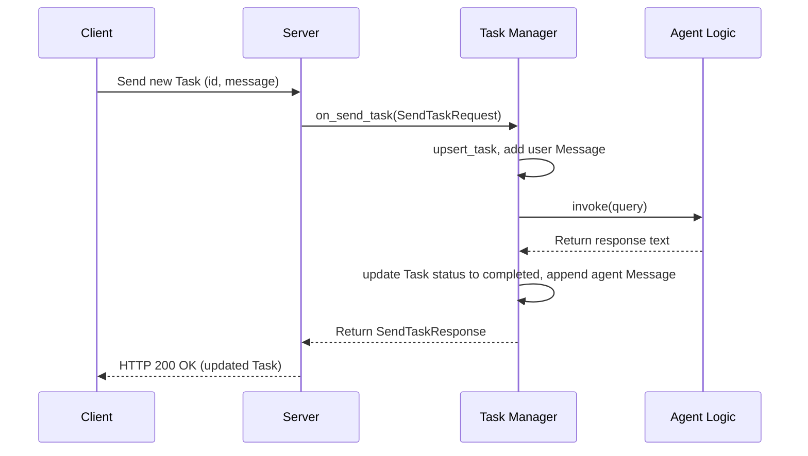
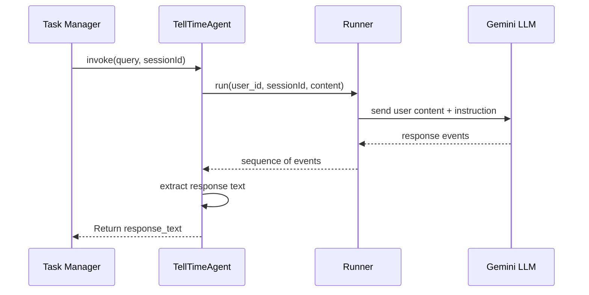
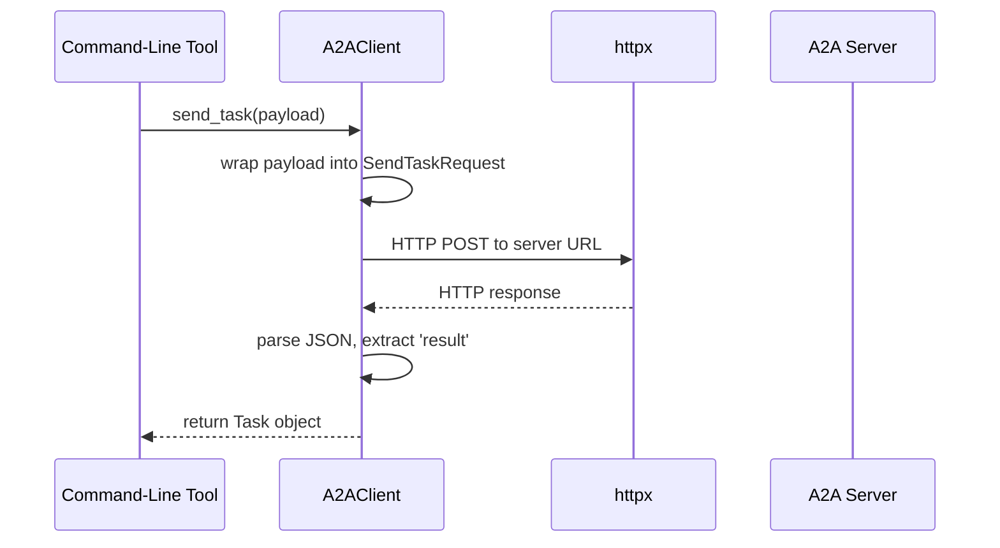
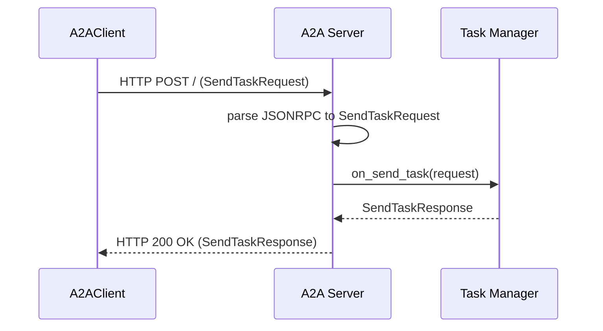
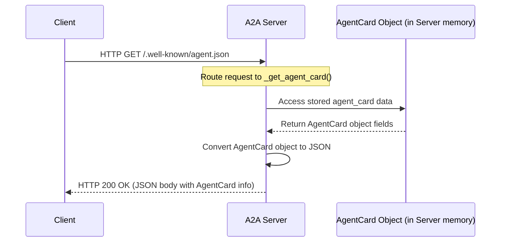
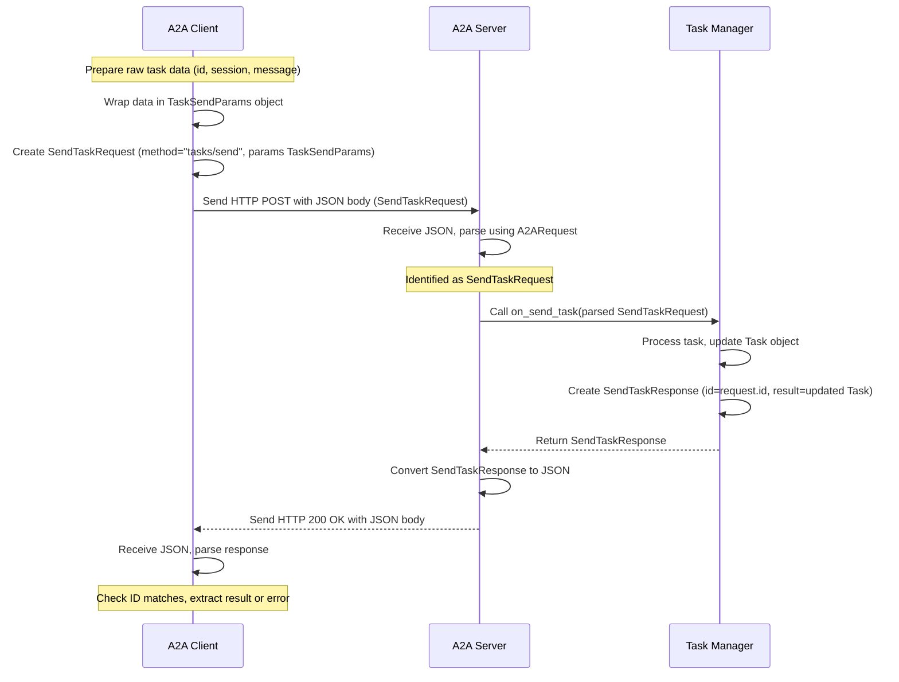
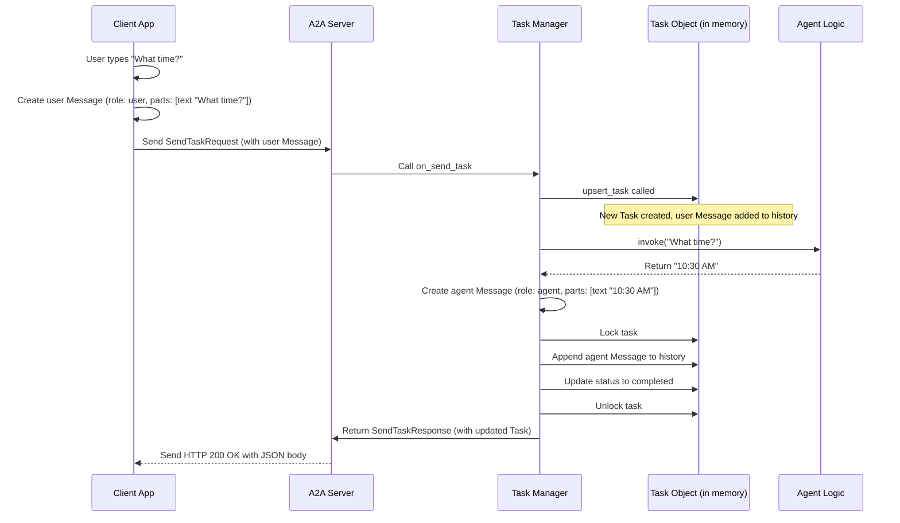
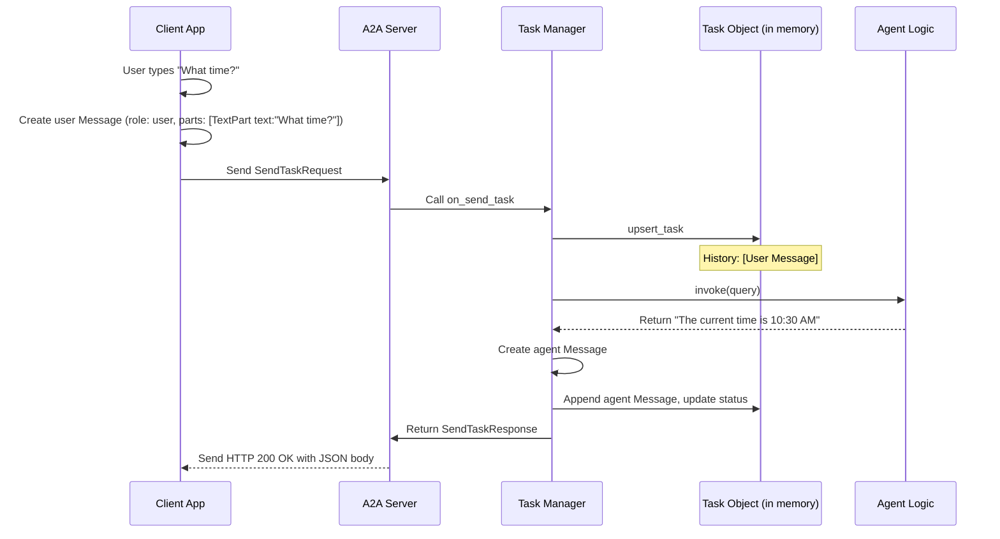
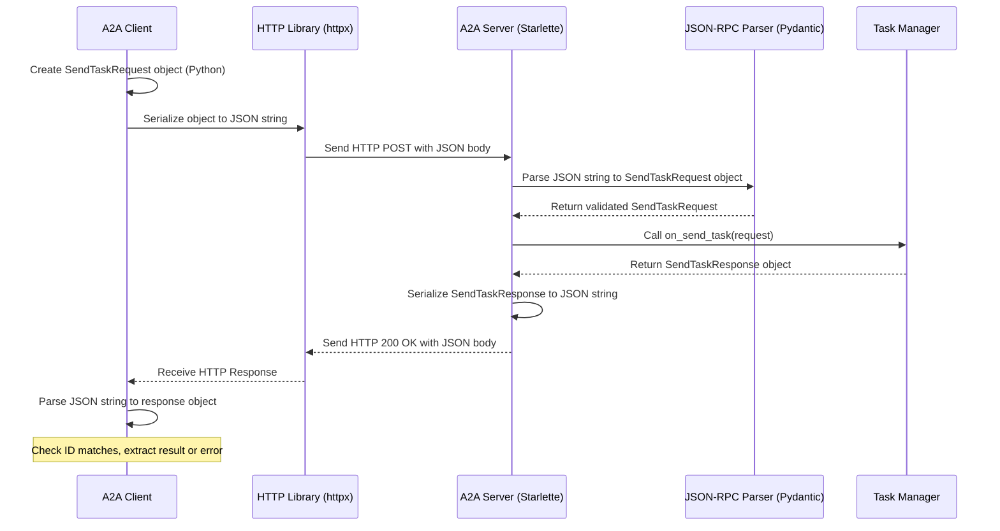

# OVERVIEW

## Chapter 1: What is a Task?

## Conclusion

You've learned about the **Task**, the fundamental building block for managing
interactions in our Agent-to-Agent system.

- It's like a job ticket or a chat thread.
- It has a unique `id`, a `status` (like submitted or completed), and a
  `history` of [`Message & Part`](08_message___part.md) objects exchanged
  between the user and the agent.
- Tasks are created by the client, sent to the server, processed by the
  [`Task Manager`](07_task_manager.md) and agent logic, updated, and sent back.

Now that we understand _what_ a Task is and how it holds the conversation, let's
dive into how the agent actually comes up with its response.

Next up:
[Chapter 2: Agent Logic (TellTimeAgent)](02_agent_logic__telltimeagent_.md)

---

## Chapter 2: Agent Logic (TellTimeAgent)

## Conclusion
You've now seen the "brain" of our time-telling application: the `TellTimeAgent`.

*   It acts as the specialist worker that handles the specific request within a [Task](01_task.md).
*   It uses Google's ADK (specifically `LlmAgent` and `Runner`) and a Gemini LLM.
*   Its `invoke` method takes the user's query.
*   Internally, it uses the ADK `Runner` to send the query and a guiding `instruction` to the Gemini LLM, gets the response, and returns the answer text.

We know what a Task is, and we know how the Agent Logic (the brain) works. But how does a user's request actually get *from* the user *to* the server where this agent lives? That involves a client and server talking to each other.

Next up: [Chapter 3: A2A Client](03_a2a_client.md)
---

## Chapter 3: A2A Client

## Conclusion

You've now learned about the **A2A Client**! It's the component that acts like
our telephone to the agent server.

- It lives within applications (like our command-line tool) that need to talk to
  an agent.
- Its job is to take a request, format it correctly (using JSON-RPC), send it
  over the network (using HTTP POST), and handle the response.
- It hides the complexity of network communication from the rest of the
  application.

We know how to _send_ a request. But what happens on the other side? Who picks
up the phone?

Next up: [Chapter 4: A2A Server](04_a2a_server.md)

---

## Chapter 4: A2A Server

## Conclusion
You've now met the **A2A Server**, the essential front door for our agent.

*   It acts as the receptionist, listening for incoming requests from clients.
*   It uses the Starlette framework to handle web communication (HTTP).
*   It understands incoming JSON-RPC requests, routing task requests (`send_task`) to the [Task Manager](07_task_manager.md).
*   It can also provide information about the agent itself by serving the [Agent Card](05_agent_metadata_models__agentcard__skill_.md).
*   It formats responses from the Task Manager and sends them back to the client.

The server needs to know *about* the agent it's serving – its name, capabilities, and skills. This information is stored in structured objects.

Next up: [Chapter 5: Agent Metadata Models](05_agent_metadata_models__agentcard__skill_.md)
---

## Chapter 5: Agent Metadata Models

## Conclusion

You've learned about the essential metadata models (`AgentCard`, `AgentSkill`,
`AgentCapabilities`) that act like a business card for our AI agent.

- They provide structured information about the agent's identity, purpose,
  location, version, features, and specific abilities.
- This metadata allows clients or directories to discover and understand agents.
- We define this metadata in Python using Pydantic models (`models/agent.py`).
- The main server script (`agents/google_adk/__main__.py`) creates these
  metadata objects for our `TellTimeAgent`.
- The [A2A Server](04_a2a_server.md) stores this metadata and serves it as JSON
  when requested at `/.well-known/agent.json`.

Now that we know how agents are described, how do the client and server actually
structure the _requests_ and _responses_ when they want to execute a task?

Next up:
[Chapter 6: A2A Request/Response Models](06_a2a_request_response_models.md)

---

## Chapter 6: A2A Request/Response Models

## Conclusion
You've learned about **A2A Request/Response Models**, which are crucial for structured communication between agents.

*   They act like specific **forms** (e.g., `SendTaskRequest`, `SendTaskResponse`) built using the standard **envelope** format of [JSON-RPC Protocol Models](09_json_rpc_protocol_models.md).
*   They define the exact structure (`method` and `params`/`result`) for specific actions, ensuring clarity and predictability.
*   Models like `SendTaskRequest` specify the `method` (e.g., `"tasks/send"`) and the structure of the `params` needed for that action.
*   Corresponding response models like `SendTaskResponse` define the structure of the `result` returned.
*   These models are used by the [A2A Client](03_a2a_client.md) to format requests and by the [A2A Server](04_a2a_server.md) to parse requests and format responses.

We've seen how the client creates a `SendTaskRequest` and how the server receives it, understands it, and eventually sends back a `SendTaskResponse`. But who *actually* handles the logic inside the server when a `SendTaskRequest` arrives? That's the job of the component we look at next.

Next up: [Chapter 7: Task Manager](07_task_manager.md)
---

## Chapter 7: Task Manager

## Conclusion

You've now met the **Task Manager**, the crucial coordinator on the server side!

- It acts like a project manager for [Task](01_task.md) objects.
- It receives task requests (like `SendTaskRequest`) from the
  [A2A Server](04_a2a_server.md).
- It orchestrates the work by calling the appropriate
  [Agent Logic (TellTimeAgent)](02_agent_logic__telltimeagent_.md).
- It updates the [Task](01_task.md)'s history and status.
- It stores the Task (in our case, using the `InMemoryTaskManager`'s
  dictionary).
- It provides methods like `on_send_task` that the server uses to delegate task
  handling.

We've seen that the Task Manager updates the Task's `history` by adding
messages. But what exactly makes up a `Message`? What are `Parts`? Let's look
closer at how conversations are structured within a Task.

Next up: [Chapter 8: Message & Part](08_message___part.md)

---

## Chapter 8: Message & Part

## Conclusion
You've now learned about **Message** and **Part**, the fundamental units for representing conversation turns within a [Task](01_task.md).

*   A **`Message`** is like one chat bubble, identifying the `role` (user or agent).
*   A **`Part`** (specifically `TextPart` for now) holds the actual content (`text`) of the message.
*   The `Task`'s `history` is a list (`List[Message]`) that records the sequence of these messages, forming the conversation log.
*   The client creates the initial user `Message`, and the [Task Manager](07_task_manager.md) creates the agent's `Message` and adds both to the `history`.

We understand the structure of the Task, its history, and the messages within it. We also know how specific request/response "forms" like `SendTaskRequest` carry this data. But how are these forms actually packaged and sent over the network? What's the "envelope" they travel in?

Next up: [Chapter 9: JSON-RPC Protocol Models](09_json_rpc_protocol_models.md)
---

## Chapter 9: JSON-RPC Protocol Models

## Conclusion

You've now learned about the **JSON-RPC Protocol Models**, the standard
"envelope" format used for communication in our `version_2_adk_agent` project.

- It provides a simple, universal structure for requests (`method`, `params`,
  `id`) and responses (`result` or `error`, `id`).
- It ensures the client and server can understand the basic format of messages,
  regardless of the specific action being requested.
- Our specific A2A models (like `SendTaskRequest`) define the content that goes
  _inside_ the `params` or `result` fields of these standard JSON-RPC envelopes.
- Python libraries like Pydantic help us easily create, send, receive, and
  validate messages conforming to this protocol.

We've now covered all the major conceptual pieces: Tasks, Agent Logic, Client,
Server, Metadata, Request/Response Forms, Task Management, Message structure,
and the underlying JSON-RPC protocol. How do we put all these pieces together to
actually run the server?

Next up:
[Chapter 10: Server Entrypoint (**main**)](10_server_entrypoint____main___.md)

---

## Chapter 10: Server Entrypoint (__main__)

## Conclusion
You've reached the end of the `version_2_adk_agent` tutorial! In this final chapter, we learned about the **Server Entrypoint (__main__)** script (`agents/google_adk/__main__.py`).

*   It acts as the **ignition key** or the **assembly point** for the entire agent server.
*   It imports all the necessary components: [A2A Server](04_a2a_server.md), [Task Manager](07_task_manager.md), [Agent Logic (TellTimeAgent)](02_agent_logic__telltimeagent_.md), and metadata models.
*   It **configures** the agent by creating the [Agent Card](05_agent_metadata_models__agentcard__skill_.md).
*   It **instantiates** the specific agent, task manager, and server classes.
*   It **wires** these components together, ensuring the server knows about its identity and task handler.
*   Finally, it calls `server.start()` to bring the agent **online**, ready to receive requests.

By understanding each component from the previous chapters and seeing how this entrypoint script connects them, you now have a complete picture of how the `TellTimeAgent` works, from receiving a request to sending back a response.

Congratulations on completing the tutorial! You can now explore the code further, experiment with modifications, or use this foundation to build more complex agents.
---

## A2A Framework Overview

### Chapter 1: What is a Task?

You've learned about the **Task**, the fundamental building block for managing
interactions in our Agent-to-Agent system.

- It's like a job ticket or a chat thread.
- It has a unique `id`, a `status` (like submitted or completed), and a
  `history` of [`Message & Part`](08_message___part.md) objects exchanged
  between the user and the agent.
- Tasks are created by the client, sent to the server, processed by the
  [`Task Manager`](07_task_manager.md) and agent logic, updated, and sent back.

### Chapter 2: Agent Logic (TellTimeAgent)

You've now seen the "brain" of our time-telling application: the
`TellTimeAgent`.

- It acts as the specialist worker that handles the specific request within a
  [Task](01_task.md).
- It uses Google's ADK (specifically `LlmAgent` and `Runner`) and a Gemini LLM.
- Its `invoke` method takes the user's query.
- Internally, it uses the ADK `Runner` to send the query and a guiding
  `instruction` to the Gemini LLM, gets the response, and returns the answer
  text.

### Chapter 3: A2A Client

You've now learned about the **A2A Client**! It's the component that acts like
our telephone to the agent server.

- It lives within applications (like our command-line tool) that need to talk to
  an agent.
- Its job is to take a request, format it correctly (using JSON-RPC), send it
  over the network (using HTTP POST), and handle the response.
- It hides the complexity of network communication from the rest of the
  application.

### Chapter 4: A2A Server

You've now met the **A2A Server**, the essential front door for our agent.

- It acts as the receptionist, listening for incoming requests from clients.
- It uses the Starlette framework to handle web communication (HTTP).
- It understands incoming JSON-RPC requests, routing task requests (`send_task`)
  to the [Task Manager](07_task_manager.md).
- It can also provide information about the agent itself by serving the
  [Agent Card](05_agent_metadata_models__agentcard__skill_.md).
- It formats responses from the Task Manager and sends them back to the client.

### Chapter 5: Agent Metadata Models

You've learned about the essential metadata models (`AgentCard`, `AgentSkill`,
`AgentCapabilities`) that act like a business card for our AI agent.

- They provide structured information about the agent's identity, purpose,
  location, version, features, and specific abilities.
- This metadata allows clients or directories to discover and understand agents.
- We define this metadata in Python using Pydantic models (`models/agent.py`).
- The main server script (`agents/google_adk/__main__.py`) creates these
  metadata objects for our `TellTimeAgent`.
- The [A2A Server](04_a2a_server.md) stores this metadata and serves it as JSON
  when requested at `/.well-known/agent.json`.

### Chapter 6: A2A Request/Response Models

You've learned about **A2A Request/Response Models**, which are crucial for
structured communication between agents.

- They act like specific **forms** (e.g., `SendTaskRequest`, `SendTaskResponse`)
  built using the standard **envelope** format of
  [JSON-RPC Protocol Models](09_json_rpc_protocol_models.md).
- They define the exact structure (`method` and `params`/`result`) for specific
  actions, ensuring clarity and predictability.
- Models like `SendTaskRequest` specify the `method` (e.g., `"tasks/send"`) and
  the structure of the `params` needed for that action.
- Corresponding response models like `SendTaskResponse` define the structure of
  the `result` returned.
- These models are used by the [A2A Client](03_a2a_client.md) to format requests
  and by the [A2A Server](04_a2a_server.md) to parse requests and format
  responses.

### Chapter 7: Task Manager

You've now met the **Task Manager**, the crucial coordinator on the server side!

- It acts like a project manager for [Task](01_task.md) objects.
- It receives task requests (like `SendTaskRequest`) from the
  [A2A Server](04_a2a_server.md).
- It orchestrates the work by calling the appropriate
  [Agent Logic (TellTimeAgent)](02_agent_logic__telltimeagent_.md).
- It updates the [Task](01_task.md)'s history and status.
- It stores the Task (in our case, using the `InMemoryTaskManager`'s
  dictionary).
- It provides methods like `on_send_task` that the server uses to delegate task
  handling.

### Chapter 8: Message & Part

You've now learned about **Message** and **Part**, the fundamental units for
representing conversation turns within a [Task](01_task.md).

- A **`Message`** is like one chat bubble, identifying the `role` (user or
  agent).
- A **`Part`** (specifically `TextPart` for now) holds the actual content
  (`text`) of the message.
- The `Task`'s `history` is a list (`List[Message]`) that records the sequence
  of these messages, forming the conversation log.
- The client creates the initial user `Message`, and the
  [Task Manager](07_task_manager.md) creates the agent's `Message` and adds both
  to the `history`.

### Chapter 9: JSON-RPC Protocol Models

You've now learned about the **JSON-RPC Protocol Models**, the standard
"envelope" format used for communication in our `version_2_adk_agent` project.

- It provides a simple, universal structure for requests (`method`, `params`,
  `id`) and responses (`result` or `error`, `id`).
- It ensures the client and server can understand the basic format of messages,
  regardless of the specific action being requested.
- Our specific A2A models (like `SendTaskRequest`) define the content that goes
  _inside_ the `params` or `result` fields of these standard JSON-RPC envelopes.
- Python libraries like Pydantic help us easily create, send, receive, and
  validate messages conforming to this protocol.

### Chapter 10: Server Entrypoint (**main**)

You've reached the end of the `version_2_adk_agent` tutorial! In this final
chapter, we learned about the **Server Entrypoint (**main**)** script
(`agents/google_adk/__main__.py`).

- It acts as the **ignition key** or the **assembly point** for the entire agent
  server.
- It imports all the necessary components: [A2A Server](04_a2a_server.md),
  [Task Manager](07_task_manager.md),
  [Agent Logic (TellTimeAgent)](02_agent_logic__telltimeagent_.md), and metadata
  models.
- It **configures** the agent by creating the
  [Agent Card](05_agent_metadata_models__agentcard__skill_.md).
- It **instantiates** the specific agent, task manager, and server classes.
- It **wires** these components together, ensuring the server knows about its
  identity and task handler.
- Finally, it calls `server.start()` to bring the agent **online**, ready to
  receive requests.

By understanding each component from the previous chapters and seeing how this
entrypoint script connects them, you now have a complete picture of how the
`TellTimeAgent` works, from receiving a request to sending back a response.

Congratulations on completing the tutorial! You can now explore the code
further, experiment with modifications, or use this foundation to build more
complex agents.
