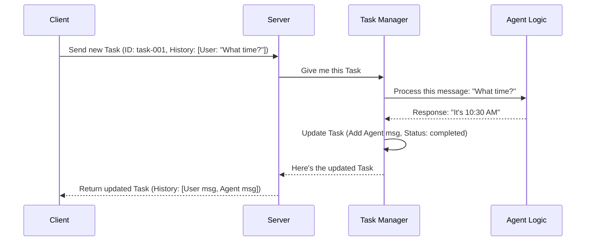

# Chapter 1: What is a Task?

Welcome to the `version_2_adk_agent` tutorial! We're going to build a system where you can talk to an AI agent. But how does the system keep track of our conversations or the jobs we ask the agent to do?

Imagine you're talking to a customer support agent online. Each chat you have is separate, right? Or think about ordering food online – each order gets a unique number and you can track its status (like "preparing", "out for delivery", "delivered").

In our system, we use something similar called a **Task**.

**A Task is the fundamental way we represent a piece of work or a conversation between you (the user) and the AI agent.** It's like a digital job ticket or a specific chat thread.

Let's say our simple use case is asking the agent: *"What time is it?"* How does the system handle this single question and its answer? It bundles it all up inside a **Task**.

## What Makes Up a Task?

A Task object holds all the important information about one specific interaction. Think of it like a folder containing everything related to one job:

1.  **Unique ID (`id`):** Just like an order number, every task gets a unique identifier (a string of letters and numbers). This helps us find and manage specific tasks later.
2.  **Status (`status`):** This tells us what's happening with the task right now. Is it just submitted? Is the agent working on it? Is it finished? We'll see states like `submitted` and `completed`.
3.  **History (`history`):** This is the conversation log! It's a list of all the messages exchanged within this task. Each message remembers who sent it (`user` or `agent`) and what they said.

Let's look at how this is represented in code using a simplified Python model (don't worry if you don't know Python, focus on the structure):

```python
# File: models/task.py (Simplified view)

from datetime import datetime
from typing import List, Literal

# Represents one message in the history
class Message:
    role: Literal["user", "agent"] # Who sent it?
    parts: List[...]              # What did they say? (e.g., text)

# Represents the task's current state
class TaskStatus:
    state: str                 # e.g., "submitted", "completed"
    timestamp: datetime        # When was this status set?

# The main Task object
class Task:
    id: str                    # Unique ID (like "abc-123")
    status: TaskStatus         # Current status object
    history: List[Message]     # List of messages exchanged
```

This `Task` object acts as a container, keeping everything related to a single interaction organized.

## How We Use a Task: Asking for the Time

Let's revisit our example: asking *"What time is it?"*. Here's how a Task helps manage this:

1.  **You Send a Message:** You type "What time is it?" into a client application (like a command line tool).
2.  **Client Creates a Task:** The client app bundles your message into the *first* message of a *new* Task. It generates a unique `id` and sets the initial `status` to `submitted`.

    *Initial Task might look something like this (simplified):*
    *   `id`: "task-001"
    *   `status`: { `state`: "submitted", `timestamp`: ... }
    *   `history`: [ { `role`: "user", `parts`: ["What time is it?"] } ]

3.  **Client Sends the Task:** The client sends this newly created Task object to the Agent server. We'll learn more about the client and server in [A2A Client](03_a2a_client.md) and [A2A Server](04_a2a_server.md).
4.  **Server Receives & Processes:** The server receives the Task. It uses a component called the [`Task Manager`](07_task_manager.md) to handle it. The Task Manager asks the actual AI agent logic ([`Agent Logic (TellTimeAgent)`](02_agent_logic__telltimeagent_.md)) to figure out the answer.
5.  **Agent Responds:** The agent generates the answer, maybe "The current time is 10:30 AM."
6.  **Server Updates the Task:** The Task Manager adds the agent's reply to the Task's `history` and updates the `status` to `completed`.

    *Updated Task now looks like this (simplified):*
    *   `id`: "task-001"
    *   `status`: { `state`: "completed", `timestamp`: ... }
    *   `history`: [
        { `role`: "user", `parts`: ["What time is it?"] },
        { `role`: "agent", `parts`: ["The current time is 10:30 AM."] }
      ]

7.  **Server Sends Back:** The server sends the updated Task object back to your client application.
8.  **Client Displays:** Your client app looks at the updated Task, finds the last message in the `history` (the agent's reply), and shows it to you.

The Task object acts as the carrier of information throughout this entire process!

## Under the Hood: The Task's Journey

Let's visualize the flow using a simple diagram:



Now, let's peek at tiny bits of code involved:

**1. Client Sending the Task (`app/cmd/cmd.py`)**

When you type your message, the client code prepares the initial Task data to send. It generates a unique `id` and packages your message.

```python
# File: app/cmd/cmd.py (Simplified snippet)
from uuid import uuid4 # Tool to generate unique IDs

# ... inside the input loop ...
prompt = "What time is it?" # Your input

# Prepare the data to send (part of the Task)
payload = {
    "id": uuid4().hex,  # Generate a new unique task ID
    "sessionId": "session-xyz", # Groups related tasks (more later)
    "message": {
        "role": "user",
        "parts": [{"type": "text", "text": prompt}] # Your message
    }
}
# Client then sends this 'payload' to the server...
```
This `payload` contains the core information needed to *start* a Task on the server side. We'll learn how it's sent using specific formats in [A2A Request/Response Models](06_a2a_request_response_models.md).

**2. Server Handling the Task (`agents/google_adk/task_manager.py`)**

The server's [`Task Manager`](07_task_manager.md) receives the data, creates or updates the Task object, interacts with the agent, and finalizes the Task.

```python
# File: agents/google_adk/task_manager.py (Simplified snippet)
from models.task import Message, Task, TextPart, TaskStatus, TaskState

# ... inside the AgentTaskManager class ...

async def on_send_task(self, request): # Receives the client's request
    # 1. Get or create the Task object in memory
    task: Task = await self.upsert_task(request.params)

    # 2. Get the user's actual question
    query = request.params.message.parts[0].text # "What time is it?"

    # 3. Ask the Agent logic for an answer (details in Chapter 2)
    result_text = self.agent.invoke(query, ...) # e.g., "The current time is 10:30 AM."

    # 4. Create the agent's message
    agent_message = Message(
        role="agent",
        parts=[TextPart(text=result_text)]
    )

    # 5. Update the task: mark as done and add agent's reply
    task.status = TaskStatus(state=TaskState.COMPLETED)
    task.history.append(agent_message)

    # 6. Send the completed Task back to the client
    return SendTaskResponse(id=request.id, result=task)
```
This shows how the server uses the `Task` object (`task`) to store the user's message, get the agent's reply, add it to the `history`, and update the `status` before sending it back.

## Conclusion

You've learned about the **Task**, the fundamental building block for managing interactions in our Agent-to-Agent system.

*   It's like a job ticket or a chat thread.
*   It has a unique `id`, a `status` (like submitted or completed), and a `history` of [`Message & Part`](08_message___part.md) objects exchanged between the user and the agent.
*   Tasks are created by the client, sent to the server, processed by the [`Task Manager`](07_task_manager.md) and agent logic, updated, and sent back.

Now that we understand *what* a Task is and how it holds the conversation, let's dive into how the agent actually comes up with its response.

Next up: [Chapter 2: Agent Logic (TellTimeAgent)](02_agent_logic__telltimeagent_.md)

---

Generated by [AI Codebase Knowledge Builder](https://github.com/The-Pocket/Tutorial-Codebase-Knowledge)