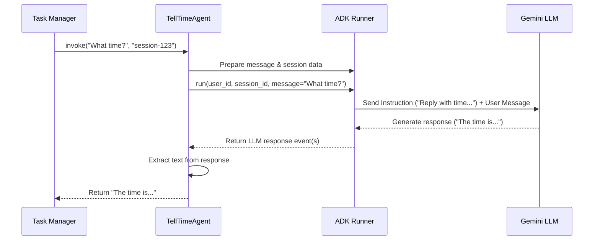

# Chapter 2: Agent Logic (TellTimeAgent)

Welcome back! In [Chapter 1: What is a Task?](01_task.md), we learned how a **Task** acts like a container or a job ticket, holding the conversation between you and the AI. It tracks the user's question (like "What time is it?") and, eventually, the agent's answer.

But who *actually* figures out the answer? Just having a Task object isn't enough. We need something that can understand the request and perform the job. That's where the **Agent Logic** comes in.

## What is Agent Logic?

Think of the Agent Logic as the **specialist worker** or the **"brain"** assigned to the task. It's the component that actually possesses the skill or knowledge to fulfill the user's request.

In our simple project, the request is "What time is it?". So, our Agent Logic needs the specific skill of... well, telling the time!

For this project (`version_2_adk_agent`), our specific agent implementation is called `TellTimeAgent`. It uses a couple of key tools:

1.  **Google's Agent Development Kit (ADK):** This is like a toolbox provided by Google that helps developers build AI agents more easily. It provides pre-built components for managing conversations, memory, and interacting with AI models.
2.  **A Gemini Large Language Model (LLM):** This is the powerful AI model from Google that understands and generates human-like text. Even though telling the time is simple, we're using an LLM here to show how the ADK connects to it. The LLM reads the instructions we give it and the user's query to figure out what to do.

So, the `TellTimeAgent` is our specific worker that uses the ADK toolkit and the Gemini LLM brain to understand the "What time is it?" request and generate the correct response.

## How `TellTimeAgent` Works (The Goal)

Our goal is simple: when the system receives a Task with the user's message "What time is it?", the `TellTimeAgent` should process this and produce the current time as a response.

Imagine the [`Task Manager`](07_task_manager.md) (which we'll cover later) gets the Task. It then turns to our `TellTimeAgent` and essentially asks: "Hey, the user wants to know the time. Can you handle this?"

The `TellTimeAgent` needs a way to be "invoked" or "called" with the user's query. Let's look at the main function that does this, `invoke`.

```python
# File: agents/google_adk/agent.py (Simplified view)

class TellTimeAgent:
    # ... (Initialization code happens here - we'll see it later) ...

    def invoke(self, query: str, session_id: str) -> str:
        """
        📥 Handle a user query and return a response string.

        Args:
            query (str): What the user said (e.g., "what time is it?")
            session_id (str): An ID to keep track of the conversation context.

        Returns:
            str: Agent's reply (e.g., "The current time is...")
        """
        # 1. Use the ADK Runner to talk to the Gemini LLM
        # 2. Send the user's 'query' to the LLM
        # 3. Get the LLM's text response back
        # 4. Return that text response

        # ... (Actual ADK/LLM interaction code goes here) ...
        response_text = self._ask_gemini_via_adk(query, session_id) # Simplified placeholder

        return response_text

# Example Usage (conceptual - done by the Task Manager):
# tell_time_agent = TellTimeAgent()
# user_question = "What time is it, please?"
# conversation_id = "chat-123"
# answer = tell_time_agent.invoke(user_question, conversation_id)
# print(answer) # Output might be something like: "The current time is: 2023-10-27 14:30:00"
```

This `invoke` method is the entry point. The [`Task Manager`](07_task_manager.md) will call this method, passing in the user's question (`query`). The `TellTimeAgent` then does its magic using the ADK and Gemini, finally returning the answer as a simple string of text.

## Under the Hood: How `TellTimeAgent` Gets the Time

Okay, how does `invoke` actually work? It doesn't *just* get the time directly. It uses the underlying Gemini LLM, guided by instructions we give it.

**Step-by-Step:**

1.  **Receive Query:** The `invoke` method gets the user's text (e.g., "What time is it?") and a `session_id`.
2.  **Prepare for LLM:** The agent formats the user's query into a structure the Gemini model understands (using `google.genai.types`).
3.  **Use ADK Runner:** The agent uses the ADK `Runner`. Think of the `Runner` as the engine that connects everything: our agent's instructions, the conversation history (session), and the actual Gemini LLM.
4.  **Send to LLM:** The `Runner` sends the formatted query (and potentially past messages from the session) to the Gemini LLM. Crucially, it also sends the "system instruction" we defined for our agent.
5.  **LLM Generates Response:** The Gemini LLM reads the instruction ("Reply with the current time...") and the user's query. It figures out what's asked and generates the text response. *Note: In this specific simple case, the ADK might optimize and not strictly need the LLM if the instruction is simple enough, but the general flow involves the LLM.* The example code actually *does* use the LLM based on the instruction. A simpler agent *could* just use Python's `datetime`.
6.  **Receive from LLM:** The `Runner` gets the text response back from the LLM.
7.  **Extract Text:** The `invoke` method extracts the plain text from the LLM's response.
8.  **Return Text:** The final text answer is returned.

Let's visualize this interaction:



**Diving into the Code:**

Let's look at the key parts of the `agents/google_adk/agent.py` file.

**1. Initialization (`__init__`)**

When we create a `TellTimeAgent`, it sets itself up.

```python
# File: agents/google_adk/agent.py (Inside TellTimeAgent class)

from google.adk.agents.llm_agent import LlmAgent
from google.adk.runners import Runner
# ... other imports like InMemorySessionService ...

class TellTimeAgent:
    def __init__(self):
        """
        👷 Initialize the TellTimeAgent
        """
        # Step 1: Build the core LLM agent object
        self._agent = self._build_agent()

        # Step 2: Set up the Runner to manage the agent execution
        self._runner = Runner(
            agent=self._agent, # Use the agent we just built
            # Services for session, memory, files (using simple in-memory versions)
            session_service=InMemorySessionService(),
            # ... other services ...
        )
        self._user_id = "time_agent_user" # A fixed ID for this simple agent
```

*   `_build_agent()`: This helper function (shown next) creates the actual `LlmAgent` object, telling it which Gemini model to use and what its basic instructions are.
*   `Runner(...)`: This creates the ADK `Runner`. It takes our `_agent` and hooks it up with services for managing conversation sessions (`session_service`). The Runner is essential for the `invoke` method to actually execute the agent.

**2. Building the Agent (`_build_agent`)**

This is where we configure the Gemini LLM via the ADK.

```python
# File: agents/google_adk/agent.py (Inside TellTimeAgent class)

    def _build_agent(self) -> LlmAgent:
        """
        ⚙️ Creates and returns a Gemini agent with basic settings.
        """
        return LlmAgent(
            model="gemini-1.5-flash-latest", # Which Gemini model to use
            name="tell_time_agent",          # A name for our agent
            description="Tells the current time", # What it does
            # VERY IMPORTANT: The instruction given to the LLM!
            instruction="Reply with the current time in the format YYYY-MM-DD HH:MM:SS."
        )
```

*   `model`: Specifies the exact Gemini model version.
*   `name`, `description`: Metadata about the agent.
*   `instruction`: This is crucial! It's the **system prompt** or guiding instruction sent to the Gemini LLM along with the user's query. This tells the LLM *how* to behave. Here, we're explicitly telling it to reply with the time in a specific format.

**3. The `invoke` Method (More Detail)**

Now let's look inside the `invoke` method again, this time with the real ADK `Runner` code.

```python
# File: agents/google_adk/agent.py (Inside TellTimeAgent class)

from google.genai import types # For formatting messages for Gemini

# ... inside TellTimeAgent class ...

    def invoke(self, query: str, session_id: str) -> str:
        # ... (Get or create session - code omitted for brevity) ...
        session = self._runner.session_service.get_or_create_session(
            # ... session details ...
        )

        # 📨 Format the user message for Gemini
        content = types.Content(
            role="user",
            parts=[types.Part.from_text(text=query)]
        )

        # 🚀 Use the Runner to execute the agent logic with the new message
        events = list(self._runner.run(
            user_id=self._user_id,
            session_id=session.id,
            new_message=content # Send the formatted user query
        ))

        # 📤 Extract the text response from the last event
        # (Simplified: assumes last event has the final answer)
        if events and events[-1].content and events[-1].content.parts:
            response_text = "\n".join([p.text for p in events[-1].content.parts if p.text])
            return response_text
        else:
            return "[Error: Could not get response]" # Basic error handling
```

*   `types.Content(...)`: We package the user's `query` text into the structure Gemini expects (a `Content` object with a `Part`).
*   `self._runner.run(...)`: This is the key call! We tell the `Runner` to execute for our user and session, providing the `new_message` (our formatted query). The runner handles sending this, plus the agent's `instruction`, to the LLM and getting the response.
*   `events = list(...)`: The `run` method returns a sequence of events (like "agent thinking", "agent responded"). We collect them all.
*   Extracting Text: We look at the last event, assume it contains the final agent message, and extract the text parts to form the final string response.

So, even for a simple task like telling the time, the `TellTimeAgent` uses the ADK `Runner` to interact with the powerful Gemini LLM, guided by the `instruction` we provided.

## Conclusion

You've now seen the "brain" of our time-telling application: the `TellTimeAgent`.

*   It acts as the specialist worker that handles the specific request within a [Task](01_task.md).
*   It uses Google's ADK (specifically `LlmAgent` and `Runner`) and a Gemini LLM.
*   Its `invoke` method takes the user's query.
*   Internally, it uses the ADK `Runner` to send the query and a guiding `instruction` to the Gemini LLM, gets the response, and returns the answer text.

We know what a Task is, and we know how the Agent Logic (the brain) works. But how does a user's request actually get *from* the user *to* the server where this agent lives? That involves a client and server talking to each other.

Next up: [Chapter 3: A2A Client](03_a2a_client.md)

---

Generated by [AI Codebase Knowledge Builder](https://github.com/The-Pocket/Tutorial-Codebase-Knowledge)