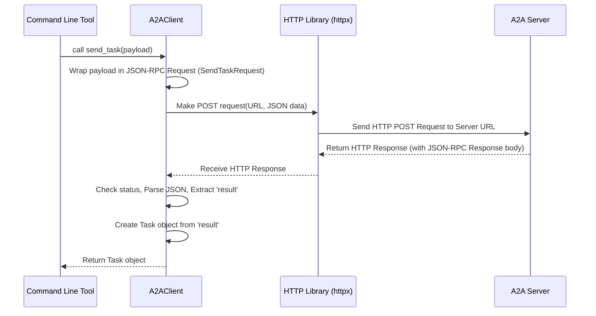

# Chapter 3: A2A Client

Welcome back! In [Chapter 2: Agent Logic (TellTimeAgent)](02_agent_logic__telltimeagent_.md), we met the `TellTimeAgent`, the "brain" that figures out the answer to "What time is it?". We saw how it uses the ADK and a Gemini LLM to generate the response.

But wait, how does our question even *get* to the `TellTimeAgent`? The agent logic lives on a server, potentially running on a different computer. We need a way to send our request from our local machine (where we type the question) over the internet or network to that server.

This is where the **A2A Client** comes in.

## Making the Call: What is the A2A Client?

Imagine the `TellTimeAgent` is like a helpful specialist working in an office building (the A2A Server). You're at home and need to ask the specialist a question. You can't just shout! You need to:

1.  **Pick up the phone:** This is like starting the client tool on your computer.
2.  **Know the number:** You need the address of the agent's office (the server URL).
3.  **Dial and speak clearly:** You need to format your request in a way the receptionist (the A2A Server) understands and send it.
4.  **Listen for the answer:** You need to receive the response back over the phone line.

The **A2A Client** is the component that does steps 2, 3, and 4 for us. It's responsible for:

*   Knowing the **address** (URL) of the [A2A Server](04_a2a_server.md).
*   **Formatting** the request correctly. Our system uses a standard called **JSON-RPC**. Think of this as the "language" the client and server agree to speak. We'll learn more about the specific message formats in [A2A Request/Response Models](06_a2a_request_response_models.md) and [JSON-RPC Protocol Models](09_json_rpc_protocol_models.md).
*   **Sending** the formatted request over the network using **HTTP** (the same protocol your web browser uses).
*   **Receiving** the server's response.
*   **Parsing** the response (understanding what the server sent back).

In our project, the command-line tool (`app/cmd/cmd.py`) that you use to type questions *contains* and *uses* an `A2AClient` to talk to the agent server.

## Using the A2A Client: The Command Line Tool (`cmd.py`)

Let's see how the command-line tool uses the `A2AClient`. When you run `python app/cmd/cmd.py` and type "What time is it?", here's a simplified view of what happens:

**1. Setting up the Client:**
The command-line tool first creates an instance of the `A2AClient`, telling it the address of the agent server.

```python
# File: app/cmd/cmd.py (Simplified Snippet)

# Import the client class we need
from client.client import A2AClient
# Other imports...

async def cli(agent: str, ...): # 'agent' holds the server URL like "http://localhost:10002"
    # Initialize the client with the server's address
    client = A2AClient(url=agent)
    # ... rest of the code ...
```
This creates our "phone" and tells it the number to dial (`agent` URL).

**2. Preparing the Message:**
When you type your message, the tool packages it into a dictionary (`payload`) that contains your text, a unique ID for this specific request, and a session ID (to group related conversations).

```python
# File: app/cmd/cmd.py (Simplified Snippet)
from uuid import uuid4 # For generating unique IDs

# ... inside the input loop ...
prompt = "What time is it?" # Your input
session_id = "some-session-id" # Keeps track of the conversation

# Prepare the data package (payload)
payload = {
    "id": uuid4().hex, # A unique ID for this specific message/task
    "sessionId": session_id,
    "message": {
        "role": "user",
        "parts": [{"type": "text", "text": prompt}] # Your actual question
    }
}
# Now, use the client to send this payload...
```
This is like writing down your question clearly before making the call.

**3. Sending the Request:**
The command-line tool calls the `send_task` method on the `client` object, passing in the prepared `payload`.

```python
# File: app/cmd/cmd.py (Simplified Snippet)

# ... after creating the payload ...
try:
    # Make the "phone call" - send the task and wait for the full response
    # The client handles formatting, sending (HTTP), and receiving
    task_response = await client.send_task(payload)

    # The 'task_response' now holds the updated Task object from the server
    # ... process the response ...

except Exception as e:
    print(f"Oops, something went wrong: {e}")
```
This is the moment of dialing and speaking your formatted question. The `await client.send_task(payload)` line does all the hard work of communicating with the server.

**4. Handling the Response:**
The `send_task` method returns the complete, updated [Task](01_task.md) object received from the server. The command-line tool then looks inside this `Task` object to find the agent's reply and prints it.

```python
# File: app/cmd/cmd.py (Simplified Snippet)
from models.task import Task # We expect a Task object back

# ... inside the 'try' block after getting task_response ...
# Assuming 'task_response' is the Task object returned by the client
agent_reply_message = task_response.history[-1] # Get the last message
agent_text = agent_reply_message.parts[0].text # Get the text part

print("\nAgent says:", agent_text) # Display the answer!
```
This is like listening to the specialist's answer over the phone and understanding it.

So, the command-line tool relies entirely on the `A2AClient` to handle the complexities of network communication!

## Under the Hood: How `A2AClient` Works

Let's peek inside the `A2AClient` itself (`client/client.py`) to see how it sends that request.

**The Steps:**

1.  **Receive Payload:** The `send_task` method in `A2AClient` gets the raw `payload` dictionary from the command-line tool.
2.  **Format Request:** It wraps this `payload` inside a specific structure defined by our [A2A Request/Response Models](06_a2a_request_response_models.md) (like `SendTaskRequest`) and further wraps that into the standard [JSON-RPC Protocol Models](09_json_rpc_protocol_models.md) format. This ensures the server knows exactly what kind of request this is ("send_task") and where to find the data.
3.  **Use HTTP Library:** The client uses an external Python library called `httpx` (an asynchronous HTTP client) to actually make the network call.
4.  **Make POST Request:** It tells `httpx` to send an HTTP `POST` request to the server's URL (`self.url`). The formatted JSON-RPC request data is included in the body of this HTTP request.
5.  **Wait for Response:** The client waits for the server to process the request and send back an HTTP response.
6.  **Check for Errors:** It checks if the HTTP response indicates success (like status code 200 OK). If not, it raises an error.
7.  **Parse JSON:** It parses the body of the successful HTTP response, expecting it to contain JSON data (the JSON-RPC response).
8.  **Extract Result:** It looks inside the parsed JSON-RPC response for the `"result"` field, which should contain the updated [Task](01_task.md) data sent back by the server.
9.  **Create Task Object:** It converts the raw "result" data into a proper `Task` object.
10. **Return Task:** It returns the `Task` object back to the command-line tool.

**Visualizing the Flow:**



**Code Snippets from `client/client.py`:**

*   **Initialization:** Storing the server URL.

    ```python
    # File: client/client.py (Simplified)

    class A2AClient:
        def __init__(self, url: str):
            """ Stores the server address when the client is created. """
            if not url:
                raise ValueError("Must provide url")
            self.url = url # e.g., "http://localhost:10002"
    ```

*   **Sending the Task:** Wrapping the payload and calling the internal send method.

    ```python
    # File: client/client.py (Simplified - Inside A2AClient class)

    from models.request import SendTaskRequest # Specific request type
    from models.task import Task, TaskSendParams # Task model
    from uuid import uuid4
    import json

    async def send_task(self, payload: dict) -> Task:
        """ Prepares and sends a 'send_task' request. """
        # 1. Wrap the raw payload in the expected parameter model
        task_params = TaskSendParams(**payload)

        # 2. Create the full JSON-RPC request object
        request = SendTaskRequest(
            id=uuid4().hex, # Unique ID for the JSON-RPC request itself
            params=task_params # Include the wrapped payload here
        )

        # 3. Call the internal helper to actually send it
        response_dict = await self._send_request(request)

        # 4. Extract the 'result' part and convert it to a Task object
        return Task(**response_dict["result"])
    ```

*   **Internal Sending Logic:** Using `httpx` to make the actual HTTP POST call.

    ```python
    # File: client/client.py (Simplified - Inside A2AClient class)

    import httpx # The HTTP client library
    from models.json_rpc import JSONRPCRequest # Base request type

    async def _send_request(self, request: JSONRPCRequest) -> dict:
        """ Sends the prepared JSON-RPC request via HTTP POST. """
        async with httpx.AsyncClient() as http_client:
            try:
                print(f"📤 Sending POST to {self.url}") # Debug print
                # The core HTTP call!
                response = await http_client.post(
                    self.url,
                    json=request.model_dump(), # Convert request object to JSON
                    timeout=30.0 # Wait max 30 seconds
                )
                response.raise_for_status() # Error if HTTP status is bad (4xx, 5xx)
                print(f"✅ Received Response: {response.status_code}") # Debug print
                return response.json() # Parse the JSON response body into a dict

            except httpx.HTTPStatusError as e:
                print(f"❌ HTTP Error: {e.response.status_code}")
                raise # Re-raise the error
            except Exception as e:
                print(f"❌ Request Error: {e}")
                raise # Re-raise other errors
    ```
    The key line here is `await http_client.post(...)`. This is where the communication happens, sending our structured `request` data to the `self.url` using the HTTP POST method.

## Conclusion

You've now learned about the **A2A Client**! It's the component that acts like our telephone to the agent server.

*   It lives within applications (like our command-line tool) that need to talk to an agent.
*   Its job is to take a request, format it correctly (using JSON-RPC), send it over the network (using HTTP POST), and handle the response.
*   It hides the complexity of network communication from the rest of the application.

We know how to *send* a request. But what happens on the other side? Who picks up the phone?

Next up: [Chapter 4: A2A Server](04_a2a_server.md)

---

Generated by [AI Codebase Knowledge Builder](https://github.com/The-Pocket/Tutorial-Codebase-Knowledge)