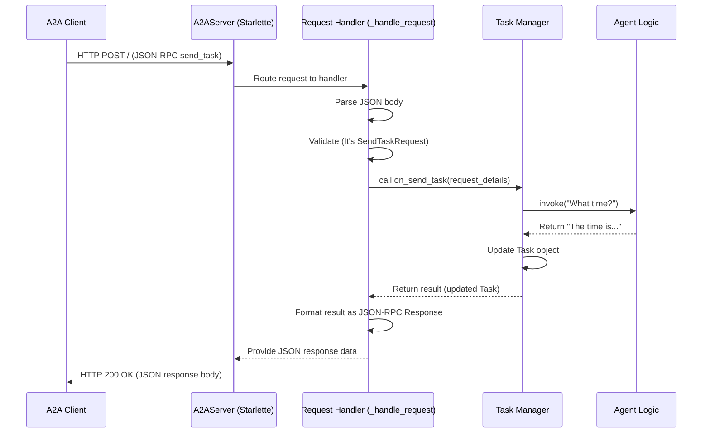

# Chapter 4: A2A Server

Welcome back! In [Chapter 3: A2A Client](03_a2a_client.md), we learned how the `A2AClient` acts like a telephone, allowing our command-line tool to format a question (like "What time is it?") and *send* it over the network to the agent.

But who answers the call on the other side? If the client sends a request, something needs to be listening, ready to receive it, understand it, and pass it along to the right place. This is the job of the **A2A Server**.

## The Agent's Front Desk: What is the A2A Server?

Imagine our `TellTimeAgent` is a specialist working in a large office building. The [A2A Client](03_a2a_client.md) is like someone calling the building's main phone number.

The **A2A Server** is like the **receptionist** or the **front desk** of that office building. Its main job is to:

1.  **Listen for Incoming Calls:** It constantly listens on a specific network address (like `http://localhost:10002`) for incoming connections (HTTP requests).
2.  **Receive the Message:** When a call comes in from a client, the server accepts it and reads the message (the request data, usually in JSON format).
3.  **Understand the Request:** It figures out what the caller wants. Are they asking to start a new task? Or are they just asking for information about the agent?
4.  **Route to the Right Department:** Based on the request, it directs the message to the correct internal component.
    *   If it's a request to perform a task (like "What time is it?"), it passes it to the [Task Manager](07_task_manager.md).
    *   If it's a request for information about the agent itself, it handles it directly.
5.  **Send Back the Response:** Once the internal component (like the Task Manager) has processed the request and prepared a response, the A2A Server takes that response and sends it back to the original caller (the [A2A Client](03_a2a_client.md)).

In our project, the A2A Server is built using a Python web framework called **Starlette**. Think of Starlette as a lightweight toolkit that provides the basic building blocks for creating web servers (like handling incoming HTTP requests and sending back responses) without adding too much complexity.

## How the A2A Server Handles Requests

Let's look at the two main things our A2A Server does:

**1. Handling a Task Request (e.g., "What time is it?")**

*   The [A2A Client](03_a2a_client.md) sends an HTTP `POST` request to the server's main address (e.g., `http://localhost:10002/`).
*   The request body contains the task details in the [JSON-RPC Protocol Models](09_json_rpc_protocol_models.md) format, specifying the method as `send_task` and including the user's message (as seen in [A2A Request/Response Models](06_a2a_request_response_models.md)).
*   The A2A Server (built with Starlette) receives this `POST` request.
*   It sees the request is for the `/` path and uses the `POST` method, so it triggers its specific handler code for task requests.
*   This handler code parses the JSON body, validates it, and sees it's a `send_task` request.
*   It then calls the `on_send_task` method of the [Task Manager](07_task_manager.md), passing along the details.
*   The [Task Manager](07_task_manager.md) interacts with the [Agent Logic (TellTimeAgent)](02_agent_logic__telltimeagent_.md) to get the answer ("The time is...") and updates the [Task](01_task.md) object.
*   The Task Manager returns the updated [Task](01_task.md) back to the A2A Server's handler.
*   The handler formats this updated Task into a proper JSON-RPC response.
*   The A2A Server sends this JSON response back to the [A2A Client](03_a2a_client.md) over HTTP.

**2. Providing Agent Information (The Agent Card)**

Sometimes, a client might just want to know *about* the agent before sending it a task. What's its name? What skills does it have?

*   A client (or even a web browser) sends an HTTP `GET` request to a special address: `http://localhost:10002/.well-known/agent.json`. This is a conventional path for discovering agent metadata.
*   The A2A Server receives this `GET` request.
*   It sees the request is for the `/.well-known/agent.json` path and uses the `GET` method, so it triggers its handler code for agent information.
*   This handler retrieves the [Agent Card](05_agent_metadata_models__agentcard__skill_.md) object (which contains the agent's name, description, skills, etc.).
*   The A2A Server formats the Agent Card data into a JSON response.
*   It sends this JSON response back to the client.

## Under the Hood: Server Implementation

Let's trace how a `send_task` request flows through the server components.

**Step-by-Step Walkthrough:**

1.  The [A2A Client](03_a2a_client.md) sends an HTTP POST request containing the JSON-RPC `send_task` payload to the server's `/` endpoint.
2.  The Starlette application within the `A2AServer` receives this raw HTTP request.
3.  Starlette routes the request to the `_handle_request` method because it's a POST to `/`.
4.  `_handle_request` reads and parses the JSON body from the request.
5.  It validates the parsed data, confirming it's a valid `SendTaskRequest` (using models from [A2A Request/Response Models](06_a2a_request_response_models.md)).
6.  It calls the `on_send_task` method on the configured [Task Manager](07_task_manager.md), passing the request details.
7.  The [Task Manager](07_task_manager.md) processes the task (invoking the [Agent Logic (TellTimeAgent)](02_agent_logic__telltimeagent_.md)) and returns a result object containing the updated [Task](01_task.md).
8.  `_handle_request` receives this result object.
9.  It calls `_create_response` to format the result object into a standard JSON-RPC response structure ([JSON-RPC Protocol Models](09_json_rpc_protocol_models.md)).
10. Starlette sends this JSON response back to the [A2A Client](03_a2a_client.md) as the HTTP response.

**Visualizing the Flow:**



**Code Dive: `server/server.py`**

This file defines the `A2AServer` class.

*   **Initialization (`__init__`)**: Sets up the server.

    ```python
    # File: server/server.py (Simplified)
    from starlette.applications import Starlette
    from starlette.responses import JSONResponse
    from starlette.requests import Request
    from models.agent import AgentCard
    # Import the Task Manager base type hint (actual instance passed in)
    from agents.google_adk.task_manager import AgentTaskManager

    class A2AServer:
        def __init__(self, host="0.0.0.0", port=5000,
                     agent_card: AgentCard = None,
                     task_manager: AgentTaskManager = None):
            """ Sets up the server components. """
            self.host = host
            self.port = port
            self.agent_card = agent_card # Holds agent metadata
            self.task_manager = task_manager # Handles actual task logic

            # Create the Starlette web application instance
            self.app = Starlette()

            # Define URL routes and link them to handler methods
            # POST requests to '/' go to _handle_request
            self.app.add_route("/", self._handle_request, methods=["POST"])
            # GET requests to '/.well-known/agent.json' go to _get_agent_card
            self.app.add_route("/.well-known/agent.json", self._get_agent_card, methods=["GET"])
    ```
    This code creates the core `Starlette` app and tells it which methods (`_handle_request`, `_get_agent_card`) should handle requests coming to specific URL paths (`/` and `/.well-known/agent.json`). It also stores the `agent_card` and `task_manager` provided when the server is created.

*   **Handling Task Requests (`_handle_request`)**: The core logic for receiving and processing tasks.

    ```python
    # File: server/server.py (Simplified - Inside A2AServer class)
    from models.request import A2ARequest, SendTaskRequest
    from models.json_rpc import JSONRPCResponse, InternalError
    import json # For logging
    import logging
    logger = logging.getLogger(__name__)

    async def _handle_request(self, request: Request):
        """ Handles incoming POST requests for tasks. """
        try:
            # 1. Get the JSON data sent by the client
            body = await request.json()
            print("\n🔍 Incoming JSON:", json.dumps(body, indent=2)) # Log for debugging

            # 2. Parse & validate the request (ensure it follows our expected structure)
            # A2ARequest uses Pydantic to figure out if it's SendTaskRequest, etc.
            json_rpc = A2ARequest.validate_python(body)

            # 3. Check if it's the 'send_task' type we support
            if isinstance(json_rpc, SendTaskRequest):
                # 4. Delegate the actual work to the Task Manager
                result = await self.task_manager.on_send_task(json_rpc)
            else:
                # Handle other request types if needed, or raise error
                raise ValueError(f"Unsupported method: {type(json_rpc)}")

            # 5. Convert the Task Manager's result into a JSON HTTP response
            return self._create_response(result)

        except Exception as e:
            logger.error(f"Error handling request: {e}")
            # If anything fails, send back a standard JSON-RPC error
            error_resp = JSONRPCResponse(id=None, error=InternalError(message=str(e)))
            return JSONResponse(error_resp.model_dump(), status_code=400)
    ```
    This method orchestrates the process: get data, validate, delegate to the `task_manager`, and format the response. It uses the `A2ARequest` model ([A2A Request/Response Models](06_a2a_request_response_models.md)) to parse and understand the incoming JSON-RPC message.

*   **Providing Agent Info (`_get_agent_card`)**: Handles requests for the agent's metadata.

    ```python
    # File: server/server.py (Simplified - Inside A2AServer class)

    def _get_agent_card(self, request: Request) -> JSONResponse:
        """ Returns the agent's metadata as JSON. """
        # Simply return the stored agent_card data, converted to a dictionary
        return JSONResponse(self.agent_card.model_dump(exclude_none=True))
    ```
    This is very straightforward – it just takes the `AgentCard` object stored during initialization and returns it as a JSON response.

*   **Starting the Server (`start`)**: Actually launches the web server.

    ```python
    # File: server/server.py (Simplified - Inside A2AServer class)

    def start(self):
        """ Starts the web server using uvicorn. """
        if not self.agent_card or not self.task_manager:
            raise ValueError("Agent card and task manager must be set")

        # Import uvicorn here so it's not a hard dependency if not running server
        import uvicorn
        # Tell uvicorn to run the Starlette app (self.app)
        # on the configured host and port
        print(f"🚀 Starting A2AServer on http://{self.host}:{self.port}")
        uvicorn.run(self.app, host=self.host, port=self.port)
    ```
    This method uses another library, `uvicorn`, which is a web server capable of running Starlette applications. The `uvicorn.run(...)` call starts the server, making it listen for incoming requests.

**Code Dive: `agents/google_adk/__main__.py`**

This script is the main entry point that *uses* the `A2AServer` class to start our specific `TellTimeAgent` server.

```python
# File: agents/google_adk/__main__.py (Simplified Snippet)

# Import the server class, models, task manager, and agent logic
from server.server import A2AServer
from models.agent import AgentCard, AgentSkill # Agent metadata models
from agents.google_adk.task_manager import AgentTaskManager
from agents.google_adk.agent import TellTimeAgent
import click # For command-line arguments (host, port)

# ... (AgentCard and Skill setup code as shown in context) ...
# agent_card = AgentCard(...)
# task_manager_instance = AgentTaskManager(agent=TellTimeAgent())

@click.command()
@click.option("--host", default="localhost", help="Host")
@click.option("--port", default=10002, help="Port")
def main(host, port):
    # --- Define Agent Metadata ---
    skill = AgentSkill(id="tell_time", name="Tell Time", ...)
    agent_card = AgentCard(
        name="TellTimeAgent",
        description="Replies with current time.",
        url=f"http://{host}:{port}/",
        skills=[skill],
        # ... other details ...
    )

    # --- Create the Task Manager with the Agent ---
    task_manager_instance = AgentTaskManager(agent=TellTimeAgent())

    # --- Create the A2A Server instance ---
    # Pass the host, port, the agent's metadata card,
    # and the task manager that knows how to handle tasks.
    server = A2AServer(
        host=host,
        port=port,
        agent_card=agent_card, # Give it the agent's info
        task_manager=task_manager_instance # Tell it how to handle tasks
    )

    # --- Start the server ---
    server.start() # This will run forever, listening for requests

if __name__ == "__main__":
    main()
```
This script shows how we *configure* and *launch* the `A2AServer`. We create the `AgentCard` with our agent's details, create the `AgentTaskManager` (telling it to use `TellTimeAgent`), and then pass both of these, along with host/port settings, into the `A2AServer` constructor. Finally, `server.start()` brings everything online.

## Conclusion

You've now met the **A2A Server**, the essential front door for our agent.

*   It acts as the receptionist, listening for incoming requests from clients.
*   It uses the Starlette framework to handle web communication (HTTP).
*   It understands incoming JSON-RPC requests, routing task requests (`send_task`) to the [Task Manager](07_task_manager.md).
*   It can also provide information about the agent itself by serving the [Agent Card](05_agent_metadata_models__agentcard__skill_.md).
*   It formats responses from the Task Manager and sends them back to the client.

The server needs to know *about* the agent it's serving – its name, capabilities, and skills. This information is stored in structured objects.

Next up: [Chapter 5: Agent Metadata Models (AgentCard, Skill)](05_agent_metadata_models__agentcard__skill_.md)

---

Generated by [AI Codebase Knowledge Builder](https://github.com/The-Pocket/Tutorial-Codebase-Knowledge)