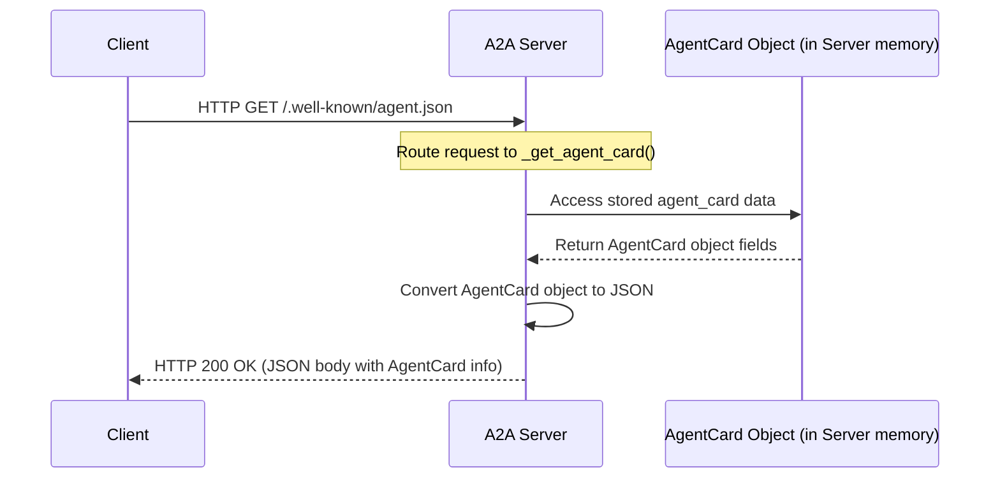

# Chapter 5: Agent Metadata Models (AgentCard, Skill)

Welcome back! In [Chapter 4: A2A Server](04_a2a_server.md), we learned how the `A2AServer` acts as the front desk for our `TellTimeAgent`, receiving requests and sending back responses. We even saw that the server has a special URL (`/.well-known/agent.json`) where clients can ask for information *about* the agent.

But how does the server know what information to provide? How can it describe the agent's identity, purpose, and abilities in a standard way? This is where **Agent Metadata Models** come in.

## What's on the Business Card?

Imagine you meet someone at a conference who has a cool skill, like telling the time *really* accurately. They hand you their business card. What would you expect to see? Probably their name, what they do, maybe their website, and perhaps a list of their special skills.

Agent metadata models are just like that business card, but for our AI agents. They are structured ways to hold information *about* the agent itself. This information helps other programs (like clients or agent directories) understand:

*   Who is this agent? (Name)
*   What does it do? (Description)
*   Where can I reach it? (URL)
*   What version is it? (Version)
*   What special features does it have? (Capabilities, e.g., can it stream answers?)
*   What specific jobs can it perform? (Skills, e.g., "Tell Time")

Why is this important? It allows for **discovery** and **understanding**. A client application might want to check if the `TellTimeAgent` supports streaming responses before trying to use that feature. An "Agent Store" website could use this metadata to list the `TellTimeAgent`, showing users what it does and how to use it.

## Key Metadata Concepts

Our project uses a few key building blocks (defined in Python using Pydantic models) to represent this metadata. Let's look at the main ones:

**1. `AgentSkill`: Describing a Single Ability**

Think of this as listing one specific service on the business card. For our `TellTimeAgent`, the main skill is telling the time.

The `AgentSkill` model holds details about one particular skill:

*   `id`: A unique computer-friendly identifier (e.g., `"tell_time"`).
*   `name`: A human-friendly name (e.g., `"Tell Time Tool"`).
*   `description`: A short explanation (e.g., `"Replies with the current time"`).
*   `examples`: Optional sample questions a user might ask (e.g., `["What time is it?", "Current time please"]`).

Here's how it looks in code (simplified):

```python
# File: models/agent.py (Simplified view)
from pydantic import BaseModel
from typing import List

class AgentSkill(BaseModel):
    id: str          # e.g., "tell_time"
    name: str        # e.g., "Tell Time Tool"
    description: str | None = None # Optional description
    examples: List[str] | None = None # Optional examples
    # ... other optional fields like tags, input/output modes ...
```

This simple structure gives a clear picture of what one specific skill involves.

**2. `AgentCapabilities`: Checking Off Features**

This is like a small checklist on the business card indicating special features. Does the agent support sending back answers piece-by-piece (streaming)? Can it send notifications proactively?

*   `streaming`: `True` if the agent can stream responses, `False` otherwise.
*   `pushNotifications`: `True` if the agent can push updates, `False` otherwise.

```python
# File: models/agent.py (Simplified view)
from pydantic import BaseModel

class AgentCapabilities(BaseModel):
    streaming: bool = False # Our TellTimeAgent does NOT stream
    pushNotifications: bool = False
    # ... other capabilities ...
```

This helps clients know how they can interact with the agent. For `TellTimeAgent`, `streaming` is `False`.

**3. `AgentCard`: The Full Business Card**

This is the main container, holding all the key information about the agent. It combines the agent's identity, contact info, capabilities, and a list of its skills.

*   `name`: The agent's name (e.g., `"TellTimeAgent"`).
*   `description`: What the agent does (e.g., `"This agent replies with the current system time."`).
*   `url`: The web address where the agent can be reached (e.g., `"http://localhost:10002/"`).
*   `version`: The agent's software version (e.g., `"1.0.0"`).
*   `capabilities`: An `AgentCapabilities` object (the checklist we just saw).
*   `skills`: A list containing one or more `AgentSkill` objects (the list of services).

```python
# File: models/agent.py (Simplified view)
from pydantic import BaseModel
from typing import List

# Assume AgentCapabilities and AgentSkill are defined as above

class AgentCard(BaseModel):
    name: str
    description: str
    url: str
    version: str
    capabilities: AgentCapabilities # Contains the capabilities object
    skills: List[AgentSkill]      # Contains a list of skill objects
    # ... other fields like supported input/output types ...
```

This `AgentCard` provides a comprehensive overview of the agent in a structured format.

## How We Use These Models

Okay, we have these nice Python classes (`AgentCard`, `AgentSkill`, `AgentCapabilities`) to structure the agent's information. How do we actually *create* this information for our `TellTimeAgent` and make it available?

This happens in the main script that starts our server, `agents/google_adk/__main__.py`.

**1. Defining the Skill:**
First, we create an `AgentSkill` object describing the "Tell Time" ability.

```python
# File: agents/google_adk/__main__.py (Simplified Snippet)
from models.agent import AgentSkill

# Define the skill this agent offers
skill = AgentSkill(
    id="tell_time",                                 # Unique ID
    name="Tell Time Tool",                          # Friendly name
    description="Replies with the current time",    # What it does
    examples=["What time is it?", "Tell me the current time"] # Examples
)
```
This creates a specific instance of `AgentSkill` for our time-telling function.

**2. Defining the Capabilities:**
We create an `AgentCapabilities` object, specifying that our agent *cannot* stream.

```python
# File: agents/google_adk/__main__.py (Simplified Snippet)
from models.agent import AgentCapabilities

# Define what features this agent supports
capabilities = AgentCapabilities(
    streaming=False # This agent does not support streaming
)
```

**3. Creating the AgentCard:**
Now we put it all together in an `AgentCard`, filling in the name, description, URL, version, and including the `capabilities` and `skill` objects we just defined.

```python
# File: agents/google_adk/__main__.py (Simplified Snippet)
from models.agent import AgentCard
# Assume 'skill' and 'capabilities' are defined as above
# Assume 'host' and 'port' variables hold the server address (e.g., "localhost", 10002)

# Create the main agent metadata card
agent_card = AgentCard(
    name="TellTimeAgent",
    description="This agent replies with the current system time.",
    url=f"http://{host}:{port}/", # Where the agent lives
    version="1.0.0",
    capabilities=capabilities,    # Include the capabilities object
    skills=[skill]                # Include the skill in a list
    # ... other details omitted ...
)
```
We now have a complete `agent_card` Python object holding all the metadata for our `TellTimeAgent`.

**4. Giving the Card to the Server:**
Finally, when we create the [A2A Server](04_a2a_server.md) instance, we pass this `agent_card` object to it.

```python
# File: agents/google_adk/__main__.py (Simplified Snippet)
from server.server import A2AServer
# Assume 'agent_card' is the object created above
# Assume 'task_manager_instance' is also created

# Create the server instance, giving it the agent's metadata
server = A2AServer(
    host=host,
    port=port,
    agent_card=agent_card,        # Pass the metadata here!
    task_manager=task_manager_instance
)

# Start the server (it now knows about the agent card)
server.start()
```
The server now holds onto this `agent_card` object.

## Under the Hood: Serving the AgentCard

How does the server use the `AgentCard` object it received? Remember the special URL `/.well-known/agent.json` from [Chapter 4: A2A Server](04_a2a_server.md)? When a client requests that URL, the server uses the stored `AgentCard`.

**Step-by-Step:**

1.  A client (like a browser or another program) sends an HTTP `GET` request to `http://<server_address>/.well-known/agent.json`.
2.  The [A2A Server](04_a2a_server.md) (specifically, the Starlette application inside it) receives this request.
3.  Starlette routes the request to the `_get_agent_card` method in `server/server.py` because the path and method (`GET`) match the route defined in the server's `__init__`.
4.  The `_get_agent_card` method simply accesses the `self.agent_card` object that was stored during the server's initialization.
5.  It converts this Python `AgentCard` object into a JSON dictionary format suitable for sending over the web.
6.  It wraps this JSON data in an HTTP response with a success code (200 OK).
7.  The server sends this HTTP response back to the client.

**Visualizing the Flow:**



**Code Snippets:**

*   **Server Storing the Card (`server/server.py`)**: The server's `__init__` method stores the card passed in.

    ```python
    # File: server/server.py (Inside A2AServer __init__)
    from models.agent import AgentCard
    from agents.google_adk import task_manager # Type hint

    # ... other imports ...

    class A2AServer:
        def __init__(self, host="0.0.0.0", port=5000,
                     agent_card: AgentCard = None, # Expect an AgentCard
                     task_manager: task_manager = None):
            # ... store host, port ...
            self.agent_card = agent_card # Store the passed-in card
            self.task_manager = task_manager
            # ... setup Starlette app ...
            # Define the route for GET requests to agent.json
            self.app.add_route("/.well-known/agent.json", self._get_agent_card, methods=["GET"])
    ```

*   **Server Serving the Card (`server/server.py`)**: The `_get_agent_card` method retrieves the stored card and returns it as JSON.

    ```python
    # File: server/server.py (Inside A2AServer class)
    from starlette.responses import JSONResponse
    from starlette.requests import Request

    # ... other methods ...

    def _get_agent_card(self, request: Request) -> JSONResponse:
        """ Returns the agent's metadata as JSON. """
        # Access the stored agent_card and convert it to a dictionary
        # Pydantic's model_dump() handles the conversion nicely
        # exclude_none=True makes the JSON cleaner by omitting optional fields that are None
        return JSONResponse(self.agent_card.model_dump(exclude_none=True))
    ```
    This handler is very simple: it just takes the `AgentCard` object it already has (`self.agent_card`), turns it into a dictionary (`model_dump`), and sends it back as a `JSONResponse`.

## Conclusion

You've learned about the essential metadata models (`AgentCard`, `AgentSkill`, `AgentCapabilities`) that act like a business card for our AI agent.

*   They provide structured information about the agent's identity, purpose, location, version, features, and specific abilities.
*   This metadata allows clients or directories to discover and understand agents.
*   We define this metadata in Python using Pydantic models (`models/agent.py`).
*   The main server script (`agents/google_adk/__main__.py`) creates these metadata objects for our `TellTimeAgent`.
*   The [A2A Server](04_a2a_server.md) stores this metadata and serves it as JSON when requested at `/.well-known/agent.json`.

Now that we know how agents are described, how do the client and server actually structure the *requests* and *responses* when they want to execute a task?

Next up: [Chapter 6: A2A Request/Response Models](06_a2a_request_response_models.md)

---

Generated by [AI Codebase Knowledge Builder](https://github.com/The-Pocket/Tutorial-Codebase-Knowledge)