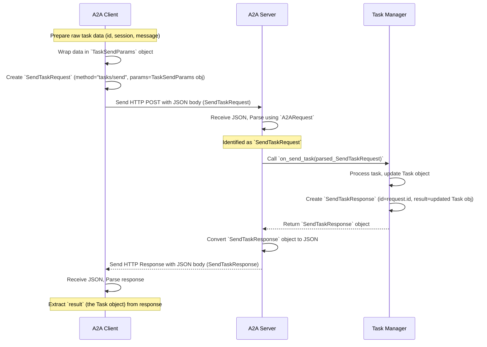

# Chapter 6: A2A Request/Response Models

Welcome back! In [Chapter 5: Agent Metadata Models (AgentCard, Skill)](05_agent_metadata_models__agentcard__skill_.md), we learned how agents describe themselves using metadata like a business card (`AgentCard`). This helps others understand *what* an agent is and *what* it can do.

Now, let's think about how a client actually *asks* the agent to do something, like perform a specific skill. Just knowing the agent exists isn't enough. We need a precise way to structure our requests and understand the agent's replies.

## The Need for Specific Forms

Imagine you want to order a pizza online. You don't just send a random message like "pizza!". The website gives you a specific form:
*   What size? (Small, Medium, Large)
*   What toppings? (Pepperoni, Mushrooms, Olives...)
*   Delivery Address?

This structured form ensures the pizza place gets all the information they need in a predictable way.

Similarly, when our [A2A Client](03_a2a_client.md) wants to talk to the [A2A Server](04_a2a_server.md) (where the `TellTimeAgent` lives), they can't just send unstructured data. They need specific "forms" for different actions.

**A2A Request/Response Models** are exactly these specific forms. They define the precise structure for messages exchanged between agents, like:
*   "Please start this task for me."
*   "Here is the result of the task you sent."
*   "Can you tell me the status of this task?"

## Building on a Standard Envelope: JSON-RPC

In [Chapter 9: JSON-RPC Protocol Models](09_json_rpc_protocol_models.md), we'll learn about **JSON-RPC**, which is like the standard postal envelope format our client and server use. It defines basic fields like `id` (to match requests with responses), `method` (what action is being requested), and `params` (the details of the request) or `result` (the outcome).

Our A2A Request/Response Models are like specific **letter templates** or **order forms** designed to fit perfectly *inside* that standard JSON-RPC envelope. They define exactly what should go into the `method` and `params` fields for specific agent actions.

## Our Specific "Forms": `SendTaskRequest` and `SendTaskResponse`

Let's look at the main "form" we use in our `TellTimeAgent` project: sending a task.

**1. `SendTaskRequest`: The "New Job Order" Form**

When the client wants the agent to start working on something (like figuring out the time), it uses the `SendTaskRequest` model. Think of this as the "New Job Order" form.

*   **Purpose:** To ask the agent to create or update a task.
*   **JSON-RPC `method`:** It *must* be set to the specific string `"tasks/send"`. This tells the server exactly what kind of action is being requested.
*   **JSON-RPC `params`:** This field contains the details of the task, structured using another model called `TaskSendParams`. This includes:
    *   The unique ID for the [Task](01_task.md) (`id`).
    *   A session ID (`sessionId`) to group related interactions.
    *   The actual user [Message & Part](08_message___part.md) (e.g., `role: "user"`, `parts: ["What time is it?"]`).

Here's how `SendTaskRequest` is defined in code using Pydantic (a Python library for defining data structures):

```python
# File: models/request.py (Simplified View)

from pydantic import BaseModel, Field
from typing import Literal

# Import the basic envelope structure
from models.json_rpc import JSONRPCRequest

# Import the model for task details
from models.task import TaskSendParams

# The specific "form" for sending a task
class SendTaskRequest(JSONRPCRequest):
    # The 'method' field MUST be exactly "tasks/send"
    method: Literal["tasks/send"] = "tasks/send"

    # The 'params' field MUST contain TaskSendParams data
    params: TaskSendParams
```
This code defines a structure named `SendTaskRequest`. It inherits the basic JSON-RPC fields and specifies that `method` must be `"tasks/send"` and `params` must follow the `TaskSendParams` structure.

**2. `SendTaskResponse`: The "Job Completion" Form**

When the server finishes processing the `SendTaskRequest` (i.e., the agent figures out the time and updates the task), it sends back a response using the `SendTaskResponse` model. Think of this as the "Job Completion" notice.

*   **Purpose:** To return the result of a successfully processed `SendTaskRequest`.
*   **JSON-RPC `result`:** This field contains the complete, updated [Task](01_task.md) object, including the agent's reply added to the history and the status updated to `completed`.

Here's its definition:

```python
# File: models/request.py (Simplified View)

from pydantic import BaseModel
from typing import Optional

# Import the basic envelope structure
from models.json_rpc import JSONRPCResponse

# Import the Task model
from models.task import Task

# The specific "form" for the response to sending a task
class SendTaskResponse(JSONRPCResponse):
    # The 'result' field will contain the updated Task object
    # (or None if there was an issue but not a full error)
    result: Optional[Task] = None
```
This defines `SendTaskResponse`, inheriting the basic JSON-RPC response fields and specifying that the `result` field should contain the `Task` object.

*(Note: There are other forms too, like `GetTaskRequest` and `GetTaskResponse` for checking on a task's status, but `SendTaskRequest/Response` are the main ones for our example.)*

## How These Forms Are Used

Let's see how the [A2A Client](03_a2a_client.md) and [A2A Server](04_a2a_server.md) use these specific "forms".

**Use Case:** Client asks "What time is it?"

**1. Client Prepares the "New Job Order" (`SendTaskRequest`)**

The command-line tool (`app/cmd/cmd.py`) gathers the task details (ID, session, message). Then, the `A2AClient` (`client/client.py`) uses the `SendTaskRequest` model to package these details into the correct JSON-RPC structure before sending it.

```python
# File: client/client.py (Simplified send_task method)

from models.request import SendTaskRequest # Import the "form"
from models.task import TaskSendParams     # Import the structure for params
from uuid import uuid4                     # For generating IDs
import json

async def send_task(self, payload: dict) -> Task:
    """ Prepares and sends a 'send_task' request. """

    # 1. Wrap the raw payload dictionary into the TaskSendParams structure
    task_params_obj = TaskSendParams(**payload)

    # 2. Create the specific SendTaskRequest "form" object
    #    - Assign a unique ID for the JSON-RPC request itself
    #    - Set the method automatically to "tasks/send"
    #    - Place the task_params_obj into the 'params' field
    request_form = SendTaskRequest(
        id=uuid4().hex,
        params=task_params_obj
    )

    print("\n📤 Client is packaging this request:")
    print(json.dumps(request_form.model_dump(), indent=2)) # Show the structured request

    # 3. Send this structured 'request_form' to the server...
    response_dict = await self._send_request(request_form) # _send_request handles HTTP

    # 4. Expect the server's response 'result' to be a Task
    return Task(**response_dict["result"])
```
The client doesn't just send the raw `payload`; it uses `SendTaskRequest` to ensure the data is perfectly formatted according to the agreed-upon "form" for the `"tasks/send"` method.

**2. Server Receives and Understands the "Form"**

The [A2A Server](04_a2a_server.md) (`server/server.py`) receives the incoming JSON request. It needs to figure out *which* form was sent. It uses a helper (`A2ARequest` from `models/request.py`) that automatically identifies the request type based on the `"method"` field.

```python
# File: server/server.py (Simplified _handle_request method)

from starlette.requests import Request
from starlette.responses import JSONResponse
from models.request import A2ARequest, SendTaskRequest # Import the union and specific form
from models.json_rpc import JSONRPCResponse, InternalError
import json
import logging
logger = logging.getLogger(__name__)

async def _handle_request(self, request: Request):
    """ Handles incoming POST requests for tasks. """
    try:
        body = await request.json() # Get the raw JSON data
        print("\n🔍 Server received JSON:", json.dumps(body, indent=2))

        # 1. Use A2ARequest to parse the body and identify the specific "form"
        #    It looks at the "method" field (e.g., "tasks/send")
        parsed_request = A2ARequest.validate_python(body)

        # 2. Check WHICH specific form it is
        if isinstance(parsed_request, SendTaskRequest):
            logger.info("Server identified request as SendTaskRequest")
            # 3. We know it's a SendTaskRequest, so we can safely access its 'params'
            #    and pass them to the Task Manager
            task_manager_result = await self.task_manager.on_send_task(parsed_request)
            # task_manager_result will be a SendTaskResponse object

            # 4. Create the final HTTP response from the Task Manager's result
            return self._create_response(task_manager_result)
        else:
            # Handle other request types (like GetTaskRequest) if needed
            raise ValueError(f"Unsupported method: {type(parsed_request)}")

    # ... error handling ...
```
The server uses `A2ARequest` to automatically validate and determine that the incoming message matches the `SendTaskRequest` structure. This ensures the server knows how to interpret the `params` correctly.

**3. Server Sends Back the "Job Completion" (`SendTaskResponse`)**

After the [Task Manager](07_task_manager.md) processes the request and updates the [Task](01_task.md), it wraps the final `Task` object into a `SendTaskResponse` "form". The server then sends this structured response back to the client.

```python
# File: agents/google_adk/task_manager.py (Simplified on_send_task method)
# ... (imports and other code) ...

async def on_send_task(self, request: SendTaskRequest) -> SendTaskResponse:
    # ... (steps 1-4: upsert task, get query, invoke agent, create agent message) ...

    # Step 5: Update task status and history (inside lock)
    async with self.lock:
        task.status = TaskStatus(state=TaskState.COMPLETED)
        task.history.append(agent_message)

    # Step 6: Create the "Job Completion" form (SendTaskResponse)
    #    - Use the original request's ID for matching
    #    - Place the final, updated 'task' object into the 'result' field
    response_form = SendTaskResponse(
        id=request.id,  # Use the same ID as the incoming request
        result=task     # Put the completed Task object here
    )
    print(f"\n✅ Task Manager prepared response for task {task.id}")
    return response_form # Return the structured response object
```
The Task Manager doesn't just return the raw `Task` data; it explicitly creates a `SendTaskResponse` object, ensuring the response follows the agreed-upon format, including the correct `id` and putting the `Task` in the `result` field.

## Under the Hood: The Flow of Forms

Let's visualize how these specific request/response models structure the communication:



This diagram shows that `SendTaskRequest` and `SendTaskResponse` act as well-defined containers ensuring that both the client and server know exactly how to package and interpret the data for the specific action of sending a task.

## Conclusion

You've learned about **A2A Request/Response Models**, which are crucial for structured communication between agents.

*   They act like specific **forms** (e.g., `SendTaskRequest`, `SendTaskResponse`) built using the standard **envelope** format of [JSON-RPC Protocol Models](09_json_rpc_protocol_models.md).
*   They define the exact structure (`method` and `params`/`result`) for specific actions, ensuring clarity and predictability.
*   Models like `SendTaskRequest` specify the `method` (e.g., `"tasks/send"`) and the structure of the `params` needed for that action.
*   Corresponding response models like `SendTaskResponse` define the structure of the `result` returned.
*   These models are used by the [A2A Client](03_a2a_client.md) to format requests and by the [A2A Server](04_a2a_server.md) to parse requests and format responses.

We've seen how the client creates a `SendTaskRequest` and how the server receives it, understands it, and eventually sends back a `SendTaskResponse`. But who *actually* handles the logic inside the server when a `SendTaskRequest` arrives? That's the job of the component we look at next.

Next up: [Chapter 7: Task Manager](07_task_manager.md)

---

Generated by [AI Codebase Knowledge Builder](https://github.com/The-Pocket/Tutorial-Codebase-Knowledge)