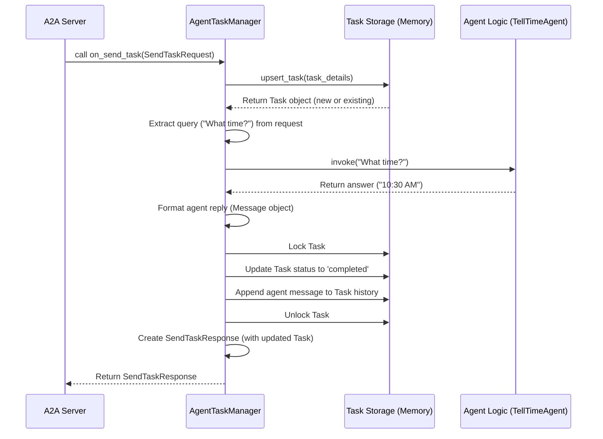

# Chapter 7: Task Manager

Welcome back! In [Chapter 6: A2A Request/Response Models](06_a2a_request_response_models.md), we learned about the specific "forms" or structures, like `SendTaskRequest`, that the [A2A Client](03_a2a_client.md) uses to ask the [A2A Server](04_a2a_server.md) to do something. We saw how the server receives this structured request.

But once the server receives a request like "Please start this task: 'What time is it?'", who actually takes charge of that task? Who coordinates the work, keeps track of the progress, and makes sure the final answer gets recorded?

This is the job of the **Task Manager**.

## The Agent's Project Manager

Imagine the [A2A Server](04_a2a_server.md) is the main office building, and the [Agent Logic (TellTimeAgent)](02_agent_logic__telltimeagent_.md) is a specialized worker (the time expert) inside. When a new job request (a `SendTaskRequest`) arrives at the front desk (the server), someone needs to manage that job from start to finish.

The **Task Manager** is like the **project manager** for tasks within the server. Its responsibilities are:

1.  **Receive New Jobs:** It takes the `SendTaskRequest` details from the server.
2.  **Keep Track:** It finds the [Task](01_task.md) associated with the request or creates a new one. It stores these tasks (in our simple project, just in the computer's memory).
3.  **Coordinate the Work:** It figures out what needs to be done (e.g., "get the current time") and asks the right worker ([Agent Logic (TellTimeAgent)](02_agent_logic__telltimeagent_.md)) to do it.
4.  **Record Progress:** It gets the result back from the agent logic (e.g., "The time is 10:30 AM").
5.  **Update the Job Ticket:** It updates the [Task](01_task.md) object by adding the agent's response to the `history` and changing the `status` (e.g., to `completed`).
6.  **Report Back:** It packages the updated [Task](01_task.md) into a `SendTaskResponse` and gives it back to the [A2A Server](04_a2a_server.md) to send to the client.

Essentially, the Task Manager is the central hub on the server side that manages the entire lifecycle of a [Task](01_task.md).

## How the Task Manager is Used

Let's revisit our "What time is it?" example and see where the Task Manager fits in.

1.  **Client Sends:** The [A2A Client](03_a2a_client.md) sends a `SendTaskRequest` (containing "What time is it?") to the [A2A Server](04_a2a_server.md).
2.  **Server Receives:** The [A2A Server](04_a2a_server.md)'s `_handle_request` method receives the request.
3.  **Server Delegates:** The server recognizes it's a `SendTaskRequest` and calls the Task Manager's `on_send_task` method, passing the request details.

    ```python
    # File: server/server.py (Simplified _handle_request method)

    # ... inside _handle_request ...
    try:
        body = await request.json()
        parsed_request = A2ARequest.validate_python(body) # Parse the request form

        # Check if it's the 'send_task' form
        if isinstance(parsed_request, SendTaskRequest):
            # ⭐️ Call the Task Manager's method to handle it!
            task_manager_result = await self.task_manager.on_send_task(parsed_request)
            # 'task_manager_result' will be a SendTaskResponse object
            return self._create_response(task_manager_result) # Send response back
        # ... other request types or error handling ...
    # ... error handling ...
    ```
    This code shows the server handing off the job (`parsed_request`) to `self.task_manager`. The server trusts the Task Manager to handle everything from here.

4.  **Task Manager Works:** The `on_send_task` method within the Task Manager does all the steps: finds/creates the [Task](01_task.md), calls the [Agent Logic (TellTimeAgent)](02_agent_logic__telltimeagent_.md), gets the answer, updates the Task, and prepares the `SendTaskResponse`. (We'll look inside this method next).
5.  **Task Manager Returns:** The `on_send_task` method finishes and returns the `SendTaskResponse` (containing the completed Task) back to the server's `_handle_request` method.
6.  **Server Responds:** The server takes this response and sends it back to the [A2A Client](03_a2a_client.md).

**Setting up the Task Manager:**

How does the server know *which* Task Manager to use? This is set up when the server starts in the main script.

```python
# File: agents/google_adk/__main__.py (Simplified main function)

# Import the specific Task Manager and Agent Logic we use
from agents.google_adk.task_manager import AgentTaskManager
from agents.google_adk.agent import TellTimeAgent
# Import the Server class
from server.server import A2AServer
# Other imports...

def main(host, port):
    # ... (AgentCard setup code) ...

    # 1. Create the Task Manager, giving it the Agent Logic it needs
    task_manager_instance = AgentTaskManager(agent=TellTimeAgent())

    # 2. Create the Server, giving it the Task Manager instance
    server = A2AServer(
        host=host,
        port=port,
        # ... agent_card ...
        task_manager=task_manager_instance # Tell the server which manager to use!
    )

    # 3. Start the server
    server.start()
```
Here, we create our specific `AgentTaskManager` (which knows how to talk to the `TellTimeAgent`) and pass it to the `A2AServer` when we create it. The server stores this instance as `self.task_manager`.

## Under the Hood: Inside the `AgentTaskManager`

Our project uses a specific implementation called `AgentTaskManager` (located in `agents/google_adk/task_manager.py`). This class actually inherits some basic functionality (like storing tasks in memory) from a more general class called `InMemoryTaskManager` (in `server/task_manager.py`). Think of it like `AgentTaskManager` is a specialized project manager who knows about AI agents, built on top of a general-purpose manager who knows how to store job tickets.

Let's trace the steps inside the `AgentTaskManager.on_send_task` method when it receives the "What time is it?" request:

**Step-by-Step Flow (`on_send_task`):**

1.  **Get Request:** The method receives the `SendTaskRequest` object from the [A2A Server](04_a2a_server.md).
2.  **Find/Create Task:** It calls `upsert_task` (a method inherited from `InMemoryTaskManager`). This method looks in its memory storage (a simple dictionary `self.tasks`) for a [Task](01_task.md) with the ID from the request.
    *   If found, it adds the user's new message to the `history`.
    *   If not found, it creates a *new* [Task](01_task.md) object with the ID, sets the `status` to `submitted`, and adds the user's message as the first item in the `history`. It stores this new task in the `self.tasks` dictionary.
    *   It returns the found or newly created `Task` object.
3.  **Extract Query:** It looks inside the user's message within the request and pulls out the actual text: `"What time is it?"`.
4.  **Call Agent Logic:** It calls the `invoke` method on the `self.agent` object (which is our `TellTimeAgent` instance, stored during initialization). It passes the query `"What time is it?"` to the agent.
5.  **Receive Answer:** The `TellTimeAgent` does its work (using the ADK/Gemini) and returns the answer string, e.g., `"The current time is 10:30 AM"`.
6.  **Format Agent Reply:** The Task Manager takes this answer string and wraps it in a proper [Message & Part](08_message___part.md) structure, setting the `role` to `"agent"`.
7.  **Update Task Status:** It changes the `status` of the [Task](01_task.md) object to `completed`.
8.  **Update Task History:** It appends the agent's formatted reply message to the `history` list of the [Task](01_task.md) object. *(Steps 7 & 8 are often done together inside a "lock" to prevent issues if multiple requests try to update the same task simultaneously)*.
9.  **Create Response Form:** It creates a `SendTaskResponse` object. It uses the same `id` as the original `SendTaskRequest` (so the client can match them up) and puts the fully updated [Task](01_task.md) object into the `result` field.
10. **Return Response:** It returns the `SendTaskResponse` object back to the [A2A Server](04_a2a_server.md).

**Visualizing the Flow:**



**Code Dive:**

Let's look at simplified snippets from `agents/google_adk/task_manager.py`:

*   **Initialization:** Storing the agent logic.

    ```python
    # File: agents/google_adk/task_manager.py (Simplified)
    from server.task_manager import InMemoryTaskManager
    from agents.google_adk.agent import TellTimeAgent
    # Other imports...

    class AgentTaskManager(InMemoryTaskManager):
        def __init__(self, agent: TellTimeAgent):
            # Call the parent class's init (sets up self.tasks, self.lock)
            super().__init__()
            # Store the specific agent logic instance we'll use
            self.agent = agent
    ```
    When `AgentTaskManager` is created, it initializes its parent (`InMemoryTaskManager`) to get the basic storage features, and it saves the `TellTimeAgent` instance so it can call its `invoke` method later.

*   **Getting the User's Question:** A helper to extract text.

    ```python
    # File: agents/google_adk/task_manager.py (Simplified)
    from models.request import SendTaskRequest

    # Inside AgentTaskManager class
    def _get_user_query(self, request: SendTaskRequest) -> str:
        """ Extracts the text from the first part of the user's message. """
        # Assumes the first part of the message is the text query
        return request.params.message.parts[0].text
    ```
    This small helper function just digs into the request structure to find the user's typed message.

*   **Handling the Task (`on_send_task`):** The main coordination logic.

    ```python
    # File: agents/google_adk/task_manager.py (Simplified)
    # Imports: SendTaskRequest, SendTaskResponse, Task, Message, TextPart, TaskStatus, TaskState
    import logging
    logger = logging.getLogger(__name__)

    # Inside AgentTaskManager class
    async def on_send_task(self, request: SendTaskRequest) -> SendTaskResponse:
        logger.info(f"Processing task: {request.params.id}")

        # Step 1 & 2: Get/Create Task (using inherited method)
        task: Task = await self.upsert_task(request.params)

        # Step 3: Extract user query
        query = self._get_user_query(request)

        # Step 4 & 5: Call Agent Logic and get answer string
        result_text = self.agent.invoke(query, request.params.sessionId)

        # Step 6: Format agent's reply
        agent_message = Message(
            role="agent",
            parts=[TextPart(text=result_text)]
        )

        # Step 7 & 8: Update task (using inherited lock)
        async with self.lock:
            task.status = TaskStatus(state=TaskState.COMPLETED)
            task.history.append(agent_message)

        # Step 9 & 10: Create and return the response form
        response_form = SendTaskResponse(id=request.id, result=task)
        logger.info(f"Task {task.id} completed.")
        return response_form
    ```
    This method clearly shows the sequence: get the task, get the query, ask the agent, format the reply, update the task, and return the response. It relies on `self.upsert_task` and `self.lock` from its parent `InMemoryTaskManager` for storage and safety.

*   **Basic Storage (`InMemoryTaskManager`):** Where tasks are kept.

    ```python
    # File: server/task_manager.py (Simplified)
    from typing import Dict
    import asyncio
    from models.task import Task, TaskSendParams, TaskStatus, TaskState

    class InMemoryTaskManager(TaskManager): # TaskManager is the abstract base
        def __init__(self):
            # 🗃️ A dictionary to hold tasks: { "task_id_1": TaskObject1, ... }
            self.tasks: Dict[str, Task] = {}
            # 🔐 A lock to prevent race conditions when modifying tasks
            self.lock = asyncio.Lock()

        async def upsert_task(self, params: TaskSendParams) -> Task:
            # Safely access the dictionary using the lock
            async with self.lock:
                task = self.tasks.get(params.id)
                if task is None:
                    # Create new task if not found
                    task = Task(
                        id=params.id,
                        status=TaskStatus(state=TaskState.SUBMITTED),
                        history=[params.message]
                    )
                    self.tasks[params.id] = task # Store it
                else:
                    # Add message to existing task's history
                    task.history.append(params.message)
                return task # Return the task object
        # ... (on_get_task implementation) ...
        # Note: on_send_task is abstract here, implemented in AgentTaskManager
    ```
    This shows the simple dictionary (`self.tasks`) used to store `Task` objects, keyed by their ID. The `asyncio.Lock` ensures that operations like adding or updating tasks happen safely, one at a time.

## Conclusion

You've now met the **Task Manager**, the crucial coordinator on the server side!

*   It acts like a project manager for [Task](01_task.md) objects.
*   It receives task requests (like `SendTaskRequest`) from the [A2A Server](04_a2a_server.md).
*   It orchestrates the work by calling the appropriate [Agent Logic (TellTimeAgent)](02_agent_logic__telltimeagent_.md).
*   It updates the [Task](01_task.md)'s history and status.
*   It stores the Task (in our case, using the `InMemoryTaskManager`'s dictionary).
*   It provides methods like `on_send_task` that the server uses to delegate task handling.

We've seen that the Task Manager updates the Task's `history` by adding messages. But what exactly makes up a `Message`? What are `Parts`? Let's look closer at how conversations are structured within a Task.

Next up: [Chapter 8: Message & Part](08_message___part.md)

---

Generated by [AI Codebase Knowledge Builder](https://github.com/The-Pocket/Tutorial-Codebase-Knowledge)