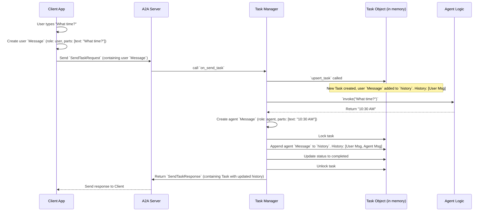

# Chapter 8: Message & Part

Welcome back! In [Chapter 7: Task Manager](07_task_manager.md), we saw how the `AgentTaskManager` acts as the project manager for our AI requests. It receives the user's question, asks the [Agent Logic (TellTimeAgent)](02_agent_logic__telltimeagent_.md) for an answer, and importantly, updates the [Task](01_task.md) object with the results.

One key part of updating the [Task](01_task.md) was adding messages to its `history`. But what exactly *is* a message in this context? How do we represent a single line of conversation like "What time is it?" or the agent's reply "The current time is 10:30 AM"?

That's where **Message** and **Part** come in.

## Keeping Track of Who Said What

Imagine a simple text chat on your phone. Each time you or your friend sends a text, it appears as a separate bubble in the conversation history. You can easily see who sent which message and what they said.

Our agent system needs something similar to keep track of the conversation within a [Task](01_task.md). The `Task`'s `history` field is designed to be a log of the entire interaction, step-by-step.

*   The **`Message`** object represents **one single turn** in the conversation – like one chat bubble.
*   The **`Part`** object represents the **actual content** of that turn – what was actually said or shown inside the bubble.

## Key Concepts: Building Blocks of Conversation

Let's break down these two simple building blocks:

**1. `Part`: The Content of a Message**

Think of this as the text inside a chat bubble. Right now, our agent system is very simple and only handles plain text. So, we have one specific type of `Part`:

*   **`TextPart`**: Holds a piece of text content.
    *   `type`: Always set to the string `"text"` to indicate it's plain text.
    *   `text`: The actual text string (e.g., `"What time is it?"`).

Here's the simplified code definition:

```python
# File: models/task.py (Simplified view)
from pydantic import BaseModel, Field
from typing import Literal

# Represents one part of a message, currently only plain text
class TextPart(BaseModel):
    type: Literal["text"] = "text" # Fixed type identifier
    text: str                      # The actual text content
```
This defines a simple structure that clearly labels a piece of text as being of `type: "text"`.

*(Why have a `Part` and `TextPart`? This design allows us to potentially add other types of content later, like images or buttons, without changing the overall `Message` structure.)*

**2. `Message`: One Turn in the Conversation**

This represents a single chat bubble – one complete utterance from either the user or the agent.

*   **`role`**: Who sent this message? This is crucial and can be either:
    *   `"user"`: The message came from the human user.
    *   `"agent"`: The message came from the AI agent.
*   **`parts`**: What is the content of this message? This is a *list* containing one or more `Part` objects. For our simple case, it will usually be a list containing just one `TextPart`.

Here's the simplified code definition:

```python
# File: models/task.py (Simplified view)
from typing import List
# Assume TextPart is defined as above

# Alias: For now, "Part" is the same as TextPart
Part = TextPart

# A message in the context of a task
class Message(BaseModel):
    role: Literal["user", "agent"] # Who sent it?
    parts: List[Part]              # What did they say? (A list of parts)
```
This structure clearly defines who sent the message (`role`) and what they sent (`parts`).

## How Messages Build the Task History

Now, let's see how these `Message` objects, containing `TextPart`s, make up the `history` list within our [Task](01_task.md).

Remember our "What time is it?" example? When the task is completed, its `history` might look like this:

*Initial State (After user sends message):*
```json
{
  "id": "task-001",
  "status": { "state": "submitted", "timestamp": "..." },
  "history": [
    {
      "role": "user",
      "parts": [
        { "type": "text", "text": "What time is it?" }
      ]
    }
  ]
}
```
The `history` is a list containing *one* `Message` object. This message has `role: "user"` and its `parts` list contains one `TextPart` with the user's question.

*Final State (After agent replies):*
```json
{
  "id": "task-001",
  "status": { "state": "completed", "timestamp": "..." },
  "history": [
    {
      "role": "user",
      "parts": [
        { "type": "text", "text": "What time is it?" }
      ]
    },
    {
      "role": "agent",
      "parts": [
        { "type": "text", "text": "The current time is 10:30 AM." }
      ]
    }
  ]
}
```
Now, the `history` list contains *two* `Message` objects:
1.  The original user message.
2.  The new agent message, with `role: "agent"` and a `TextPart` containing the agent's answer.

The `history` provides a complete, ordered record of the conversation turn-by-turn.

## Under the Hood: Creating and Adding Messages

Let's see where these `Message` objects are created and added to the history.

**1. User Message Creation (Client Side)**

When you type your query in the command-line tool, the [A2A Client](03_a2a_client.md) needs to package it correctly before sending it. This happens when it prepares the `TaskSendParams` that go inside the `SendTaskRequest`.

```python
# File: app/cmd/cmd.py (Simplified Snippet inside input loop)
from uuid import uuid4
# We define the structure directly in the payload for simplicity here

prompt = "What time is it?" # Your input
session_id = "some-session-id"

# Prepare the payload for the 'tasks/send' request parameters
payload = {
    "id": uuid4().hex,
    "sessionId": session_id,
    # 👇 Create the user Message structure here!
    "message": {
        "role": "user",
        "parts": [
            {"type": "text", "text": prompt} # Create the TextPart
        ]
    }
}

# client.send_task(payload) will package this into SendTaskRequest.params
```
The client constructs the `message` dictionary with the correct `role` and `parts` (containing the `TextPart` with your input) as part of the data it will send to the server.

**2. Agent Message Creation (Server Side - Task Manager)**

After the [Agent Logic (TellTimeAgent)](02_agent_logic__telltimeagent_.md) returns its text answer (e.g., "The current time is 10:30 AM."), the [Task Manager](07_task_manager.md) needs to wrap this answer in a `Message` object before adding it to the history.

```python
# File: agents/google_adk/task_manager.py (Simplified on_send_task method)
from models.task import Message, TextPart, TaskStatus, TaskState
# ... imports and other code ...

async def on_send_task(self, request: SendTaskRequest) -> SendTaskResponse:
    # ... (get task, get query, invoke agent) ...
    result_text = self.agent.invoke(query, request.params.sessionId) # e.g., "The current time is 10:30 AM."

    # 👇 Create the agent Message object here!
    agent_message = Message(
        role="agent",
        parts=[TextPart(text=result_text)] # Create the TextPart
    )

    # Add the agent's message to the task's history
    async with self.lock:
        task.status = TaskStatus(state=TaskState.COMPLETED)
        task.history.append(agent_message) # Append the whole Message object

    # ... (create SendTaskResponse and return) ...
```
The `AgentTaskManager` explicitly creates a `Message` object, sets the `role` to `"agent"`, creates a `TextPart` with the `result_text`, and then appends this complete `agent_message` object to the `task.history` list.

**Visualizing the Flow:**

Let's see how the `history` gets built during the `send_task` process:


This diagram shows the user `Message` being added when the task is first created/updated, and the agent `Message` being added later by the `Task Manager` after the agent provides its response.

## Conclusion

You've now learned about **Message** and **Part**, the fundamental units for representing conversation turns within a [Task](01_task.md).

*   A **`Message`** is like one chat bubble, identifying the `role` (user or agent).
*   A **`Part`** (specifically `TextPart` for now) holds the actual content (`text`) of the message.
*   The `Task`'s `history` is a list (`List[Message]`) that records the sequence of these messages, forming the conversation log.
*   The client creates the initial user `Message`, and the [Task Manager](07_task_manager.md) creates the agent's `Message` and adds both to the `history`.

We understand the structure of the Task, its history, and the messages within it. We also know how specific request/response "forms" like `SendTaskRequest` carry this data. But how are these forms actually packaged and sent over the network? What's the "envelope" they travel in?

Next up: [Chapter 9: JSON-RPC Protocol Models](09_json_rpc_protocol_models.md)

---

Generated by [AI Codebase Knowledge Builder](https://github.com/The-Pocket/Tutorial-Codebase-Knowledge)