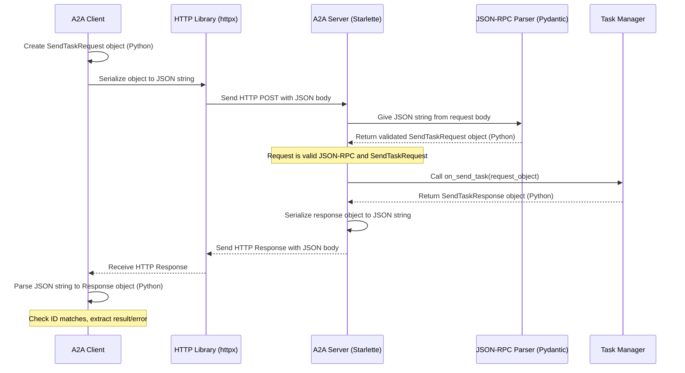

# Chapter 9: JSON-RPC Protocol Models

Welcome back! In [Chapter 8: Message & Part](08_message___part.md), we looked closely at how individual messages (`Message`) and their content (`TextPart`) are structured to form the conversation history within a [Task](01_task.md). We also saw in [Chapter 6: A2A Request/Response Models](06_a2a_request_response_models.md) how specific "forms" like `SendTaskRequest` are used to ask the agent to do something.

But how do the [A2A Client](03_a2a_client.md) and [A2A Server](04_a2a_server.md) ensure they understand the *basic format* of any message they exchange? Before you can even read the specific `SendTaskRequest` form, you need to know how to open the envelope it arrived in!

That's where **JSON-RPC** comes in.

## The Universal Postal Service: Why JSON-RPC?

Imagine you're sending a physical letter. You can write anything you want inside, but you still need to follow some rules for the outside envelope so the postal service can deliver it:
*   Put the recipient's address in the middle.
*   Put your return address in the top corner.
*   Put a stamp in the other corner.

If everyone agrees on this basic envelope format, the postal service works smoothly, regardless of whether the letter inside is a birthday card, a bill, or a job application.

**JSON-RPC** is like that standard envelope format for our client and server. It's a simple, agreed-upon set of rules for structuring requests and responses using JSON. This ensures that the client and server can understand the *basic plumbing* of communication, even before they look at the specific details of the request (like the "What time is it?" message).

It solves the problem: "How can we make sure the client and server speak the same basic structural language when making requests and sending replies?"

## Key Concepts: The Parts of the Envelope

JSON-RPC 2.0 defines a few key fields that must be present in messages. Think of these as the standard parts of our digital envelope. These structures are defined in our project in `models/json_rpc.py`.

**1. The Request Envelope (`JSONRPCRequest`)**

When the client wants the server to do something (like run the `TellTimeAgent`), it sends a `JSONRPCRequest`.

*   `jsonrpc`: Always `"2.0"`. This is like saying "We're using the standard postal rules, version 2.0".
*   `method`: A string specifying *what action* the client wants the server to perform. This is like the "Subject" line or "Attention: Tell Time Department". In our case, it's `"tasks/send"`.
*   `params`: An object or array containing the specific details needed for that action. This is the actual content of the letter – for `"tasks/send"`, it contains the [Task](01_task.md) ID, session ID, and the user's [Message & Part](08_message___part.md), structured according to `TaskSendParams` from [Chapter 6](06_a2a_request_response_models.md).
*   `id`: A unique identifier (string or number) for *this specific request*. Think of it as a tracking number. It's crucial for matching the server's response back to the original request.

Here's a simplified view of the base request model:

```python
# File: models/json_rpc.py (Simplified view)
from pydantic import BaseModel, Field
from typing import Any, Literal
from uuid import uuid4

# Base for all messages
class JSONRPCMessage(BaseModel):
    jsonrpc: Literal["2.0"] = "2.0"
    id: int | str | None = Field(default_factory=lambda: uuid4().hex) # Auto-generate ID if missing

# The Request structure
class JSONRPCRequest(JSONRPCMessage):
    method: str                 # What function to call?
    params: Any | None = None   # What data does it need? (Can be dict, list, etc.)
```
This defines the basic fields required for any request. Our specific requests like `SendTaskRequest` build upon this.

**2. The Response Envelope (`JSONRPCResponse`)**

When the server finishes processing the request, it sends back a `JSONRPCResponse`.

*   `jsonrpc`: Still `"2.0"`.
*   `id`: Must be the *exact same ID* as the request it's responding to. This confirms which "tracking number" this reply belongs to.
*   **EITHER** `result`: If the request was successful, this field contains the output or result of the action. For a successful `"tasks/send"`, this holds the updated [Task](01_task.md) object.
*   **OR** `error`: If something went wrong, this field contains an error object with details (`code`, `message`, `data`).

A response will have *either* `result` *or* `error`, but never both.

Here's a simplified view of the base response model:

```python
# File: models/json_rpc.py (Simplified view)

# (Assuming JSONRPCMessage and JSONRPCError are defined)

# The Response structure
class JSONRPCResponse(JSONRPCMessage):
    result: Any | None = None       # Success? Put the answer here.
    error: JSONRPCError | None = None # Failure? Put the error details here.
```
This defines the basic structure for replies, allowing for both success and failure cases. Our specific responses like `SendTaskResponse` build on this.

**3. The Error Notice (`JSONRPCError`)**

If the server couldn't process the request, the `error` field in the response contains a `JSONRPCError` object.

*   `code`: A number indicating the type of error (e.g., -32600 for Invalid Request, -32603 for Internal Error).
*   `message`: A short, human-readable explanation of the error.
*   `data` (optional): Extra details about the error.

```python
# File: models/json_rpc.py (Simplified view)

# The Error structure
class JSONRPCError(BaseModel):
    code: int
    message: str
    data: Any | None = None
```
This provides a standard way to report problems back to the client.

## How We Use the Envelopes

Our specific request/response models from [Chapter 6: A2A Request/Response Models](06_a2a_request_response_models.md) are designed to fit perfectly *inside* these JSON-RPC envelopes.

**Example: Sending "What time is it?"**

1.  **Client Packages the Request:** The [A2A Client](03_a2a_client.md) takes the user's message and task details (`TaskSendParams`) and puts them into the `params` field of a `SendTaskRequest`. The `SendTaskRequest` itself automatically includes `jsonrpc: "2.0"`, `method: "tasks/send"`, and gets assigned a unique `id`.

    *What the client sends (conceptual JSON):*
    ```json
    {
      "jsonrpc": "2.0",
      "method": "tasks/send",
      "params": { // This is the TaskSendParams content
        "id": "task-abc-123",
        "sessionId": "session-xyz",
        "message": {
          "role": "user",
          "parts": [{"type": "text", "text": "What time is it?"}]
        }
      },
      "id": "req-001" // Unique request ID
    }
    ```
    See how this perfectly matches the `JSONRPCRequest` structure?

2.  **Server Processes:** The [A2A Server](04_a2a_server.md) receives this. It first checks the basic envelope (`jsonrpc`, `id`). It sees `method: "tasks/send"` and knows how to handle the `params` according to the `SendTaskRequest` definition. It asks the [Task Manager](07_task_manager.md) to process it.

3.  **Server Packages the Response:** The [Task Manager](07_task_manager.md) successfully gets the time and updates the [Task](01_task.md). It puts the complete, updated `Task` object into the `result` field of a `SendTaskResponse`. The `SendTaskResponse` automatically includes `jsonrpc: "2.0"` and crucially uses the *same `id`* from the original request (`"req-001"`).

    *What the server sends back (conceptual JSON):*
    ```json
    {
      "jsonrpc": "2.0",
      "result": { // This is the updated Task object
        "id": "task-abc-123",
        "status": {"state": "completed", ...},
        "history": [
          {"role": "user", ...},
          {"role": "agent", "parts": [{"type": "text", "text": "The time is..."}]}
        ]
      },
      "id": "req-001", // Matches the request ID!
      "error": null // No error occurred
    }
    ```
    This matches the `JSONRPCResponse` structure, with the `Task` object nested inside the `result` field. The matching `id` lets the client know this response is for its `"req-001"` request.

## Under the Hood: Sending and Receiving Envelopes

The client and server don't need to manually build these JSON strings. They use the Pydantic models defined in `models/json_rpc.py` and `models/request.py`.

**Step-by-Step:**

1.  **Client Creates Request Object:** The [A2A Client](03_a2a_client.md) creates a Python object like `SendTaskRequest(params=task_details)`. Pydantic automatically fills in `jsonrpc: "2.0"`, `method: "tasks/send"`, and generates an `id`.
2.  **Client Serializes to JSON:** Before sending over HTTP, the client converts the Python request object into a JSON string (using `.model_dump()` which Pydantic provides).
3.  **HTTP Transport:** The JSON string is sent as the body of an HTTP POST request.
4.  **Server Receives HTTP:** The [A2A Server](04_a2a_server.md) receives the HTTP request.
5.  **Server Parses JSON:** The server takes the JSON string from the HTTP body.
6.  **Server Validates & Creates Object:** It uses Pydantic models (`A2ARequest` which uses the `method` field to pick the right model like `SendTaskRequest`) to parse the JSON back into a validated Python object. This ensures the request follows the expected JSON-RPC and `SendTaskRequest` structure. If parsing fails, it knows the request is malformed.
7.  **Server Processes:** The server uses the parsed request object to call the [Task Manager](07_task_manager.md).
8.  **Server Creates Response Object:** The Task Manager returns a response object (e.g., `SendTaskResponse(id=request.id, result=task_object)`).
9.  **Server Serializes Response:** The server converts the Python response object into a JSON string.
10. **Server Sends HTTP Response:** The server sends the JSON string back to the client in the HTTP response body.
11. **Client Parses Response:** The client receives the HTTP response, parses the JSON body, and uses Pydantic to validate it and turn it into a Python response object (checking the `id` matches and extracting the `result` or `error`).

**Visualizing the Flow:**



This shows how the JSON-RPC models act as the blueprint for creating and parsing the messages at both ends, while HTTP handles the actual transport over the network.

## Conclusion

You've now learned about the **JSON-RPC Protocol Models**, the standard "envelope" format used for communication in our `version_2_adk_agent` project.

*   It provides a simple, universal structure for requests (`method`, `params`, `id`) and responses (`result` or `error`, `id`).
*   It ensures the client and server can understand the basic format of messages, regardless of the specific action being requested.
*   Our specific A2A models (like `SendTaskRequest`) define the content that goes *inside* the `params` or `result` fields of these standard JSON-RPC envelopes.
*   Python libraries like Pydantic help us easily create, send, receive, and validate messages conforming to this protocol.

We've now covered all the major conceptual pieces: Tasks, Agent Logic, Client, Server, Metadata, Request/Response Forms, Task Management, Message structure, and the underlying JSON-RPC protocol. How do we put all these pieces together to actually run the server?

Next up: [Chapter 10: Server Entrypoint (__main__)](10_server_entrypoint____main___.md)

---

Generated by [AI Codebase Knowledge Builder](https://github.com/The-Pocket/Tutorial-Codebase-Knowledge)