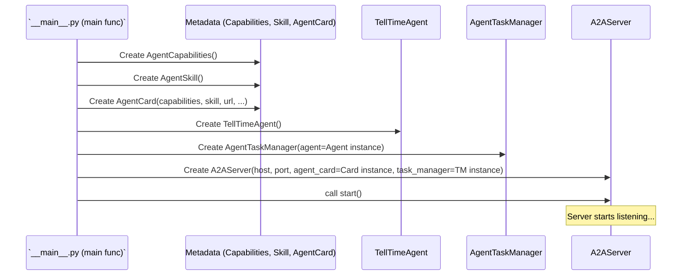

# Chapter 10: Server Entrypoint (__main__)

Welcome to the final chapter! In [Chapter 9: JSON-RPC Protocol Models](09_json_rpc_protocol_models.md), we saw the standard "envelope" format (`JSONRPCRequest`, `JSONRPCResponse`) that our [A2A Client](03_a2a_client.md) and [A2A Server](04_a2a_server.md) use to ensure they understand the basic structure of messages.

We've explored all the individual components:
*   The job ticket ([Task](01_task.md))
*   The specialist worker ([Agent Logic (TellTimeAgent)](02_agent_logic__telltimeagent_.md))
*   The telephone ([A2A Client](03_a2a_client.md))
*   The front desk ([A2A Server](04_a2a_server.md))
*   The business card ([Agent Metadata Models (AgentCard, Skill)](05_agent_metadata_models__agentcard__skill_.md))
*   The order forms ([A2A Request/Response Models](06_a2a_request_response_models.md))
*   The project manager ([Task Manager](07_task_manager.md))
*   The chat bubbles ([Message & Part](08_message___part.md))
*   The standard envelope ([JSON-RPC Protocol Models](09_json_rpc_protocol_models.md))

But how do we actually assemble all these pieces and turn on the engine? How does the `TellTimeAgent` server start running so it can listen for requests?

## The Ignition Key: What is the Server Entrypoint?

Think of building a car. You have the engine, the wheels, the seats, the steering wheel... all the parts. But you need one specific action to make the car actually start: turning the ignition key.

The **Server Entrypoint** script (`agents/google_adk/__main__.py`) is like that ignition key for our agent server. It's the main executable script that:

1.  **Gathers the Parts:** It imports all the necessary components we've learned about (the server, the task manager, the agent logic, the metadata models).
2.  **Configures the Agent:** It defines the agent's identity and skills by creating the [Agent Card](05_agent_metadata_models__agentcard__skill_.md).
3.  **Prepares the Workers:** It creates an instance of our specific agent logic ([Agent Logic (TellTimeAgent)](02_agent_logic__telltimeagent_.md)) and the project manager ([Task Manager](07_task_manager.md)).
4.  **Sets up the Front Desk:** It creates an instance of the main [A2A Server](04_a2a_server.md).
5.  **Connects Everything:** It "wires" the components together – telling the Task Manager which Agent Logic to use, and telling the A2A Server which Task Manager and Agent Card to use.
6.  **Starts the Engine:** It tells the [A2A Server](04_a2a_server.md) to start listening for incoming requests on a specific network address (host and port).

This script is the central point where everything comes together to bring our agent online.

## How to Use It: Running the Server

You don't *use* the entrypoint script like you use the [A2A Client](03_a2a_client.md) to ask questions. Instead, you *run* this script to start the server itself.

You typically run it from your terminal, standing in the root directory of the project:

```bash
python -m agents.google_adk --host localhost --port 10002
```

Let's break down this command:
*   `python -m agents.google_adk`: Tells Python to run the `__main__.py` file found inside the `agents/google_adk` directory as the main program.
*   `--host localhost`: An option telling the server to listen only for connections from your own computer (localhost). You could use `0.0.0.0` to allow connections from other computers on your network.
*   `--port 10002`: An option telling the server which network port number to listen on. This needs to match the port the client tries to connect to.

When you run this command, you'll see log messages indicating the server is starting up and listening. It will keep running, waiting for clients to connect and send requests, until you stop it (usually by pressing `Ctrl+C` in the terminal).

## Under the Hood: Assembling the Agent (`__main__.py`)

Let's walk through the `agents/google_adk/__main__.py` script step-by-step to see how it assembles and starts our `TellTimeAgent` server.

**1. Imports:**
The script starts by importing all the necessary building blocks we've created in other files.

```python
# File: agents/google_adk/__main__.py (Simplified)

# The server class that listens for requests
from server.server import A2AServer

# Models for agent's "business card"
from models.agent import AgentCard, AgentCapabilities, AgentSkill

# The specific task manager and agent logic for this agent
from agents.google_adk.task_manager import AgentTaskManager
from agents.google_adk.agent import TellTimeAgent

# Libraries for command-line options and logging
import click
import logging
```
This brings in all the blueprints and tools needed to build and run the server.

**2. Command-Line Setup (`@click` decorators):**
The script uses the `click` library to easily define command-line options like `--host` and `--port`.

```python
# File: agents/google_adk/__main__.py (Simplified)

@click.command() # Makes the 'main' function a command-line command
@click.option("--host", default="localhost", help="Host to bind server")
@click.option("--port", default=10002, help="Port number for server")
def main(host, port):
    """Sets up and starts the agent server."""
    # ... (rest of the setup code goes here) ...
```
This allows users to easily configure the server's address when they run the script. The values provided (or the defaults) are passed as arguments (`host`, `port`) to the `main` function.

**3. Defining Agent Capabilities and Skills:**
Inside the `main` function, we first define the agent's features and specific abilities, just like we saw in [Chapter 5: Agent Metadata Models (AgentCard, Skill)](05_agent_metadata_models__agentcard__skill_.md).

```python
# File: agents/google_adk/__main__.py (Inside main function)

    # Define agent features (e.g., can it stream answers?)
    capabilities = AgentCapabilities(streaming=False) # Our agent cannot stream

    # Define the specific skill this agent has
    skill = AgentSkill(
        id="tell_time",
        name="Tell Time Tool",
        description="Replies with the current time",
        # ... other details like examples ...
    )
```
This creates the description of *what* our agent can do.

**4. Creating the Agent's "Business Card" (`AgentCard`):**
Next, we combine the capabilities, skills, and other metadata into the main `AgentCard`.

```python
# File: agents/google_adk/__main__.py (Inside main function)

    # Create the full "business card" for the agent
    agent_card = AgentCard(
        name="TellTimeAgent",
        description="Replies with the current system time.",
        url=f"http://{host}:{port}/", # Agent's address
        version="1.0.0",
        capabilities=capabilities,   # Include the capabilities
        skills=[skill]               # Include the list of skills
        # ... other details ...
    )
```
Now we have a complete metadata object representing our `TellTimeAgent`.

**5. Preparing the Worker and Manager:**
We create instances of our specific agent logic and the task manager that knows how to use it.

```python
# File: agents/google_adk/__main__.py (Inside main function)

    # 1. Create the actual agent logic instance (the time expert)
    the_agent_logic = TellTimeAgent()

    # 2. Create the task manager, telling it which agent logic to use
    the_task_manager = AgentTaskManager(agent=the_agent_logic)
```
This creates the core components responsible for handling tasks, linking the manager (`AgentTaskManager`) directly to the worker (`TellTimeAgent`).

**6. Setting up the Server and Wiring Components:**
We create the main [A2A Server](04_a2a_server.md) instance, providing it with the host/port, the agent's `AgentCard`, and the `AgentTaskManager` we just created. This is the key connection step.

```python
# File: agents/google_adk/__main__.py (Inside main function)

    # Create the server instance (the front desk)
    server = A2AServer(
        host=host,                     # Where to listen
        port=port,                     # Which port to use
        agent_card=agent_card,         # Give it the agent's info
        task_manager=the_task_manager  # Tell it which manager handles tasks
    )
```
The `A2AServer` now knows its address, its identity (`agent_card`), and who to delegate tasks to (`task_manager`).

**7. Starting the Server (`server.start()`):**
Finally, we turn the ignition key! The `server.start()` method tells the server to begin listening for incoming HTTP requests.

```python
# File: agents/google_adk/__main__.py (Inside main function)

    # Turn the key - start listening for requests!
    print(f"🚀 Starting TellTimeAgent server on http://{host}:{port}")
    server.start() # This runs forever (until stopped)
```
This call blocks the script (it doesn't proceed past this line) and activates the server, making it ready to receive messages from clients.

**Visualizing the Assembly:**

This diagram shows how the `main` function creates and connects the components:



**8. Running the `main` function:**
The standard Python construct `if __name__ == "__main__":` ensures that the `main()` function is called only when the script is executed directly (like with `python -m agents.google_adk`), not when it's imported as a module by another script.

```python
# File: agents/google_adk/__main__.py (Bottom of the file)

if __name__ == "__main__":
    # This line calls the main function we defined above
    # when the script is run directly.
    main()
```

## Conclusion

You've reached the end of the `version_2_adk_agent` tutorial! In this final chapter, we learned about the **Server Entrypoint (__main__)** script (`agents/google_adk/__main__.py`).

*   It acts as the **ignition key** or the **assembly point** for the entire agent server.
*   It imports all the necessary components: [A2A Server](04_a2a_server.md), [Task Manager](07_task_manager.md), [Agent Logic (TellTimeAgent)](02_agent_logic__telltimeagent_.md), and metadata models.
*   It **configures** the agent by creating the [Agent Card](05_agent_metadata_models__agentcard__skill_.md).
*   It **instantiates** the specific agent, task manager, and server classes.
*   It **wires** these components together, ensuring the server knows about its identity and task handler.
*   Finally, it calls `server.start()` to bring the agent **online**, ready to receive requests.

By understanding each component from the previous chapters and seeing how this entrypoint script connects them, you now have a complete picture of how the `TellTimeAgent` works, from receiving a request to sending back a response.

Congratulations on completing the tutorial! You can now explore the code further, experiment with modifications, or use this foundation to build more complex agents.

---

Generated by [AI Codebase Knowledge Builder](https://github.com/The-Pocket/Tutorial-Codebase-Knowledge)