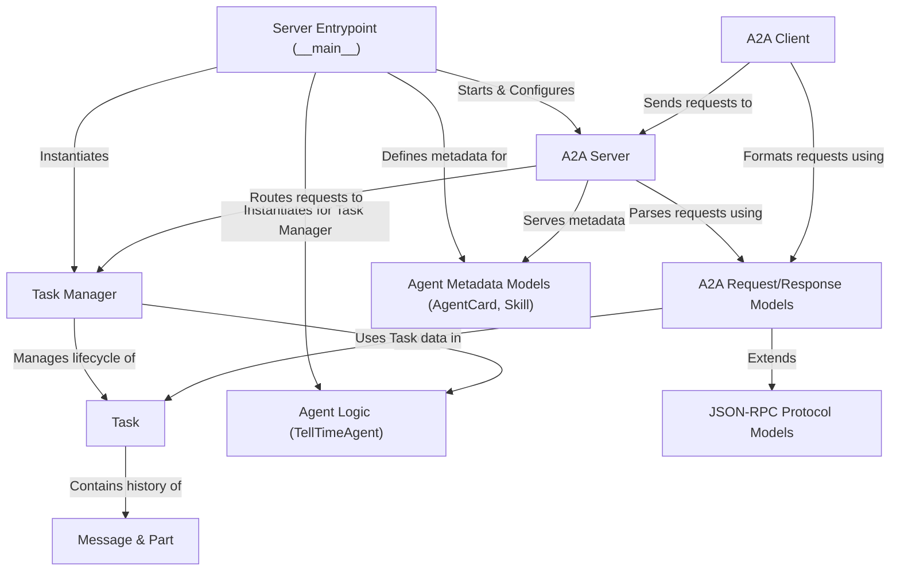

# Tutorial: version_2_adk_agent

This project implements a simple **AI agent** called *TellTimeAgent* that tells the current time.
It runs as a web **server** (*A2A Server*) using Google's Agent Development Kit (ADK).
Users can interact with it using a **command-line tool** (*A2A Client*) which sends a *Task* (like "what time is it?") to the server.
The server receives the task, asks the *Agent Logic* for the answer, manages the *Task* lifecycle using the *Task Manager*, and sends the response back.
Communication follows a standard format (*JSON-RPC* and specific *A2A Models*) to ensure the client and server understand each other.
The server also provides *metadata* (*AgentCard*) describing what the agent can do.

**Source Repository:** [None](None)

## Chapters

1. [Task](01_task.md)
2. [Agent Logic (TellTimeAgent)](02_agent_logic__telltimeagent_.md)
3. [A2A Client](03_a2a_client.md)
4. [A2A Server](04_a2a_server.md)
5. [Agent Metadata Models (AgentCard, Skill)](05_agent_metadata_models__agentcard__skill_.md)
6. [A2A Request/Response Models](06_a2a_request_response_models.md)
7. [Task Manager](07_task_manager.md)
8. [Message & Part](08_message___part.md)
9. [JSON-RPC Protocol Models](09_json_rpc_protocol_models.md)
10. [Server Entrypoint (__main__)](10_server_entrypoint____main___.md)

---

Generated by [AI Codebase Knowledge Builder](https://github.com/The-Pocket/Tutorial-Codebase-Knowledge)