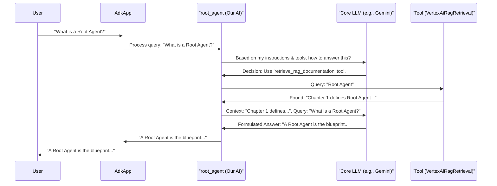

# Chapter 1: Root Agent Definition

Welcome to the RAG project tutorial! We're excited to help you understand how to build and deploy powerful AI assistants. In this very first chapter, we'll explore the foundational concept of the "Root Agent Definition."

## What's a Root Agent and Why Do We Need One?

Imagine you want to build a specialized AI assistant. Maybe it's an expert on your company's products, a helper for coding questions, or a guide for a complex game. How do you tell the AI *what* it is and *what it should be able to do*?

This is where the **Root Agent Definition** comes in.

Think of it like creating a job description and providing the basic tools for a new employee. Before they can start working, you need to define:
*   **Who they are:** What's their role or specialty?
*   **What's their primary goal?** What are their core instructions?
*   **What tools do they have?** Can they look up information? Can they perform specific actions?

Our Root Agent Definition is precisely this blueprint for our AI's "brain" and capabilities. It's the starting point for building any intelligent agent in this project.

**Our Use Case:** Let's say we want to build an AI assistant that can answer questions about a specific set of documents (our "corpus"). For example, it could be an expert on the RAG project itself, capable of explaining its components based on its documentation. To build this, we first need to define our "RAG Documentation Expert" agent.

## Designing Your AI Assistant: The `root_agent`

In our RAG project, the blueprint for our AI is defined in a file named `rag/agent.py`. Inside this file, we create something called `root_agent`.

Let's look at what goes into defining this `root_agent`.

### Key Ingredients of a Root Agent

1.  **Core Large Language Model (LLM):** This is the "engine" of your AI's brain. It's the powerful model that does the thinking, understanding, and generating of text. We might choose a model like `'gemini-2.0-flash-001'`.
2.  **Name:** A simple, descriptive name for your agent, like `'ask_rag_agent'`. This helps identify it.
3.  **Instructions (The "Prime Directive"):** These are the fundamental rules and guidelines your agent must follow. Think of it as its core mission statement. We'll dive deep into this in [Agent Instructions (Prompts)](02_agent_instructions__prompts_.md). For now, just know it's a crucial part.
4.  **Tools:** These are special capabilities you give your agent. If it needs to find specific information from a document collection, you'd give it a "retrieval tool." One such tool we'll use is `VertexAiRagRetrieval`, which we'll explore in detail in [RAG Retrieval Tool](04_rag_retrieval_tool.md).

### Example: Defining Our `root_agent`

Let's peek into `rag/agent.py` to see how these ingredients come together.

```python
# rag/agent.py (simplified snippet)

from google.adk.agents import Agent
# ... other imports for tools and prompts ...
from .prompts import return_instructions_root
from .tools import ask_vertex_retrieval # Assuming tools are defined elsewhere for clarity

# ... (Tool definition like ask_vertex_retrieval would be here or imported) ...

root_agent = Agent(
    model='gemini-2.0-flash-001',
    name='ask_rag_agent',
    instruction=return_instructions_root(), # Gets instructions from prompts.py
    tools=[
        ask_vertex_retrieval, # Gives the agent the RAG retrieval tool
    ]
)
```

Let's break this down:
*   `from google.adk.agents import Agent`: We're importing the `Agent` class, which is like a template for creating our AI assistant.
*   `model='gemini-2.0-flash-001'`: We're telling our agent to use the `gemini-2.0-flash-001` model as its brain.
*   `name='ask_rag_agent'`: We've named our agent.
*   `instruction=return_instructions_root()`: This line fetches the core instructions for our agent. The actual text of these instructions lives in `prompts.py`, which we'll cover in [Chapter 2: Agent Instructions (Prompts)](02_agent_instructions__prompts_.md).
*   `tools=[ask_vertex_retrieval,]`: This gives our agent a list of tools it can use. Here, it's equipped with `ask_vertex_retrieval`, which allows it to search through our documents.

This `root_agent` object now holds the complete design of our AI assistant.

### Equipping the Agent with a Tool

Let's briefly look at how a tool like `ask_vertex_retrieval` might be defined. Don't worry about all the details now; we'll cover tools thoroughly in [Chapter 4: RAG Retrieval Tool](04_rag_retrieval_tool.md).

```python
# rag/agent.py (simplified tool definition snippet)
from google.adk.tools.retrieval.vertex_ai_rag_retrieval import VertexAiRagRetrieval
from vertexai.preview import rag
import os

ask_vertex_retrieval = VertexAiRagRetrieval(
    name='retrieve_rag_documentation',
    description=(
        'Use this tool to retrieve documentation and reference materials...'
    ),
    rag_resources=[
        rag.RagResource(
            rag_corpus=os.environ.get("RAG_CORPUS") # Points to our document collection
        )
    ]
    # ... other configurations ...
)
```
In this snippet:
*   We define `ask_vertex_retrieval` using `VertexAiRagRetrieval`.
*   We give it a `name` and `description` so the agent understands what this tool is for.
*   Crucially, `rag_corpus` tells the tool *where* to find the documents to search. This `RAG_CORPUS` is an environment variable pointing to our knowledge base, which we'll discuss more in [Chapter 3: Corpus Preparation & Management](03_corpus_preparation___management.md).

By including `ask_vertex_retrieval` in the `tools` list of our `root_agent`, we're empowering our AI to search through these specific documents when it needs to answer a question.

## Packaging the Agent for Deployment

Once our `root_agent` is defined, it needs to be "packaged" so it can be deployed and run. This is done using something called `AdkApp`.

Think of `AdkApp` as a container or a wrapper that holds your agent and gets it ready for the real world.

You can see this in action in the `deployment/deploy.py` file:

```python
# deployment/deploy.py (snippet)

from vertexai.preview.reasoning_engines import AdkApp
from rag.agent import root_agent # Our defined agent

# ... other setup code ...

app = AdkApp(
    agent=root_agent, # We pass our root_agent here!
    enable_tracing=True,
)

# ... code to deploy 'app' ...
```
Here:
*   `from rag.agent import root_agent`: We import the `root_agent` we just defined.
*   `app = AdkApp(agent=root_agent, ...)`: We create an `AdkApp` instance and tell it to use our `root_agent`.

This `app` object is what eventually gets deployed, making our AI assistant live and interactive. We'll learn more about this in [Chapter 6: Agent Deployment](06_agent_deployment.md).

## Under the Hood: What Happens?

When you define the `root_agent` and package it in an `AdkApp`, you're essentially setting up a system that can receive a user's question (a query) and intelligently respond.

Here's a simplified step-by-step flow:

1.  **User Asks a Question:** For example, "What is a Root Agent?"
2.  **`AdkApp` Receives Query:** The `AdkApp` takes this question.
3.  **`root_agent` Takes Over:** The `AdkApp` passes the query to our `root_agent`.
4.  **Agent Consults LLM:** The `root_agent` (using its specified LLM, e.g., Gemini) processes the query based on its `instruction` and available `tools`.
5.  **Tool Usage (if needed):** The LLM might decide that to answer "What is a Root Agent?", it needs to use the `retrieve_rag_documentation` tool.
6.  **Tool Execution:** The `retrieve_rag_documentation` tool searches the configured RAG corpus for relevant information.
7.  **Information Returned:** The tool provides the found information (e.g., text snippets about Root Agent Definition) back to the `root_agent`.
8.  **LLM Formulates Answer:** The `root_agent` gives this new information (and the original query) to the LLM to formulate a human-readable answer.
9.  **Response to User:** The `root_agent` sends the final answer back through the `AdkApp` to the user.

Let's visualize this interaction:



This diagram shows how the different components work together, starting from your definition of the `root_agent`. The `instruction` guides the LLM's reasoning, and the `tools` provide it with capabilities beyond simple text generation.

## Conclusion

You've now taken the first step in understanding how our RAG project builds AI assistants! The **Root Agent Definition** is the cornerstone. It's where you specify:
*   The **AI model** to power its thinking (`model`).
*   Its **identity** (`name`).
*   Its **core mission** (`instruction`).
*   Its **special abilities** (`tools`).

By defining `root_agent` in `rag/agent.py` and packaging it with `AdkApp`, we create a complete, deployable AI assistant.

In the next chapter, we'll zoom in on a critical piece of this definition: the `instruction`. How do we write effective instructions to guide our agent's behavior? Let's find out!

Next up: [Chapter 2: Agent Instructions (Prompts)](02_agent_instructions__prompts_.md)

---

Generated by [AI Codebase Knowledge Builder](https://github.com/The-Pocket/Tutorial-Codebase-Knowledge)