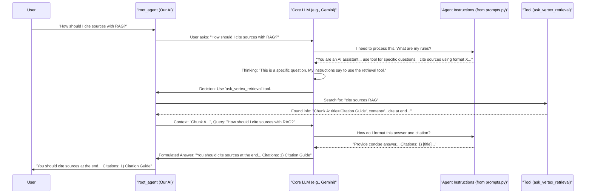

# Chapter 2: Agent Instructions (Prompts)

In [Chapter 1: Root Agent Definition](01_root_agent_definition.md), we learned how to create the basic blueprint for our AI assistant, defining its name, the AI model it uses, and the tools it has. But just like hiring a new employee, giving them a title and tools isn't enough. We also need to tell them *how* to do their job, *how* to behave, and *what* their responsibilities are. This is where "Agent Instructions," often called "prompts," come into play.

## What are Agent Instructions and Why Do We Need Them?

Imagine you're setting up an AI assistant to answer customer questions about your company's products. This is our **use case**. You wouldn't want it to give one-word answers, make up information, or forget to mention important details. You'd want it to be helpful, polite, use the product database (its "tool") correctly, and maybe even guide users to the right product pages.

**Agent Instructions (Prompts)** are the detailed guidelines we give to our AI agent to shape its behavior and responses. Think of it like writing a comprehensive job description and a detailed style guide for a customer service representative. These instructions tell the agent:

*   How to understand what a user is asking.
*   When it should use its tools (like a document search tool for our RAG project).
*   How it should behave in a conversation (e.g., be polite, ask clarifying questions).
*   How to format its answers (e.g., including citations or references).
*   What tone of voice to adopt (e.g., professional, friendly).

Without clear instructions, our AI agent might not be very helpful or could even give misleading information. Good instructions are key to making our AI consistent, reliable, and truly useful. In our RAG project, these instructions are primarily defined in the `rag/prompts.py` file.

## Peeking Inside: The `rag/prompts.py` File

In our project, the instructions for our `root_agent` are neatly stored in a file called `rag/prompts.py`. This file contains functions that return the text of these instructions. Let's look at a simplified idea of how this works.

The main function we care about for our `root_agent`'s instructions is `return_instructions_root()`.

```python
# rag/prompts.py (simplified snippet)

def return_instructions_root() -> str:
    instruction_prompt_v1 = """
        You are an AI assistant with access to specialized corpus of documents.
        Your role is to provide accurate and concise answers to questions based
        on documents that are retrievable using ask_vertex_retrieval.
        
        If you believe the user is just chatting and having casual conversation, 
        don't use the retrieval tool.
        
        But if the user is asking a specific question about a knowledge they 
        expect you to have, you can use the retrieval tool to fetch the most 
        relevant information.
        
        Make sure to cite the source of the information.
        Citation Format Instructions:
        When you provide an answer, you must also add one or more citations 
        **at the end** of your answer.
        ... (many more details) ...
        """
    return instruction_prompt_v1
```

*   This Python function, `return_instructions_root()`, simply returns a long string of text. This text is the "job description and style guide" for our AI.
*   You can see different versions (like `instruction_prompt_v0` and `instruction_prompt_v1` in the full file). This allows developers to experiment with different instruction sets. The function currently returns `instruction_prompt_v1`.

Remember from [Chapter 1: Root Agent Definition](01_root_agent_definition.md), when we defined our `root_agent`, we used this function:

```python
# rag/agent.py (snippet from Chapter 1)
# ...
from .prompts import return_instructions_root # We import the function

root_agent = Agent(
    model='gemini-2.0-flash-001',
    name='ask_rag_agent',
    instruction=return_instructions_root(), # And use it here!
    tools=[
        # ... tools list ...
    ]
)
```
So, the `instruction` parameter of our `Agent` gets filled with the detailed text provided by `return_instructions_root()`.

## Breaking Down the Instructions: What Are We Telling the Agent?

Let's look at some key parts of the `instruction_prompt_v1` (which our agent uses) and understand what each part does. These instructions are quite comprehensive!

1.  **Defining the Agent's Role:**
    ```text
    You are an AI assistant with access to specialized corpus of documents.
    Your role is to provide accurate and concise answers to questions based
    on documents that are retrievable using ask_vertex_retrieval.
    ```
    *   **Explanation:** This is like the "Job Title" and "Primary Responsibility." It tells the AI: "You are an AI assistant, and your main job is to answer questions using information you can find with the `ask_vertex_retrieval` tool." This tool is our [RAG Retrieval Tool](04_rag_retrieval_tool.md), which we'll cover later.

2.  **Guiding Tool Usage:**
    ```text
    If you believe the user is just chatting and having casual conversation, don't use the retrieval tool.
    But if the user is asking a specific question about a knowledge they expect you to have,
    you can use the retrieval tool to fetch the most relevant information.
    If you are not certain about the user intent, make sure to ask clarifying questions
    before answering.
    ```
    *   **Explanation:** This is crucial for efficiency and relevance.
        *   It tells the AI *not* to use its powerful (and potentially slower) search tool for casual chat.
        *   It tells the AI *to use* the tool when the user asks a specific question that requires information from the documents.
        *   It also guides the AI to ask for clarification if the user's query is unclear, preventing wrong answers.

3.  **Setting Boundaries:**
    ```text
    Do not answer questions that are not related to the corpus.
    ```
    *   **Explanation:** This keeps the AI focused. If our corpus is about the "RAG project," we don't want the AI trying to answer questions about cooking recipes.

4.  **Formatting Answers and Citing Sources:**
    ```text
    When crafting your answer, you may use the retrieval tool to fetch details
    from the corpus. Make sure to cite the source of the information.
    
    Citation Format Instructions:
    When you provide an answer, you must also add one or more citations **at the end** of
    your answer. ...
    **How to cite:**
    - Use the retrieved chunk's `title` to reconstruct the reference.
    - Include the document title and section if available.
    ...
    Format the citations at the end of your answer under a heading like
    "Citations" or "References." For example:
    "Citations:
    1) RAG Guide: Implementation Best Practices
    2) Advanced Retrieval Techniques: Vector Search Methods"
    ```
    *   **Explanation:** This is super important for a RAG system!
        *   It instructs the AI to always cite where it got its information. This builds trust and allows users to check the sources.
        *   It provides very specific rules on *how* to format these citations, ensuring consistency. It even tells the AI to use the `title` field from the retrieved information.

5.  **Controlling Conversational Behavior:**
    ```text
    Do not reveal your internal chain-of-thought or how you used the chunks.
    Simply provide concise and factual answers, and then list the
    relevant citation(s) at the end.
    ```
    *   **Explanation:** This tells the AI to be direct and avoid explaining its internal reasoning process unless asked. It focuses on delivering the answer and its sources.

6.  **Handling Uncertainty:**
    ```text
    If you are not certain or the information is not available, clearly state that you do not have
    enough information.
    ```
    *   **Explanation:** This is vital for honesty. It's better for the AI to admit it doesn't know than to guess or make things up.

## How Do These Instructions Work "Under the Hood"?

When you send a question to the AI agent, the Large Language Model (LLM) – its "brain" – doesn't just see your question. It sees your question *along with* these detailed instructions.

Imagine you're the AI. Every time someone asks you something:
1.  You first re-read your "job description and style guide" (the instructions).
2.  Then, you look at the user's question.
3.  You think: "Okay, given my instructions (be accurate, use tools for specific questions, cite sources, etc.) and this question, how should I respond?"

The instructions guide the LLM's thought process, helping it decide:
*   Is this a casual question or a specific one?
*   Should I use my `ask_vertex_retrieval` tool?
*   If I use the tool, what information should I look for?
*   Once I have the information, how should I phrase the answer?
*   How do I format the citations correctly?

Let's visualize this interaction:



This diagram shows that the `Instructions` are consulted by the `LLM` at key decision points, ensuring the agent behaves as desired.

## Tips for Writing Good Instructions

Crafting effective instructions (prompts) is a bit of an art and a science. Here are some tips if you ever want to modify or write your own:

*   **Be Clear and Specific:** The AI takes things literally. "Be helpful" is vague. "Answer questions based on the provided documents and cite your sources" is much clearer.
*   **Define the Persona/Role:** Telling the AI "You are a friendly and expert RAG documentation assistant" helps set the tone.
*   **Guide Tool Usage Carefully:** Explain *when* to use tools, *when not to*, and *how* to interpret their results if necessary.
*   **Specify Output Format:** If you need answers in a particular structure (like with citations), spell it out with examples.
*   **Set Boundaries:** Tell the AI what it *should not* do (e.g., "Do not provide medical advice," "Do not answer off-topic questions").
*   **Iterate and Test:** The first version of your instructions might not be perfect. Test your agent with various questions and refine the instructions based on its responses.

## Conclusion

Agent Instructions (Prompts) are the soul of your AI agent's personality and behavior. They are the detailed rulebook that guides the LLM, ensuring it acts appropriately, uses its tools wisely, and communicates effectively. In our RAG project, these crucial guidelines live in `rag/prompts.py` and are fed to our `root_agent` during its definition.

By carefully crafting these instructions, we can build AI assistants that are not just knowledgeable but also reliable, consistent, and genuinely helpful.

Now that our agent has its core definition and detailed instructions, it needs information to work with – the actual documents it will search. In the next chapter, we'll dive into how we prepare and manage this knowledge base.

Next up: [Chapter 3: Corpus Preparation & Management](03_corpus_preparation___management.md)

---

Generated by [AI Codebase Knowledge Builder](https://github.com/The-Pocket/Tutorial-Codebase-Knowledge)