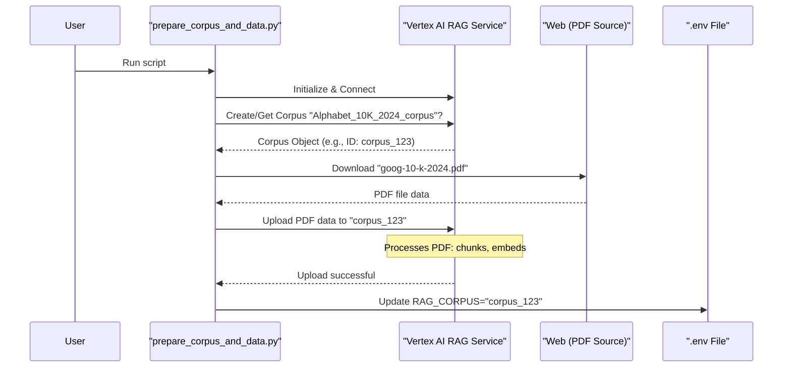

# Chapter 3: Corpus Preparation & Management

In [Chapter 1: Root Agent Definition](01_root_agent_definition.md), we designed the blueprint for our AI assistant, and in [Chapter 2: Agent Instructions (Prompts)](02_agent_instructions__prompts_.md), we gave it detailed instructions on how to behave. Now, our smart assistant is ready for its role, but it's like an expert librarian with no books in their library! To answer questions accurately, our agent needs access to a specialized knowledge base. This chapter is all about building and organizing that knowledge base, which we call a "RAG Corpus."

## What's a RAG Corpus and Why Do We Need One?

Imagine our AI assistant's job is to answer very specific questions about Alphabet's (Google's parent company) 2024 financial performance, based on their official 10-K report. This is our **use case**. The agent can't just "know" this information from its general training. We need to provide it with that specific document.

A **RAG Corpus** is essentially this curated collection of documents – our AI's specialized library. "Corpus Preparation & Management" is the process of:
1.  **Gathering** the necessary documents (like downloading the 10-K PDF).
2.  **Organizing** them in a way that the AI can efficiently search through them (using a service like Vertex AI).
3.  **Making them accessible** to the agent when it needs to find information.

Think of it like this:
*   **You are the Head Librarian:** You decide which books (documents) go into a special collection.
*   **The Corpus is the Special Collection Shelf:** It holds only the documents relevant to a specific topic.
*   **Vertex AI is the Smart Indexing System:** It processes these books, creating a detailed index so that information can be found quickly, not just by title, but by the content within.

Without this prepared corpus, our agent, even with the best instructions, wouldn't be able to answer questions about specific, private, or very new information not part of its original training.

## The Magic Script: `prepare_corpus_and_data.py`

To make our lives easier, our RAG project includes a script called `rag/shared_libraries/prepare_corpus_and_data.py`. This script automates the entire process of setting up our knowledge base.

Here's what it does:
1.  **Downloads source documents:** For our use case, it fetches Alphabet's 10-K PDF from a URL.
2.  **Creates a `RagCorpus` in Vertex AI:** If our "Alphabet 10-K Library Shelf" doesn't exist yet in Vertex AI, the script creates it. Vertex AI is a Google Cloud service that helps us manage and use AI models and data.
3.  **Uploads documents:** It takes the downloaded PDF and puts it onto our "Library Shelf" in Vertex AI. Vertex AI then "indexes" this document, breaking it down into smaller, searchable pieces and creating special codes (embeddings) that help find relevant information even if the user's question uses different words.
4.  **Stores the Corpus ID:** Every corpus in Vertex AI has a unique ID. The script saves this ID in our project's `.env` configuration file. This way, our agent's retrieval tool knows exactly which "Library Shelf" to search later.

Let's look at how this script works, piece by piece.

### 1. Configuration: Telling the Script What to Do

At the top of `prepare_corpus_and_data.py`, you'll find some configuration settings. These tell the script important details:

```python
# rag/shared_libraries/prepare_corpus_and_data.py (simplified snippet)

# ... (license and imports) ...
# Load environment variables from .env file
load_dotenv()

# --- Please fill in your configurations ---
PROJECT_ID = os.getenv("GOOGLE_CLOUD_PROJECT") # Your Google Cloud Project ID
LOCATION = os.getenv("GOOGLE_CLOUD_LOCATION")   # The region for your resources
CORPUS_DISPLAY_NAME = "Alphabet_10K_2024_corpus" # A friendly name for our corpus
CORPUS_DESCRIPTION = "Corpus containing Alphabet's 10-K 2024 document"
PDF_URL = "https://abc.xyz/assets/77/51/9841ad5c4fbe85b4440c47a4df8d/goog-10-k-2024.pdf" # Where to get the PDF
PDF_FILENAME = "goog-10-k-2024.pdf" # What to name the downloaded file
ENV_FILE_PATH = os.path.abspath(os.path.join(os.path.dirname(__file__), "..", "..", ".env")) # Path to .env
```
*   `PROJECT_ID` and `LOCATION`: These tell Google Cloud where to create and store our corpus. You'd have these set up in your `.env` file (more on this in [Chapter 8: Environment Configuration](08_environment_configuration.md)).
*   `CORPUS_DISPLAY_NAME`: This is a human-readable name for our knowledge base.
*   `PDF_URL` and `PDF_FILENAME`: This tells the script where to find the document online and what to call it.
*   `ENV_FILE_PATH`: This points to the `.env` file where the corpus ID will be saved.

### 2. Setting Up Vertex AI Connection

Before we can do anything with Vertex AI, we need to connect to it.

```python
# rag/shared_libraries/prepare_corpus_and_data.py (snippet)

def initialize_vertex_ai():
  credentials, _ = default() # Gets your Google Cloud login details
  vertexai.init(
      project=PROJECT_ID, location=LOCATION, credentials=credentials
  )
```
*   This function `initialize_vertex_ai()` uses your Google Cloud project details to establish a connection with Vertex AI services.

### 3. Creating (or Finding) Our "Library Shelf" (RagCorpus)

Next, the script either creates a new `RagCorpus` or finds an existing one with the `CORPUS_DISPLAY_NAME` we specified.

```python
# rag/shared_libraries/prepare_corpus_and_data.py (snippet)

def create_or_get_corpus():
  """Creates a new corpus or retrieves an existing one."""
  # ... (configuration for embedding model)
  existing_corpora = rag.list_corpora() # Get a list of all existing corpora
  corpus = None
  for existing_corpus in existing_corpora:
    if existing_corpus.display_name == CORPUS_DISPLAY_NAME:
      corpus = existing_corpus # Found it!
      print(f"Found existing corpus: {CORPUS_DISPLAY_NAME}")
      break
  if corpus is None:
    corpus = rag.create_corpus( # Didn't find it, so create a new one
        display_name=CORPUS_DISPLAY_NAME,
        description=CORPUS_DESCRIPTION,
        # ... (embedding_model_config)
    )
    print(f"Created new corpus: {CORPUS_DISPLAY_NAME}")
  return corpus
```
*   This function checks if a corpus named "Alphabet\_10K\_2024\_corpus" already exists in your Vertex AI project.
*   If it exists, it uses that one.
*   If not, it creates a brand new one. This new corpus is like an empty, specially prepared shelf in our digital library, ready for documents.

### 4. Getting the "Book": Downloading the PDF

Now, we need the actual document. The script downloads it from the `PDF_URL`.

```python
# rag/shared_libraries/prepare_corpus_and_data.py (snippet)

def download_pdf_from_url(url, output_path):
  """Downloads a PDF file from the specified URL."""
  print(f"Downloading PDF from {url}...")
  response = requests.get(url, stream=True) # Makes the web request
  response.raise_for_status() # Checks for errors like "File not found"
  
  with open(output_path, 'wb') as f: # Saves the downloaded content to a file
    for chunk in response.iter_content(chunk_size=8192):
      f.write(chunk)
  print(f"PDF downloaded successfully to {output_path}")
  return output_path
```
*   This function takes the `PDF_URL` (e.g., the link to the 10-K report) and saves the PDF to a temporary location on your computer.

### 5. Placing the "Book" on the "Shelf": Uploading to RagCorpus

With the PDF downloaded, the script uploads it to our `RagCorpus` in Vertex AI.

```python
# rag/shared_libraries/prepare_corpus_and_data.py (snippet)

def upload_pdf_to_corpus(corpus_name, pdf_path, display_name, description):
  """Uploads a PDF file to the specified corpus."""
  print(f"Uploading {display_name} to corpus {corpus_name}...")
  rag_file = rag.upload_file( # The key Vertex AI command
      corpus_name=corpus_name, # The ID of our corpus
      path=pdf_path,           # Path to the downloaded PDF
      display_name=display_name, # Name for this file in the corpus
      description=description,
  )
  print(f"Successfully uploaded {display_name}")
  return rag_file
```
*   `corpus_name` here is the unique ID of the `RagCorpus` we created or found earlier (e.g., `projects/your-project-id/locations/your-location/ragCorpora/1234567890`).
*   `rag.upload_file()` sends the PDF to Vertex AI. Vertex AI then does its magic:
    *   It breaks the PDF into smaller, manageable chunks of text.
    *   It creates "embeddings" for each chunk – these are numerical representations that capture the meaning of the text, allowing for smart searching.
    *   This makes the content searchable not just by keywords, but by semantic similarity (meaning).

### 6. Remembering the "Shelf Location": Updating the `.env` File

Once the corpus is ready and the document is uploaded, the script gets the unique ID of our `RagCorpus` (e.g., `projects/your-project-id/locations/your-location/ragCorpora/1234567890`). This ID is crucial because it tells our agent's tools exactly where to look for information.

```python
# rag/shared_libraries/prepare_corpus_and_data.py (snippet)

def update_env_file(corpus_name, env_file_path):
    """Updates the .env file with the corpus name (ID)."""
    set_key(env_file_path, "RAG_CORPUS", corpus_name) # Adds/updates the variable
    print(f"Updated RAG_CORPUS in {env_file_path} to {corpus_name}")
```
*   This function writes a line like `RAG_CORPUS="projects/your-project-id/locations/your-location/ragCorpora/1234567890"` into your project's `.env` file.
*   Now, when our agent's retrieval tool (which we'll see in [Chapter 4: RAG Retrieval Tool](04_rag_retrieval_tool.md)) needs to search the documents, it can read this `RAG_CORPUS` variable from the environment and know exactly which Vertex AI `RagCorpus` to query.

### Putting It All Together: The `main()` Function

The `main()` function in the script orchestrates all these steps:

```python
# rag/shared_libraries/prepare_corpus_and_data.py (snippet)

def main():
  initialize_vertex_ai()
  corpus = create_or_get_corpus() # Get or create our "library shelf"

  update_env_file(corpus.name, ENV_FILE_PATH) # Save its ID to .env

  with tempfile.TemporaryDirectory() as temp_dir: # Create a temp folder
    pdf_path = os.path.join(temp_dir, PDF_FILENAME)
    download_pdf_from_url(PDF_URL, pdf_path) # Get the "book"
    
    upload_pdf_to_corpus( # Put the "book" on the "shelf"
        corpus_name=corpus.name, 
        pdf_path=pdf_path,
        display_name=PDF_FILENAME,
        description="Alphabet's 10-K 2024 document"
    )
  
  list_corpus_files(corpus_name=corpus.name) # Show what's in our corpus
```
When you run `python -m rag.shared_libraries.prepare_corpus_and_data`, this `main` function executes, performing all the steps to set up your knowledge base.

## What Happens Under the Hood? A Quick Tour

Let's visualize the journey of your data when you run the `prepare_corpus_and_data.py` script:



1.  **You run the script.**
2.  The script connects to **Vertex AI RAG Service**.
3.  It asks Vertex AI to either create a new corpus (our "library shelf") or give it the existing one named "Alphabet\_10K\_2024\_corpus". Vertex AI returns the corpus object, which includes its unique ID.
4.  The script then goes to the **Web Data Source** (the URL for the PDF) and downloads the 10-K report.
5.  The script sends this PDF to the **Vertex AI RAG Service**, telling it to add this file to our specific corpus. Vertex AI then works its magic: it breaks the document into smaller pieces (chunks) and creates semantic embeddings for each chunk. This makes the information highly searchable.
6.  Finally, the script takes the unique ID of the corpus (e.g., `projects/.../ragCorpora/corpus_123`) and writes it into your **.env File** as the value for `RAG_CORPUS`.

Now, your `.env` file contains a line like:
`RAG_CORPUS="projects/your-gcp-project/locations/us-central1/ragCorpora/1234567890123456789"`

This `RAG_CORPUS` ID is critical. As we saw in [Chapter 1: Root Agent Definition](01_root_agent_definition.md), the agent's retrieval tool is configured to use this environment variable to know which knowledge base to search.

## Conclusion

You've now learned how we build and manage the specialized knowledge base—the RAG Corpus—that our AI agent will use. By running the `prepare_corpus_and_data.py` script, we automate downloading documents, setting up a searchable `RagCorpus` in Vertex AI, and storing its identifier for easy access. Our "librarian" agent now has its "special collection of books" ready!

With the corpus prepared, how does our agent actually look up information in it when a user asks a question? That's exactly what we'll explore in the next chapter, where we dive into the [RAG Retrieval Tool](04_rag_retrieval_tool.md).

Next up: [Chapter 4: RAG Retrieval Tool](04_rag_retrieval_tool.md)

---

Generated by [AI Codebase Knowledge Builder](https://github.com/The-Pocket/Tutorial-Codebase-Knowledge)