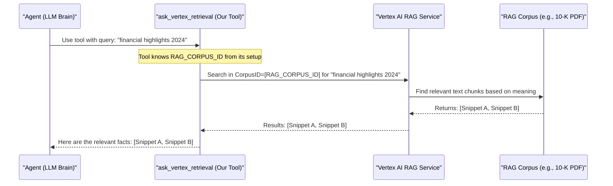

# Chapter 4: RAG Retrieval Tool

In [Chapter 3: Corpus Preparation & Management](03_corpus_preparation___management.md), we learned how to create and manage our AI's specialized library – the RAG Corpus. We prepared our "Alphabet 10-K report" and made it ready for our AI agent. But how does our agent actually *read* the books in this library? It needs a special tool for that! This chapter introduces the "RAG Retrieval Tool," the very component our agent uses to look up information.

## What's the RAG Retrieval Tool and Why Do We Need It?

Let's stick with our **use case**: Our AI assistant needs to answer questions about Alphabet's 2024 financial performance using the 10-K report we prepared. Imagine a user asks, "What were Alphabet's key financial highlights in 2024?"

Our agent is smart, but it doesn't magically know the contents of every new document we give it. It needs a mechanism to:
1.  **Understand** that it needs to look up information in the 10-K report.
2.  **Search** through that report efficiently.
3.  **Find** the most relevant pieces of information (snippets) related to "key financial highlights."
4.  **Bring back** these snippets so it can form an answer.

This is precisely what the **RAG Retrieval Tool** does. It's like giving your research assistant a super-powered search engine that *only* looks through the specific documents you've provided in the RAG corpus. For our RAG project, this tool is specifically an instance of `VertexAiRagRetrieval`.

## Meet `ask_vertex_retrieval`: Our Agent's Search Superpower

In [Chapter 1: Root Agent Definition](01_root_agent_definition.md), we saw that our `root_agent` is equipped with tools. One of these tools is named `ask_vertex_retrieval`. This is our RAG Retrieval Tool.

Let's look at how `ask_vertex_retrieval` is defined in our `rag/agent.py` file:

```python
# rag/agent.py (snippet)
from google.adk.tools.retrieval.vertex_ai_rag_retrieval import VertexAiRagRetrieval
from vertexai.preview import rag
import os

ask_vertex_retrieval = VertexAiRagRetrieval(
    name='retrieve_rag_documentation',
    description=(
        'Use this tool to retrieve documentation and reference materials for the question from the RAG corpus,'
    ),
    rag_resources=[
        rag.RagResource(
            rag_corpus=os.environ.get("RAG_CORPUS") # Points to our knowledge base!
        )
    ],
    similarity_top_k=10,
    vector_distance_threshold=0.6,
)
```

Let's break down these settings in a beginner-friendly way:

1.  **`name='retrieve_rag_documentation'`**:
    *   **Analogy:** This is like giving our search tool a specific name, e.g., "Library Search Engine."
    *   **Purpose:** The agent's brain (the LLM) uses this name to identify and decide to use this specific tool when it needs to find information in our documents.

2.  **`description='Use this tool to retrieve documentation...'`**:
    *   **Analogy:** This is the instruction manual for the "Library Search Engine."
    *   **Purpose:** It tells the agent *when* and *why* it should use this tool. If the user asks a question that requires looking up facts in our RAG corpus, the agent reads this description and thinks, "Aha! The 'retrieve\_rag\_documentation' tool is perfect for this!"

3.  **`rag_resources=[rag.RagResource(rag_corpus=os.environ.get("RAG_CORPUS"))]`**:
    *   **Analogy:** This tells the "Library Search Engine" *which specific library shelf* to search.
    *   **Purpose:** This is the most crucial part!
        *   `rag.RagResource(...)`: Specifies a source of information.
        *   `rag_corpus=os.environ.get("RAG_CORPUS")`: This line fetches the ID of our RAG Corpus (e.g., `projects/your-project/locations/us-central1/ragCorpora/12345...`) from the `.env` file. Remember in [Chapter 3: Corpus Preparation & Management](03_corpus_preparation___management.md), the `prepare_corpus_and_data.py` script saved this ID into `.env` after setting up our "Alphabet 10-K" corpus.
    *   So, this tells the tool: "When you search, search *only* within the corpus identified by this ID."

4.  **`similarity_top_k=10`**:
    *   **Analogy:** When you search on Google, you get a list of results. This is like saying, "Show me the top 10 most relevant results."
    *   **Purpose:** It tells the tool to return up to 10 of the most similar document snippets it finds for a given query.

5.  **`vector_distance_threshold=0.6`**:
    *   **Analogy:** This is like setting a "relevance score." If a search result isn't relevant enough (its score is too low, or in this case, its "distance" is too high), don't show it.
    *   **Purpose:** It helps filter out less relevant results. Only snippets that are sufficiently similar to the query (meeting a certain threshold) will be returned. (A lower distance means higher similarity).

By setting up `ask_vertex_retrieval` this way, we've given our agent a precise and powerful way to search our specific knowledge base.

## How Does the Agent Use This Tool?

Remember in [Chapter 2: Agent Instructions (Prompts)](02_agent_instructions__prompts_.md), we gave our agent detailed instructions. These instructions, along with the tool's `description`, help the agent decide when to use `ask_vertex_retrieval`.

Here's a simplified flow:

1.  **User asks a question:** "What were Alphabet's key financial highlights in 2024?"
2.  **Agent (LLM) analyzes:** Based on its instructions ("answer questions based on documents using `ask_vertex_retrieval`") and the tool description, the LLM recognizes this isn't a casual chat. It needs facts from the RAG corpus.
3.  **Agent decides to use the tool:** It decides to use the `retrieve_rag_documentation` tool.
4.  **Agent formulates a search query:** It might transform the user's question into a search query like "Alphabet 2024 financial highlights."
5.  **Tool executes the search:** The `ask_vertex_retrieval` tool takes this query and searches the specified `RAG_CORPUS` (our 10-K report).
6.  **Tool returns results:** The tool finds the most relevant snippets from the 10-K report. For example, it might return:
    *   Snippet 1: "Revenue grew by 15% to $XXX billion, driven by strong performance in Cloud..." (from page 25 of the 10-K)
    *   Snippet 2: "Net income was $YY billion, an increase of 12% year-over-year..." (from page 28 of the 10-K)
7.  **Agent formulates an answer:** The LLM takes these snippets, synthesizes the information, and generates a human-readable answer, like: "Alphabet's key financial highlights in 2024 include revenue growth of 15% to $XXX billion and a net income of $YY billion..." It will also cite the source as per its instructions.

This tool acts as the crucial bridge, fetching the raw data that the LLM then refines into a helpful answer.

## Under the Hood: How `ask_vertex_retrieval` Works

Let's peek behind the curtain. When the agent decides to use `ask_vertex_retrieval`, what happens?

**High-Level Walkthrough:**

1.  **Agent's Decision:** The `root_agent` (specifically, its LLM component) decides it needs information from the corpus to answer the current query. It chooses the `retrieve_rag_documentation` tool.
2.  **Tool Invocation:** The agent "calls" this tool, providing it with a search query (e.g., "financial highlights 2024").
3.  **Connecting to Vertex AI RAG:** The `VertexAiRagRetrieval` tool, using the `rag_corpus` ID (e.g., `projects/.../ragCorpora/123...` from the environment variable), connects to the Vertex AI RAG service. This service hosts our indexed 10-K report.
4.  **Semantic Search:** Vertex AI RAG service performs a "semantic search." This isn't just keyword matching. It uses the embeddings (numerical representations of meaning) created during corpus preparation (Chapter 3) to find text chunks in the 10-K report whose *meaning* is similar to the search query.
5.  **Retrieving Snippets:** The service retrieves the most relevant chunks of text (up to `similarity_top_k` and meeting the `vector_distance_threshold`).
6.  **Returning to Agent:** These snippets are passed back from the tool to the agent's LLM.
7.  **Answer Generation:** The LLM uses these snippets as context to generate the final answer for the user.

**Visualizing the Flow with a Sequence Diagram:**



**Diving Deeper into the Code (`rag/agent.py`):**

The magic is primarily in how `VertexAiRagRetrieval` is configured. Let's look at the definition again:

```python
# rag/agent.py (relevant part)
ask_vertex_retrieval = VertexAiRagRetrieval(
    # ... name and description ...
    rag_resources=[
        rag.RagResource(
            rag_corpus=os.environ.get("RAG_CORPUS") # Tells where to search
        )
    ],
    # ... similarity_top_k, vector_distance_threshold ...
)
```
The `VertexAiRagRetrieval` class (provided by `google.adk.tools`) handles all the complex interactions with the Google Cloud Vertex AI RAG service. Our job is to:
1.  **Instantiate it:** Create an object of this class.
2.  **Configure it:** Tell it the `name` and `description` so the agent knows how and when to use it.
3.  **Point it to the data:** Most importantly, provide the `rag_corpus` ID via `rag_resources`. This tells the underlying ADK machinery which specific knowledge base in Vertex AI to target for its search operations.

When the agent uses this tool, the `VertexAiRagRetrieval` object takes the search query, uses the Google Cloud client libraries to send a request to your specified `rag_corpus` in Vertex AI, and then processes the response to return the found document chunks.

## Conclusion

The RAG Retrieval Tool, specifically our `ask_vertex_retrieval` instance of `VertexAiRagRetrieval`, is the workhorse that connects our agent's intelligence to our curated knowledge base. It's the specialized search engine that dives into our RAG Corpus, fishes out the most relevant information, and hands it to the agent's LLM. This allows our agent to answer questions based on specific, up-to-date, or private documents far beyond its general training.

We've now seen:
*   How to define an agent ([Chapter 1: Root Agent Definition](01_root_agent_definition.md)).
*   How to instruct it ([Chapter 2: Agent Instructions (Prompts)](02_agent_instructions__prompts_.md)).
*   How to prepare its knowledge base ([Chapter 3: Corpus Preparation & Management](03_corpus_preparation___management.md)).
*   And now, how it searches that knowledge base using a retrieval tool.

But how do all these components, especially those relying on Google Cloud services like Gemini (the LLM) and Vertex AI RAG, actually talk to each other and work in harmony? That's what we'll explore next.

Next up: [Chapter 5: Vertex AI Services Integration](05_vertex_ai_services_integration.md)

---

Generated by [AI Codebase Knowledge Builder](https://github.com/The-Pocket/Tutorial-Codebase-Knowledge)