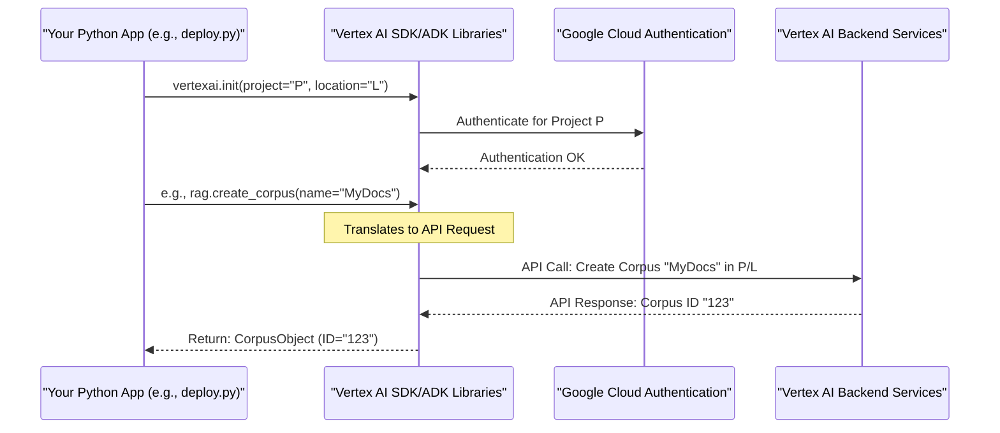

# Chapter 5: Vertex AI Services Integration

In [Chapter 4: RAG Retrieval Tool](04_rag_retrieval_tool.md), we saw how our agent gets a special tool to search through our knowledge base. But where does this "knowledge base" live? How does our agent's "brain" (the AI model) actually run? And how do all these pieces talk to Google's powerful AI technology? The answer lies in **Vertex AI Services Integration**.

This chapter explains how our RAG project is built upon Google Cloud's Vertex AI platform. Think of Vertex AI as a powerful, managed workshop that provides all the specialized machinery and skilled workers (services) we need to build and run our AI assistant.

## What's Vertex AI Services Integration All About?

Imagine you want to build an amazing, intelligent AI assistant that can answer questions about specific company documents. This is our **use case**. You could try to build everything from scratch: the AI models, the data storage, the search systems, the servers to run it all... That would be a monumental task!

Instead, our RAG project takes a smarter approach: it uses **Google Cloud Vertex AI**.

**Vertex AI Services Integration** means our project deeply relies on various services provided by Vertex AI. It's like building your dream car not by mining the metal and forging every part yourself, but by using a high-tech factory that provides:
*   Powerful engines (AI models like Gemini).
*   Advanced navigation systems (the RAG service for information retrieval).
*   A final assembly line and showroom (Agent Engines for deploying and interacting with your AI).

Our project connects to these Vertex AI services to perform its core functions. This lets us focus on *what* our AI assistant should do, rather than *how* to build all the underlying technology from scratch.

## The "Master Key": `vertexai.init()`

Before our application can use any of these fancy tools from the Vertex AI workshop, it needs to "unlock the door" and tell Vertex AI which project it's working on. This is done using a crucial command: `vertexai.init()`.

Think of `vertexai.init()` as plugging your main power adapter into the wall and turning on the master switch for your workshop. Without this, none of the machines will work.

You'll see this initialization step in several places in our project, for example, at the beginning of scripts that need to talk to Google Cloud:

```python
# Simplified from deployment/deploy.py or prepare_corpus_and_data.py
import vertexai
import os

# These would typically be loaded from your .env file
GOOGLE_CLOUD_PROJECT = "your-gcp-project-id"
GOOGLE_CLOUD_LOCATION = "us-central1" # e.g., a region like us-central1

vertexai.init(
    project=GOOGLE_CLOUD_PROJECT,
    location=GOOGLE_CLOUD_LOCATION,
    # staging_bucket=STAGING_BUCKET, # Sometimes used for temporary storage
)

print("Vertex AI is initialized and ready!")
```
*   `import vertexai`: We bring in the Vertex AI library.
*   `GOOGLE_CLOUD_PROJECT`: This is your unique ID for your project on Google Cloud. It tells Vertex AI *who* is making the request.
*   `GOOGLE_CLOUD_LOCATION`: This specifies the geographical region (e.g., `us-central1`) where your AI resources will live or be processed.
*   `vertexai.init(...)`: This is the command that establishes the connection. Once this line runs successfully, your Python script can start using other Vertex AI services.

Every script or part of our application that directly interacts with Vertex AI (like for corpus management, model access, or deployment) will perform this initialization.

## Key Vertex AI Services Our RAG Project Uses

Once `vertexai.init()` has set up the connection, our RAG project can leverage several specialized services:

### 1. `vertexai.preview.rag` (Our Digital Library's Management System)

We got a detailed look at this in [Chapter 3: Corpus Preparation & Management](03_corpus_preparation___management.md). The `vertexai.preview.rag` module within the Vertex AI SDK is what we use to:
*   Create a "corpus" (our specialized knowledge library).
*   Upload documents into this corpus.
*   Have Vertex AI process and index these documents for efficient searching.

The `prepare_corpus_and_data.py` script uses these capabilities:
```python
# Simplified from rag/shared_libraries/prepare_corpus_and_data.py
from vertexai.preview import rag
# ... (after vertexai.init() has been called) ...

# Create a new "shelf" in our digital library
my_corpus = rag.create_corpus(display_name="CompanyDocsCorpus")
print(f"Corpus created with ID: {my_corpus.name}")

# Add a "book" (document) to the shelf
rag.upload_file(
    corpus_name=my_corpus.name, # Tell it which shelf
    path="path/to/my_document.pdf", # The actual document file
    display_name="Annual Report 2024",
)
print("Document uploaded!")
```
*   The `VertexAiRagRetrieval` tool we configured in [Chapter 4: RAG Retrieval Tool](04_rag_retrieval_tool.md) then uses this Vertex AI-managed corpus to find relevant information. The tool talks to the `vertexai.preview.rag` service under the hood.

### 2. AI Models like Gemini (The Agent's "Brain")

Our agent needs a powerful AI model to understand language, reason, and generate responses. As we saw in [Chapter 1: Root Agent Definition](01_root_agent_definition.md), we specify a model like `gemini-2.0-flash-001`.

```python
# Simplified from rag/agent.py
from google.adk.agents import Agent

root_agent = Agent(
    model='gemini-2.0-flash-001', # This model is provided by Vertex AI
    name='ask_rag_agent',
    # ... other parameters ...
)
```
*   This model isn't running on your computer. It's a large, sophisticated model hosted and managed by Vertex AI.
*   The Agent Development Kit (ADK) and Vertex AI SDK handle the communication, sending your agent's requests (like "answer this question using this information") to the Gemini model running on Vertex AI and getting back the response.

### 3. `vertexai.agent_engines` (The Agent's "Deployment Platform")

Once we've defined our agent, given it instructions, and connected it to a knowledge base, we need a way to "deploy" it – to make it live and accessible. This is where `vertexai.agent_engines` comes in.

Think of it like this:
*   Your `root_agent` is the blueprint for a sophisticated robot.
*   `vertexai.agent_engines` is the factory service that builds this robot according to your blueprint and then gives it a "station" where it can operate and receive tasks (user queries).

We'll dive much deeper into this in [Chapter 6: Agent Deployment](06_agent_deployment.md), but here's a glimpse from `deployment/deploy.py`:

```python
# Simplified from deployment/deploy.py
from vertexai import agent_engines
from vertexai.preview.reasoning_engines import AdkApp
from rag.agent import root_agent # Our defined agent
# ... (after vertexai.init()) ...

# Package our agent into an "App"
app = AdkApp(agent=root_agent)

# Deploy this app using Agent Engines
remote_app_instance = agent_engines.create(
    app,
    # ... other deployment configurations ...
)
print(f"Agent deployed! Resource name: {remote_app_instance.resource_name}")
```
*   `agent_engines.create()` takes our packaged agent and sets it up as a running service within Vertex AI. This service can then be called to interact with our agent.

## How It All Works Together: Under the Hood

So, how does your Python code on your machine make all these powerful Google Cloud services work?

1.  **Initialization (`vertexai.init()`):**
    *   Your script calls `vertexai.init(project="your-project", location="your-region")`.
    *   The Vertex AI SDK uses your Google Cloud credentials (usually set up automatically if you're running in a Google Cloud environment or have used the `gcloud` command-line tool to log in) to authenticate with Google Cloud.
    *   It establishes a context for all subsequent Vertex AI calls, telling them which project and region to work within.

2.  **Making a Service Call (e.g., Creating a Corpus):**
    *   Your script calls `rag.create_corpus(...)`.
    *   The Vertex AI SDK translates this Python call into a secure API request to the Vertex AI RAG service backend.
    *   This request includes your project information (so Google Cloud knows it's you) and the details of the corpus you want to create.
    *   The Vertex AI RAG service processes the request, creates the corpus in its infrastructure, and sends back a response (like the new corpus ID).
    *   The SDK converts this response back into a Python object for your script.

A similar process happens when the agent's LLM is called or when you deploy using `agent_engines`. The SDKs (Vertex AI SDK and ADK) act as convenient translators and messengers between your Python code and the powerful Vertex AI services.

Here's a simplified view:



## Why Bother with Vertex AI Services?

Integrating with Vertex AI offers huge benefits for a project like ours:

*   **Managed Power:** We get to use cutting-edge AI models (like Gemini) and specialized services (like the RAG service) without needing to build or manage the complex infrastructure ourselves. Google handles the servers, scaling, and maintenance.
*   **Focus on the "What," Not the "How":** We can concentrate on defining our agent's behavior, instructions, and the knowledge it needs, rather than on low-level engineering.
*   **Scalability and Reliability:** Vertex AI is designed to handle large-scale applications and provide reliable service.
*   **Integrated Ecosystem:** The services are designed to work together smoothly.

## Conclusion

Vertex AI Services Integration is the cornerstone of our RAG project. It's how we tap into Google Cloud's advanced AI capabilities to power our intelligent assistant. The process starts with `vertexai.init()` to establish a connection, and then our code uses specific modules like `vertexai.preview.rag` (for knowledge management), accesses powerful AI models (like Gemini for thinking), and leverages `vertexai.agent_engines` (for deployment and interaction).

By building on this robust platform, we can create sophisticated AI applications more efficiently and effectively.

Now that we understand how our project connects to and uses these powerful backend services, let's see how we actually take our defined agent and "bring it to life" so users can start talking to it.

Next up: [Chapter 6: Agent Deployment](06_agent_deployment.md)

---

Generated by [AI Codebase Knowledge Builder](https://github.com/The-Pocket/Tutorial-Codebase-Knowledge)