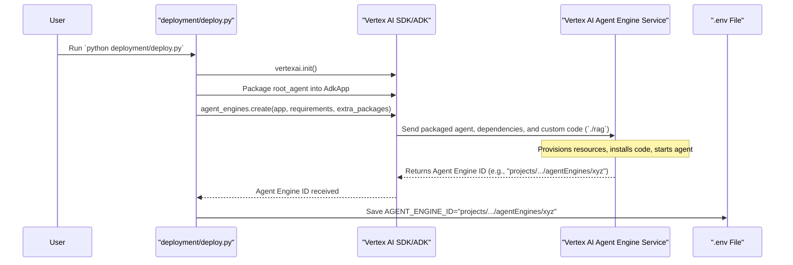

# Chapter 6: Agent Deployment

Welcome to Chapter 6! In [Chapter 5: Vertex AI Services Integration](05_vertex_ai_services_integration.md), we saw how our RAG project connects to and uses powerful Google Cloud Vertex AI services like the AI models (Gemini) and the RAG service for our knowledge base. We have our agent defined ([Chapter 1](01_root_agent_definition.md)), instructed ([Chapter 2](02_agent_instructions__prompts_.md)), equipped with tools ([Chapter 4](04_rag_retrieval_tool.md)), and its knowledge base prepared ([Chapter 3](03_corpus_preparation___management.md)).

But right now, our AI assistant is like a brilliant robot design that's still on the drawing board. It's fully planned out, but it can't actually *do* anything yet. How do we bring it to life and make it available to start working? That's what **Agent Deployment** is all about!

**Our Use Case:** Imagine we've built our "Alphabet 10-K Financial Expert" agent. We want to make it available so that financial analysts, or even ourselves, can ask it questions like, "What were the main revenue drivers for Alphabet in 2024?" To do this, we need to deploy it.

## What is Agent Deployment?

Think of **Agent Deployment** as sending your fully assembled and programmed robot (our AI agent) to its official workstation so it can start its job. This "workstation" is a service in Google Cloud called **Vertex AI Agent Engine**.

Deployment involves a few key steps:

1.  **Packaging:** We take our agent's core programming (the `root_agent` we defined in `rag/agent.py`), its instructions ([Chapter 2](02_agent_instructions__prompts_.md)), and its tools ([Chapter 4](04_rag_retrieval_tool.md)) and package them up neatly.
2.  **Sending to the Cloud:** We then send this package to Vertex AI Agent Engine using a command called `agent_engines.create`. This command tells Google Cloud to set up a dedicated environment for our agent and get it running.
3.  **Getting an Address:** Once deployed, our agent gets a unique "address" in the cloud, called an **Agent Engine ID**. This ID is like the robot's office number. We store this ID in our project's `.env` file.
4.  **Ready for Work:** With this ID, other parts of our system or users can find and interact with our agent. It's now accessible and operational!

This process ensures our carefully crafted agent isn't just a local file but a running service ready to help.

## The Deployment Script: `deployment/deploy.py`

Our RAG project has a helpful script called `deployment/deploy.py` that automates this entire process. Let's walk through what it does, step by step.

### Step 1: Waking Up Vertex AI (Initialization)

Before we can deploy anything, our script needs to connect to Google Cloud's Vertex AI services. We saw this in [Chapter 5](05_vertex_ai_services_integration.md).

```python
# deployment/deploy.py (simplified snippet)
import vertexai
import os

# These values are loaded from your .env file (see Chapter 8)
GOOGLE_CLOUD_PROJECT = os.getenv("GOOGLE_CLOUD_PROJECT")
GOOGLE_CLOUD_LOCATION = os.getenv("GOOGLE_CLOUD_LOCATION")
STAGING_BUCKET = os.getenv("STAGING_BUCKET") # A cloud storage bucket for temporary files

vertexai.init(
    project=GOOGLE_CLOUD_PROJECT,
    location=GOOGLE_CLOUD_LOCATION,
    staging_bucket=STAGING_BUCKET, # Tells Vertex AI where to store temporary files during deployment
)
print("Vertex AI initialized, ready for deployment!")
```
*   This code gets your Google Cloud project details (which you'd have set up in your `.env` file) and initializes the Vertex AI library. Think of it as unlocking the door to the Google Cloud workshop.

### Step 2: Packaging Our Agent (The `AdkApp`)

Remember from [Chapter 1: Root Agent Definition](01_root_agent_definition.md), we use something called `AdkApp` to package our agent. It's like putting our robot and all its manuals into a standardized shipping container.

```python
# deployment/deploy.py (simplified snippet)
from vertexai.preview.reasoning_engines import AdkApp
from rag.agent import root_agent # Our agent defined in rag/agent.py

# Package our root_agent into an AdkApp
app = AdkApp(
    agent=root_agent,
    enable_tracing=True, # Helps with debugging if something goes wrong
)
print("Agent packaged into an AdkApp, ready for shipping!")
```
*   `from rag.agent import root_agent`: We import the `root_agent` we carefully defined.
*   `AdkApp(agent=root_agent, ...)`: We create an `AdkApp` instance, telling it to use our `root_agent`. This `app` object now holds everything needed for our agent to run.

### Step 3: Sending the Agent to its "Workstation" (`agent_engines.create`)

This is the main event! We use the `agent_engines.create()` command to send our packaged `app` to Vertex AI Agent Engine.

```python
# deployment/deploy.py (simplified snippet)
from vertexai import agent_engines
# 'app' is our AdkApp packaged agent from the previous step

print("Sending agent to its workstation (Vertex AI Agent Engine)...")
remote_app = agent_engines.create(
    app, # Our packaged agent
    requirements=[ # Software our agent needs to run in the cloud
        "google-cloud-aiplatform[adk,agent-engines]==1.88.0",
        "google-adk",
        "python-dotenv", # For reading .env files
        # ... other necessary Python packages ...
    ],
    extra_packages=[ # Our own custom code folders
        "./rag", # This sends our 'rag' folder (with agent.py, prompts.py, etc.)
    ],
)
print(f"Agent arrived! Workstation ID: {remote_app.resource_name}")
```
Let's break down what `agent_engines.create()` needs:
*   `app`: This is our `AdkApp` object – our "shipping container" with the agent inside.
*   `requirements`: This is a list of Python libraries that our agent depends on (like `google-adk` itself). Vertex AI will install these in the agent's cloud environment.
*   `extra_packages`: This crucial part tells Vertex AI to include our own project code. `["./rag"]` means it will bundle up the entire `rag` folder (which contains `agent.py`, `prompts.py`, and other necessary files for our agent) and send it to the cloud.

When this command runs:
1.  Vertex AI takes our `app`, the `requirements`, and our `extra_packages`.
2.  It sets up a new, dedicated environment in the cloud (our agent's "workstation").
3.  It installs all the `requirements` and our custom code (`./rag`) in that environment.
4.  It starts our agent, making it ready to receive requests.
5.  Finally, it gives back `remote_app`, an object that contains information about our deployed agent, most importantly its unique address: `remote_app.resource_name`.

The `remote_app.resource_name` will look something like:
`projects/your-gcp-project-id/locations/us-central1/agentEngines/1234567890123456789`
This is the Agent Engine ID!

### Step 4: Saving the Agent's "Address" (Agent Engine ID)

Now that our agent has an official address in the cloud, we need to save it so we can find it later. The `deploy.py` script updates our project's `.env` file with this new Agent Engine ID.

```python
# deployment/deploy.py (simplified snippet)
from dotenv import set_key # A helper to write to .env files
import os

# Path to your project's .env file
ENV_FILE_PATH = os.path.abspath(os.path.join(os.path.dirname(__file__), "..", ".env"))

def update_env_file(agent_engine_id, env_file_path):
    """Updates the .env file with the agent engine ID."""
    set_key(env_file_path, "AGENT_ENGINE_ID", agent_engine_id)
    print(f"Agent's address (AGENT_ENGINE_ID) saved to {env_file_path}")

# 'remote_app' is the result from agent_engines.create()
update_env_file(remote_app.resource_name, ENV_FILE_PATH)
```
*   This function `update_env_file` takes the `remote_app.resource_name` (the Agent Engine ID) and writes it into your `.env` file like this:
    `AGENT_ENGINE_ID="projects/your-gcp-project-id/locations/us-central1/agentEngines/1234567890123456789"`

Now, whenever we want to talk to our deployed agent, we can read this `AGENT_ENGINE_ID` from the `.env` file.

## Under the Hood: What Happens During Deployment?

Let's visualize the journey when you run `python deployment/deploy.py`:

1.  **You run `deploy.py`.**
2.  **Initialization:** The script connects to Vertex AI using `vertexai.init()`.
3.  **Packaging:** Your `root_agent` (from `rag/agent.py`) is wrapped into an `AdkApp` object.
4.  **Deployment Command:** The script calls `agent_engines.create()`, passing the `AdkApp`, list of `requirements` (like `google-adk`), and your custom code specified in `extra_packages` (your `./rag` folder).
5.  **To the Cloud!** The Vertex AI SDK and ADK bundle all this information: your agent's logic, its Python dependencies, and your `rag` code. This bundle is sent securely to the Vertex AI Agent Engine service in Google Cloud.
6.  **Setting up the Workstation:** The Agent Engine service:
    *   Provisions necessary cloud resources (like a virtual server).
    *   Creates a clean environment.
    *   Installs all the Python packages from `requirements`.
    *   Copies your `rag` code into this environment.
    *   Starts your agent application. Now your agent is "live" and listening for requests.
7.  **Getting the Address:** The Agent Engine service returns a unique ID (the `resource_name`) for this newly deployed agent.
8.  **Saving the Address:** Your `deploy.py` script receives this ID and saves it as `AGENT_ENGINE_ID` in your `.env` file.

Here's a diagram of this flow:



## Why is Deployment Important?

Deploying your agent to Vertex AI Agent Engine offers several benefits:

*   **Accessibility:** Your agent becomes a running service in the cloud, potentially accessible from anywhere (depending on how you configure access).
*   **Managed Infrastructure:** Google Cloud handles the underlying servers, networking, and scaling. You don't have to worry about managing hardware.
*   **Stability:** It provides a stable endpoint (the Agent Engine ID) that applications can use to consistently interact with your agent.
*   **Operationalization:** It's the step that takes your agent from a development artifact to a usable, working application.

## Conclusion

You've now learned how to take your fully designed AI assistant and "send it to its workstation" in the cloud! Agent Deployment, primarily using the `deployment/deploy.py` script and the `agent_engines.create()` command, packages your agent, its dependencies, and your custom code, and sets it up as an operational service in Vertex AI Agent Engine.

The key outcome is the `AGENT_ENGINE_ID` stored in your `.env` file. This ID is the "address" of your live agent.

So, our agent is defined, instructed, knows how to use its tools, has its knowledge base, and is now deployed and waiting at its workstation. What's next? It's time to talk to it!

Next up: [Chapter 7: Agent Interaction](07_agent_interaction.md)

---

Generated by [AI Codebase Knowledge Builder](https://github.com/The-Pocket/Tutorial-Codebase-Knowledge)