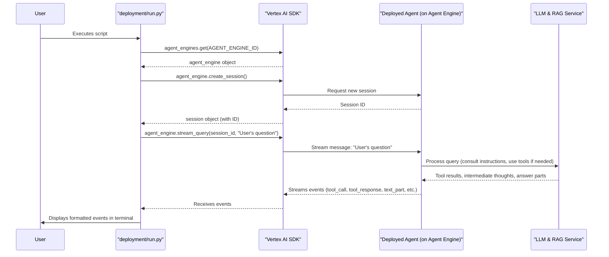

# Chapter 7: Agent Interaction

Welcome to Chapter 7! In [Chapter 6: Agent Deployment](06_agent_deployment.md), we successfully "sent our agent to its workstation." We packaged our "Alphabet 10-K Financial Expert" AI assistant, deployed it to the Vertex AI Agent Engine, and got its unique address (the `AGENT_ENGINE_ID`). Our agent is now live and ready for action!

But how do we actually *talk* to it? How do we ask it questions and get those insightful answers we've been working towards? This chapter is all about **Agent Interaction** – the way we communicate with our deployed RAG agent.

**Our Use Case:** We've deployed our "Alphabet 10-K Financial Expert." Now, we want to ask it a specific question, like: *"According to the MD&A, how might the increasing proportion of revenues derived from non-advertising sources like Google Cloud and devices potentially impact Alphabet's overall operating margin, and why?"* We want to see how it processes this query and what answer it provides.

## What is Agent Interaction?

Imagine our deployed agent is like a super-smart librarian who is now sitting at their desk in the cloud, ready to help. Agent Interaction is simply how we have a conversation with this librarian.

It involves:
1.  **Finding the Librarian:** Knowing the librarian's "desk number" (our `AGENT_ENGINE_ID`).
2.  **Starting a Conversation:** Initiating a session with the librarian.
3.  **Asking Questions:** Sending our queries (like "What were the main revenue drivers?") to the librarian.
4.  **Getting a Response:** The librarian (our agent) processes the question, possibly looks up information in its special books (our RAG corpus using the [RAG Retrieval Tool](04_rag_retrieval_tool.md)), and then gives us an answer.
5.  **Seeing the Process:** Optionally, we can also see some of the librarian's "thought process" – like when it decides to look something up.

Our RAG project includes a script called `deployment/run.py` specifically designed to manage this back-and-forth dialogue. This script connects to our deployed agent, sends it questions, and then neatly displays the entire conversation, including any actions the agent takes.

## Chatting with Your Agent: The `deployment/run.py` Script

The `deployment/run.py` script is our command center for talking to the deployed agent. Let's explore how it works.

### Step 1: Setting the Stage (Initialization and Setup)

First, the script needs to know how to connect to Google Cloud and find our specific agent.

```python
# deployment/run.py (simplified snippet)
import os
import vertexai
from vertexai import agent_engines
from dotenv import load_dotenv
import json # For handling some data structures

# Load environment variables from .env file
load_dotenv()

# Initialize Vertex AI
vertexai.init(
    project=os.getenv("GOOGLE_CLOUD_PROJECT"),
    location=os.getenv("GOOGLE_CLOUD_LOCATION"),
)

# Get the ID of our deployed agent
AGENT_ENGINE_ID = os.getenv("AGENT_ENGINE_ID")
```
*   `load_dotenv()`: This loads variables from our `.env` file, which we learned about in [Chapter 6: Agent Deployment](06_agent_deployment.md) (and will cover fully in [Chapter 8: Environment Configuration](08_environment_configuration.md)). Crucially, it loads `GOOGLE_CLOUD_PROJECT`, `GOOGLE_CLOUD_LOCATION`, and most importantly, `AGENT_ENGINE_ID`.
*   `vertexai.init(...)`: As we saw in [Chapter 5: Vertex AI Services Integration](05_vertex_ai_services_integration.md), this connects our script to Vertex AI.
*   `AGENT_ENGINE_ID = os.getenv("AGENT_ENGINE_ID")`: This fetches the unique address of our deployed agent – the one we saved during deployment.

### Step 2: Connecting to Your Deployed Agent

With the `AGENT_ENGINE_ID`, the script can now get a direct line to our agent.

```python
# deployment/run.py (snippet)

# Get a reference to our specific deployed agent engine
agent_engine = agent_engines.get(AGENT_ENGINE_ID)
print(f"Connected to agent: {AGENT_ENGINE_ID}")
```
*   `agent_engines.get(AGENT_ENGINE_ID)`: This is like dialing the agent's specific "phone number" on the Vertex AI Agent Engine platform. It returns an `agent_engine` object that we can use to interact with our deployed AI.

### Step 3: Starting a Conversation (Creating a Session)

Before we ask questions, it's good practice to start a "session." Think of this like telling the librarian, "Hi, I'm starting a new research query with you." This helps the agent keep track of the conversation, especially if you plan to ask multiple related questions.

```python
# deployment/run.py (snippet)

# Create a new conversation session with the agent
# 'user_id' can be any identifier for the user starting the conversation
session = agent_engine.create_session(user_id="my_user_123")
print(f"Created new session: {session['id']}")
```
*   `agent_engine.create_session(user_id="my_user_123")`: This creates a unique session. The agent can use this session ID (`session['id']`) to remember the context of your conversation if you ask follow-up questions.

### Step 4: Asking Questions (Streaming Queries)

Now for the exciting part: asking our questions! The `run.py` script has a list of predefined queries. It sends each one to the agent using `agent_engine.stream_query()`.

```python
# deployment/run.py (snippet)

queries = [
    "Hi, how are you?", # A simple greeting
    # Our more complex financial question:
    "According to the MD&A, how might the increasing proportion of revenues derived from non-advertising sources like Google Cloud and devices potentially impact Alphabet's overall operating margin, and why?",
    # ... other questions ...
    "Thanks, I got all the information I need. Goodbye!",
]

for query in queries:
    print(f"\n[user]: {query}") # Display what the user is asking
    for event in agent_engine.stream_query(
        user_id="my_user_123", # The same user ID as the session
        session_id=session['id'], # The ID of our current conversation
        message=query, # The actual question text
    ):
        pretty_print_event(event) # Display what the agent says/does
```
*   `queries`: A list of questions we want to ask our agent.
*   `agent_engine.stream_query(...)`: This is the core command for sending a question.
    *   `session_id`: Links this query to our ongoing conversation.
    *   `message=query`: This is the actual text of our question.
    *   **Streaming:** The "stream" part is important. Instead of waiting for one final answer, the agent sends back a series of "events" as it processes the query. This could include:
        *   The agent confirming it received the question.
        *   The agent deciding to use a tool (like our [RAG Retrieval Tool](04_rag_retrieval_tool.md)).
        *   The results from the tool.
        *   The agent's final synthesized answer.

### Step 5: Understanding the Agent's Response (Pretty Printing Events)

As the agent streams back events, the `pretty_print_event(event)` function displays them in a readable format.

```python
# deployment/run.py (simplified logic of pretty_print_event)

def pretty_print_event(event):
    """Neatly prints different types of conversation events."""
    author = event.get("author", "unknown") # Who sent this event (user or agent)
    
    if "content" in event and "parts" in event["content"]:
        for part in event["content"]["parts"]:
            if "text" in part:
                # If it's simple text, print it
                print(f"[{author}]: {part['text'][:200]}...") # Truncated for brevity
            elif "functionCall" in part:
                # If the agent is calling a tool
                print(f"[{author}]: Function call: {part['functionCall'].get('name', 'unknown')}")
            elif "functionResponse" in part:
                # If it's the result from a tool
                print(f"[{author}]: Function response: {part['functionResponse'].get('name', 'unknown')}")
    else:
        print(f"[{author}]: {str(event)[:200]}...") # Fallback for other event types
```
*   This function looks at each `event` from the stream.
*   If it's text from the agent (the answer), it prints it.
*   If the agent calls a function (like `retrieve_rag_documentation`), it prints that.
*   If it's the response from a function call (the retrieved documents), it prints that too.
This gives us a nice, conversational view of what's happening.

**Example Output (Conceptual):**

When you run `python deployment/run.py`, you'll see something like this in your terminal:

```text
Connected to agent: projects/your-gcp-project/locations/us-central1/agentEngines/123...
Created new session: abcdef12345

[user]: Hi, how are you?
[agent]: I am an AI assistant ready to help you with questions about your documents. How can I assist you today?

[user]: According to the MD&A, how might the increasing proportion of revenues derived from non-advertising sources like Google Cloud and devices potentially impact Alphabet's overall operating margin, and why?
[agent]: Function call: retrieve_rag_documentation
  Args: {"query": "impact of non-advertising revenue on Alphabet operating margin MD&A"}
[agent]: Function response: retrieve_rag_documentation
  Response: {"chunks": [{"source": "goog-10-k-2024.pdf#page=45", "text": "The MD&A section notes that while Google Cloud and Other Bets segments are growing, they currently operate at lower margins than our established advertising businesses. Increased investment in these areas may initially pressure overall operating margin..."}, ...]}
[agent]: Based on the MD&A, the increasing proportion of revenues from non-advertising sources like Google Cloud could initially pressure Alphabet's overall operating margin. This is because these segments currently operate at lower margins compared to advertising and require significant ongoing investment. However, long-term growth in these areas is seen as crucial for diversification.
Citations:
1) goog-10-k-2024.pdf#page=45

[user]: Thanks, I got all the information I need. Goodbye!
[agent]: You're welcome! Goodbye.
```
This output shows the user's questions, the agent's internal actions (like calling the retrieval tool), and its final, cited answers.

## Under the Hood: How Interaction Works

Let's visualize the communication flow when you run `deployment/run.py` and ask a question.

1.  **Script Starts:** You run `python deployment/run.py`.
2.  **Connect & Session:**
    *   The script loads `AGENT_ENGINE_ID` from `.env`.
    *   It calls `agent_engines.get(AGENT_ENGINE_ID)` to connect to your specific deployed agent on Vertex AI.
    *   It calls `agent_engine.create_session()` to establish a conversation context with the agent. The agent service notes this session ID.
3.  **Query Streaming:**
    *   The script iterates through your `queries`. For each query, it calls `agent_engine.stream_query(session_id=..., message=...)`.
    *   The Vertex AI SDK sends this message, along with the session ID, to the remote Agent Engine service where your agent is running.
4.  **Agent Processing:** Your deployed `root_agent` (running inside the Agent Engine service):
    *   Receives the message.
    *   Consults its instructions ([Chapter 2: Agent Instructions (Prompts)](02_agent_instructions__prompts_.md)) and the LLM (e.g., Gemini) to decide what to do.
    *   If needed, it uses its tools (like `ask_vertex_retrieval` described in [Chapter 4: RAG Retrieval Tool](04_rag_retrieval_tool.md)). Tool usage involves calling the RAG service ([Chapter 3: Corpus Preparation & Management](03_corpus_preparation___management.md), [Chapter 5: Vertex AI Services Integration](05_vertex_ai_services_integration.md)).
    *   As it takes these steps, it sends back "events" (tool calls, tool responses, intermediate thoughts, final answer parts) over the stream.
5.  **Displaying Events:** The `run.py` script receives these events one by one and uses `pretty_print_event()` to display them in your terminal.

Here's a simplified sequence diagram:



The `agent_engine.stream_query()` method is key here. It keeps the connection open while the agent works, allowing for this real-time flow of information back to your script. This makes the interaction feel more dynamic than just sending a question and waiting a long time for a single, final answer.

## Conclusion

You've now learned how to have a conversation with your deployed RAG agent! The `deployment/run.py` script is your window into the agent's world. It shows how to:
*   Connect to your specific deployed agent using its `AGENT_ENGINE_ID`.
*   Start a conversation session.
*   Send questions (queries) using the powerful `stream_query` method.
*   Receive and display the stream of events, giving you insight into the agent's process and its final answers.

This ability to interact is, of course, the ultimate goal of building our RAG agent. We can now test its knowledge, see how it uses its tools, and get valuable information from the corpus we provided.

Throughout these chapters, we've often mentioned the `.env` file and environment variables like `GOOGLE_CLOUD_PROJECT`, `RAG_CORPUS`, and `AGENT_ENGINE_ID`. How are these configured, and why are they so important? That's what we'll explore in our final chapter.

Next up: [Chapter 8: Environment Configuration](08_environment_configuration.md)

---

Generated by [AI Codebase Knowledge Builder](https://github.com/The-Pocket/Tutorial-Codebase-Knowledge)