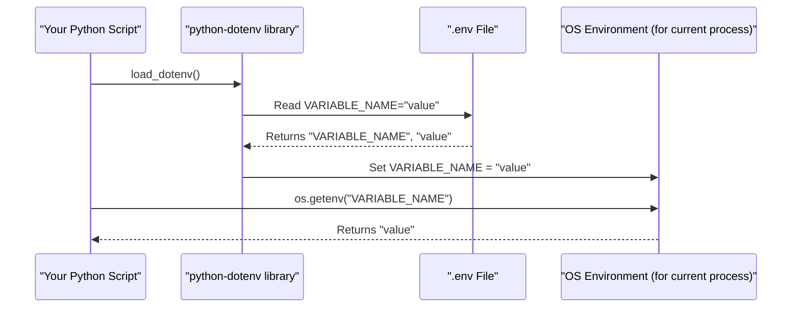

# Chapter 8: Environment Configuration

Welcome to the final chapter of our RAG project tutorial! In [Chapter 7: Agent Interaction](07_agent_interaction.md), we saw how to chat with our deployed AI assistant and get answers based on the knowledge we provided. Throughout the previous chapters, you might have noticed frequent mentions of a file named `.env` and variables like `GOOGLE_CLOUD_PROJECT`, `RAG_CORPUS`, and `AGENT_ENGINE_ID`. These are all part of "Environment Configuration."

This chapter explains how we manage all the important settings and credentials our RAG application needs to run correctly. Think of it like having a master checklist of keys and addresses that your application uses.

## What's Environment Configuration and Why Do We Need It?

Imagine you're building an application, like our RAG agent. This application needs certain pieces of information to work:
*   Which Google Cloud project should it use?
*   Where is its knowledge base (the RAG Corpus) located?
*   What's the address of the deployed agent service?

Now, you could write these values directly into your Python code. But what if:
*   You want to run the application on your computer for testing, and then on a powerful cloud server for production? The settings might be different.
*   Some of these values are sensitive, like API keys, and you don't want to save them directly in your code where everyone can see them?
*   Multiple developers are working on the project, and they each have their own Google Cloud project ID?

This is where **Environment Configuration** comes in. It's a way to manage all these settings *outside* of your main application code.

**Our Use Case:** Our RAG application needs to know your specific `GOOGLE_CLOUD_PROJECT` ID, the `GOOGLE_CLOUD_LOCATION` (like `us-central1`), where to find the `RAG_CORPUS` we prepared in [Chapter 3: Corpus Preparation & Management](03_corpus_preparation___management.md), and the `AGENT_ENGINE_ID` of our deployed agent from [Chapter 6: Agent Deployment](06_agent_deployment.md). We want to set these up once and have all parts of our application use them without hardcoding them.

The most common way to handle this in Python projects is by using a **`.env` file**.

## The Mighty `.env` File: Your App's Secret Keeper and Settings Manager

A `.env` file (pronounced "dot-env") is a simple text file where you store these configuration variables as key-value pairs. It typically lives in the root directory of your project.

Here's why `.env` files are so useful:
*   **Separation:** Keeps configuration settings separate from your application code. This makes your code cleaner and more focused on its job.
*   **Security:** You can store sensitive information like API keys or database passwords in the `.env` file. Since this file is usually *not* committed to version control systems (like Git), your secrets stay safe.
*   **Flexibility:** You can easily change settings for different environments (like development, testing, or production) just by changing the values in the `.env` file, without touching the code.

### What Does a `.env` File Look Like?

It's just plain text, with each line defining a variable:
```text
# This is a comment
VARIABLE_NAME_1="some_value"
VARIABLE_NAME_2="another_value"
API_KEY="super_secret_key_12345"
```
*   Lines starting with `#` are comments.
*   Each setting is `VARIABLE_NAME="value"`. The quotes are often optional for simple values but good practice for values with spaces.

For our RAG project, a typical `.env` file might look like this after you've set it up and run the scripts:

```text
# .env (Example for RAG Project)
GOOGLE_CLOUD_PROJECT="your-actual-gcp-project-id"
GOOGLE_CLOUD_LOCATION="us-central1"
STAGING_BUCKET="gs://your-gcp-project-id-staging-bucket"

# This value is set by prepare_corpus_and_data.py
RAG_CORPUS="projects/your-actual-gcp-project-id/locations/us-central1/ragCorpora/1234567890123456789"

# This value is set by deploy.py
AGENT_ENGINE_ID="projects/your-actual-gcp-project-id/locations/us-central1/agentEngines/9876543210987654321"
```

## How Our RAG Project Uses the `.env` File

Our Python scripts use a handy library called `python-dotenv`. This library reads the `.env` file and makes the variables defined in it available to the Python script as if they were system environment variables.

You'll see this at the beginning of many of our scripts:

```python
# Example from rag/agent.py or deployment/deploy.py
import os
from dotenv import load_dotenv

# This line does the magic!
load_dotenv()

# Now you can access the variables using os.getenv()
project_id = os.getenv("GOOGLE_CLOUD_PROJECT")
rag_corpus_id = os.getenv("RAG_CORPUS")

print(f"My Project ID is: {project_id}")
print(f"My RAG Corpus ID is: {rag_corpus_id}")
```
*   `from dotenv import load_dotenv`: Imports the necessary function.
*   `load_dotenv()`: When this function is called, it looks for a `.env` file in the current directory (or parent directories) and loads all the key-value pairs into the environment for the running Python process.
*   `os.getenv("VARIABLE_NAME")`: This standard Python function then retrieves the value of the environment variable. If the variable isn't set, `os.getenv()` returns `None`.

This is how our `root_agent` in `rag/agent.py` knows which `RAG_CORPUS` to use (as seen in [Chapter 1: Root Agent Definition](01_root_agent_definition.md)), and how `deployment/deploy.py` and `deployment/run.py` know your `GOOGLE_CLOUD_PROJECT` and `AGENT_ENGINE_ID`.

## Key Variables in Our RAG Project's `.env`

Let's look at the important variables our RAG project uses:

1.  **`GOOGLE_CLOUD_PROJECT`**:
    *   **What it is:** Your unique identifier for your project on Google Cloud Platform.
    *   **Where it comes from:** You provide this. It's the ID of the GCP project where you want to create and run your RAG resources.
    *   **Used by:** Almost all scripts that interact with Vertex AI (`prepare_corpus_and_data.py`, `deploy.py`, `run.py`).

2.  **`GOOGLE_CLOUD_LOCATION`**:
    *   **What it is:** The Google Cloud region (e.g., `us-central1`, `europe-west1`) where your resources will be located.
    *   **Where it comes from:** You provide this, choosing a region that supports the Vertex AI services you're using.
    *   **Used by:** Similar to `GOOGLE_CLOUD_PROJECT`, for initializing Vertex AI connections.

3.  **`STAGING_BUCKET`**:
    *   **What it is:** A Google Cloud Storage bucket URI (e.g., `gs://your-bucket-name`). Vertex AI uses this for temporary storage during processes like agent deployment.
    *   **Where it comes from:** You need to create a Google Cloud Storage bucket and provide its URI here.
    *   **Used by:** `vertexai.init()` in `deployment/deploy.py` during [Chapter 6: Agent Deployment](06_agent_deployment.md).

4.  **`RAG_CORPUS`**:
    *   **What it is:** The full resource name (ID) of the Vertex AI RAG Corpus where your documents are stored and indexed.
    *   **Where it comes from:** This is **automatically generated and updated** in your `.env` file by the `rag/shared_libraries/prepare_corpus_and_data.py` script when you run it (as discussed in [Chapter 3: Corpus Preparation & Management](03_corpus_preparation___management.md)).
    *   **Used by:** The `VertexAiRagRetrieval` tool in `rag/agent.py` to know which knowledge base to search.

5.  **`AGENT_ENGINE_ID`**:
    *   **What it is:** The full resource name (ID) of your deployed Vertex AI Agent Engine.
    *   **Where it comes from:** This is **automatically generated and updated** in your `.env` file by the `deployment/deploy.py` script when you deploy your agent (as discussed in [Chapter 6: Agent Deployment](06_agent_deployment.md)).
    *   **Used by:** The `deployment/run.py` script to connect to and interact with your live agent ([Chapter 7: Agent Interaction](07_agent_interaction.md)).

## Managing Your `.env` File

Here's how you typically work with the `.env` file in this project:

1.  **Create it:**
    *   The project usually includes a template file named `.env.example`.
    *   You'll copy this template to a new file named `.env` in the root of the project.
    *   ```bash
        cp .env.example .env
        ```

2.  **Initial Setup (Manual Entries):**
    *   Open your new `.env` file in a text editor.
    *   You'll need to fill in your `GOOGLE_CLOUD_PROJECT`, `GOOGLE_CLOUD_LOCATION`, and `STAGING_BUCKET` values based on your Google Cloud setup.

    ```text
    # .env (Initial state after copying and manual edits)
    GOOGLE_CLOUD_PROJECT="your-gcp-project-id-here"
    GOOGLE_CLOUD_LOCATION="us-central1" # Or your preferred region
    STAGING_BUCKET="gs://your-unique-bucket-name-for-staging"

    RAG_CORPUS="" # Will be filled by prepare_corpus_and_data.py
    AGENT_ENGINE_ID="" # Will be filled by deploy.py
    ```

3.  **Automatic Updates by Scripts:**
    *   When you run `python -m rag.shared_libraries.prepare_corpus_and_data`, it will create your RAG corpus and then automatically update the `RAG_CORPUS` line in your `.env` file.
    *   When you run `python deployment/deploy.py`, it will deploy your agent and then automatically update the `AGENT_ENGINE_ID` line.
    *   These scripts use the `set_key` function from the `python-dotenv` library to modify the `.env` file.

    ```python
    # Simplified example of how a script updates the .env file
    # (similar to what's in prepare_corpus_and_data.py or deploy.py)
    from dotenv import set_key
    import os

    ENV_FILE_PATH = ".env" # Path to your .env file

    def update_my_setting(new_value):
        set_key(ENV_FILE_PATH, "MY_IMPORTANT_SETTING", new_value)
        print(f"Updated MY_IMPORTANT_SETTING in {ENV_FILE_PATH}")

    # Imagine this value comes from a cloud service
    # new_corpus_id = "projects/123/locations/us-central1/ragCorpora/abc"
    # update_my_setting(new_corpus_id) # This would write MY_IMPORTANT_SETTING="projects/..."
    ```

4.  **Keep it Secret, Keep it Safe! (`.gitignore`)**
    *   The `.env` file often contains sensitive information or user-specific settings.
    *   **It should NEVER be committed to version control (like Git).**
    *   The project should have a `.gitignore` file that includes `.env` to prevent accidental commits.

    ```text
    # .gitignore (example content)
    .env
    *.pyc
    __pycache__/
    # ... other files and folders to ignore
    ```

## Under the Hood: How `python-dotenv` and `os.getenv` Work

It's quite straightforward:

1.  **You call `load_dotenv()`** in your Python script.
2.  The `python-dotenv` library **searches for a `.env` file** (usually in the current directory or parent directories).
3.  If found, it **reads the file line by line.**
4.  For each `VARIABLE_NAME="value"` pair, it **sets an environment variable within the current Python process.** This is similar to how you might set environment variables in your computer's command line, but it's only for this specific Python program while it's running.
5.  Later, when your code calls **`os.getenv("VARIABLE_NAME")`**, Python looks up this variable in the environment of the current process and returns its value.

Let's visualize this:


This simple mechanism provides a powerful way to manage your application's settings cleanly and securely.

## Conclusion: Configuration is Key!

And that's a wrap on Environment Configuration, and indeed, on our entire RAG project tutorial!

You've learned that environment configuration is crucial for managing your application's settings, like project IDs and resource names (`RAG_CORPUS`, `AGENT_ENGINE_ID`). By using a `.env` file and the `python-dotenv` library, we keep these settings separate from our code. This makes our RAG application more flexible, secure, and easier to manage across different setups. You now understand how essential variables are loaded using `os.getenv()` and how some of them are even updated automatically by our project's scripts.

Throughout this tutorial series, you've journeyed from the very basics of defining a [Root Agent Definition](01_root_agent_definition.md), crafting effective [Agent Instructions (Prompts)](02_agent_instructions__prompts_.md), preparing your knowledge base via [Corpus Preparation & Management](03_corpus_preparation___management.md), understanding the [RAG Retrieval Tool](04_rag_retrieval_tool.md), integrating with [Vertex AI Services Integration](05_vertex_ai_services_integration.md), performing [Agent Deployment](06_agent_deployment.md), and finally engaging in [Agent Interaction](07_agent_interaction.md).

We hope this tutorial has given you a solid foundation in building RAG-based AI assistants. The world of generative AI and agent development is vast and exciting, and you're now equipped with the fundamental concepts to explore further. Happy building!

---

Generated by [AI Codebase Knowledge Builder](https://github.com/The-Pocket/Tutorial-Codebase-Knowledge)