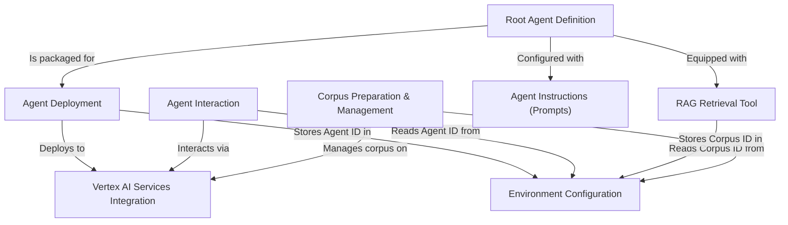

# Tutorial: RAG

This project creates a *smart AI assistant* that answers questions using information from a specific document collection (its *RAG corpus*).
It relies on **Google's Vertex AI** to define the assistant's capabilities (like searching documents using a special tool), deploy it to the cloud, and handle conversations with users.
The system first prepares the document corpus, then defines the agent with instructions and tools, deploys this agent, and finally allows users to interact with it to get cited answers.

**Source Repository:** [None](None)

## Chapters

1. [Root Agent Definition](01_root_agent_definition.md)
2. [Agent Instructions (Prompts)](02_agent_instructions__prompts_.md)
3. [Corpus Preparation & Management](03_corpus_preparation___management.md)
4. [RAG Retrieval Tool](04_rag_retrieval_tool.md)
5. [Vertex AI Services Integration](05_vertex_ai_services_integration.md)
6. [Agent Deployment](06_agent_deployment.md)
7. [Agent Interaction](07_agent_interaction.md)
8. [Environment Configuration](08_environment_configuration.md)

---

Generated by [AI Codebase Knowledge Builder](https://github.com/The-Pocket/Tutorial-Codebase-Knowledge)