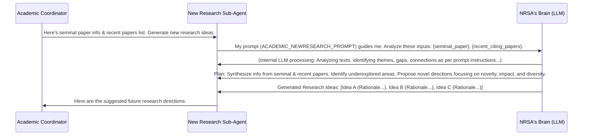

# Chapter 3: The Innovation Consultant - New Research Sub-Agent

Welcome to Chapter 3! In our [previous chapter](02_web_search_sub_agent.md), we met the **Web Search Sub-Agent**, our diligent online detective skilled at finding recent papers related to your foundational research. It helps us understand what's happening *now*.

But what about what could happen *next*? After understanding a groundbreaking paper and seeing how others have built upon it, a natural question arises: "Where could this research go in the future? What are the exciting, unexplored avenues?" This is where our **New Research Sub-Agent** steps in!

## Sparking New Ideas: The Role of the New Research Sub-Agent

Imagine you're part of a research team. You've just reviewed a classic, important discovery (the "seminal paper") and a whole collection of recent studies that followed up on it. Now, you want to brainstorm new projects. What are the most promising directions? What are the gaps nobody is looking at yet?

The **New Research Sub-Agent** is like a specialized innovation consultant for your research. Its main job is to:

1.  **Analyze the Past and Present:** It looks at the core ideas of your seminal paper and the key findings, trends, and even limitations highlighted in the recent citing papers.
2.  **Identify Opportunities:** Based on this analysis, it tries to spot:
    *   **Gaps:** What questions are still unanswered?
    *   **Trends:** Where is the field generally heading, and what logical next steps does this suggest?
    *   **Underexplored Areas:** Are there interesting combinations of ideas or applications that haven't been tried yet?
3.  **Propose the Future:** It then generates a list of potential new research directions, complete with suggestions for novel research questions or projects.

Think of it as a creative partner that helps you think "outside the box" by strategically looking at what's already known.

## How It Works: A Simple Brainstorming Session

Let's continue with our example of the seminal paper "RevolutionarySolarCells.pdf" and the recent papers found by our [Web Search Sub-Agent](02_web_search_sub_agent.md).

1.  **Input (from the Academic Coordinator Agent):**
    *   **Seminal Paper Info:** A summary of "RevolutionarySolarCells.pdf" – its main discovery, why it was important, etc.
    *   **Recent Citing Papers Info:** A list of summaries from, say, 5 recent papers that cited "RevolutionarySolarCells.pdf," highlighting what these newer papers achieved or discussed.

2.  **The New Research Sub-Agent Gets to Thinking:**
    The agent (powered by a Large Language Model) processes this information. It might "think" along these lines (this is a very simplified version!):
    *   "Okay, the seminal paper introduced a new way to make solar cells much more efficient."
    *   "Recent Paper A improved this efficiency further using material X."
    *   "Recent Paper B tried to lower the cost but faced challenges with durability."
    *   "Recent Paper C explored a different application but didn't combine it with the high efficiency of the seminal work."
    *   "Hmm, there's a **gap** here: No one seems to be focusing on making these highly efficient cells *also* very durable and cheap *at the same time*."
    *   "And there's an **underexplored area**: What if we take the core principle of 'RevolutionarySolarCells' and apply it to transparent surfaces for smart windows?"

3.  **Output (to the Academic Coordinator Agent):**
    A list of suggested research directions, perhaps looking something like this:

    *   **"1. Research Area: Cost-Effective Durability Enhancements for High-Efficiency Solar Cells."**
        *   **Rationale:** "While recent work (Paper A) has pushed efficiency, Paper B highlighted durability as a key challenge for cost-effectiveness. This research would focus on novel materials or coating techniques to improve lifespan without significantly increasing production costs, addressing a critical gap for practical adoption."
    *   **"2. Research Area: Transparent 'RevolutionarySolarCells' for Energy-Harvesting Smart Windows."**
        *   **Rationale:** "The seminal paper focused on opaque cells. Integrating its high-efficiency principles with transparent conductive materials, an area gaining traction, could open up new applications in building-integrated photovoltaics, an underexplored intersection."
    *   ...and several more ideas.

These suggestions aim to be novel (new and different) and have the potential for significant impact.

## A Look at the Code: Defining Our Innovator

The New Research Sub-Agent, like our other agents, is defined in Python. Its definition is quite focused because its main job is to "think" and generate ideas based on the information it's given.

This snippet is from `academic_research/sub_agents/academic_newresearch/agent.py`:

```python
# File: academic_research/sub_agents/academic_newresearch/agent.py

from google.adk import Agent # The basic building block for our agent

from . import prompt # This file contains the agent's detailed instructions

MODEL = "gemini-2.5-pro-preview-03-25" # The AI model it uses

academic_newresearch_agent = Agent(
    model=MODEL,
    name="academic_newresearch_agent",
    instruction=prompt.ACADEMIC_NEWRESEARCH_PROMPT,
    # Notice: No 'tools' are listed here!
    # This agent primarily uses its LLM and instructions to reason.
)
```

Let's break this down:

*   `Agent`: As we saw with the Web Search Sub-Agent, this is a way to define an agent in our toolkit. It's suitable for agents that perform a specific task guided by instructions.
*   `model=MODEL`: This tells the agent which Large Language Model (like Gemini) to use for its "thinking." We'll discuss models more in the [LLM Model Configuration](07_llm_model_configuration.md) chapter.
*   `name="academic_newresearch_agent"`: A unique name for this sub-agent.
*   `instruction=prompt.ACADEMIC_NEWRESEARCH_PROMPT`: This is super important! It points to a detailed set of instructions (a "prompt") that tells the agent *exactly* how to analyze the input papers and *what kind* of research suggestions to generate. We'll peek at this prompt shortly.
*   **No `tools` explicitly listed:** Unlike the Web Search Sub-Agent which used `google_search`, this agent's primary "tool" is the power of the LLM itself, guided by its detailed instructions. It synthesizes information and generates creative text.

This `academic_newresearch_agent` is then made available as a tool to our main [Academic Coordinator Agent](01_academic_coordinator_agent.md), as seen in `academic_research/agent.py`:

```python
# File: academic_research/agent.py
# ... (other parts of the file) ...
from .sub_agents.academic_newresearch import academic_newresearch_agent
# ...

academic_coordinator = LlmAgent(
    # ... (other parameters) ...
    tools=[
        AgentTool(agent=academic_websearch_agent),
        AgentTool(agent=academic_newresearch_agent), # Our innovator!
    ],
)
```
This means the Academic Coordinator can call upon the New Research Sub-Agent when it's time to brainstorm future directions.

## Under the Hood: The Agent's Creative Process

So, what happens when the Academic Coordinator asks the New Research Sub-Agent for ideas?

1.  **Receive the Brief:** The Academic Coordinator passes on:
    *   Information about the seminal paper (`{seminal_paper}`).
    *   Information about the recent citing papers (`{recent_citing_papers}`).

2.  **Consult the "Creative Brief" (The Prompt):** The New Research Sub-Agent loads its instructions from `prompt.ACADEMIC_NEWRESEARCH_PROMPT`. This prompt is like a detailed guide for a brainstorming session.

3.  **Analyze and Synthesize:** The LLM, guided by the prompt:
    *   Deeply understands the key contributions and context of the seminal paper.
    *   Scans the recent papers for common themes, new techniques, reported limitations, and unanswered questions.
    *   It's looking for patterns, connections, and importantly, *what's missing* or *what could be different*.

4.  **Generate Ideas:** Based on this synthesis, the LLM starts generating potential research directions. The prompt guides it to aim for:
    *   **Novelty:** Ideas that are genuinely new or combine existing concepts in fresh ways.
    *   **Potential Impact:** Ideas that could lead to significant advancements or solve important problems.
    *   **Diversity:** A mix of ideas – some practical, some more radical or unexpected, some aligning with emerging trends.

5.  **Structure the Output:** The prompt also tells the agent how to format its suggestions (e.g., a title and a short rationale for each).

6.  **Report Back:** The New Research Sub-Agent sends its list of creative research ideas back to the Academic Coordinator.

Here's a simplified diagram of this flow:



## The Agent's "Creative Brief": A Glimpse at the Prompt

The `ACADEMIC_NEWRESEARCH_PROMPT` (found in `academic_research/sub_agents/academic_newresearch/prompt.py`) is the detailed instruction manual that guides the New Research Sub-Agent's "thinking." It's quite comprehensive, but here's a peek at the *kind* of instructions it contains:

```python
# Snippet from academic_research/sub_agents/academic_newresearch/prompt.py

ACADEMIC_NEWRESEARCH_PROMPT = """
Role: You are an AI Research Foresight Agent.

Inputs:

Seminal Paper: Information identifying a key foundational paper...
{seminal_paper}
Recent Papers Collection: A list or collection of recent academic papers...
{recent_citing_papers}

Core Task:

Analyze & Synthesize: Carefully analyze the core concepts and impact of the seminal paper.
Then, synthesize the trends, advancements, identified gaps, limitations, and unanswered questions presented in the collection of recent papers.
Identify Future Directions: Based on this synthesis, extrapolate and identify underexplored or novel avenues for future research...

Output Requirements:

Generate a list of at least 10 distinct future research areas.
Focus Criteria: Each proposed area must meet the following criteria:
Novelty: Represents a significant departure...
Future Potential: Shows strong potential to be impactful...
Diversity Mandate: Ensure the portfolio... reflects a good balance... (High Potential Utility, Unexpectedness / Paradigm Shift, Emerging Popularity / Interest).

Format: Present the 10 research areas as a numbered list. For each area:
Provide a clear, concise Title or Theme.
Write a Brief Rationale (2-4 sentences) explaining...
... (and more details)
"""
```

Let's break down what this prompt tells the agent:

*   **`Role:`**: It sets the persona – an "AI Research Foresight Agent." This helps the LLM adopt the right mindset.
*   **`Inputs:`**: It tells the agent what information it will receive, using placeholders like `{seminal_paper}` and `{recent_citing_papers}`. When the agent is called, these placeholders are filled with the actual data from the Academic Coordinator.
*   **`Core Task:`**: This describes the main job: analyze, synthesize, and then identify future directions by extrapolating from the inputs.
*   **`Output Requirements:`**: This is very specific. It asks for *at least 10* ideas and specifies the criteria those ideas should meet:
    *   **Novelty:** Is it new?
    *   **Future Potential:** Could it be important?
    *   **Diversity Mandate:** It even asks for a mix of ideas – some practical, some paradigm-shifting, and some tapping into popular trends.
*   **`Format:`**: It dictates how the output should look (numbered list, title, rationale).

This detailed prompt is crucial. It’s not just asking the LLM to "come up with ideas"; it's guiding it to come up with *specific kinds* of ideas, reasoned in a particular way. We'll dive much deeper into crafting such instructions in the [Agent Prompts](06_agent_prompts.md) chapter.

## Conclusion

The New Research Sub-Agent is our team's visionary, our innovation consultant. It takes the foundational knowledge of a seminal paper and the latest developments from recent research, then looks ahead to suggest exciting, novel, and potentially impactful future research directions. It helps answer the crucial question: "Given what we know, what are the most promising things to explore next?"

So far, we've met:
1.  The [Academic Coordinator Agent](01_academic_coordinator_agent.md): Our overall project manager.
2.  The [Web Search Sub-Agent](02_web_search_sub_agent.md): Our specialist for finding recent related work.
3.  The **New Research Sub-Agent**: Our specialist for brainstorming future ideas.

But how do these agents actually talk to each other? How does the Coordinator know when to call the Web Search agent, and then how does it pass that information to the New Research agent? This flow of work is managed by something we call "workflow orchestration."

In the next chapter, we'll explore [Workflow Orchestration](04_workflow_orchestration.md) and see how the Academic Coordinator manages the entire process from start to finish.

---

Generated by [AI Codebase Knowledge Builder](https://github.com/The-Pocket/Tutorial-Codebase-Knowledge)