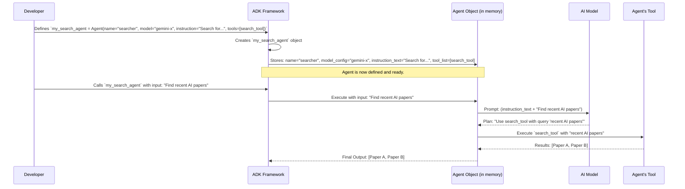

# Chapter 5: ADK Agent Definition - Your Agent's Blueprint

In the [previous chapter on Workflow Orchestration](04_workflow_orchestration.md), we saw how the Academic Coordinator Agent follows a "master plan" or a recipe, laid out in its prompt, to manage its tasks and call upon its sub-agents. But how do we actually *build* these agents in the first place? How do we tell our system, "This is an agent, here's what it's called, here's the AI it uses, and here are its instructions"?

That's where the **ADK Agent Definition** comes in. It's like having a specific LEGO Technic kit for building different kinds of robots. The kit (our Agent Development Kit, or ADK) provides standard connectors and components that allow you to assemble various functional robots (our agents).

## Why Do We Need a Standard Way to Define Agents?

Imagine you're part of a team building many different helper robots.
*   One robot might be good at searching for information.
*   Another might be excellent at brainstorming new ideas.
*   A third might be a general manager, coordinating the others.

If everyone on your team built their robots in completely different ways, with different parts and different instruction manuals, it would be chaotic! It would be hard to understand how each robot works, how to fix them, or how to get them to work together.

The Google Agent Development Kit (ADK) solves this by providing a **standardized structure** for creating agents. This makes our agent code cleaner, easier to understand, and easier to manage.

## The Agent "Blueprint": Key Components

The ADK gives us special classes, primarily `LlmAgent` and `Agent`, which act as our "LEGO Technic kits." When we define an agent, we're essentially filling out a blueprint for it, specifying several key pieces of information:

1.  **`name`**: This is like giving your LEGO robot a unique model number or name (e.g., "WebSearchBot-001"). It helps identify the agent within the system.
2.  **`model`**: This specifies which AI "brain" or Large Language Model (LLM) the agent will use (e.g., a specific version of Gemini). Think of it as choosing the main computer chip for your robot. We'll learn more about this in the [LLM Model Configuration](07_llm_model_configuration.md) chapter.
3.  **`instruction`**: These are the detailed "assembly instructions" and "operating manual" for your robot. It's a prompt that tells the agent its purpose, how to behave, and what to do. This is super important, and we'll dive deep into it in the [Agent Prompts](06_agent_prompts.md) chapter.
4.  **`tools`**: These are special "attachments" or "gadgets" your robot can use. For example, a web-searching robot would have a "web search tool." Some agents might even use other agents as tools! We'll explore these in the [Agent Tools](08_agent_tools.md) chapter.
5.  **`description` (for `LlmAgent`)**: A short, human-readable summary of what the agent does. It's like the blurb on the LEGO box.
6.  **`output_key` (optional)**: If an agent is designed to produce a specific piece of information, this key helps label that output so other agents or systems can easily find and use it.

Let's see how these components come together!

## Building Our Agents: Examples from Our Project

Remember the agents we've met? Let's look at how they were defined using this ADK structure.

### Example 1: The `academic_websearch_agent`

In [Chapter 2](02_web_search_sub_agent.md), we met our Web Search Sub-Agent. Here's how it's defined in `academic_research/sub_agents/academic_websearch/agent.py`:

```python
# File: academic_research/sub_agents/academic_websearch/agent.py

from google.adk import Agent # Our basic "kit" for this agent
from google.adk.tools import google_search # A specific "tool"
from . import prompt # Where its instructions live

MODEL = "gemini-2.5-pro-preview-03-25" # Choosing the AI brain

academic_websearch_agent = Agent( # Using the Agent "kit"
    model=MODEL,
    name="academic_websearch_agent", # Its unique name
    instruction=prompt.ACADEMIC_WEBSEARCH_PROMPT, # Its operating manual
    output_key="recent_citing_papers", # Label for its findings
    tools=[google_search], # The "gadgets" it can use
)
```

Let's break this down using our LEGO analogy:
*   `Agent(...)`: We're using the standard `Agent` kit from ADK.
*   `model=MODEL`: We're picking the `gemini-2.5-pro-preview-03-25` AI brain for this robot.
*   `name="academic_websearch_agent"`: We're naming this specific robot "academic_websearch_agent."
*   `instruction=prompt.ACADEMIC_WEBSEARCH_PROMPT`: We're giving it a detailed instruction manual (the `ACADEMIC_WEBSEARCH_PROMPT`).
*   `output_key="recent_citing_papers"`: When this robot finds papers, it will label them as "recent_citing_papers."
*   `tools=[google_search]`: We're equipping this robot with a `google_search` tool, like giving it a special internet-access antenna.

### Example 2: The `academic_coordinator` Agent

Our main [Academic Coordinator Agent](01_academic_coordinator_agent.md) is a bit more complex, as it manages other agents. It uses the `LlmAgent` kit. Here's its definition from `academic_research/agent.py`:

```python
# File: academic_research/agent.py

from google.adk.agents import LlmAgent # A more advanced "kit"
from google.adk.tools.agent_tool import AgentTool # To wrap agents as tools
from . import prompt
from .sub_agents.academic_newresearch import academic_newresearch_agent
from .sub_agents.academic_websearch import academic_websearch_agent

MODEL = "gemini-2.5-pro-preview-03-25"

academic_coordinator = LlmAgent( # Using the LlmAgent "kit"
    name="academic_coordinator",
    model=MODEL,
    description=( # The "blurb on the box"
        "analyzing seminal papers provided by the users, ..."
    ),
    instruction=prompt.ACADEMIC_COORDINATOR_PROMPT, # Its master plan!
    tools=[ # Its team of helper robots!
        AgentTool(agent=academic_websearch_agent),
        AgentTool(agent=academic_newresearch_agent),
    ],
)
```
Key parts:
*   `LlmAgent(...)`: We're using the `LlmAgent` kit, suitable for more complex, conversational agents that might manage other agents.
*   `name`, `model`, `instruction`: Similar to our web search agent.
*   `description`: A quick summary of what this "lead detective" agent does.
*   `tools=[...]`: This is interesting! Its tools are other agents.
    *   `AgentTool(agent=academic_websearch_agent)`: We take our `academic_websearch_agent` (which we just defined) and "package" it as a tool for the coordinator using `AgentTool`.
    *   `AgentTool(agent=academic_newresearch_agent)`: Same for the new research agent.

This shows how you can build simpler agents and then combine them as tools for a more sophisticated agent!

### Declaring the Main Agent

One more small but important piece you might have noticed at the end of `academic_research/agent.py`:

```python
# File: academic_research/agent.py
# ... (academic_coordinator definition) ...

root_agent = academic_coordinator
```
This line `root_agent = academic_coordinator` tells the ADK system: "When the `academic-research` project starts, the `academic_coordinator` is the main agent that users will interact with." It's like designating one of your LEGO robots as the "main character" or the one you turn on first.

## Under the Hood: How ADK Brings Your Agent to Life

When you write `my_agent = Agent(...)` or `my_agent = LlmAgent(...)`, what actually happens? You're not just writing down some text; you're instructing the ADK to create an "agent object."

Think of it like this:
1.  **You provide the blueprint**: You write the Python code defining your agent with its `name`, `model`, `instruction`, and `tools`.
2.  **ADK reads the blueprint**: The ADK framework takes this information.
3.  **ADK assembles the "agent object"**: It creates a special data structure in the computer's memory that represents your agent. This object now "knows":
    *   Its name.
    *   Which AI model it should use (its "brain").
    *   The full text of its instructions (its "operating manual").
    *   The list of tools it has access to.

Later, when it's time for your agent to do some work (e.g., the Academic Coordinator needs to talk to the Web Search Sub-Agent):
1.  The ADK system says, "Okay, `academic_websearch_agent`, it's your turn!"
2.  The `academic_websearch_agent` object "wakes up."
3.  It looks at its `instruction` and the current task.
4.  It might use its `model` (the LLM) to figure out what to do next, possibly deciding to use one of its `tools` (like `google_search`).

Here's a simplified diagram of how ADK uses your definition:



This standardized definition is what allows the ADK to manage and run these agents effectively. It's the common language that lets all parts of the system understand what an agent is and what it can do.

## Your LEGO Technic Kit for Building Agents: A Recap

So, the ADK Agent Definition is like your specialized LEGO Technic kit for building AI agents.
*   **The Kit Itself (`LlmAgent`, `Agent` classes)**: Provides the basic framework and standard connection points.
*   **`name` (e.g., "academic_coordinator")**: The unique model number or name you give your finished LEGO robot.
*   **`model` (e.g., "gemini-2.5-pro-preview-03-25")**: The specific type of "AI brain" or computer chip you install in your robot. We'll explore this more in [LLM Model Configuration](07_llm_model_configuration.md).
*   **`instruction` (e.g., `prompt.ACADEMIC_COORDINATOR_PROMPT`)**: The detailed assembly instructions *and* the complete operating manual for your robot, telling it exactly how to behave. This is a critical part, which we'll cover in [Agent Prompts](06_agent_prompts.md).
*   **`tools` (e.g., `[google_search]` or `[AgentTool(agent=...)]`)**: The special LEGO Technic motors, sensors, grippers, or even smaller helper robots you attach to your main robot to give it new capabilities. Learn more in [Agent Tools](08_agent_tools.md).
*   **`description`**: The cool summary on the box of your LEGO kit.
*   **`root_agent`**: Deciding which of your assembled robots is the main one to play with first.

By using these standard components, we can build sophisticated agents that are well-structured and can work together.

## Conclusion

The ADK Agent Definition provides a standardized and powerful way to construct agents. By using classes like `LlmAgent` or `Agent` and clearly specifying parameters like `name`, `model`, `instruction`, and `tools`, we create well-defined "blueprints" for our AI assistants. This structure is key to building complex systems like our `academic-research` project, where multiple agents collaborate.

We've seen that the `instruction` parameter is a vital part of this definition—it's the agent's core programming. In the next chapter, we'll dive much deeper into what makes a good set of instructions by exploring [Agent Prompts](06_agent_prompts.md).

---

Generated by [AI Codebase Knowledge Builder](https://github.com/The-Pocket/Tutorial-Codebase-Knowledge)