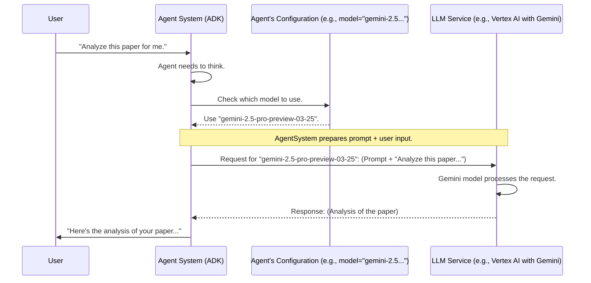

# Chapter 7: LLM Model Configuration - Choosing Your Agent's "Brain"

Welcome to Chapter 7! In our [previous chapter on Agent Prompts](06_agent_prompts.md), we saw how detailed instructions (prompts) guide our AI agents, acting as their "How-To" guide. These prompts are incredibly smart and tell the agent *what* to do and *how* to do it. But who or what is actually *understanding* these instructions and *thinking* through the tasks? That's where the Large Language Model (LLM) comes in, and configuring which LLM to use is a key decision.

Imagine you're building a super-smart robot. You've written a perfect instruction manual (the [Agent Prompts](06_agent_prompts.md)). Now, you need to choose the main computer chip or "brain" for your robot. This "brain" will read your manual and actually perform the thinking. The better the brain, the better your robot will understand complex instructions and perform its tasks.

That's exactly what **LLM Model Configuration** is about!

## What is LLM Model Configuration? Picking the Right Engine!

**LLM Model Configuration** refers to choosing the specific Large Language Model (LLM) that will act as the "brain" or "intelligence engine" for our AI agents. This model is responsible for understanding language, following instructions, generating text, and making decisions based on the prompts it receives.

Think of it like choosing the engine for a car:
*   You could choose a small, efficient engine for a city car.
*   Or a powerful V8 engine for a sports car.
*   Or perhaps a sophisticated hybrid engine for a balance of power and efficiency.

The `MODEL` variable we'll see in our code specifies which "engine" is installed in each agent. This choice directly affects:
*   **Performance**: How quickly and effectively the agent can process information.
*   **Understanding**: How well the agent can grasp complex instructions and nuanced language (like in our detailed [Agent Prompts](06_agent_prompts.md)).
*   **Output Quality**: The coherence, accuracy, and sophistication of the text the agent generates.
*   **Capabilities**: Different models might be better at different things (e.g., creative writing, logical reasoning, summarizing long texts).

In the `academic-research` project, we want our agents to be very capable, especially for research-oriented tasks which can be quite complex.

## Our Project's "Engine": `gemini-2.5-pro-preview-03-25`

For the `academic-research` project, a specific and powerful "engine" has been chosen for all our agents: **`gemini-2.5-pro-preview-03-25`**.

You'll see this model name appearing consistently in the agent definition files. This means we're equipping *all* our agents – the [Academic Coordinator Agent](01_academic_coordinator_agent.md), the [Web Search Sub-Agent](02_web_search_sub_agent.md), and the [New Research Sub-Agent](03_new_research_sub_agent.md) – with the same high-performance "brain."

Why this specific one? The "gemini-2.5-pro-preview-03-25" model is a highly capable LLM from Google, known for its strong reasoning abilities, understanding of complex context, and ability to generate high-quality, relevant text. For a project focused on academic research, which involves analyzing papers, searching for specific information, and generating novel research ideas, having such a powerful model is a great advantage. It's like giving each of our "research assistant" agents a top-tier brain to work with.

## How the "Engine" is Set in Code

Let's see how this `MODEL` configuration looks in our Python files. It's quite straightforward!

Across our agent definition files, you'll typically see a line at the top like this:

```python
# Example from academic_research/agent.py (and sub-agent files)

MODEL = "gemini-2.5-pro-preview-03-25" # Defining our chosen "engine"
```
This line creates a variable named `MODEL` and assigns it the string `"gemini-2.5-pro-preview-03-25"`. This simply stores the name of our chosen LLM.

Then, when an agent is defined using the ADK's `LlmAgent` or `Agent` classes (as we saw in the [ADK Agent Definition](05_adk_agent_definition.md) chapter), this `MODEL` variable is used to tell the agent which brain it should use.

Here's an example from the definition of our main `academic_coordinator` in `academic_research/agent.py`:

```python
# File: academic_research/agent.py
# ... (imports) ...

MODEL = "gemini-2.5-pro-preview-03-25" # Our chosen model

academic_coordinator = LlmAgent(
    name="academic_coordinator",
    model=MODEL, # Here's where we assign the "brain"!
    description=(
        "analyzing seminal papers provided by the users, ..."
    ),
    instruction=prompt.ACADEMIC_COORDINATOR_PROMPT,
    # ... (tools) ...
)
```
Notice the line `model=MODEL`. This tells the `academic_coordinator` agent to use the LLM specified in our `MODEL` variable (which is "gemini-2.5-pro-preview-03-25").

Similarly, for our sub-agents like the `academic_websearch_agent` (from `academic_research/sub_agents/academic_websearch/agent.py`):

```python
# File: academic_research/sub_agents/academic_websearch/agent.py
# ... (imports) ...

MODEL = "gemini-2.5-pro-preview-03-25" # Same consistent model

academic_websearch_agent = Agent(
    model=MODEL, # Assigning the same "brain"
    name="academic_websearch_agent",
    instruction=prompt.ACADEMIC_WEBSEARCH_PROMPT,
    # ... (output_key, tools) ...
)
```
Again, `model=MODEL` ensures this agent also uses the same powerful "gemini-2.5-pro-preview-03-25" engine. By using the same model across all agents, we ensure a consistent level of intelligence and capability throughout our research assistance process.

## Under the Hood: How an Agent Uses its Configured Model

So, you've told your agent which "brain" to use. What happens when the agent actually needs to think or generate text?

1.  **Task Arises**: The agent (e.g., `academic_coordinator`) receives input from you, or needs to process information according to its [Agent Prompts](06_agent_prompts.md).
2.  **Prepare the "Question"**: The agent system (ADK) takes the agent's prompt, the current conversation history, and your latest input, and bundles it all together. This is like preparing a detailed question or task for the "brain."
3.  **Identify the "Brain"**: The system looks at the agent's `model` configuration (e.g., "gemini-2.5-pro-preview-03-25").
4.  **Send to LLM Service**: It then sends this bundled "question" to the actual LLM service that hosts the specified model (e.g., Google's Vertex AI platform, where Gemini models run).
5.  **LLM Processes**: The chosen LLM ("gemini-2.5-pro-preview-03-25" in our case) processes the information, "thinks" about it based on all its training, and generates a response.
6.  **Receive the "Answer"**: The LLM service sends this response back to our agent system.
7.  **Agent Acts**: The agent then uses this response to talk back to you, call a tool, or decide what to do next.

Here's a simplified diagram showing this interaction:



This `model` setting is the crucial link that tells the ADK which AI "engine" to contact whenever the agent needs to perform intelligent tasks.

## Why "gemini-2.5-pro-preview-03-25" for This Project?

Choosing an LLM model often involves balancing several factors:
*   **Capability**: How good is it at understanding, reasoning, and generating text?
*   **Speed**: How fast can it produce a response?
*   **Cost**: Some models are more expensive to use than others.
*   **Specific Strengths**: Some models might be fine-tuned for specific types of tasks (e.g., coding, conversation, research).

For `academic-research`, the choice of "gemini-2.5-pro-preview-03-25" indicates a preference for high capability. This model is designed to handle:
*   **Complex Instructions**: The [Agent Prompts](06_agent_prompts.md) we use are quite detailed and define sophisticated workflows. A capable model is needed to follow them accurately.
*   **Nuanced Understanding**: Academic papers often contain dense, specific language. The model needs to understand this.
*   **High-Quality Generation**: When suggesting new research ideas or summarizing findings, the quality and relevance of the generated text are very important.
*   **Research-Oriented Tasks**: Tasks like identifying innovations in a paper, understanding citations, and brainstorming novel research questions are well-suited to advanced models like Gemini.

By using a powerful model like "gemini-2.5-pro-preview-03-25" consistently, the project aims to provide a high-quality, intelligent research assistance experience. It's like ensuring every specialist in our research team has access to the best possible analytical tools.

## Conclusion

The LLM Model Configuration, specified by the `MODEL` variable (e.g., `"gemini-2.5-pro-preview-03-25"`) and used in the `model` parameter of our agent definitions, is like choosing the "brain" or "engine" for each agent. It determines the underlying AI power that drives the agent's ability to understand, reason, and communicate.

In `academic-research`, we consistently use the capable `gemini-2.5-pro-preview-03-25` model, ensuring all our agents have a strong intellectual foundation to tackle complex research-related tasks outlined in their [Agent Prompts](06_agent_prompts.md).

Now that we understand how our agents get their "brains" (LLM model) and their "instructions" (prompts), what about the special skills or "gadgets" they can use to interact with the world or perform specific actions, like searching the web? That's what we'll explore next in [Agent Tools](08_agent_tools.md).

---

Generated by [AI Codebase Knowledge Builder](https://github.com/The-Pocket/Tutorial-Codebase-Knowledge)