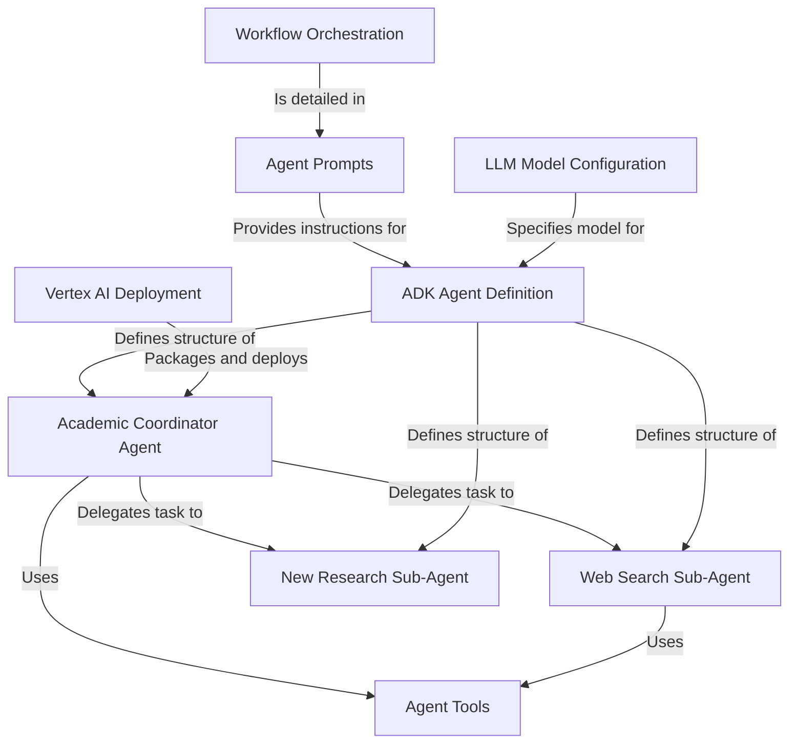

# Tutorial: academic-research

This project builds an **AI research assistant** that helps users explore academic topics.
You give it a key *research paper* (a "seminal paper"), and the main AI, called the **Academic Coordinator Agent**, figures out what the paper is about.
Then, it uses specialized *helper AIs* (sub-agents) to find *recent related articles* and suggest *new ideas for future research* based on everything it learned.
Finally, the whole system can be set up to run on Google's cloud platform (*Vertex AI*).

**Source Repository:** [None](None)

## Chapters

1. [Academic Coordinator Agent](01_academic_coordinator_agent.md)
2. [Web Search Sub-Agent](02_web_search_sub_agent.md)
3. [New Research Sub-Agent](03_new_research_sub_agent.md)
4. [Workflow Orchestration](04_workflow_orchestration.md)
5. [ADK Agent Definition](05_adk_agent_definition.md)
6. [Agent Prompts](06_agent_prompts.md)
7. [LLM Model Configuration](07_llm_model_configuration.md)
8. [Agent Tools](08_agent_tools.md)
9. [Vertex AI Deployment](09_vertex_ai_deployment.md)

---

Generated by [AI Codebase Knowledge Builder](https://github.com/The-Pocket/Tutorial-Codebase-Knowledge)