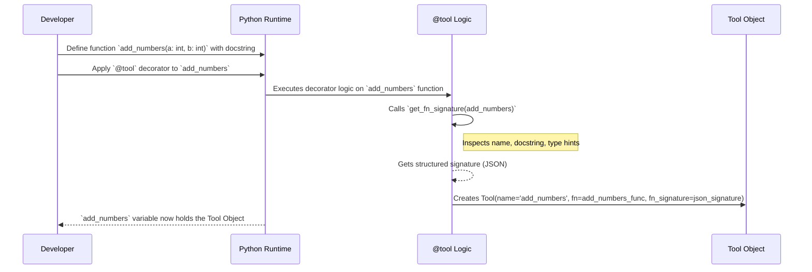

# Chapter 1: Tool - Giving AI Superpowers

Welcome to the Agentic Patterns Course! We're starting our journey by learning about a fundamental building block for smart AI agents: the **Tool**.

## Why Do We Need Tools?

Imagine you have a very smart AI assistant, like ChatGPT. It's fantastic at understanding and generating text, translating languages, and answering questions based on the vast amount of text it learned from.

But what if you ask it:

*   "What's the weather like in London *right now*?"
*   "What is 567 multiplied by 89?"
*   "Search the web for the latest news about Agentic AI."

The AI model itself, based purely on its training data, can't directly answer these questions accurately. Its knowledge is frozen at the time it was trained, it can't access real-time information (like weather or live news), and while it might approximate calculations, complex math isn't its primary strength.

This is where **Tools** come in! Tools are like giving your AI assistant special gadgets or superpowers to interact with the outside world, perform specific calculations, or access specific information sources. They bridge the gap between the AI's language capabilities and the real world's data and actions.

## What Exactly is a Tool?

Think of a **Tool** as a specific, well-defined capability you give to an AI agent. Just like a carpenter uses a hammer for nails and a saw for wood, an AI agent uses different tools for different jobs.

*   **Specific Job:** Each tool does one thing well (e.g., get current weather, calculate math, search the web).
*   **Defined Inputs:** A tool knows exactly what information it needs to do its job. For a weather tool, the input might be the `location` (like "London"). For a calculator tool, the inputs might be `number1` and `number2`.
*   **Defined Outputs:** A tool produces a predictable result. The weather tool outputs the `temperature` and `conditions`. The calculator tool outputs the `result`.

This clear structure (specific job, defined inputs, defined outputs) is crucial because it allows the AI agent to understand *when* to use a tool, *what information* to provide it, and *what kind of result* to expect back.

**Analogy:** A tool for an AI is like:
*   A **hammer** for a construction worker (specific job: drive nails).
*   A **calculator** for a student (specific job: perform calculations).
*   A **web search function** for a researcher (specific job: find information online).

## Creating a Simple Tool in Code

Let's see how we can represent a tool in our project. We'll use Python functions and a special piece of code called a "decorator" to turn a regular function into a Tool that our agents can understand.

Imagine we want a tool that simply adds two numbers.

1.  **Define a standard Python function:**

    ```python
    # This function will become our tool
    def add_numbers(a: int, b: int) -> int:
        """Adds two integers together."""
        print(f"Tool 'add_numbers' called with a={a}, b={b}")
        return a + b
    ```
    This is a normal Python function. It takes two integers (`a` and `b`) and returns their sum. The `"""Adds two integers together."""` part is called a docstring, and it describes what the function does – this will be important for the AI! The type hints (`: int`, `-> int`) tell us what kind of data the function expects and returns.

2.  **Turn it into a `Tool` using the `@tool` decorator:**

    Our project provides a handy `@tool` decorator. Think of a decorator as something that wraps around your function to give it extra powers.

    ```python
    # src/agentic_patterns/tool_pattern/tool.py provides the @tool decorator
    from agentic_patterns.tool_pattern.tool import tool
    import json # We'll use this later to see the signature

    @tool
    def add_numbers(a: int, b: int) -> int:
        """Adds two integers together."""
        print(f"Tool 'add_numbers' called with a={a}, b={b}")
        return a + b

    # Now, 'add_numbers' is not just a function, it's a Tool object!
    print(type(add_numbers))
    # Output: <class 'agentic_patterns.tool_pattern.tool.Tool'>

    print(add_numbers.name)
    # Output: add_numbers
    ```
    By adding `@tool` right before the function definition, we've transformed `add_numbers` from a plain function into a `Tool` object. This object holds not just the function itself, but also information *about* the function that an AI can understand.

3.  **What's inside the `Tool` object?**

    The `Tool` object created by the decorator stores:
    *   `name`: The name of the function (`add_numbers`).
    *   `fn`: The actual Python function code to be executed.
    *   `fn_signature`: A structured description (in JSON format) of the tool, including its name, description (from the docstring), and its parameters (inputs) with their expected types.

    Let's look at the signature:
    ```python
    # Pretty-print the JSON signature
    signature = json.loads(add_numbers.fn_signature)
    print(json.dumps(signature, indent=2))
    ```

    This will output something like:
    ```json
    {
      "name": "add_numbers",
      "description": "Adds two integers together.",
      "parameters": {
        "properties": {
          "a": {
            "type": "int"
          },
          "b": {
            "type": "int"
          }
        }
      }
    }
    ```
    This signature is *key*! It's like an instruction manual for the AI. It tells the AI: "There's a tool named `add_numbers`. It's used for 'Adds two integers together.' It needs two inputs: `a` (which should be an integer) and `b` (which should also be an integer)."

## How it Works Under the Hood

How does the `@tool` decorator magically create this structured signature and the `Tool` object? Let's peek behind the curtain.

**Step-by-Step:**

1.  **You write** a Python function with type hints and a docstring (like `add_numbers`).
2.  **You apply** the `@tool` decorator above the function definition.
3.  When Python loads your code, the `@tool` decorator **runs**.
4.  Inside the decorator, a helper function called `get_fn_signature` **inspects** your `add_numbers` function. It looks at:
    *   `__name__` (the function's name: "add_numbers")
    *   `__doc__` (the docstring: "Adds two integers together.")
    *   `__annotations__` (the type hints: `a` is `int`, `b` is `int`)
5.  `get_fn_signature` **builds** the JSON signature dictionary we saw earlier.
6.  The `@tool` decorator then **creates** an instance of the `Tool` class, passing in the function's name, the function itself (`fn`), and the JSON signature string (`fn_signature`).
7.  The original `add_numbers` name in your code now **refers** to this `Tool` object instead of the raw function.

**Sequence Diagram:**

This diagram shows the interaction when the `@tool` decorator is applied:



**Code Snippets from `src/agentic_patterns/tool_pattern/tool.py`:**

Let's look at the core pieces (simplified slightly for clarity):

1.  **`get_fn_signature`**: This function reads the function's details.

    ```python
    # From: src/agentic_patterns/tool_pattern/tool.py
    def get_fn_signature(fn: Callable) -> dict:
        """Generates the signature for a given function."""
        fn_signature: dict = {
            "name": fn.__name__,          # Get function name
            "description": fn.__doc__,    # Get docstring
            "parameters": {"properties": {}},
        }
        # Get parameter names and types from annotations
        schema = {
            k: {"type": v.__name__} for k, v in fn.__annotations__.items() if k != "return"
        }
        fn_signature["parameters"]["properties"] = schema
        return fn_signature
    ```
    This function takes your original function (`fn`) and extracts its name, docstring, and parameter types to build the dictionary.

2.  **`Tool` Class**: This class is a container to hold the function and its signature.

    ```python
    # From: src/agentic_patterns/tool_pattern/tool.py
    class Tool:
        """A class representing a tool that wraps a callable and its signature."""
        def __init__(self, name: str, fn: Callable, fn_signature: str):
            self.name = name           # Store the name
            self.fn = fn               # Store the actual function
            self.fn_signature = fn_signature # Store the JSON signature string

        def run(self, **kwargs):
            """Executes the tool (function) with provided arguments."""
            return self.fn(**kwargs) # Calls the original function
    ```
    It stores the name, the function (`fn`), and the signature string. It also has a `run` method, which is how the tool's function actually gets called later.

3.  **`@tool` Decorator**: This ties everything together.

    ```python
    # From: src/agentic_patterns/tool_pattern/tool.py
    def tool(fn: Callable):
        """A decorator that wraps a function into a Tool object."""
        def wrapper():
            # 1. Get the signature
            fn_signature_dict = get_fn_signature(fn)
            # 2. Convert signature to JSON string
            fn_signature_json = json.dumps(fn_signature_dict)
            # 3. Create the Tool object
            return Tool(
                name=fn_signature_dict.get("name"),
                fn=fn,
                fn_signature=fn_signature_json
            )
        # Return the created Tool object
        return wrapper()
    ```
    This function `tool` is the decorator. When you put `@tool` above your function, Python calls `tool(your_function)`. It then runs `get_fn_signature`, creates the `Tool` object, and returns it.

## Why is this Important for Agents?

You've now learned how to package a Python function into a `Tool` object with a clear, machine-readable signature. This is the first crucial step in building capable AI agents.

Later in this course, we'll see agent patterns like the [ToolAgent](08_toolagent.md) and the [ReactAgent (Planning Pattern)](06_reactagent__planning_pattern_.md). These agents will:

1.  Receive your request (e.g., "Add 5 and 3").
2.  Look at the signatures of the tools they have available (like the signature of our `add_numbers` tool).
3.  Use a Large Language Model ([LLM Interaction (Completions)](02_llm_interaction__completions_.md)) to decide *which* tool to use (it will see the description "Adds two integers together.") and *what inputs* to provide (it will figure out `a=5` and `b=3`).
4.  Request the execution of the `add_numbers` tool with those inputs.
5.  Receive the result (e.g., `8`) back from the tool.
6.  Formulate a final answer for you.

Without the `Tool` abstraction and its clear signature, the AI wouldn't know how to reliably ask for specific actions or calculations to be performed.

## Conclusion

In this chapter, we learned about the concept of a **Tool**.
*   **What it is:** A specific capability (like a function) given to an AI agent.
*   **Why it's needed:** To allow AI to interact with the real world, perform calculations, or access external data sources.
*   **Key features:** Defined inputs and outputs, described by a structured signature.
*   **How to create one:** By writing a Python function and using the `@tool` decorator, which generates a signature and wraps everything in a `Tool` object.

Tools are the fundamental building blocks that give our AI agents practical abilities. Now that we know how to define *what* a tool is, our next step is to understand how an agent *interacts* with the core AI brain – the Large Language Model (LLM) – to understand requests and generate responses, including deciding when to use a tool.

Let's move on to exploring that interaction!

**Next:** [Chapter 2: LLM Interaction (Completions)](02_llm_interaction__completions_.md)

---

Generated by [AI Codebase Knowledge Builder](https://github.com/The-Pocket/Tutorial-Codebase-Knowledge)