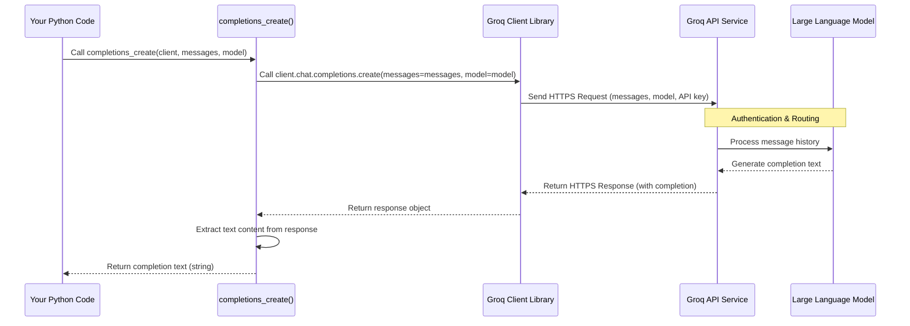

# Chapter 2: LLM Interaction (Completions) - Talking to the AI Brain

In [Chapter 1: Tool](01_tool.md), we learned how to give our AI agents special "superpowers" using Tools. We created a simple `add_numbers` tool that our agent *could* use. But how does the agent actually *think* or *talk*? How does it understand our requests, generate text, or even decide *when* to use a tool like `add_numbers`?

That's where the **LLM Interaction (Completions)** part comes in. This is the core mechanism our agent uses to communicate with the powerful Large Language Model (LLM) – the AI "brain" that powers its language understanding and generation abilities.

## Why Do We Need This "Interaction Layer"?

Imagine you have the smartest AI brain available (like Llama 3, accessible via a service like Groq). You can't just shout your questions into the void and expect an answer. You need a specific way to:

1.  **Format your request:** How do you tell the AI what you want? Do you just send your latest message, or does it need context about the conversation so far?
2.  **Send the request:** How does your code physically send the information to the AI service running somewhere else?
3.  **Receive the response:** How does the AI's generated text (its "completion" of the conversation) get back to your code?

The LLM Interaction layer handles precisely this. It's the communication protocol and the pipeline connecting your agent code to the LLM service.

**Use Case:** Let's say you want your agent to tell you a joke.
*   You type: "Tell me a joke about computers."
*   How does this request get sent to the LLM?
*   How does the LLM's funny (hopefully!) response get displayed back to you?

This chapter explains that fundamental connection.

**Analogy:** Think of the LLM as a genius living far away that you can only talk to via a special phone line (the API).
*   The **LLM Interaction layer** is like the **phone line itself and the operator** who knows how to format your message for the genius and relay the genius's answer back to you.
*   The **LLM** is the **genius** who understands language and generates responses.
*   Your **request** ("Tell me a joke") needs to be properly **formatted** (put into a standard message format) by the operator before being sent.
*   The LLM's **response** (the joke) is sent back over the phone line for the operator to give to you.

## Key Concepts: Talking to the LLM

1.  **API Client:** We need a way to connect to the service hosting the LLM. In our course, we'll use the `groq` Python library, which provides a `Groq` client. This client handles the technical details of connecting, authenticating (using an API key you set up separately), and sending/receiving data.
2.  **Conversation History (Messages):** LLMs usually work best when they have context. We don't just send the *latest* user message. We send a list of messages representing the conversation so far. Each message typically has a `role` (`system`, `user`, or `assistant`) and `content` (the text).
    *   `system`: Instructions for the AI (e.g., "You are a helpful assistant.").
    *   `user`: What the human user said.
    *   `assistant`: What the AI said previously.
3.  **Completions API:** The specific function or endpoint we call on the client/service is often called a "completions" endpoint. We give it the conversation history, and it "completes" the conversation by generating the next message (usually an `assistant` message).
4.  **Model:** We often need to specify *which* LLM brain we want to talk to (e.g., `llama-3.3-70b-versatile`). Different models have different strengths and capabilities.

## How to Use It: A Simple Conversation

Let's see how we can ask the LLM a simple question using our project's helper functions.

1.  **Import necessary libraries and set up the client:**

    ```python
    # Make sure you have python-dotenv installed (`pip install python-dotenv groq`)
    # and a .env file with your GROQ_API_KEY
    from dotenv import load_dotenv
    from groq import Groq

    # Load environment variables (like GROQ_API_KEY)
    load_dotenv()

    # Create the client to connect to Groq
    client = Groq()

    # Specify the model we want to use
    model_name = "llama3-8b-8192" # A smaller, fast model for quick tests
    print(f"Using model: {model_name}")
    # Output: Using model: llama3-8b-8192
    ```
    This code sets up the `Groq` client, which knows how to talk to the Groq API using your secret API key (loaded from a `.env` file). We also choose which LLM we want to use.

2.  **Prepare the messages:** We need to structure our request as a list of message dictionaries. Our project provides a helper function `build_prompt_structure` for this.

    ```python
    # Import the helper function
    from agentic_patterns.utils.completions import build_prompt_structure

    # Create the conversation history
    messages = [
        build_prompt_structure(prompt="You are a helpful assistant.", role="system"),
        build_prompt_structure(prompt="Explain the concept of an API in simple terms.", role="user")
    ]

    # Let's see what the messages list looks like
    import json
    print(json.dumps(messages, indent=2))
    ```
    This creates a list containing two messages: a system instruction telling the AI its role, and our user question.

    Output:
    ```json
    [
      {
        "role": "system",
        "content": "You are a helpful assistant."
      },
      {
        "role": "user",
        "content": "Explain the concept of an API in simple terms."
      }
    ]
    ```

3.  **Call the Completions API:** Now we use the `completions_create` helper function (which uses the `client`) to send these messages to the LLM and get the response.

    ```python
    # Import the core interaction function
    from agentic_patterns.utils.completions import completions_create

    print("Sending request to LLM...")
    # Send the messages and get the response
    response_content = completions_create(
        client=client,
        messages=messages,
        model=model_name
    )

    print("\nLLM Response:")
    print(response_content)
    ```
    This function takes our client, the prepared messages, and the model name. It handles the actual communication with the Groq API and returns the text content of the LLM's reply.

    Example Output (will vary slightly each time):
    ```
    Sending request to LLM...

    LLM Response:
    Okay, imagine you want to order pizza online. 🍕

    You go to the pizza place's website (or app). You choose your toppings, size, and crust. Then you click "Order".

    That website (or app) is like the **customer interface**. You interact with it directly.

    But how does your order get from the website to the actual pizza kitchen? 🤔

    That's where the **API (Application Programming Interface)** comes in!

    Think of the API as the **waiter** or the **order-taker** in the background.

    *   The **website (customer interface)** tells the **API (waiter)**: "Hey, this person wants a large pepperoni pizza."
    *   The **API (waiter)** takes that order and translates it into a format the **kitchen (the backend system)** understands.
    *   The **API (waiter)** gives the order to the **kitchen**.
    *   Later, the **API (waiter)** might also check the kitchen for updates ("Is the pizza ready yet?") and tell the website, so you see "Your pizza is in the oven!"

    So, an **API** is like a hidden **messenger or translator** that lets different software applications talk to each other and exchange information or request actions, without needing to know the messy details of how the other application works internally. It defines the rules for how they should interact.
    ```

See? We successfully "talked" to the AI brain! We sent it our structured request (system prompt + user question), and it sent back a helpful explanation.

## How it Works Under the Hood

What actually happens inside that `completions_create` function?

**Step-by-Step:**

1.  **You call `completions_create`**, passing the `Groq` client, the list of `messages`, and the `model` name.
2.  The function takes your list of message dictionaries.
3.  It calls the `client.chat.completions.create()` method provided by the `groq` library. This method is the "phone dialer".
4.  The `groq` library constructs a secure internet request (an HTTPS request) to the Groq API endpoint (e.g., `https://api.groq.com/openai/v1/chat/completions`). This request includes:
    *   Your messages.
    *   The model name you specified.
    *   Your API key (for authentication, handled securely by the client library).
5.  The Groq API service receives your request.
6.  It validates your API key and routes your messages to the specific LLM you requested (e.g., `llama3-8b-8192`).
7.  The LLM processes the entire conversation history you sent and generates the most likely next message (the "completion").
8.  Groq's service takes the LLM's generated text and packages it into an HTTPS response.
9.  The response is sent back across the internet to the `groq` client library in your code.
10. The `client.chat.completions.create()` method receives the response.
11. Our `completions_create` helper function extracts just the text content from the response object (specifically, `response.choices[0].message.content`).
12. This text content is returned by `completions_create` to your main code.

**Sequence Diagram:**

This diagram shows the flow of communication:



**Code Snippets from `src/agentic_patterns/utils/completions.py`:**

Let's look at the helper functions we used:

1.  **`build_prompt_structure`**: Creates the standard message dictionary.

    ```python
    # From: src/agentic_patterns/utils/completions.py
    def build_prompt_structure(prompt: str, role: str, tag: str = "") -> dict:
        """
        Builds a structured prompt that includes the role and content.
        # ... (rest of docstring)
        """
        if tag: # Optionally wrap content in XML tags
            prompt = f"<{tag}>{prompt}</{tag}>"
        # Returns a dictionary like: {"role": "user", "content": "Hello!"}
        return {"role": role, "content": prompt}
    ```
    This is quite simple – it just takes the text (`prompt`) and the speaker (`role`) and puts them into a dictionary with the keys `"role"` and `"content"`, which is the format the API expects.

2.  **`completions_create`**: Sends the request and gets the response text.

    ```python
    # From: src/agentic_patterns/utils/completions.py
    def completions_create(client, messages: list, model: str) -> str:
        """
        Sends a request to the client's `completions.create` method...
        # ... (rest of docstring)
        """
        # This is the core API call using the Groq client
        response = client.chat.completions.create(
            messages=messages,
            model=model
        )
        # Extract the text content from the first choice in the response
        return str(response.choices[0].message.content)
    ```
    This function is the heart of the interaction. It uses the `client` object (which we initialized earlier) and calls its `chat.completions.create` method, passing the `messages` list and `model` name. It then digs into the `response` object to pull out the actual text generated by the LLM.

## Conclusion

In this chapter, we peeled back the curtain on how our agent code actually communicates with the powerful LLM "brain". We learned:

*   **Why it's needed:** To bridge the gap between our code and the external LLM service.
*   **Key Components:** An API Client (`Groq`), structured Conversation History (`messages`), and the Completions API call.
*   **How it works:** We structure our conversation as a list of messages (with roles) and use a client library to send this to the LLM API, receiving the generated text completion in return.
*   **Helper Functions:** Our project provides `build_prompt_structure` and `completions_create` to simplify this process.

This LLM interaction is the absolute foundation upon which agentic behavior is built. Whether the agent is just chatting, deciding to use a tool, or reflecting on its work, it relies on this mechanism to "think" and generate responses.

Now that we know *how* to talk to the LLM, how do we effectively manage the conversation history, especially as it grows longer? Let's explore that next.

**Next:** [Chapter 3: Chat History](03_chat_history.md)

---

Generated by [AI Codebase Knowledge Builder](https://github.com/The-Pocket/Tutorial-Codebase-Knowledge)