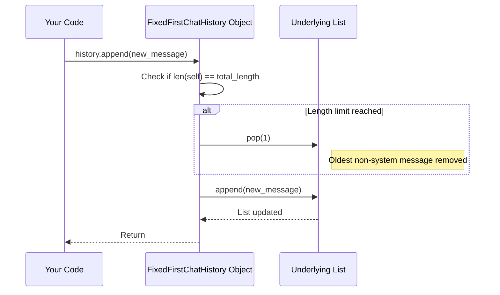

# Chapter 3: Chat History - Remembering the Conversation

In [Chapter 2: LLM Interaction (Completions)](02_llm_interaction__completions_.md), we learned how our agent code can talk to the Large Language Model (LLM) "brain" by sending messages and receiving responses. We saw that we send messages in a specific format, like `{"role": "user", "content": "..."}`.

But what happens when you have a *conversation*? Imagine this exchange:

1.  **You:** "What's the capital of France?"
2.  **AI:** "The capital of France is Paris."
3.  **You:** "What's the weather like there?"

How does the AI know that "there" refers to Paris? It needs to remember the previous messages! This ability to remember the conversation flow is managed by **Chat History**.

## Why is Chat History Important?

LLMs, by themselves, don't inherently remember past interactions within a single conversation session *unless* you explicitly provide them with the context. Each call to the [LLM Interaction (Completions)](02_llm_interaction__completions_.md) API is often independent.

If you only sent the last message ("What's the weather like there?") to the LLM, it would have no idea what "there" means. It would likely ask for clarification or give a generic answer.

**Chat History solves this by keeping track of the entire sequence of messages (or at least the relevant recent ones) exchanged between the user and the AI.** When asking the LLM for a new response, we send this history along, giving the LLM the necessary context to understand the conversation and provide a relevant answer.

**Analogy:** Think of Chat History like the scrolling transcript in your favorite messaging app (like WhatsApp or Slack). You can scroll up to see what was said before. The AI needs this transcript too, so it doesn't lose track of the topic or forget important details mentioned earlier.

## What Exactly is Chat History?

At its core, Chat History is simply a **list of messages**. Each message in the list is typically a dictionary containing:

*   `role`: Who said it? (`"user"`, `"assistant"`, or sometimes `"system"` for initial instructions).
*   `content`: What did they say? (The actual text of the message).

As the conversation progresses, new messages are added to the end of this list.

```
[
  {"role": "system", "content": "You are a helpful assistant."},
  {"role": "user", "content": "What's the capital of France?"},
  {"role": "assistant", "content": "The capital of France is Paris."},
  {"role": "user", "content": "What's the weather like there?"}
]  <-- This whole list is the Chat History
```

When we want the AI's next response, we send this entire list to the LLM via the completions API we learned about in Chapter 2.

## How to Manage Chat History in Code

Let's see how we can manage this list.

**1. The Basic Approach: Using a Python List**

The simplest way is to use a standard Python list.

```python
from agentic_patterns.utils.completions import build_prompt_structure, completions_create
from groq import Groq
from dotenv import load_dotenv

# Setup (same as Chapter 2)
load_dotenv()
client = Groq()
model_name = "llama3-8b-8192"

# Start with an empty history or initial system prompt
chat_history = [
    build_prompt_structure(prompt="You are a helpful assistant.", role="system")
]

# First user message
user_message_1 = "What's the capital of France?"
chat_history.append(build_prompt_structure(prompt=user_message_1, role="user"))
print("History after user 1:", chat_history)
# Output: History after user 1: [{'role': 'system', 'content': 'You are a helpful assistant.'}, {'role': 'user', 'content': "What's the capital of France?"}]

# Get AI response
print("\nAsking LLM...")
ai_response_1 = completions_create(client, chat_history, model_name)
print("AI response 1:", ai_response_1)
# Output (example): AI response 1: The capital of France is Paris.

# Add AI response to history
chat_history.append(build_prompt_structure(prompt=ai_response_1, role="assistant"))
print("\nHistory after AI 1:", chat_history)
# Output: History after AI 1: [{'role': 'system', 'content': '...'}, {'role': 'user', 'content': '...'}, {'role': 'assistant', 'content': '...'}]

# Second user message
user_message_2 = "What's the weather like there?"
chat_history.append(build_prompt_structure(prompt=user_message_2, role="user"))
print("\nHistory after user 2:", chat_history)
# Output: History after user 2: [{'role': 'system', 'content': '...'}, {'role': 'user', 'content': '...'}, {'role': 'assistant', 'content': '...'}, {'role': 'user', 'content': 'What's the weather like there?'}]


# Get AI response (now with context!)
print("\nAsking LLM again...")
ai_response_2 = completions_create(client, chat_history, model_name)
print("AI response 2:", ai_response_2)
# Output (example): AI response 2: The current weather in Paris is [details about weather]...
```

This works! We manually appended each user message and AI response to our `chat_history` list before calling the LLM again.

**2. Using a Helper Function: `update_chat_history`**

Manually calling `build_prompt_structure` and `append` every time can be a bit repetitive. Our project provides a helper function to simplify this.

```python
# Import the helper
from agentic_patterns.utils.completions import update_chat_history

# (Assume client, model_name, build_prompt_structure are set up as before)

chat_history = [
    build_prompt_structure(prompt="You are a helpful assistant.", role="system")
]

user_message_1 = "What's the capital of France?"
# Use the helper to add user message
update_chat_history(chat_history, user_message_1, "user")
print("History:", chat_history)
# Output: History: [{'role': 'system', 'content': '...'}, {'role': 'user', 'content': "What's the capital of France?"}]

ai_response_1 = "The capital of France is Paris." # Pretend we got this from LLM
# Use the helper to add AI response
update_chat_history(chat_history, ai_response_1, "assistant")
print("History:", chat_history)
# Output: History: [{'role': 'system', 'content': '...'}, {'role': 'user', 'content': '...'}, {'role': 'assistant', 'content': 'The capital of France is Paris.'}]
```

The `update_chat_history` function just takes the history list, the message text, and the role, and does the `build_prompt_structure` and `append` for us.

**3. Using Dedicated Classes: `ChatHistory` and `FixedFirstChatHistory`**

As conversations get very long, sending the *entire* history can become slow and expensive. Sometimes, you might want to limit the history length (e.g., only keep the last 10 messages). Also, you often want to make sure the initial system prompt *always* stays in the history, even if older messages are dropped.

To handle these scenarios more easily, our project provides special classes in `src/agentic_patterns/utils/completions.py`:

*   **`ChatHistory`:** A basic wrapper around a list that can optionally enforce a maximum length. When the maximum length is reached, adding a new message automatically removes the oldest one.
*   **`FixedFirstChatHistory`:** A variation of `ChatHistory` that *always* keeps the very first message (usually the system prompt) and only removes older messages *after* the first one when the length limit is hit.

Let's see how to use `FixedFirstChatHistory` to keep the system prompt and limit the total history to, say, 5 messages:

```python
from agentic_patterns.utils.completions import FixedFirstChatHistory, build_prompt_structure

# Initialize with a max length of 5 messages
# The first message (system prompt) will always be kept.
history = FixedFirstChatHistory(
    messages=[
        build_prompt_structure(prompt="You are a helpful AI.", role="system")
    ],
    total_length=5
)

# Add messages using the append method (similar to a list)
history.append(build_prompt_structure(prompt="Hi!", role="user"))
history.append(build_prompt_structure(prompt="Hello there!", role="assistant"))
history.append(build_prompt_structure(prompt="How are you?", role="user"))
history.append(build_prompt_structure(prompt="I am an AI, I don't have feelings, but I'm operational!", role="assistant"))

print(f"History length: {len(history)}")
# Output: History length: 5

# Now the history is full (1 system + 4 user/assistant).
# Let's add another message.
history.append(build_prompt_structure(prompt="What can you do?", role="user"))

print(f"\nHistory length after adding 6th message: {len(history)}")
# Output: History length after adding 6th message: 5

print("\nCurrent History:")
for msg in history:
    print(f"- {msg['role']}: {msg['content']}")

# Expected Output:
# Current History:
# - system: You are a helpful AI. (Still here!)
# - assistant: Hello there! (The first user message "Hi!" was removed)
# - user: How are you?
# - assistant: I am an AI...
# - user: What can you do? (The newest message)
```

Notice how the oldest message *after* the system prompt (`"Hi!"`) was automatically removed when we added the sixth message, keeping the total length at 5 and preserving the initial system prompt. This is very useful for managing context in long-running agent interactions.

## How it Works Under the Hood

Let's peek inside `src/agentic_patterns/utils/completions.py` to see how these classes and helpers are built.

**1. `update_chat_history` function:**

This is quite straightforward. It just bundles the `build_prompt_structure` call and the list `append` method.

```python
# From: src/agentic_patterns/utils/completions.py (simplified)
def update_chat_history(history: list, msg: str, role: str):
    """Updates the chat history by appending the latest message."""
    # Calls the same function we used in Chapter 2
    structured_message = build_prompt_structure(prompt=msg, role=role)
    # Adds the structured message to the list
    history.append(structured_message)
```

**2. `ChatHistory` class:**

This class inherits from the built-in Python `list`. It overrides the `append` method to check the `total_length`.

```python
# From: src/agentic_patterns/utils/completions.py (simplified)
class ChatHistory(list):
    def __init__(self, messages: list | None = None, total_length: int = -1):
        """Initialise with optional messages and max length."""
        if messages is None:
            messages = []
        super().__init__(messages) # Initialize the underlying list
        self.total_length = total_length # Store the max length (-1 means infinite)

    def append(self, msg: dict): # Takes a message dictionary
        """Add a message, removing the oldest if length limit is reached."""
        # Check if length limit is set and reached
        if self.total_length != -1 and len(self) == self.total_length:
            self.pop(0) # Remove the oldest message (at index 0)
        super().append(msg) # Add the new message to the end
```

**3. `FixedFirstChatHistory` class:**

This class inherits from `ChatHistory`. It overrides `append` slightly differently to protect the first message.

```python
# From: src/agentic_patterns/utils/completions.py (simplified)
class FixedFirstChatHistory(ChatHistory):
    # Inherits __init__ from ChatHistory

    def append(self, msg: dict):
        """Add a message, removing the oldest *after the first one*
           if length limit is reached."""
        # Check if length limit is set and reached
        if self.total_length != -1 and len(self) == self.total_length:
            # Remove the message at index 1 (the oldest *after* the first one)
            self.pop(1)
        super(ChatHistory, self).append(msg) # Use list's append to add the new message
```
*(Note: The original code uses `super().append(msg)` which works because `FixedFirstChatHistory` inherits `ChatHistory`'s `append`, which in turn calls `list`'s `append`. Simplified here for clarity on the `pop(1)` difference.)*

**Sequence Diagram: Using `FixedFirstChatHistory`**

This diagram shows what happens when you append to a `FixedFirstChatHistory` that is already full.



These classes provide convenient ways to manage the conversation context, preventing it from growing indefinitely while ensuring crucial instructions (like the system prompt) can be retained.

## Conclusion

In this chapter, we learned about the crucial role of **Chat History** in maintaining conversational context for AI agents.

*   **Why:** LLMs need past messages to understand the flow and references in a conversation.
*   **What:** A list of messages, each with a `role` and `content`.
*   **How:** Managed using Python lists, helper functions (`update_chat_history`), or specialized classes (`ChatHistory`, `FixedFirstChatHistory`) for features like length limiting and pinning initial prompts.

Effectively managing chat history is essential for building agents that can hold coherent, multi-turn conversations. Now that we understand how to define [Tools](01_tool.md), interact with the [LLM](02_llm_interaction__completions_.md), and manage the [Chat History](03_chat_history.md), we need to refine how the agent understands the tools it possesses. How can we ensure the LLM knows exactly *how* to use a tool, including what arguments it expects?

Let's dive into how we define tools more formally and validate their usage.

**Next:** [Chapter 4: Tool Definition & Validation](04_tool_definition___validation.md)

---

Generated by [AI Codebase Knowledge Builder](https://github.com/The-Pocket/Tutorial-Codebase-Knowledge)