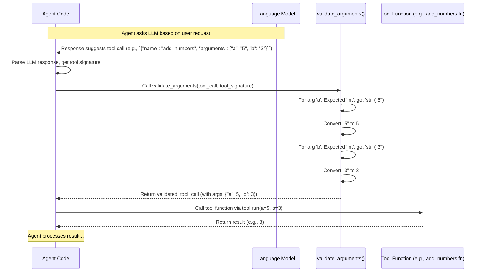

# Chapter 4: Tool Definition & Validation - The Instruction Manual and Safety Check

In [Chapter 3: Chat History](03_chat_history.md), we learned how to keep track of the conversation so our AI agent can understand context. Now, let's revisit our [Tools](01_tool.md) from Chapter 1. We know how to *define* a basic tool, like our `add_numbers` function.

But what happens when the AI (the Large Language Model or [LLM](02_llm_interaction__completions_.md)) tries to *use* the tool? How do we make sure it uses it correctly?

## Why Do We Need More Than Just a Definition?

Imagine you have a power drill (our Tool). The basic definition tells you it drills holes. But a good instruction manual also tells you:
*   What *kind* of drill bit to use (the `type` of input).
*   How to insert the bit correctly (the `format` of the input).
*   What safety precautions to take (the `validation`).

Our AI needs something similar for its Tools. In Chapter 1, we saw that the `@tool` decorator creates a signature like this:

```json
{
  "name": "add_numbers",
  "description": "Adds two integers together.",
  "parameters": {
    "properties": {
      "a": {
        "type": "int"
      },
      "b": {
        "type": "int"
      }
    }
  }
}
```

This tells the AI it needs two *integers* (`int`), named `a` and `b`.

**The Problem:** LLMs think in text. When they decide to use the `add_numbers` tool, they might generate the arguments like this: `{"a": "5", "b": "3"}`. Notice the quotation marks? The LLM provided the numbers as *strings* (text), not *integers* (actual numbers).

If we directly pass `"5"` and `"3"` to our Python `add_numbers(a: int, b: int)` function, it will likely cause an error because the function expects `int` types, not `str` types.

**This is where Tool Definition & Validation comes in:** We need a way to:
1.  Clearly **define** the expected inputs (name, description, *and types*). (We did this in Chapter 1 with the signature).
2.  **Validate** that the arguments the LLM provides *can* be used with the tool.
3.  **Convert** the arguments to the correct format (e.g., turn the string `"5"` into the integer `5`) before actually running the tool's function.

**Analogy:** Think of Tool Definition & Validation as the **instruction manual and safety checklist** for a power tool.
*   **Definition (Signature):** The manual describing what the tool does and what parts (arguments) it needs (e.g., "Requires a 1/4 inch Phillips head bit").
*   **Validation & Conversion:** The safety check ensuring you *have* a 1/4 inch Phillips head bit (not a flathead) and that it's properly inserted before you turn the drill on.

## Key Concepts: Ensuring Correct Tool Use

1.  **Tool Signature (The Manual):** This is the JSON structure we saw earlier, generated by `@tool`. It includes:
    *   `name`: The tool's identifier (`add_numbers`).
    *   `description`: What the tool does (human and AI-readable).
    *   `parameters`: A dictionary describing the inputs (arguments).
        *   `properties`: Contains each argument's name (e.g., `a`) and its expected `type` (e.g., `int`).

2.  **Argument Validation (The Check):** Before running the tool's code, we need to look at the arguments the LLM provided and compare them to the `parameters` in the signature. Can the provided value be used as the expected type? For example, can the string `"5"` be treated as an integer? Yes. Can the string `"hello"` be treated as an integer? No.

3.  **Argument Conversion/Casting (The Adjustment):** If validation passes (e.g., `"5"` *can* be an integer), we need to convert it to the actual required type. We change the string `"5"` into the integer `5`. This process is often called "type casting".

## How to Use Validation and Conversion

Let's see how this works in practice using our `add_numbers` tool and a helper function from our project.

1.  **Define the Tool (as before):**

    ```python
    # src/agentic_patterns/tool_pattern/tool.py provides the @tool decorator
    from agentic_patterns.tool_pattern.tool import tool
    import json

    @tool
    def add_numbers(a: int, b: int) -> int:
        """Adds two integers together."""
        print(f"Tool 'add_numbers' called with a={a} (type: {type(a)}), b={b} (type: {type(b)})")
        return a + b

    # Get the signature (the "manual")
    tool_signature_json = add_numbers.fn_signature
    tool_signature_dict = json.loads(tool_signature_json)

    print("Tool Signature:")
    print(json.dumps(tool_signature_dict, indent=2))
    ```
    This is the same tool definition from Chapter 1.

2.  **Simulate LLM Output:** Imagine the LLM decides to call this tool and provides the arguments as strings within a dictionary structure.

    ```python
    # This is like the raw output from the LLM
    llm_provided_tool_call = {
      "name": "add_numbers",
      "arguments": {
        "a": "5", # Note: This is a string!
        "b": "3"  # Note: This is also a string!
      },
      "id": 1 # Agents often use an ID to track calls
    }
    print("\nLLM provided arguments:")
    print(llm_provided_tool_call["arguments"])
    # Output: LLM provided arguments:
    # {'a': '5', 'b': '3'}
    ```

3.  **Validate and Convert Arguments:** Now, we use the `validate_arguments` helper function from `src/agentic_patterns/tool_pattern/tool.py`. This function performs the "safety check and adjustment".

    ```python
    # Import the validation function
    from agentic_patterns.tool_pattern.tool import validate_arguments

    print("\nValidating and converting arguments...")
    # Pass the LLM's call and the tool's signature dictionary
    validated_tool_call = validate_arguments(
        tool_call=llm_provided_tool_call,
        tool_signature=tool_signature_dict
    )

    print("\nValidated arguments:")
    print(validated_tool_call["arguments"])
    # Output: Validated arguments:
    # {'a': 5, 'b': 3} # Notice: Now they are integers!
    ```
    Success! `validate_arguments` looked at the signature (`"type": "int"`), saw the provided strings (`"5"`, `"3"`), confirmed they could be converted, and changed them into integers (`5`, `3`).

4.  **Run the Tool with Corrected Arguments:** Now it's safe to run the actual tool function using the validated and converted arguments.

    ```python
    # Extract the corrected arguments
    corrected_arguments = validated_tool_call["arguments"]

    print("\nRunning the tool with corrected arguments...")
    # Use the .run() method of the Tool object
    result = add_numbers.run(**corrected_arguments)
    # The ** unpacks the dictionary into keyword arguments: a=5, b=3

    print(f"\nTool Result: {result}")
    # Output:
    # Running the tool with corrected arguments...
    # Tool 'add_numbers' called with a=5 (type: <class 'int'>), b=3 (type: <class 'int'>)
    # Tool Result: 8
    ```
    The tool ran successfully because `validate_arguments` ensured the arguments were in the correct format (`int`) before the `add_numbers` function was called.

## How it Works Under the Hood

What's happening inside `validate_arguments`?

**Step-by-Step Flow:**

1.  An **Agent** (like `ToolAgent` or `ReactAgent`, which we'll see later) interacts with the [LLM](02_llm_interaction__completions_.md).
2.  The **LLM** sends back a response indicating a tool should be called, including the tool name and arguments (often as a JSON string, potentially with incorrect types like `"5"`).
3.  The **Agent** code parses this response and extracts the `tool_call` dictionary (like `llm_provided_tool_call`).
4.  The Agent retrieves the corresponding **Tool** object (e.g., `add_numbers`) and its signature (`tool_signature_dict`).
5.  The Agent calls `validate_arguments`, passing the `tool_call` and the `tool_signature_dict`.
6.  **`validate_arguments`** iterates through each argument provided by the LLM (e.g., `a`, `b`).
7.  For each argument, it looks up the expected `type` in the `tool_signature_dict` (e.g., `int`).
8.  It checks if the provided value's type matches the expected type.
9.  If they don't match, but the value *can* be converted (e.g., string `"5"` can become integer `5`), it performs the **conversion**.
10. `validate_arguments` returns the updated `tool_call` dictionary with converted arguments.
11. The **Agent** takes the validated `arguments` and calls the actual tool function (`add_numbers.fn`) using `add_numbers.run(**validated_arguments)`.
12. The tool **function** executes with correctly typed arguments.

**Sequence Diagram:**



**Code Snippets:**

Let's look at a simplified version of `validate_arguments` from `src/agentic_patterns/tool_pattern/tool.py`:

```python
# From: src/agentic_patterns/tool_pattern/tool.py (simplified)
def validate_arguments(tool_call: dict, tool_signature: dict) -> dict:
    """Validates and converts arguments to match expected types."""
    # Get the expected types from the signature
    properties = tool_signature["parameters"]["properties"] # e.g., {"a": {"type": "int"}, ...}

    # Simple mapping from type names (str) to actual Python types/functions
    type_mapping = {
        "int": int,
        "str": str,
        "bool": bool,
        "float": float,
        # Add more types as needed
    }

    # Loop through arguments provided by the LLM
    for arg_name, arg_value in tool_call["arguments"].items():
        # Find the expected type name (e.g., "int")
        expected_type_name = properties[arg_name].get("type")
        # Get the actual Python type/converter (e.g., <class 'int'>)
        expected_type = type_mapping[expected_type_name]

        # Check if the value is already the correct type
        if not isinstance(arg_value, expected_type):
            # If not, try to convert it
            print(f"Converting arg '{arg_name}' from {type(arg_value)} to {expected_type_name}")
            try:
                tool_call["arguments"][arg_name] = expected_type(arg_value)
            except ValueError as e:
                # Handle cases where conversion fails (e.g., int("hello"))
                print(f"Error converting argument '{arg_name}': {e}")
                # In a real system, you might raise an error or ask the LLM to fix it
                raise TypeError(f"Argument '{arg_name}' could not be converted to {expected_type_name}")

    # Return the tool_call dictionary with potentially converted arguments
    return tool_call
```
This function iterates through the arguments the LLM provided (`tool_call["arguments"]`). For each one, it finds the expected type from the `tool_signature`. It uses a `type_mapping` dictionary to get the correct Python type (like `int` or `str`). If the provided argument isn't already that type (`isinstance` check), it tries to convert it using the type itself as a function (e.g., `int("5")` converts the string to an integer).

This validation step is typically called within an agent's logic, like in the `process_tool_calls` method found in `src/agentic_patterns/planning_pattern/react_agent.py` or `src/agentic_patterns/tool_pattern/tool_agent.py`:

```python
# Simplified example from an Agent's process_tool_calls method
# (See full code in react_agent.py or tool_agent.py)

def process_tool_calls(self, tool_calls_content: list): # tool_calls_content contains strings like '{"name": "add_numbers", ...}'
    observations = {}
    for tool_call_str in tool_calls_content:
        tool_call = json.loads(tool_call_str) # Parse the string from LLM
        tool_name = tool_call["name"]
        tool = self.tools_dict[tool_name] # Get the Tool object
        tool_signature = json.loads(tool.fn_signature) # Get the signature

        # *** Here's the validation step! ***
        validated_tool_call = validate_arguments(
            tool_call, tool_signature
        )

        # Now run the tool with validated arguments
        result = tool.run(**validated_tool_call["arguments"])
        observations[validated_tool_call["id"]] = result
    return observations
```
The agent receives the tool call (as a string), finds the right tool and its signature, calls `validate_arguments`, and *then* runs the tool.

## Conclusion

In this chapter, we learned why simply defining a tool isn't enough. We need **Tool Definition & Validation** to act as the instruction manual and safety check.

*   **Definition:** The tool's signature (name, description, parameters with types) tells the AI *how* the tool should be used.
*   **Validation & Conversion:** We need code (like the `validate_arguments` function) to check if the arguments provided by the LLM match the expected types and to convert them if necessary (e.g., `"5"` to `5`).

This ensures that when the AI decides to use a tool, it does so correctly and safely, preventing errors and making our agent more reliable.

Now that we know how to define tools, interact with the LLM, manage history, and validate tool usage, how does the agent *extract* the specific information it needs (like the tool name and arguments, or the final answer) from the potentially verbose text generated by the LLM?

**Next:** [Chapter 5: Response Extraction](05_response_extraction.md)

---

Generated by [AI Codebase Knowledge Builder](https://github.com/The-Pocket/Tutorial-Codebase-Knowledge)