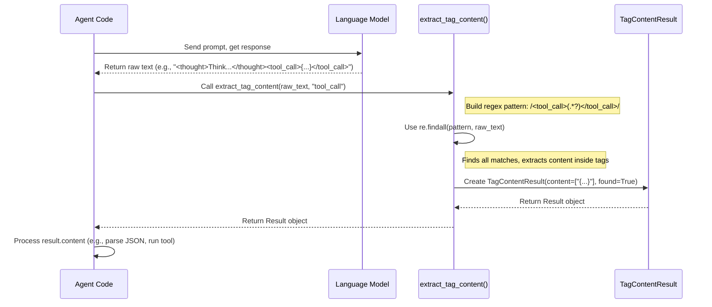

# Chapter 5: Response Extraction - Finding Needles in the Haystack

In [Chapter 4: Tool Definition & Validation](04_tool_definition___validation.md), we made sure our AI agent could safely and correctly use its tools by validating the arguments provided by the Large Language Model (LLM). But where do those arguments, or the decision to use a tool, actually come from?

They come from the LLM's response! However, the LLM doesn't just output the tool arguments. It often provides its reasoning, maybe a plan, the tool call itself, and sometimes even a preliminary answer, all mixed together in one block of text.

## Why Do We Need Response Extraction?

Imagine you ask an agent: "What's the weather in Paris and what's 5 times 12?"

The LLM might respond with something like this (we'll learn how to prompt for this structure later):

```text
Okay, the user wants two things: the weather in Paris and a calculation.
I need to use the weather tool for Paris and the calculator tool for 5 * 12.

<thought>First, I'll get the weather.</thought>
<tool_call>{"name": "get_weather", "arguments": {"location": "Paris"}, "id": 0}</tool_call>

<thought>Next, I'll do the calculation.</thought>
<tool_call>{"name": "calculator", "arguments": {"expression": "5 * 12"}, "id": 1}</tool_call>
```

This is great! The LLM has thought through the problem and decided which tools to use. But for our *agent code* to actually run these tools, we need to specifically pull out the JSON strings inside the `<tool_call>` tags. We also might want to log the thoughts inside the `<thought>` tags.

How can our Python code reliably find and separate these specific pieces of information from the rest of the text? Manually searching the string would be complex and error-prone.

This is the problem **Response Extraction** solves. It provides utilities to easily find and pull out structured information from the LLM's free-form text, especially when that information is wrapped in specific tags.

**Analogy:** Think of the LLM's response as a long article. You need to find all mentions of "Action Items" or specific "Data Points". Response Extraction is like using a digital highlighter or a **Ctrl+F (Find) function** that automatically finds *all* instances of text marked with a specific style (like `<tool_call>`) and gives you a clean list of just that highlighted text.

## Key Concept: Extracting Tagged Content

The most common way agents structure LLM responses is by asking the LLM to wrap different kinds of output in XML-like tags.
*   `<thought>...</thought>`: The agent's reasoning process.
*   `<tool_call>...</tool_call>`: The request to execute a specific tool with arguments.
*   `<response>...</response>`: The final answer to the user.

Our primary tool for this is a helper function designed to find and extract the content within these tags.

## How to Use It: The `extract_tag_content` Function

Our project provides a simple utility function in `src/agentic_patterns/utils/extraction.py` called `extract_tag_content`.

Let's take the example LLM response from before and see how to extract the thoughts and tool calls.

1.  **The LLM's Raw Response:**

    ```python
    llm_output_text = """
    Okay, the user wants two things: the weather in Paris and a calculation.
    I need to use the weather tool for Paris and the calculator tool for 5 * 12.

    <thought>First, I'll get the weather.</thought>
    <tool_call>{"name": "get_weather", "arguments": {"location": "Paris"}, "id": 0}</tool_call>

    <thought>Next, I'll do the calculation.</thought>
    <tool_call>{"name": "calculator", "arguments": {"expression": "5 * 12"}, "id": 1}</tool_call>
    """
    ```
    This is the raw string we might get back from the [LLM Interaction (Completions)](02_llm_interaction__completions_.md).

2.  **Import the Extractor:**

    ```python
    # Import the function and the result type hint
    from agentic_patterns.utils.extraction import extract_tag_content, TagContentResult
    ```

3.  **Extract `<thought>` Tags:**

    ```python
    print("Extracting thoughts...")
    thought_result: TagContentResult = extract_tag_content(llm_output_text, "thought")

    # Check if any thoughts were found
    if thought_result.found:
        print(f"Found {len(thought_result.content)} thought(s):")
        for i, thought in enumerate(thought_result.content):
            print(f" - Thought {i+1}: {thought}")
    else:
        print("No thoughts found.")
    ```
    We call `extract_tag_content` with the text and the tag name (`"thought"`). It returns a `TagContentResult` object. This object tells us if *any* tags were found (`.found`) and provides a list of the content extracted from between the tags (`.content`).

    Output:
    ```
    Extracting thoughts...
    Found 2 thought(s):
     - Thought 1: First, I'll get the weather.
     - Thought 2: Next, I'll do the calculation.
    ```

4.  **Extract `<tool_call>` Tags:**

    ```python
    print("\nExtracting tool calls...")
    tool_call_result: TagContentResult = extract_tag_content(llm_output_text, "tool_call")

    if tool_call_result.found:
        print(f"Found {len(tool_call_result.content)} tool call(s):")
        # The content here is the JSON string needed to run the tool
        for i, tool_call_json in enumerate(tool_call_result.content):
            print(f" - Tool Call {i+1}: {tool_call_json}")

            # In a real agent, you'd parse this JSON and run the tool
            # import json
            # tool_call_dict = json.loads(tool_call_json)
            # print(f"   Parsed name: {tool_call_dict['name']}")
    else:
        print("No tool calls found.")
    ```
    Similarly, we call `extract_tag_content` with the tag name `"tool_call"`.

    Output:
    ```
    Extracting tool calls...
    Found 2 tool call(s):
     - Tool Call 1: {"name": "get_weather", "arguments": {"location": "Paris"}, "id": 0}
     - Tool Call 2: {"name": "calculator", "arguments": {"expression": "5 * 12"}, "id": 1}
    ```

It's that simple! The agent code can now easily get the specific information it needs (like the tool call JSON) to proceed with its task. For instance, the [ReactAgent (Planning Pattern)](06_reactagent__planning_pattern_.md) uses this exact function in its main loop to find thoughts, tool calls, or final responses within the LLM's output.

## How it Works Under the Hood

How does `extract_tag_content` find the text between the tags? It uses a common technique called **regular expressions (regex)**.

**Step-by-Step:**

1.  Your agent code receives the raw text response from the LLM.
2.  Your agent calls `extract_tag_content(raw_text, "some_tag")`.
3.  Inside `extract_tag_content`, a **regular expression pattern** is created based on the tag name. For a tag like `"thought"`, the pattern looks something like `<thought>(.*?)</thought>`.
    *   `<thought>`: Matches the opening tag literally.
    *   `(.*?)`: This is the capture group. `.` matches any character, `*?` means match zero or more characters, but as few as possible (non-greedy), and the parentheses `()` capture whatever is matched.
    *   `</thought>`: Matches the closing tag literally.
    *   The `re.DOTALL` flag used in the code allows `.` to match newline characters as well, so the content can span multiple lines.
4.  The function uses Python's `re.findall()` method with this pattern and the input text. `re.findall()` searches the entire string and returns a list of all the captured substrings (i.e., everything that matched the `(.*?)` part).
5.  The function creates a `TagContentResult` object. The `content` attribute is set to the list returned by `re.findall()`, and the `found` attribute is set to `True` if the list is not empty, `False` otherwise.
6.  This `TagContentResult` object is returned to the agent code.

**Sequence Diagram:**

This diagram shows the process when an agent uses the extractor:



**Code Snippets from `src/agentic_patterns/utils/extraction.py`:**

1.  **`TagContentResult` Dataclass:** This is a simple container to hold the results.

    ```python
    # From: src/agentic_patterns/utils/extraction.py
    from dataclasses import dataclass

    @dataclass
    class TagContentResult:
        """
        A data class to represent the result of extracting tag content.

        Attributes:
            content (List[str]): Content found between the specified tags.
            found (bool): Flag indicating if any content was found.
        """
        content: list[str]
        found: bool
    ```
    It just defines a structure with two fields: `content` (a list of strings) and `found` (a boolean).

2.  **`extract_tag_content` Function:** This is where the regex magic happens.

    ```python
    # From: src/agentic_patterns/utils/extraction.py
    import re

    def extract_tag_content(text: str, tag: str) -> TagContentResult:
        """
        Extracts all content enclosed by specified tags.
        """
        # Build the regex pattern dynamically using the provided tag name
        # Example: if tag is "thought", pattern becomes r"<thought>(.*?)</thought>"
        tag_pattern = rf"<{tag}>(.*?)</{tag}>"

        # Use re.findall to find all non-overlapping matches of the pattern
        # re.DOTALL makes '.' match newlines too.
        # It returns a list of strings, where each string is the captured group (.*?)
        matched_contents = re.findall(tag_pattern, text, re.DOTALL)

        # Clean up whitespace from the start/end of each extracted string
        cleaned_content = [content.strip() for content in matched_contents]

        # Return the dataclass instance with the result
        return TagContentResult(
            content=cleaned_content,
            found=bool(cleaned_content), # True if list is not empty
        )
    ```
    This function takes the text and the tag name, constructs the regex pattern, uses `re.findall` to get all the matching contents inside the tags, cleans them up a bit (`strip()`), and returns the `TagContentResult`.

This simple utility is incredibly helpful for parsing the structured chaos that can sometimes come out of an LLM, allowing our agent code to reliably find the pieces it needs to act upon.

## Conclusion

In this chapter, we learned about **Response Extraction** – the process of pulling specific, structured information out of an LLM's potentially messy text response.

*   **Why:** LLMs often mix reasoning, tool calls, and final answers. We need a way to isolate the parts our agent code needs (like the exact tool call JSON).
*   **How:** By instructing the LLM to wrap specific outputs in XML-like tags (e.g., `<tool_call>`) and using a utility function (`extract_tag_content`) that leverages regular expressions to find and extract the content within those tags.
*   **Result:** We get a clean list of the specific pieces of information we need, making our agent logic simpler and more robust.

We now have a solid foundation:
1.  Defining [Tools](01_tool.md).
2.  [Talking to the LLM](02_llm_interaction__completions_.md).
3.  Remembering the [Conversation History](03_chat_history.md).
4.  [Validating Tool Use](04_tool_definition___validation.md).
5.  Extracting specific info from the [LLM Response](05_response_extraction.md).

With these building blocks in place, we're ready to assemble them into our first real agent pattern! How does an agent use tools and observations in a cycle to solve problems? Let's explore the powerful ReAct (Reason + Act) pattern.

**Next:** [Chapter 6: ReactAgent (Planning Pattern)](06_reactagent__planning_pattern_.md)

---

Generated by [AI Codebase Knowledge Builder](https://github.com/The-Pocket/Tutorial-Codebase-Knowledge)