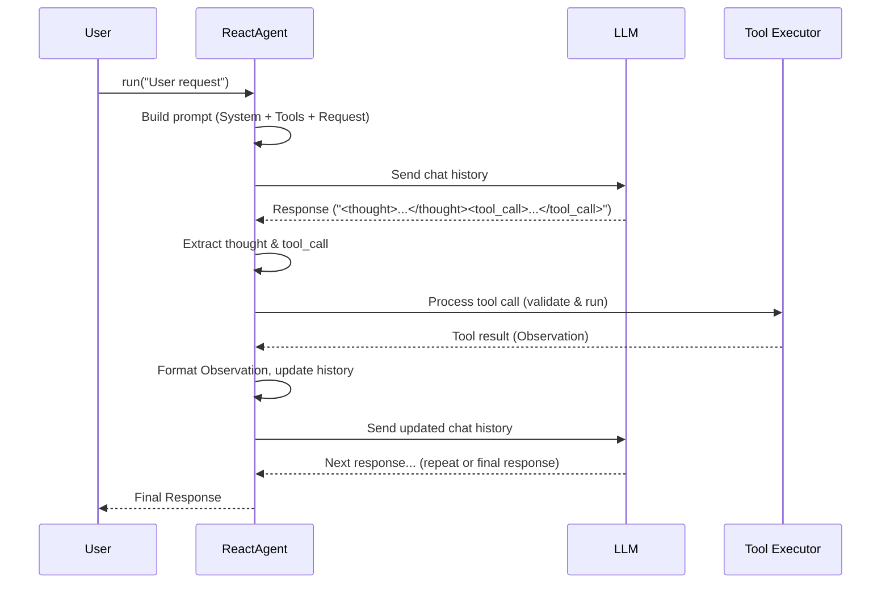

# Chapter 6: ReactAgent (Planning Pattern) - Thinking Before Acting

In the previous chapter, [Response Extraction](05_response_extraction.md), we learned how to pull specific pieces of information, like tool calls, out of the LLM's response. We now have all the ingredients we need: defining [Tools](01_tool.md), [talking to the LLM](02_llm_interaction__completions_.md), managing [Chat History](03_chat_history.md), [validating tool use](04_tool_definition___validation.md), and extracting structured data.

Now, how do we combine these to build an agent that can actually *solve problems* that might require multiple steps or using different tools?

## Why Do We Need a Planning Pattern?

Imagine you ask an AI agent: "What's the capital of France, and what's the weather there right now?"

This isn't a single question; it requires a sequence of actions:
1.  Figure out the capital of France (maybe using a search tool or its internal knowledge).
2.  Once it knows the capital is Paris, figure out the current weather in Paris (using a weather tool).
3.  Combine these two pieces of information into a final answer.

A simple back-and-forth chat might struggle with this. The agent needs a way to *plan* and *execute* a series of steps, potentially using tools along the way. This is where the **ReAct** pattern comes in.

**ReAct stands for Reason + Act.** It's a simple but powerful pattern that guides an AI agent to think through a problem, decide on an action (often using a tool), observe the result, and repeat until the task is complete.

**Analogy:** Think of a detective solving a case:
1.  **Think (Reason):** "The clue mentions a 'Mr. Big'. I should find out who that is." (Plan the next step)
2.  **Act:** Interview a witness who might know Mr. Big (Use a "tool" - interviewing).
3.  **Observe:** Analyze the witness's testimony. "Okay, the witness says Mr. Big hangs out at the old docks."
4.  **Think (Reason):** "My next step should be to investigate the old docks." (Plan based on observation)
5.  **Act:** Go to the docks (Another action/tool).
6.  ...and so on, until the case is solved.

The ReAct pattern gives our agent this structured way of thinking and acting.

## What Exactly is the ReAct Loop?

The core idea is a cycle:

1.  **Thought:** The agent analyzes the current situation (the user's request and any previous observations) and thinks about what needs to be done next. This is usually internal reasoning.
2.  **Action:** Based on the thought, the agent decides to perform an action. This is often calling a specific [Tool](01_tool.md) with the necessary arguments.
3.  **Observation:** The agent receives the result of its action (e.g., the output from the tool). This result is an observation about the world.
4.  **Repeat:** The agent takes this new observation, goes back to the **Thought** step to figure out what to do next, and continues the cycle until it believes the original request is fully answered. At that point, instead of another Action, it generates a final **Response**.

This loop allows the agent to:
*   Break down complex tasks into smaller steps.
*   Use tools to gather information or perform actions.
*   Adapt its plan based on the results it observes.

## How to Use the `ReactAgent`

Our project provides a ready-to-use implementation of this pattern called `ReactAgent` in `src/agentic_patterns/planning_pattern/react_agent.py`. Let's see how to use it.

**1. Define Your Tools:**
First, we need some tools the agent can use. Let's reuse our `add_numbers` tool from [Chapter 1](01_tool.md) and create a simple "weather" tool.

```python
# src/agentic_patterns/tool_pattern/tool.py provides the @tool decorator
from agentic_patterns.tool_pattern.tool import tool
import json

@tool
def add_numbers(a: int, b: int) -> int:
    """Adds two integers together."""
    print(f"--> Tool 'add_numbers' called with a={a}, b={b}")
    return a + b

@tool
def get_current_weather(location: str, unit: str = "celsius") -> str:
    """Gets the current weather for a specified location."""
    print(f"--> Tool 'get_current_weather' called for {location}")
    # In a real app, this would call a weather API
    # We'll just return a fake result for demonstration
    return f"The weather in {location} is 22 degrees {unit}"

# List of tools our agent can use
available_tools = [add_numbers, get_current_weather]
```
This code defines two functions and uses the `@tool` decorator to make them available as Tools for our agent.

**2. Initialize the `ReactAgent`:**
Now, create an instance of the `ReactAgent`, telling it which tools it has access to.

```python
# Import the agent class
from agentic_patterns.planning_pattern.react_agent import ReactAgent

# Create the agent, passing the list of tools
react_agent = ReactAgent(tools=available_tools, model="llama3-8b-8192") # Using a faster model for demo
print("ReactAgent initialized with tools:", [tool.name for tool in react_agent.tools])
```
This creates our agent and equips it with the `add_numbers` and `get_current_weather` tools.

**3. Run the Agent:**
Use the agent's `.run()` method to give it a task. Let's ask our multi-step question.

```python
# Import colorama for highlighted output (optional, but helps readability)
from colorama import init, Fore
init(autoreset=True) # Initialize colorama

user_request = "What is the weather in London and also tell me what 15 + 3 is?"
print(f"\nUser Request: {user_request}\n")

# Run the agent with the request
final_response = react_agent.run(user_msg=user_request)

print(Fore.CYAN + f"\nFinal Response:\n{final_response}")
```
This starts the ReAct loop. The agent will interact with the LLM, use tools, and cycle through Thoughts, Actions, and Observations until it has the final answer.

**Example Output (Simplified & Annotated):**

```
User Request: What is the weather in London and also tell me what 15 + 3 is?

(Agent talks to LLM internally, LLM generates the following...)
MAGENTA
Thought: The user wants two pieces of information: the weather in London and the result of 15 + 3. I should first get the weather using the get_current_weather tool, then use the add_numbers tool.

GREEN
Using Tool: get_current_weather
--> Tool 'get_current_weather' called for London
GREEN
Tool call dict:
{'name': 'get_current_weather', 'arguments': {'location': 'London'}, 'id': 0}
GREEN
Tool result:
The weather in London is 22 degrees celsius
BLUE
Observations: {0: 'The weather in London is 22 degrees celsius'}

(Agent sends observation back to LLM, LLM generates...)
MAGENTA
Thought: I have the weather for London. Now I need to calculate 15 + 3 using the add_numbers tool.

GREEN
Using Tool: add_numbers
--> Tool 'add_numbers' called with a=15, b=3
GREEN
Tool call dict:
{'name': 'add_numbers', 'arguments': {'a': 15, 'b': 3}, 'id': 1}
GREEN
Tool result:
18
BLUE
Observations: {1: 18}

(Agent sends observation back to LLM, LLM generates...)
CYAN
Final Response:
The weather in London is 22 degrees celsius and 15 + 3 is 18.
```
Look at the output! The agent successfully:
1.  **Thought:** Broke down the request.
2.  **Acted:** Called the `get_current_weather` tool for "London".
3.  **Observed:** Got the weather result.
4.  **Thought:** Realized it still needed to calculate 15 + 3.
5.  **Acted:** Called the `add_numbers` tool with `a=15, b=3`.
6.  **Observed:** Got the calculation result (18).
7.  **Responded:** Combined both results into a final answer.

## How it Works Under the Hood

Let's trace the steps inside the `ReactAgent`'s `run` method.

**Step-by-Step Walkthrough:**

1.  **Initialization:** When you call `react_agent.run(user_msg)`, it starts by setting up the conversation.
2.  **System Prompt:** It creates a special system prompt for the LLM. This prompt explains the ReAct loop (Thought, Action, Observation) and includes the signatures of all available tools (using `add_tool_signatures`). It tells the LLM how to format its response (e.g., use `<thought>`, `<tool_call>`, `<response>` tags).
3.  **Chat History:** It initializes the [Chat History](03_chat_history.md) with the system prompt and the user's first message (tagged as `<question>`).
4.  **LLM Call #1:** It sends the initial history to the LLM using `completions_create` from [LLM Interaction (Completions)](02_llm_interaction__completions_.md).
5.  **Extraction:** The agent uses `extract_tag_content` (from [Response Extraction](05_response_extraction.md)) to parse the LLM's response, looking for `<thought>`, `<tool_call>`, or `<response>` tags.
6.  **Action or Response?**
    *   If `<response>` is found: The agent assumes the task is done and returns the content.
    *   If `<tool_call>` is found:
        *   The agent logs the `<thought>` (if any).
        *   It calls `process_tool_calls` with the extracted tool call content (the JSON strings).
        *   `process_tool_calls`:
            *   Parses the JSON string for each tool call.
            *   Finds the corresponding [Tool](01_tool.md) object.
            *   Uses `validate_arguments` (from [Tool Definition & Validation](04_tool_definition___validation.md)) to check and convert arguments.
            *   Runs the tool's function (`tool.run(**validated_arguments)`).
            *   Collects the results (observations) keyed by the tool call ID.
        *   The agent formats the observations (e.g., `{0: 'Weather result', 1: 'Calculation result'}`).
        *   It updates the [Chat History](03_chat_history.md) by adding the LLM's previous output (thought/tool\_call) as an `assistant` message and the `observations` as a `user` message (simulating the environment providing feedback).
        *   It loops back to Step 4 (LLM Call) with the updated history.
    *   If only `<thought>` is found (no action/response): The agent updates the history and loops back to Step 4.
7.  **Max Rounds:** The loop continues until a `<response>` is found or a maximum number of rounds (`max_rounds`) is reached (to prevent infinite loops).

**Sequence Diagram:**

This diagram shows one cycle of the ReAct loop involving a tool call:



**Code Snippets from `src/agentic_patterns/planning_pattern/react_agent.py`:**

1.  **The System Prompt Structure:** The `REACT_SYSTEM_PROMPT` string defines the rules for the LLM.

    ```python
    # From: src/agentic_patterns/planning_pattern/react_agent.py
    REACT_SYSTEM_PROMPT = """
    You operate by running a loop with the following steps: Thought, Action, Observation.
    # ... (instructions on using tools) ...
    For each function call return a json object ... within <tool_call></tool_call> XML tags...
    <tools>
    %s # <-- Tool signatures get inserted here
    </tools>
    Example session:
    <question>...</question>
    <thought>...</thought>
    <tool_call>...</tool_call>
    You will be called again with this:
    <observation>...</observation>
    You then output:
    <response>...</response>
    # ... (additional constraints) ...
    """
    ```
    This template tells the LLM exactly how to structure its reasoning and actions. The `%s` is replaced by the actual tool signatures.

2.  **The Main Loop in `run`:** (Simplified)

    ```python
    # From: src/agentic_patterns/planning_pattern/react_agent.py (inside ReactAgent.run)
    def run(self, user_msg: str, max_rounds: int = 10) -> str:
        # ... (Setup: build initial prompt with tool signatures, init chat_history) ...

        chat_history = ChatHistory(
            [ # Initial history
                build_prompt_structure(prompt=self.system_prompt, role="system"),
                build_prompt_structure(prompt=user_msg, role="user", tag="question"),
            ]
        )

        # Run the ReAct loop
        for _ in range(max_rounds):
            # 1. Call LLM
            completion = completions_create(self.client, chat_history, self.model)

            # 2. Extract response, thought, tool calls
            response = extract_tag_content(str(completion), "response")
            if response.found:
                return response.content[0] # Found final answer!

            thought = extract_tag_content(str(completion), "thought")
            tool_calls = extract_tag_content(str(completion), "tool_call")

            # Add LLM's reasoning/action to history
            update_chat_history(chat_history, completion, "assistant")

            if thought.found: print(Fore.MAGENTA + f"\nThought: {thought.content[0]}")

            # 3. Process Actions (if any)
            if tool_calls.found:
                # Process tools and get observations
                observations = self.process_tool_calls(tool_calls.content)
                print(Fore.BLUE + f"\nObservations: {observations}")
                # Add observations to history for next loop
                update_chat_history(chat_history, f"{observations}", "user") # Note: Role 'user' used for observations
            # Loop continues...

        # Fallback if no response after max_rounds
        return completions_create(self.client, chat_history, self.model)

    ```
    This shows the core loop: call LLM, extract parts, check for final response, process tool calls, update history, repeat.

3.  **Processing Tool Calls (`process_tool_calls`):**

    ```python
    # From: src/agentic_patterns/planning_pattern/react_agent.py
    def process_tool_calls(self, tool_calls_content: list) -> dict:
        observations = {}
        for tool_call_str in tool_calls_content:
            tool_call = json.loads(tool_call_str) # Parse JSON from LLM
            tool_name = tool_call["name"]
            tool = self.tools_dict[tool_name] # Find the Tool object

            print(Fore.GREEN + f"\nUsing Tool: {tool_name}")

            # *** Validate arguments before running! ***
            validated_tool_call = validate_arguments(
                tool_call, json.loads(tool.fn_signature)
            )
            print(Fore.GREEN + f"\nTool call dict: \n{validated_tool_call}")

            # *** Run the actual tool function! ***
            result = tool.run(**validated_tool_call["arguments"])
            print(Fore.GREEN + f"\nTool result: \n{result}")

            # Store result by ID
            observations[validated_tool_call["id"]] = result

        return observations
    ```
    This method iterates through the requested tool calls, uses `validate_arguments` for safety, runs the tool via `tool.run()`, and collects the results.

## Conclusion

In this chapter, we explored the **ReactAgent (Planning Pattern)**, a powerful way to build agents that can reason and act to solve multi-step problems.

*   **What it is:** An agent following a **Thought -> Action -> Observation** loop.
*   **Why it's useful:** Allows agents to break down tasks, use tools systematically, and adapt based on results.
*   **How it works:** Uses a specific system prompt to guide the LLM, extracts thoughts and tool calls from the response, executes tools safely, and feeds observations back into the loop until a final answer is generated.
*   **Key Components Used:** Leverages [Tools](01_tool.md), [LLM Interaction](02_llm_interaction__completions_.md), [Chat History](03_chat_history.md), [Tool Validation](04_tool_definition___validation.md), and [Response Extraction](05_response_extraction.md).

The ReAct pattern is a cornerstone of many modern agent systems. But what if the agent makes a mistake or could do better? How can it look back on its own work and improve? That's where the concept of Reflection comes in.

**Next:** [Chapter 7: ReflectionAgent (Reflection Pattern)](07_reflectionagent__reflection_pattern_.md)

---

Generated by [AI Codebase Knowledge Builder](https://github.com/The-Pocket/Tutorial-Codebase-Knowledge)