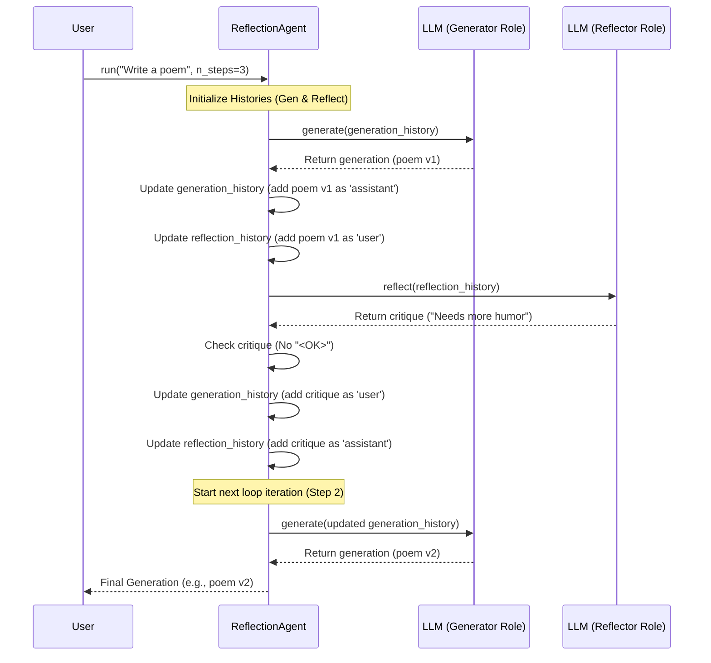

# Chapter 7: ReflectionAgent (Reflection Pattern) - Improving Through Self-Critique

In [Chapter 6: ReactAgent (Planning Pattern)](06_reactagent__planning_pattern_.md), we saw how agents can use a **Thought -> Action -> Observation** loop to solve problems step-by-step. The `ReactAgent` is great for planning and using tools. But what if the agent's first attempt at a task isn't quite good enough? How can it *improve* its own work?

Imagine writing an essay or a piece of code. Your first draft might have mistakes, awkward phrasing, or could simply be better. You typically *review* your draft, identify areas for improvement, and then *revise* it. This process of self-critique and refinement is exactly what the **Reflection Pattern** brings to AI agents.

## Why Do We Need Reflection?

LLMs are powerful, but they don't always generate the perfect output on the first try, especially for complex creative or analytical tasks.

**Use Case:** Let's say you ask an agent to write a short, funny poem about a programming bug.
*   **First attempt:** The agent might write a poem that's technically about a bug but isn't very funny or doesn't rhyme well.
*   **Problem:** The user wants a *better* poem. How can the agent achieve this without the user having to provide extremely detailed feedback?

The Reflection Pattern allows the agent to:
1.  Generate an initial draft.
2.  Critique its own draft based on the original request (or general quality criteria).
3.  Revise the draft based on its own critique.
4.  Repeat this cycle to iteratively improve the output.

**Analogy:** Think of it like an internal **editor**.
*   The **Writer** (Generator mode) creates the first draft.
*   The **Editor** (Reflector mode) reads the draft and leaves comments: "This part is unclear," "Could be funnier," "Fix the rhyme here."
*   The **Writer** takes the comments and produces a revised draft.
This can happen several times, leading to a much more polished final piece.

## What Exactly is the Reflection Pattern?

The Reflection Pattern involves an agent using an LLM in (at least) two different modes, often cyclically:

1.  **Generation Mode:** The LLM receives the user's request (and potentially previous critiques) and generates an output (e.g., the poem).
2.  **Reflection Mode:** The LLM receives the generated output and is asked to *critique* it. It identifies flaws, suggests improvements, or checks if the output meets the requirements.
3.  **Revision (Back to Generation Mode):** The LLM receives the original request *and* the critique from the reflection step, and is asked to generate a *revised* output.

This cycle can repeat multiple times (`n_steps`). The agent stops when the critique suggests no further changes are needed (often indicated by a special signal like `<OK>`) or when a maximum number of steps is reached.

## How to Use the `ReflectionAgent`

Our project provides `ReflectionAgent` in `src/agentic_patterns/reflection_pattern/reflection_agent.py` to implement this pattern.

**1. Initialize the `ReflectionAgent`:**
You just need to create an instance of the class. You can optionally specify the LLM model.

```python
# Import the agent
from agentic_patterns.reflection_pattern.reflection_agent import ReflectionAgent

# Create an instance
# You can specify a model, e.g., model="llama3-8b-8192" for faster tests
reflection_agent = ReflectionAgent()

print("ReflectionAgent initialized.")
# Output: ReflectionAgent initialized.
```
This sets up the agent, ready to generate and reflect.

**2. Run the Agent:**
Use the agent's `.run()` method. You provide the initial user request and can control how many refinement steps (`n_steps`) it takes. Setting `verbose=1` helps see the internal steps.

```python
# Import colorama for highlighted output (optional)
from colorama import init, Fore
init(autoreset=True) # Initialize colorama

# The user's request
user_request = "Write a short, funny, 2-line rhyming poem about a sleepy cat."

print(f"User Request: {user_request}\n")

# Run the agent for up to 3 generate-reflect cycles
final_poem = reflection_agent.run(
    user_msg=user_request,
    n_steps=3, # Try to improve up to 3 times
    verbose=1  # Show the generation and reflection steps
)

print(Fore.CYAN + f"\nFinal Poem:\n{final_poem}")
```
This tells the agent to start with the user's request, generate a poem, reflect on it, revise it based on the reflection, and repeat this up to two more times if the reflection step keeps finding ways to improve.

**Example Output (Simplified & Annotated):**

```
User Request: Write a short, funny, 2-line rhyming poem about a sleepy cat.

==================================================
STEP 1/3
==================================================

BLUE

GENERATION

A fluffy cat, so very deep,
Just closed his eyes and fell asleep.

GREEN

REFLECTION

The poem is okay, but not particularly funny. The rhyme 'deep/asleep' is a bit basic. Could inject more humor related to sleepiness.

==================================================
STEP 2/3
==================================================

BLUE

GENERATION

The cat yawned wide, a mighty sight,
Then snored all day and through the night.

GREEN

REFLECTION

Better humor with the yawn and snoring. Rhyme 'sight/night' works. It fulfills the request reasonably well. Maybe slightly funnier? It's pretty good though. <OK>

RED

Stop Sequence found. Stopping the reflection loop ...


CYAN
Final Poem:
The cat yawned wide, a mighty sight,
Then snored all day and through the night.
```

In this example:
1.  **Step 1 Generation:** The agent wrote a simple poem.
2.  **Step 1 Reflection:** The agent (in editor mode) critiqued it as not funny enough.
3.  **Step 2 Generation:** The agent (writer mode) revised the poem using the critique, making it funnier.
4.  **Step 2 Reflection:** The agent (editor mode) found the revision much better and included `<OK>`, signaling no major changes needed.
5.  The loop stopped early because of `<OK>`. The final output is the improved version from Step 2.

## How it Works Under the Hood

Let's peek inside the `ReflectionAgent`'s `.run()` method.

**Step-by-Step Walkthrough:**

1.  **Initialization:** When `run()` is called, it sets up two separate [Chat History](03_chat_history.md) trackers: `generation_history` and `reflection_history`. It uses `FixedFirstChatHistory` to limit the history size (e.g., to 3 messages) to prevent the context from getting too long and slow during the iterative process, while always keeping the initial system prompt.
2.  **System Prompts:** It defines two different system prompts:
    *   `generation_system_prompt`: Instructs the LLM to generate the best content based on the user request and *any provided critique*.
    *   `reflection_system_prompt`: Instructs the LLM to *critique* the provided content and suggest improvements, or output `<OK>` if it's good.
3.  **History Setup:**
    *   `generation_history` starts with the generation system prompt and the initial user message.
    *   `reflection_history` starts with the reflection system prompt.
4.  **Generate-Reflect Loop:** The agent enters a loop that runs up to `n_steps`.
    *   **a. Generate:** Calls the `generate()` method, which uses `_request_completion` to send `generation_history` to the LLM. The LLM acts as the "writer". The output is the generated content (e.g., the poem).
    *   **b. Update Histories (Post-Generation):**
        *   Adds the generated content to `generation_history` with the `assistant` role.
        *   Adds the generated content to `reflection_history` with the `user` role (as input for the critique).
    *   **c. Reflect:** Calls the `reflect()` method, which uses `_request_completion` to send `reflection_history` to the LLM. The LLM acts as the "editor". The output is the critique.
    *   **d. Check for Stop Signal:** Checks if the critique contains `<OK>`. If yes, the loop breaks, as the agent considers the last generation acceptable.
    *   **e. Update Histories (Post-Reflection):**
        *   Adds the critique to `generation_history` with the `user` role (input for the next revision).
        *   Adds the critique to `reflection_history` with the `assistant` role.
    *   **f. Repeat:** The loop continues to the next step.
5.  **Return Final Generation:** After the loop finishes (either by `<OK>` or reaching `n_steps`), the agent returns the *last generated content* (stored in the `generation` variable).

**Sequence Diagram (One Generate-Reflect Cycle):**



**Code Snippets:**

1.  **Core Logic in `run` (Simplified):**

    ```python
    # From: src/agentic_patterns/reflection_pattern/reflection_agent.py (simplified)
    def run(self, user_msg: str, ..., n_steps: int = 3, verbose: int = 0) -> str:
        # ... Setup generation_system_prompt & reflection_system_prompt ...

        # Use FixedFirstChatHistory to manage context length
        generation_history = FixedFirstChatHistory(
            [build_prompt_structure(prompt=generation_system_prompt, role="system"),
             build_prompt_structure(prompt=user_msg, role="user")],
            total_length=3,
        )
        reflection_history = FixedFirstChatHistory(
            [build_prompt_structure(prompt=reflection_system_prompt, role="system")],
            total_length=3,
        )

        generation = "" # To store the latest generation

        for step in range(n_steps):
            if verbose > 0: fancy_step_tracker(step, n_steps) # Print step number

            # --- Generate ---
            generation = self.generate(generation_history, verbose=verbose)
            update_chat_history(generation_history, generation, "assistant")
            update_chat_history(reflection_history, generation, "user") # Input for critique

            # --- Reflect ---
            critique = self.reflect(reflection_history, verbose=verbose)

            if "<OK>" in critique: # Check stop condition
                print(Fore.RED, "\n\nStop Sequence found...")
                break

            # Add critique as input for next generation step
            update_chat_history(generation_history, critique, "user")
            update_chat_history(reflection_history, critique, "assistant")

        return generation # Return the last successful generation
    ```
    This shows the main loop, calling `generate`, `reflect`, updating histories, and checking for the `<OK>` signal.

2.  **Generate and Reflect Methods:** These methods primarily format the request and call the underlying LLM interaction function.

    ```python
    # From: src/agentic_patterns/reflection_pattern/reflection_agent.py (simplified)
    class ReflectionAgent:
        # ... (__init__ sets up self.client, self.model) ...

        def _request_completion(self, history: list, verbose: int = 0, ...):
            # Calls the core LLM interaction function from Chapter 2
            output = completions_create(self.client, history, self.model)
            # ... (optional logging) ...
            return output

        def generate(self, generation_history: list, verbose: int = 0) -> str:
            # Simply uses the generation history to get the next generation
            return self._request_completion(
                generation_history, verbose, log_title="GENERATION", ...
            )

        def reflect(self, reflection_history: list, verbose: int = 0) -> str:
            # Uses the reflection history (containing the last generation) to get critique
            return self._request_completion(
                reflection_history, verbose, log_title="REFLECTION", ...
            )
    ```
    These methods wrap the call to `completions_create` ([LLM Interaction (Completions)](02_llm_interaction__completions_.md)), passing the appropriate history (either for generation or reflection).

## Conclusion

In this chapter, we learned about the **Reflection Pattern**, a technique for enabling AI agents to improve their own work through self-critique and revision.

*   **What it is:** An agent that alternates between **Generating** output and **Reflecting** (critiquing) on that output to guide revisions.
*   **Why it's useful:** Leads to higher-quality results for tasks where the first attempt might not be perfect, mimicking a human writing and editing process.
*   **How it works:** Uses an LLM in two modes (generator and reflector/critic) with specific system prompts, cycling through generate-reflect steps until the critique indicates satisfaction (`<OK>`) or a step limit is reached.
*   **Key Components Used:** Leverages [LLM Interaction (Completions)](02_llm_interaction__completions_.md) and [Chat History](03_chat_history.md) (specifically `FixedFirstChatHistory` to manage context).

The Reflection pattern adds a layer of refinement to our agents. We've now seen agents that can plan (`ReactAgent`) and agents that can refine (`ReflectionAgent`). What about agents that are primarily focused on just using tools based on direct user requests, without complex planning or reflection loops?

**Next:** [Chapter 8: ToolAgent](08_toolagent.md)

---

Generated by [AI Codebase Knowledge Builder](https://github.com/The-Pocket/Tutorial-Codebase-Knowledge)