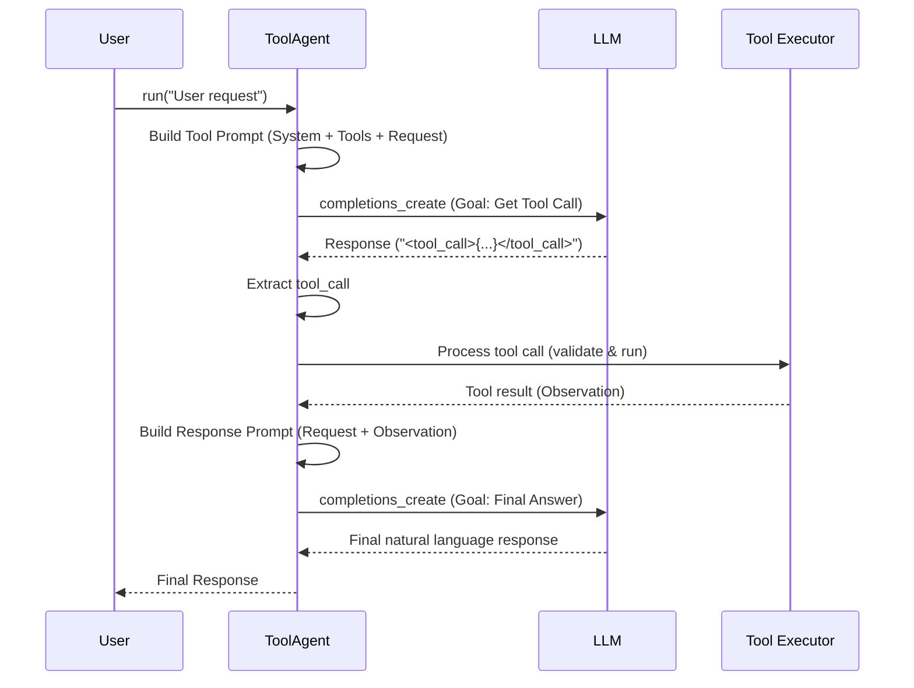

# Chapter 8: ToolAgent - The Specialist Dispatcher

In [Chapter 7: ReflectionAgent (Reflection Pattern)](07_reflectionagent__reflection_pattern_.md), we saw how an agent could refine its own work through self-critique. Before that, in [Chapter 6: ReactAgent (Planning Pattern)](06_reactagent__planning_pattern_.md), we built an agent that could plan and execute multiple steps using tools. Both patterns are powerful, but sometimes you need something simpler.

What if the user's request is straightforward and directly maps to one of your available tools? For example:
*   "What is 25 times 4?"
*   "Get the current weather in Paris."

For these kinds of tasks, the complex reasoning loop of `ReactAgent` or the self-correction cycle of `ReflectionAgent` might be unnecessary. We need a simpler agent that just focuses on one job: figuring out the right tool, using it, and reporting back.

This is exactly what the **ToolAgent** pattern provides. It's like a specialized dispatcher.

## Why Do We Need a Simple ToolAgent?

Imagine you run a service center. You have different technicians, each specializing in one thing: plumbing, electricity, HVAC, etc.
*   A **`ReactAgent`** is like a general contractor who might need to call the plumber, then the electrician, coordinating multiple steps to fix a complex problem.
*   A **`ReflectionAgent`** is like a technician who does the job, then reviews their own work to ensure it's perfect, possibly redoing parts.
*   A **`ToolAgent`** is like the **dispatcher at the front desk**. A customer calls and says, "My faucet is leaking." The dispatcher knows this needs the plumbing tool (the plumber), collects the necessary info (address), calls the plumber, gets the result ("Fixed!"), and reports back to the customer. It's a direct request-tool-response flow.

The `ToolAgent` is optimized for these direct tool requests. It's simpler, often faster, and more predictable for tasks that don't require elaborate planning or refinement.

**Use Case:** You want an agent that can answer simple calculation or information retrieval questions using specific tools, without extra conversational steps.
*   User: "Add 1024 and 512."
*   `ToolAgent` should:
    1.  Identify the `add_numbers` tool is needed.
    2.  Extract the arguments `a=1024` and `b=512`.
    3.  Call the `add_numbers` tool.
    4.  Get the result `1536`.
    5.  Formulate a final response like "1024 plus 512 is 1536."

## How to Use the `ToolAgent`

Using the `ToolAgent` is straightforward, similar to initializing other agents, but its internal process is simpler.

**1. Define Your Tools:**
First, we need the tools the agent can dispatch. Let's use our familiar `add_numbers` tool.

```python
# src/agentic_patterns/tool_pattern/tool.py provides the @tool decorator
from agentic_patterns.tool_pattern.tool import tool
import json

@tool
def add_numbers(a: int, b: int) -> int:
    """Adds two integers together."""
    print(f"--> Tool 'add_numbers' called with a={a}, b={b}")
    return a + b

# List of tools our agent can use
available_tools = [add_numbers]
```
Here, we define a simple `add_numbers` function and make it a `Tool` using the `@tool` decorator from [Chapter 1: Tool](01_tool.md).

**2. Initialize the `ToolAgent`:**
Create an instance of `ToolAgent` from `src/agentic_patterns/tool_pattern/tool_agent.py`, giving it the list of tools.

```python
# Import the agent class
from agentic_patterns.tool_pattern.tool_agent import ToolAgent

# Create the agent, passing the list of tools
tool_agent = ToolAgent(tools=available_tools, model="llama3-8b-8192") # Using a faster model for demo

print("ToolAgent initialized with tools:", [tool.name for tool in tool_agent.tools])
# Expected Output: ToolAgent initialized with tools: ['add_numbers']
```
This sets up our specialized dispatcher agent, ready to handle requests related to adding numbers.

**3. Run the Agent:**
Use the agent's `.run()` method with the user's request.

```python
# Import colorama for highlighted output (optional)
from colorama import init, Fore
init(autoreset=True) # Initialize colorama

user_request = "What is 1024 + 512?"
print(f"\nUser Request: {user_request}\n")

# Run the agent with the request
final_response = tool_agent.run(user_msg=user_request)

print(Fore.CYAN + f"\nFinal Response:\n{final_response}")
```
This sends the request to the `ToolAgent`.

**Example Output (Simplified & Annotated):**

```
User Request: What is 1024 + 512?

(Agent sends a special prompt + user request to LLM to choose a tool...)

(LLM responds indicating 'add_numbers' should be called with a=1024, b=512)

GREEN
Using Tool: add_numbers
GREEN
Tool call dict:
{'name': 'add_numbers', 'arguments': {'a': 1024, 'b': 512}, 'id': 0}
--> Tool 'add_numbers' called with a=1024, b=512
GREEN
Tool result:
1536

(Agent takes the tool result (Observation: {0: 1536}) and asks LLM to formulate a final response based on the original request and the observation...)

CYAN
Final Response:
1024 + 512 is 1536.
```
Notice the difference from `ReactAgent`:
*   There's no explicit `<thought>` step shown (though the LLM thinks internally).
*   The agent directly calls the tool based on the LLM's first decision.
*   After getting the tool result (observation), it *immediately* generates the final response, rather than potentially looping back for more thoughts or actions.

## How it Works Under the Hood

The `ToolAgent` follows a more direct path than the `ReactAgent`.

**Step-by-Step Walkthrough:**

1.  **Receive Request:** The `tool_agent.run(user_msg)` method is called.
2.  **Prepare Tool-Calling Prompt:** The agent constructs a prompt for the LLM. This includes:
    *   A system message (`TOOL_SYSTEM_PROMPT`) explaining that the LLM's job is to identify and format function calls based on the user query and the provided tool signatures. It tells the LLM to output the call within `<tool_call>` tags.
    *   The signatures of all available [Tools](01_tool.md).
    *   The user's request.
3.  **LLM Call #1 (Tool Selection):** The agent sends this prompt to the LLM using `completions_create` ([LLM Interaction (Completions)](02_llm_interaction__completions_.md)). The goal is solely to get the LLM to decide *which* tool to use and *what arguments* to provide.
4.  **Extract Tool Call:** The agent uses `extract_tag_content` ([Response Extraction](05_response_extraction.md)) to pull the `<tool_call>` content (the JSON string) from the LLM's response.
5.  **Process Tool Call (If any):**
    *   If a `<tool_call>` is found, the agent calls `process_tool_calls`.
    *   `process_tool_calls`:
        *   Parses the JSON string.
        *   Finds the correct `Tool` object.
        *   Uses `validate_arguments` ([Tool Definition & Validation](04_tool_definition___validation.md)) to ensure arguments are correct.
        *   Executes the tool function (`tool.run()`).
        *   Collects the result (observation).
6.  **Prepare Final Response Prompt:** The agent sets up a *new*, simpler [Chat History](03_chat_history.md). This history *only* contains:
    *   The original user request.
    *   (If a tool was called) An observation message containing the result from the tool (e.g., "Observation: {0: 1536}").
    *   *It does NOT include the complex tool-calling system prompt or the LLM's tool_call output.*
7.  **LLM Call #2 (Final Answer):** The agent sends this simple chat history to the LLM. The goal now is just to generate a natural language response based on the original request and the tool's result.
8.  **Return Response:** The LLM's response from the second call is returned as the final answer.

**Sequence Diagram:**


This flow is simpler: one LLM call to decide the tool, execute the tool, one LLM call to phrase the answer.

## Code Implementation Details

Let's look at key parts of `src/agentic_patterns/tool_pattern/tool_agent.py`.

**1. The System Prompt (`TOOL_SYSTEM_PROMPT`):**

```python
# From: src/agentic_patterns/tool_pattern/tool_agent.py
TOOL_SYSTEM_PROMPT = """
You are a function calling AI model. You are provided with function signatures within <tools></tools> XML tags.
You may call one or more functions to assist with the user query. ...
For each function call return a json object ... within <tool_call></tool_call> XML tags...

<tools>
%s # <-- Tool signatures get inserted here
</tools>
"""
```
This prompt focuses the LLM purely on selecting and formatting tool calls based on the available tools and the user query. It doesn't ask for thoughts or complex reasoning steps.

**2. The `run` Method (Simplified):**

```python
# From: src/agentic_patterns/tool_pattern/tool_agent.py (inside ToolAgent.run)
def run(self, user_msg: str) -> str:
    # Prepare prompt for LLM to choose a tool
    tool_system_prompt = TOOL_SYSTEM_PROMPT % self.add_tool_signatures()
    tool_chat_history = ChatHistory([
        build_prompt_structure(prompt=tool_system_prompt, role="system"),
        build_prompt_structure(prompt=user_msg, role="user"),
    ])

    # LLM Call #1: Get the tool call decision
    tool_call_response = completions_create(self.client, tool_chat_history, self.model)
    tool_calls = extract_tag_content(str(tool_call_response), "tool_call")

    # Prepare history for the final response LLM call
    # Start with just the user message
    agent_chat_history = ChatHistory([build_prompt_structure(prompt=user_msg, role="user")])

    # Process tool call, if LLM decided to use one
    if tool_calls.found:
        # Validate and run the tool(s)
        observations = self.process_tool_calls(tool_calls.content)
        # Add observation to the *final response* history
        update_chat_history(agent_chat_history, f"Observation: {observations}", "user") # Note: using 'user' role for observation

    # LLM Call #2: Generate final response based on request + observation
    final_response = completions_create(self.client, agent_chat_history, self.model)

    return final_response
```
This clearly shows the two distinct LLM calls: one to get the `<tool_call>`, and a second, simpler one (using `agent_chat_history`) to generate the final answer after the tool result is available.

**3. Processing Tool Calls (`process_tool_calls`):**
This method is very similar to the one in `ReactAgent`. It takes the extracted JSON strings, finds the tool, validates arguments, runs the tool, and returns the observations.

```python
# From: src/agentic_patterns/tool_pattern/tool_agent.py (simplified)
def process_tool_calls(self, tool_calls_content: list) -> dict:
    observations = {}
    for tool_call_str in tool_calls_content:
        tool_call = json.loads(tool_call_str) # Parse JSON
        tool_name = tool_call["name"]
        tool = self.tools_dict[tool_name] # Find Tool object

        # Validate arguments (from Chapter 4)
        validated_tool_call = validate_arguments(
            tool_call, json.loads(tool.fn_signature)
        )

        # Run the tool (from Chapter 1)
        result = tool.run(**validated_tool_call["arguments"])
        observations[validated_tool_call["id"]] = result # Store result

    return observations
```
This highlights how the `ToolAgent` reuses the core components for tool handling (`Tool`, `validate_arguments`) that we learned about earlier.

## Conclusion

In this chapter, we met the **ToolAgent**, a simpler agent pattern designed for efficiency when the user's request directly maps to an available tool.

*   **What it is:** An agent focused on identifying the correct tool, extracting arguments, executing it, and generating a response based on the tool's output. Think of it as a **specialist dispatcher**.
*   **Why it's useful:** Provides a more direct and often faster way to handle simple, tool-based requests compared to more complex planning (`ReactAgent`) or reflection (`ReflectionAgent`) patterns.
*   **How it works:** Uses one LLM call to determine the tool call, executes the tool, and then uses a second LLM call with just the original request and the tool's result to formulate the final answer.
*   **Key Components Used:** Relies heavily on [Tool](01_tool.md) definition, [LLM Interaction](02_llm_interaction__completions_.md), [Chat History](03_chat_history.md), [Tool Definition & Validation](04_tool_definition___validation.md), and [Response Extraction](05_response_extraction.md).

The `ToolAgent` gives us another option in our agent-building toolkit, suitable for specific, streamlined tasks. So far, we've mostly considered single agents performing tasks. What happens when we want multiple agents, perhaps with different specializations (like `ReactAgent`, `ReflectionAgent`, or `ToolAgent`), to collaborate on a larger goal?

**Next:** [Chapter 9: Agent (Multi-agent)](09_agent__multi_agent_.md)

---

Generated by [AI Codebase Knowledge Builder](https://github.com/The-Pocket/Tutorial-Codebase-Knowledge)