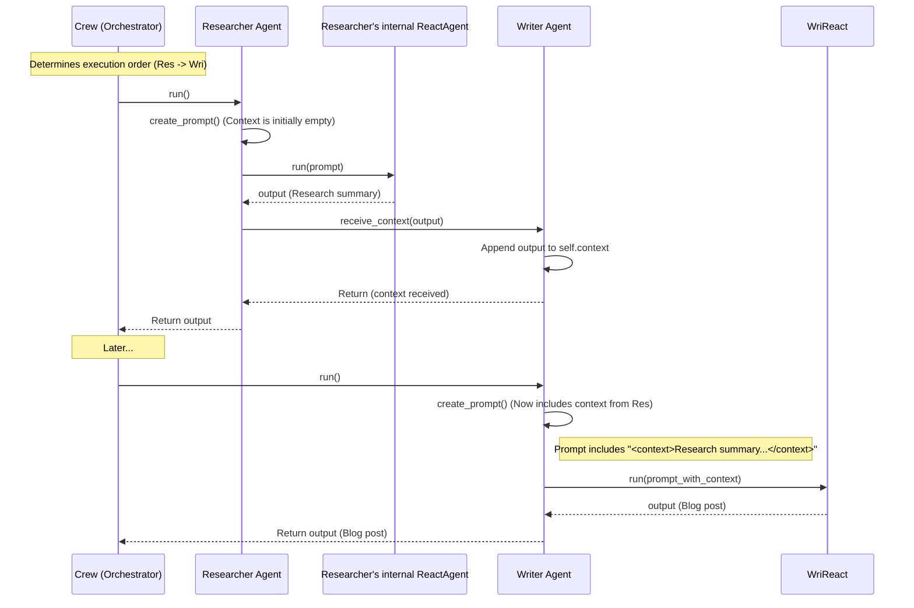

# Chapter 9: Agent (Multi-agent) - Building Your AI Team

In [Chapter 8: ToolAgent](08_toolagent.md), we learned about a streamlined agent perfect for directly using tools based on user requests. We've now explored several patterns for *individual* agents: planning ([ReactAgent](06_reactagent__planning_pattern_.md)), refining ([ReflectionAgent](07_reflectionagent__reflection_pattern_.md)), and direct tool use ([ToolAgent](08_toolagent.md)).

But what if a task is too big or complex for a single agent? What if you need different specialists to collaborate, just like a human team?

## Why Do We Need Multiple Agents?

Imagine you want to create a blog post about the latest trends in renewable energy. This involves several steps:

1.  **Research:** Find recent articles, summarize key trends, identify interesting statistics.
2.  **Writing:** Draft the blog post using the research, making it engaging and easy to read.
3.  **Editing:** Review the draft for clarity, grammar, style, and accuracy.

A single AI agent *might* be able to do all this, but it could struggle:
*   **Complexity:** Juggling research, writing, and editing simultaneously is hard.
*   **Specialization:** An agent optimized for research might not be the best writer or editor.
*   **Quality:** Breaking the task down allows each specialist to focus on their part, potentially leading to a better overall result.

This is where the concept of **Multi-agent Systems** comes in. We can create a team of specialized AI agents, each with a specific role, that work together to achieve a common goal. The core building block for such a team is the **Agent**.

**Analogy:** Think of building a house. You don't hire one person to do everything. You hire specialists: an architect (designer), a foundation crew (researcher), carpenters (writer), electricians, plumbers, painters (editors/reviewers). Each specialist (`Agent`) has a specific role and task, and they often depend on each other's work. The foundation must be laid before the carpenters can frame the walls.

## Key Concepts: The Individual Agent in a Team

In our multi-agent system, an `Agent` is an individual AI worker defined by several characteristics:

1.  **Role & Backstory:** Who is this agent? What's their expertise or personality? (e.g., "You are a senior researcher specializing in renewable energy.") This helps the underlying LLM adopt the right persona.
2.  **Task:** What specific job is this agent responsible for? (e.g., "Research the latest trends in solar panel efficiency.")
3.  **Tools:** Does this agent need any specific [Tools](01_tool.md) (like web search, calculators) to perform its task? (We saw how agents use tools in [Chapter 6: ReactAgent (Planning Pattern)](06_reactagent__planning_pattern_.md) and [Chapter 8: ToolAgent](08_toolagent.md)).
4.  **Dependencies:** Does this agent need information from *other* agents before it can start its work? (e.g., The Writer agent *depends* on the Researcher agent's output).
5.  **Context Passing:** How does an agent receive the necessary information (output) from the agents it depends on? This shared information is called "context".

Our `Agent` abstraction bundles these characteristics and provides a way to define relationships between agents.

## How to Use: Defining Agents and Dependencies

Let's define two agents for our blog post example: a Researcher and a Writer. We'll use the `Agent` class from `src/agentic_patterns/multiagent_pattern/agent.py`.

**1. Define the Researcher Agent:**

```python
# Import the Agent class and any Tools if needed
from agentic_patterns.multiagent_pattern.agent import Agent
# Assuming we have a 'search_tool' defined elsewhere using @tool
# from some_module import search_tool

# Create the Researcher agent
researcher = Agent(
    name="Dr. Anya Sharma",
    backstory="You are a world-renowned energy researcher with expertise in summarizing complex topics.",
    task_description="Find and summarize 3 key recent trends in renewable energy.",
    task_expected_output="A bulleted list summarizing the 3 trends with brief descriptions.",
    # tools=[search_tool] # Optionally assign tools
)

print(f"Created Agent: {researcher.name}")
# Output: Created Agent: Dr. Anya Sharma
```
This code creates an instance of the `Agent` class. We give it a `name`, a `backstory` (which acts like a system prompt for its internal LLM), a `task_description`, and optionally, the expected `output` format and any `tools` it might need.

**2. Define the Writer Agent:**

```python
# Create the Writer agent
writer = Agent(
    name="Alex Chen",
    backstory="You are a talented blog writer known for making complex topics accessible and engaging.",
    task_description="Write a short blog post (approx. 200 words) based on the provided research trends.",
    task_expected_output="A well-structured blog post with an introduction, body (covering trends), and conclusion.",
)

print(f"Created Agent: {writer.name}")
# Output: Created Agent: Alex Chen
```
Similarly, we define the Writer agent with its unique role and task.

**3. Define the Dependency:**
The Writer needs the Researcher's output. We can define this dependency using a special operator `>>` (or `<<`). Think of `>>` as "passes information to".

```python
# Define that the researcher's output should go to the writer
# Read as: researcher passes data to writer
researcher >> writer

# You can check dependencies (optional)
print(f"{writer.name} depends on: {writer.dependencies}")
# Output: Alex Chen depends on: [Dr. Anya Sharma]
print(f"{researcher.name} passes output to: {researcher.dependents}")
# Output: Dr. Anya Sharma passes output to: [Alex Chen]
```
The `researcher >> writer` line tells our system that `writer` cannot start its task until `researcher` has finished, and that `researcher`'s output should be made available to `writer` as context. This creates the connection for information flow.

Now we have defined our agents and their relationship. How this team is actually *run* in the correct order is handled by the `Crew`, which we'll cover in [Chapter 10: Crew](10_crew.md). For now, the key takeaway is how to define these individual `Agent` building blocks and their connections.

## How it Works Under the Hood

What happens internally when you create an `Agent` and set up dependencies?

**Step-by-Step Context Flow (Conceptual):**

1.  **Agent Creation:** When you create `Agent(...)`, it stores the `name`, `backstory`, `task_description`, etc. It also initializes an internal agent (like a `ReactAgent` from [Chapter 6: ReactAgent (Planning Pattern)](06_reactagent__planning_pattern_.md)) configured with the `backstory` as its system prompt and any provided `tools`. It also initializes empty lists for `dependencies` and `dependents`.
2.  **Dependency Definition (`>>`):** When you write `researcher >> writer`, the `__rshift__` method (which defines the `>>` operator) on the `researcher` object is called. This method does two things:
    *   Adds `writer` to the `researcher`'s `dependents` list.
    *   Adds `researcher` to the `writer`'s `dependencies` list.
3.  **Execution (Managed by Crew - Preview):** When the team (`Crew`) runs (see [Chapter 10: Crew](10_crew.md)), it determines the correct execution order using the dependencies (Researcher runs first).
4.  **Agent Task Execution:** The `researcher.run()` method is called by the `Crew`.
    *   Inside `run()`, the agent first calls `create_prompt()`. This method formats the `task_description`, `task_expected_output`, and any `context` received so far into a single prompt string.
    *   This prompt is passed to the agent's internal `react_agent.run()` method.
    *   The internal `ReactAgent` uses the LLM ([LLM Interaction (Completions)](02_llm_interaction__completions_.md)), potentially using its tools and following the ReAct loop, to generate the output based on the prompt.
5.  **Context Passing:** Once the `researcher` finishes and produces its `output` (the research summary):
    *   The `researcher.run()` method iterates through its `dependents` list (which contains `writer`).
    *   For each dependent (`writer`), it calls `writer.receive_context(output)`.
    *   The `writer.receive_context()` method simply appends the received `output` (the research summary) to the `writer`'s internal `context` string.
6.  **Dependent Agent Execution:** Later, when the `Crew` calls `writer.run()`:
    *   `writer.create_prompt()` will now include the research summary received from the `researcher` within the `<context>` tags of its prompt.
    *   The `writer`'s internal `react_agent` uses this enriched prompt to perform its writing task.

**Sequence Diagram (Simplified Context Passing):**

This shows how output from `Researcher` becomes context for `Writer`.



**Code Snippets from `src/agentic_patterns/multiagent_pattern/agent.py`:**

1.  **`Agent.__init__` (Simplified):** Shows how the internal agent is created.

    ```python
    # From: src/agentic_patterns/multiagent_pattern/agent.py
    class Agent:
        def __init__(
            self, name: str, backstory: str, task_description: str,
            task_expected_output: str = "", tools: list[Tool] | None = None,
            llm: str = "llama-3.3-70b-versatile",
        ):
            self.name = name
            self.backstory = backstory # Used as system prompt
            self.task_description = task_description
            self.task_expected_output = task_expected_output

            # Each Agent uses an internal agent (like ReactAgent) to do its work
            self.react_agent = ReactAgent(
                model=llm, system_prompt=self.backstory, tools=tools or []
            )

            self.dependencies: list[Agent] = [] # Agents I need info from
            self.dependents: list[Agent] = []   # Agents that need info from me
            self.context = "" # Stores info received from dependencies

            # ... (Registers with Crew - See Chapter 10) ...
    ```
    This sets up the agent's properties and crucially creates an internal `ReactAgent` configured with the agent's specific `backstory` and `tools`.

2.  **Dependency Operators (`__rshift__`, `add_dependent`):** Shows how `>>` works.

    ```python
    # From: src/agentic_patterns/multiagent_pattern/agent.py
    class Agent:
        # ... other methods ...

        def __rshift__(self, other): # Defines the '>>' operator
            """ self >> other """
            self.add_dependent(other) # Add 'other' to my dependents list
            return other # Allow chaining like a >> b >> c

        def add_dependent(self, other):
            if isinstance(other, Agent):
                # Add 'other' agent to the list of agents that depend on me
                self.dependents.append(other)
                # Add 'self' to the list of agents that 'other' depends on
                other.dependencies.append(self)
            # ... (handle lists of agents, error checking) ...
    ```
    When you use `researcher >> writer`, this code ensures both `researcher.dependents` and `writer.dependencies` are updated correctly.

3.  **Receiving and Using Context:**

    ```python
    # From: src/agentic_patterns/multiagent_pattern/agent.py
    class Agent:
        # ... other methods ...

        def receive_context(self, input_data):
            """Receives and stores context information from other agents."""
            # Simply appends the input to the context string
            self.context += f"\n---\nContext from dependency:\n{input_data}\n---\n"

        def create_prompt(self):
            """Creates a prompt using task description and accumulated context."""
            prompt = f"""
            You are {self.name}. {self.backstory}
            Your task: <task_description>{self.task_description}</task_description>
            Expected output format: <task_expected_output>{self.task_expected_output}</task_expected_output>

            Use the following context from previous agents if available:
            <context>
            {self.context}
            </context>

            Perform your task now. Your response:
            """
            # Simplified prompt structure for clarity
            return prompt.strip()

        def run(self):
            """Runs the agent's task."""
            # 1. Create the prompt using the current context
            msg = self.create_prompt()

            # 2. Run the internal ReactAgent to get the output
            output = self.react_agent.run(user_msg=msg)

            # 3. Pass the output to all dependent agents
            for dependent in self.dependents:
                dependent.receive_context(output)
            return output
    ```
    The `receive_context` method accumulates information. `create_prompt` formats this context along with the task details. The `run` method orchestrates getting the prompt, running the internal agent, and then crucially, passing the `output` to all `dependents` by calling their `receive_context` method.

## Conclusion

In this chapter, we introduced the `Agent` concept as the fundamental building block for multi-agent teams.

*   **What it is:** An individual AI worker with a specific role, backstory, task, and potentially tools.
*   **Why it's useful:** Allows breaking down complex problems into specialized sub-tasks, handled by collaborating agents.
*   **Key Features:** Can define dependencies on other agents (`>>` operator) and receive output ("context") from them to inform their own work.
*   **How it Works:** Each `Agent` wraps an internal execution agent (like `ReactAgent`), uses received context to formulate its prompt, runs its task, and passes its output to dependent agents.

We've defined the players (`Agent`s) and how they relate to each other. But how do we manage the team? How do we ensure agents run in the correct order based on their dependencies? That's the role of the **Crew**.

**Next:** [Chapter 10: Crew](10_crew.md)

---

Generated by [AI Codebase Knowledge Builder](https://github.com/The-Pocket/Tutorial-Codebase-Knowledge)