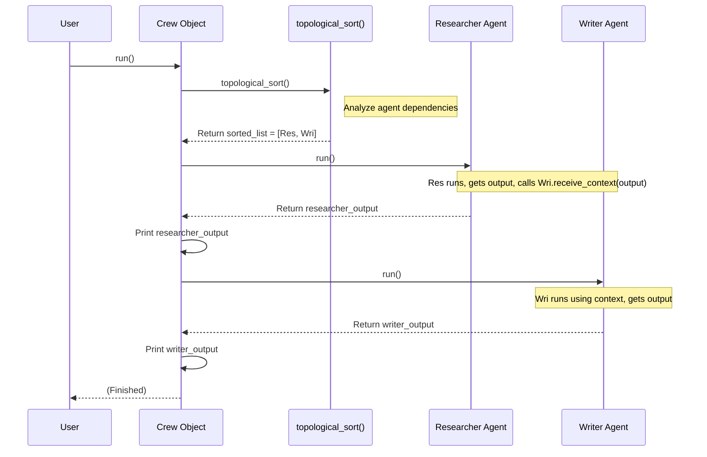

# Chapter 10: Crew - The Project Manager for Your AI Team

In [Chapter 9: Agent (Multi-agent)](09_agent__multi_agent_.md), we learned how to define individual `Agent`s, like specialists on a team, each with their own role and task. We even saw how to define dependencies between them, like saying the Writer agent needs the output from the Researcher agent using `researcher >> writer`.

But just defining the team members and who depends on whom isn't enough. How do we actually *run* the team? How do we make sure the Researcher does their job *before* the Writer starts? We need a way to manage the workflow and ensure everything happens in the correct order.

## Why Do We Need a Crew?

Imagine you have your blog post team:
1.  **Researcher:** Finds the latest trends in renewable energy.
2.  **Writer:** Writes a blog post based on the research.

You've defined them as `Agent`s and set the dependency: `researcher >> writer`.

Now, how do you kick off the process? If you just told both agents to start working simultaneously, the Writer wouldn't have the necessary research yet! It would fail or produce a poor result.

We need something that understands the dependencies and orchestrates the team, ensuring:
*   Agents with no dependencies start first (like the Researcher).
*   Agents run only after the agents they depend on have finished.
*   The output from one agent is correctly passed as context to the next.

This orchestrator, this project manager for our AI team, is called the **Crew**.

**Analogy:** Think of the **Crew** as the **Director** of a movie.
*   The `Agent`s are the actors, lighting crew, sound engineers, etc.
*   The dependencies (`>>`) define the script's sequence (e.g., Scene 1 must be shot before Scene 2 if it depends on it).
*   The **Director (Crew)** reads the script (dependencies), tells each actor/crew member when it's their turn (`agent.run()`), ensures they have what they need from previous steps (context), and coordinates the entire production from start to finish.

## What Exactly is a Crew?

A **Crew** is an object that:
1.  **Holds** a collection of `Agent`s.
2.  **Analyzes** the dependencies between these agents.
3.  Determines the **correct execution order** (using a method called topological sort).
4.  **Runs** the agents sequentially according to that order, managing the flow of information (context) between them.

It ensures that the team's collaborative task flows logically from start to finish.

## How to Use the `Crew`

Using the `Crew` involves creating it and then defining your agents *within its context*.

**1. Import `Crew` and `Agent`:**

```python
# Import necessary classes
from agentic_patterns.multiagent_pattern.crew import Crew
from agentic_patterns.multiagent_pattern.agent import Agent
# Optional: Import any Tools your agents might need
# from some_module import search_tool
```

**2. Define Agents within a `Crew` Context:**
We use a `with` statement to create a `Crew` and automatically associate agents defined inside it with that crew.

```python
# Define the crew and agents using a 'with' block
with Crew() as crew:
    # Define the Researcher agent (same as Chapter 9)
    researcher = Agent(
        name="Dr. Anya Sharma",
        backstory="Expert energy researcher.",
        task_description="Find and summarize 3 key recent trends in renewable energy.",
        task_expected_output="Bulleted list of 3 trends.",
        # tools=[search_tool] # If needed
    )

    # Define the Writer agent (same as Chapter 9)
    writer = Agent(
        name="Alex Chen",
        backstory="Talented blog writer.",
        task_description="Write a short blog post based on the provided research trends.",
        task_expected_output="Approx 200-word blog post.",
    )

    # Define the dependency (same as Chapter 9)
    # Researcher's output goes to the Writer
    researcher >> writer

# At this point, the 'crew' object knows about 'researcher' and 'writer'
# and their dependency relationship because they were created inside the 'with Crew()' block.

print(f"Crew has {len(crew.agents)} agents: {crew.agents}")
# Expected Output: Crew has 2 agents: [Dr. Anya Sharma, Alex Chen]
```
By defining the agents inside the `with Crew() as crew:` block, they automatically register themselves with the `crew` instance. The `researcher >> writer` line establishes the workflow direction.

**3. Run the Crew:**
Now, simply tell the `Crew` to start the process.

```python
# Import colorama for highlighted output (optional)
from colorama import init, Fore
init(autoreset=True) # Initialize colorama

print("\nStarting the Crew run...")
# Execute the agents in the correct order
crew.run()
```
This single command kicks off the entire multi-agent workflow.

**Example Output (Simplified & Annotated):**

```
Starting the Crew run...

(Crew analyzes dependencies: Finds Researcher has 0 dependencies, Writer has 1 dependency on Researcher)
(Crew decides order: Researcher -> Writer)

RUNNING AGENT: Dr. Anya Sharma
(Researcher agent runs its internal ReactAgent, potentially using search_tool...)
(Researcher produces its output: e.g., "* Trend 1: ...\n* Trend 2: ...\n* Trend 3: ...")
RED * Trend 1: Increased Solar Efficiency...
* Trend 2: Growth in Offshore Wind...
* Trend 3: Battery Storage Advancements...

(Crew passes Researcher's output to Writer as context)

RUNNING AGENT: Alex Chen
(Writer agent runs its internal ReactAgent, using the context from Researcher...)
(Writer produces its output: the blog post)
RED ## Renewable Energy Powers Forward!

Recent breakthroughs are reshaping the energy landscape. Key trends include **Increased Solar Efficiency**, making solar panels more practical than ever. We're also seeing massive **Growth in Offshore Wind** projects... Finally, **Battery Storage Advancements** are solving the challenge of intermittent supply... The future is bright and green!

(Crew finishes)
```
The `crew.run()` method automatically:
1.  Figured out `researcher` must run first.
2.  Ran `researcher`.
3.  Took the researcher's output (the list of trends).
4.  Passed that output to `writer` as context.
5.  Ran `writer`, which used the context to write the post.
6.  Printed the final output of each agent.

## How it Works Under the Hood

Let's look at the steps the `Crew` takes, particularly during the `with` block and the `run()` call.

**Step-by-Step Walkthrough:**

1.  **`with Crew() as crew:`:**
    *   When Python enters the `with` block, the `Crew.__init__()` method creates an empty list `self.agents`.
    *   The `Crew.__enter__()` method runs. It sets a class variable `Crew.current_crew = self` (pointing to this specific `crew` instance).
2.  **`Agent(...)` Creation (Inside `with` block):**
    *   When `researcher = Agent(...)` is called, the `Agent.__init__` method runs.
    *   Inside `Agent.__init__`, it checks if `Crew.current_crew` is set (which it is, thanks to `__enter__`).
    *   It calls `Crew.register_agent(self)` (where `self` is the newly created agent).
    *   `Crew.register_agent` adds the new agent to the `Crew.current_crew.agents` list.
    *   This happens for both `researcher` and `writer`.
3.  **Dependency Definition (`>>`):** The `researcher >> writer` call updates the `dependencies` and `dependents` lists within the `researcher` and `writer` objects, as explained in [Chapter 9: Agent (Multi-agent)](09_agent__multi_agent_.md). The `Crew` itself doesn't directly store dependencies; it relies on the agents knowing their own connections.
4.  **Exiting `with` block:**
    *   The `Crew.__exit__()` method runs. It resets the class variable `Crew.current_crew = None`, so any `Agent` created *outside* a `with` block won't be automatically added to a crew.
5.  **`crew.run()`:**
    *   This is the main orchestration method.
    *   **a. Topological Sort:** It first calls `crew.topological_sort()`.
        *   This method analyzes the dependencies stored *within* the agents in `crew.agents`.
        *   It calculates how many direct dependencies each agent has (`in_degree`).
        *   It finds all agents with 0 dependencies (our `researcher`).
        *   It adds them to a queue and the final sorted list.
        *   It processes the queue: takes an agent (`researcher`), looks at its `dependents` (`writer`), and reduces their dependency count. If a dependent's count becomes 0, it's added to the queue.
        *   This continues until all agents are processed, resulting in a list `sorted_agents` where each agent comes *after* all its dependencies (e.g., `[researcher, writer]`).
        *   If it can't process all agents (e.g., due to a circular dependency like A >> B >> A), it raises an error.
    *   **b. Execute Agents:** It iterates through the `sorted_agents` list.
        *   For each `agent` in the list (first `researcher`, then `writer`):
            *   It calls `agent.run()`.
            *   Recall from Chapter 9, `agent.run()` executes the agent's task (using its internal `ReactAgent`), gets the `output`, and automatically calls `dependent.receive_context(output)` for all its dependents.
            *   The `crew.run()` method prints the output returned by `agent.run()`.

**Sequence Diagram (`crew.run()`):**



**Code Snippets:**

1.  **`Crew` Context Management (`__enter__`, `__exit__`, `register_agent`):**

    ```python
    # From: src/agentic_patterns/multiagent_pattern/crew.py
    class Crew:
        current_crew = None # Class variable to track active context

        def __init__(self):
            self.agents = []

        def __enter__(self):
            """Sets this crew as the active context."""
            Crew.current_crew = self
            return self

        def __exit__(self, exc_type, exc_val, exc_tb):
            """Clears the active context."""
            Crew.current_crew = None

        def add_agent(self, agent):
            self.agents.append(agent)

        @staticmethod
        def register_agent(agent):
            """Registers an agent with the current active crew."""
            if Crew.current_crew is not None:
                Crew.current_crew.add_agent(agent)

    # From: src/agentic_patterns/multiagent_pattern/agent.py (inside Agent.__init__)
    # Automatically register this agent to the active Crew context if one exists
    # Crew.register_agent(self) # This line in Agent.__init__ links Agent to Crew
    ```
    This shows how the `with` statement uses `__enter__` and `__exit__` to manage the `current_crew` context, and how `Agent.__init__` uses `register_agent` to automatically add itself to that context.

2.  **`Crew.topological_sort()` (Conceptual Explanation):**
    Finding the correct order might seem complex, but the idea is simple:
    *   Start with agents who don't depend on anyone else.
    *   Once they finish, find the agents who *only* depended on the ones that just finished. They can run now.
    *   Repeat this process until everyone has run.
    The code uses a queue and tracks the number of unmet dependencies (`in_degree`) for each agent to implement this efficiently.

    ```python
    # From: src/agentic_patterns/multiagent_pattern/crew.py (simplified logic)
    def topological_sort(self):
        # 1. Calculate how many agents each agent depends on
        in_degree = {agent: len(agent.dependencies) for agent in self.agents}

        # 2. Initialize a queue with agents that have 0 dependencies
        queue = deque([agent for agent in self.agents if in_degree[agent] == 0])
        sorted_agents = []

        # 3. Process the queue
        while queue:
            current_agent = queue.popleft()
            sorted_agents.append(current_agent)

            # 4. For agents that depended on the one just finished...
            for dependent in current_agent.dependents:
                in_degree[dependent] -= 1 # ...reduce their dependency count
                # 5. If count reaches 0, they can run next
                if in_degree[dependent] == 0:
                    queue.append(dependent)

        # 6. Check if all agents were sorted (no cycles)
        if len(sorted_agents) != len(self.agents):
            raise ValueError("Circular dependencies detected!")

        return sorted_agents
    ```

3.  **`Crew.run()`:**

    ```python
    # From: src/agentic_patterns/multiagent_pattern/crew.py
    from colorama import Fore
    from agentic_patterns.utils.logging import fancy_print

    class Crew:
        # ... other methods ...

        def run(self):
            """Runs all agents in the crew in topologically sorted order."""
            # 1. Determine the correct execution order
            sorted_agents = self.topological_sort()

            # 2. Execute each agent in that order
            for agent in sorted_agents:
                fancy_print(f"RUNNING AGENT: {agent}") # Log which agent is running
                # Call the agent's run method (which handles its task and context passing)
                agent_output = agent.run()
                # Print the result of the agent's work
                print(Fore.RED + f"{agent_output}")
    ```
    This method first gets the `sorted_agents` list from `topological_sort()`, then simply loops through it, calling `agent.run()` for each one in the correct sequence.

## Conclusion

In this final chapter, we learned about the **Crew**, the project manager that orchestrates our team of AI `Agent`s.

*   **What it is:** A manager that holds a collection of `Agent`s and understands their dependencies.
*   **Why it's needed:** To ensure agents run in the correct logical order based on who needs whose output, enabling complex collaborative tasks.
*   **How it works:** Uses a `with` context for easy agent registration, performs a `topological_sort` to find the execution order, and then iterates through the sorted agents, running each one.
*   **Key Components Used:** Relies heavily on the `Agent` definition from [Chapter 9: Agent (Multi-agent)](09_agent__multi_agent_.md), particularly the `dependencies` and `dependents` lists, and the agent's `run()` method which handles context passing.

By combining specialized `Agent`s with a coordinating `Crew`, you can build sophisticated multi-agent systems capable of tackling complex problems that would be difficult for a single agent alone. This concludes our journey through the core concepts of the `agentic-patterns-course`, from basic [Tools](01_tool.md) and [LLM Interaction (Completions)](02_llm_interaction__completions_.md) to advanced agent patterns like [ReactAgent (Planning Pattern)](06_reactagent__planning_pattern_.md), [ReflectionAgent (Reflection Pattern)](07_reflectionagent__reflection_pattern_.md), and finally, multi-agent collaboration with `Agent`s and `Crew`s. We hope these building blocks empower you to create your own intelligent agents!

---

Generated by [AI Codebase Knowledge Builder](https://github.com/The-Pocket/Tutorial-Codebase-Knowledge)