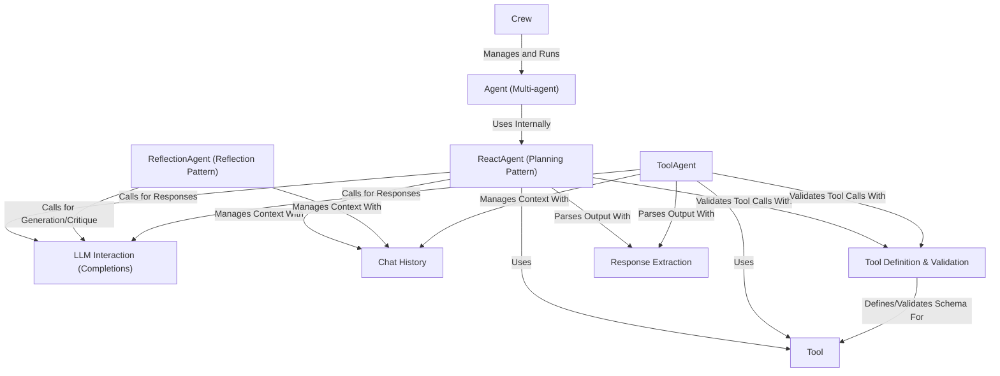

# Tutorial: agentic-patterns-course

This project provides patterns for building *AI agents*. You can create individual agents that follow specific thinking processes like **planning** (*ReAct*) or **self-improvement** (*Reflection*).
These agents can use **Tools** (like functions) to interact with the world.
You can also build a **Crew** of multiple agents that work together as a team, coordinated by a manager, to solve more complex tasks. Core utilities handle interacting with the **LLM**, managing **conversation history**, defining tools, and extracting information from responses.

**Source Repository:** [https://github.com/neural-maze/agentic-patterns-course](https://github.com/neural-maze/agentic-patterns-course)

## Chapters

1. [Tool](01_tool.md)
2. [LLM Interaction (Completions)](02_llm_interaction__completions_.md)
3. [Chat History](03_chat_history.md)
4. [Tool Definition & Validation](04_tool_definition___validation.md)
5. [Response Extraction](05_response_extraction.md)
6. [ReactAgent (Planning Pattern)](06_reactagent__planning_pattern_.md)
7. [ReflectionAgent (Reflection Pattern)](07_reflectionagent__reflection_pattern_.md)
8. [ToolAgent](08_toolagent.md)
9. [Agent (Multi-agent)](09_agent__multi_agent_.md)
10. [Crew](10_crew.md)

---

Generated by [AI Codebase Knowledge Builder](https://github.com/The-Pocket/Tutorial-Codebase-Knowledge)