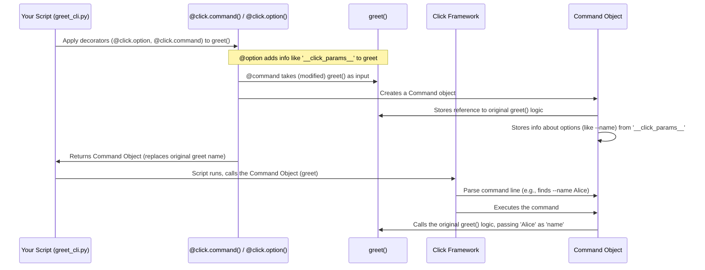

# Chapter 1: Decorators - Giving Your Functions Superpowers!

Welcome to your first step into the world of `click`! If you've ever wanted to turn your simple Python scripts into powerful command-line tools that feel professional and are easy to use, you're in the right place.

## The Problem: Plain Functions vs. CLI Commands

Imagine you have a simple Python function:

```python
# filename: greet.py
def say_hello():
  print("Hello there!")

# How do you run this from the command line easily?
# You might run `python greet.py`, but it just defines the function.
# You'd need extra code to actually *call* say_hello().
```

This function works fine inside Python, but making it a command you can just type in your terminal (like `git status` or `ls -l`) requires extra steps. You'd need to handle command-line arguments, maybe show help messages, and figure out *which* function to run if your script has multiple actions. This can get complicated quickly!

## The Solution: Click Decorators - Easy CLI Magic! ✨

This is where `click` comes in, and its magic starts with **decorators**.

Think of decorators as special "stickers" or "labels" you put *on top* of your Python functions. In Python, these start with the `@` symbol.

```python
@some_decorator
def my_function():
  # ... function code ...
  pass
```

These decorators modify or enhance the function they are attached to. `click` provides decorators like `@click.command()`, `@click.option()`, and `@click.argument()` that specifically turn your Python functions into command-line interface (CLI) commands and define how they accept input.

It's like telling `click`, "Hey, see this function? I want you to make it runnable from the terminal, and here's how..." – all without writing lots of repetitive setup code.

## Your First Click Command: `@click.command()`

Let's transform our simple `say_hello` function into a real CLI command using `@click.command()`:

1.  **Import `click`:** You need to import the library first.
2.  **Add the decorator:** Place `@click.command()` directly above your function definition.
3.  **Call the function (conditionally):** Add a standard Python construct (`if __name__ == '__main__':`) to call your decorated function when the script is run directly.

```python
# filename: hello_cli.py
import click

@click.command() # <-- The magic sticker!
def hello():
  """A simple program that greets.""" # Docstrings become help text!
  print("Hello World!")

if __name__ == '__main__':
  hello() # <-- This now runs the Click command system
```

**Explanation:**

*   `import click`: Brings the `click` library into your script.
*   `@click.command()`: This decorator takes the `hello` function and transforms it. It's no longer just a plain Python function; it's now a `click` Command object!
*   `"""A simple program that greets."""`: The function's docstring is automatically used by `click` to generate help messages.
*   `if __name__ == '__main__': hello()`: This standard Python pattern ensures that `hello()` is called only when you run the script directly (e.g., `python hello_cli.py`). Because `hello` has been decorated, this doesn't just call the original function directly; it triggers `click`'s machinery to parse command-line arguments (if any) and then run your function's logic.

**Try it out!**

Save the code above as `hello_cli.py`. Open your terminal in the same directory and run:

```bash
$ python hello_cli.py
Hello World!
```

Cool! Now try asking for help:

```bash
$ python hello_cli.py --help
Usage: hello_cli.py [OPTIONS]

  A simple program that greets.

Options:
  --help  Show this message and exit.
```

Look at that! `click` automatically added a `--help` option and used your function's docstring. You got all this just by adding one line: `@click.command()`!

## Stacking Decorators: Adding Parameters

`@click.command()` is just the beginning. `click` uses other decorators, typically placed *between* `@click.command()` and your `def`, to define parameters like options (e.g., `--name`) or arguments (e.g., a filename).

Let's add an option to customize the greeting:

```python
# filename: greet_cli.py
import click

@click.command()
@click.option('--name', default='World', help='Who to greet.') # <-- New decorator!
def greet(name): # <-- The option value is passed as an argument!
  """A simple program that greets NAME."""
  print(f"Hello {name}!")

if __name__ == '__main__':
  greet()
```

**Explanation:**

*   `@click.option('--name', default='World', help='Who to greet.')`: This decorator tells `click` to expect an option named `--name` on the command line.
    *   `default='World'`: If the user doesn't provide `--name`, use "World".
    *   `help='Who to greet.'`: This text will appear in the `--help` output.
*   `def greet(name):`: Notice that the function now takes an argument `name`. `click` automatically matches the option `--name` to this argument because they share the same name. The value provided (or the default) will be passed here.

**Try it out!**

```bash
# Run without the option (uses default)
$ python greet_cli.py
Hello World!

# Run with the option
$ python greet_cli.py --name Alice
Hello Alice!

# Check the help message again
$ python greet_cli.py --help
Usage: greet_cli.py [OPTIONS]

  A simple program that greets NAME.

Options:
  --name TEXT  Who to greet.  [default: World]
  --help       Show this message and exit.
```

See how `@click.option()` added the `--name` parameter? We'll explore `@click.option()` in detail in [Option](03_option.md) and its sibling `@click.argument()` in [Argument](04_argument.md). For now, the key takeaway is that you *stack* these decorators to build up your command's interface.

## How Do Decorators Work Under the Hood?

The `@` syntax is actually just a shortcut (syntactic sugar) for a common pattern in Python. When you write:

```python
@click.command()
def hello():
  # ...
  pass
```

It's roughly equivalent to writing this *after* the function definition:

```python
def hello():
  # ...
  pass

# The decorator is called with the function as input,
# and the result replaces the original function name.
hello = click.command()(hello)
```

So, `click.command()` is a function (or more accurately, something *callable* like a function or a class) that takes your function (`hello`) as an argument. It then does some processing and returns a *new* object – a `click.Command` object – which replaces the original `hello` function in your code.

**Analogy: Gift Wrapping**

Think of your original function (`hello`) as a gift.
The decorator (`@click.command()`) is like wrapping paper and a ribbon.
When you apply the decorator, you're essentially calling a "wrap_gift" function: `wrapped_hello = wrap_gift(hello)`.
The result (`wrapped_hello`) is the nicely wrapped gift, which now has extra features (like looking good and having a tag). In `click`'s case, the "wrapped" function is a `Command` object that knows how to handle command-line parsing, help messages, and calling your original logic.

**Step-by-Step:**

Here's a simplified sequence of what happens:



**Code Glimpse (Simplified):**

Let's peek inside `src/click/decorators.py` (simplified for clarity):

```python
# Simplified view of the command decorator factory
def command(name=None, cls=None, **attrs):
    if cls is None:
        cls = Command # Default to the Command class

    def decorator(f):
        # 'f' is the function being decorated (e.g., greet)

        # Look for parameters added by @option/@argument
        # (They store info in f.__click_params__ temporarily)
        params = []
        if hasattr(f, "__click_params__"):
             params.extend(reversed(f.__click_params__))
             del f.__click_params__ # Clean up

        # Use function's docstring for help if not provided
        if attrs.get("help") is None:
            attrs["help"] = f.__doc__

        # Create the actual Command object
        cmd = cls( # cls is typically click.Command
            name=name or f.__name__.lower(), # Use function name if needed
            callback=f, # Store the original function 'f'
            params=params, # Attach options/arguments
            **attrs # Pass other settings
        )
        return cmd # Return the Command object

    return decorator # Return the actual decorator function
```

This shows the core idea: the `command` function returns another function (`decorator`). This `decorator` function takes *your* function (`f`), extracts information (like docstrings and parameters added by other decorators), creates a `Command` object wrapping your function, and returns that `Command` object.

## Conclusion

Decorators are the heart of `click`'s interface design. They provide a clean, readable way to transform standard Python functions into powerful command-line commands without writing complex parsing logic yourself.

*   `@click.command()` turns a function into a basic CLI command.
*   Other decorators like `@click.option()` and `@click.argument()` stack on top to define parameters.
*   Under the hood, decorators are functions that wrap your function, returning a specialized `click` object that knows how to interact with the command line.

Now that you understand the fundamental role of decorators, you're ready to learn more about the most important one: `@click.command()` and the [Command](02_command.md) object it creates.

---> Next Chapter: [Command](02_command.md)

---

Generated by [AI Codebase Knowledge Builder](https://github.com/The-Pocket/Tutorial-Codebase-Knowledge)