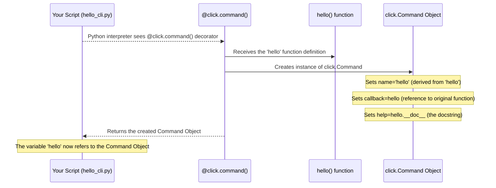

# Chapter 2: Command - Your Basic Toolkit

In [Chapter 1: Decorators](01_decorators.md), we saw how the `@click.command()` decorator magically turned a simple Python function into a command-line tool. It felt like giving our function superpowers! Now, let's dive deeper into *what* that decorator actually creates: the **Command**.

## The Problem: What *Is* a Command, Really?

Imagine you're building a command-line tool with several different actions. Maybe a tool to manage your photos:

*   One action to `upload` photos.
*   Another action to `download` photos.
*   A third action to `show` photo details.

Each of these actions (`upload`, `download`, `show`) needs to be a distinct operation the user can call from the terminal. How do we represent these individual actions in our code? How does `click` know that the `upload` action should run *this* specific piece of Python code, while `download` runs *that* piece?

## The Solution: `click.Command` - The Building Block

The answer is the `click.Command` object.

Think of your entire command-line application as a toolbox. A `click.Command` is like a single, specific tool in that toolbox – a hammer, a screwdriver, or a wrench. It's designed to do **one job**.

**Key features of a `Command`:**

1.  **Name:** How you invoke it from the terminal (e.g., `upload`, `hello`).
2.  **Action (Callback):** The Python function that gets executed when the command is called.
3.  **Parameters:** It can accept inputs, like options (e.g., `--force`) or arguments (e.g., a filename). We'll cover these in detail in [Option](03_option.md) and [Argument](04_argument.md).
4.  **Help Message:** Automatically generated text explaining what the command does and how to use it.

The `@click.command()` decorator is the easiest way to create a `Command` object. It takes your Python function and bundles it up with a name and other settings into a `Command`.

## Creating Your First Command (Again!)

Let's look back at our `hello_cli.py` example from Chapter 1, but focus on the `Command` aspect:

```python
# filename: hello_cli.py
import click

@click.command() # This decorator *creates* a Command object!
def hello():     # The function 'hello' becomes the Command's *callback*
  """A simple program that greets.""" # Docstring becomes the help text
  print("Hello World!")

if __name__ == '__main__':
  # 'hello' here is no longer the original function.
  # It's the Command object created by the decorator!
  hello()
```

**Explanation:**

1.  `@click.command()`: Reads the `hello` function below it.
2.  It creates a `click.Command` object.
3.  **Name:** By default, it takes the function name (`hello`), converts it to lowercase, and uses that as the command name.
4.  **Callback:** It stores the original `hello` function inside the `Command` object as the code to run (the "callback").
5.  **Help:** It takes the function's docstring (`"""A simple program that greets."""`) and uses it for the help message.
6.  The name `hello` in your script is then reassigned to point to this newly created `Command` object.
7.  When `hello()` is called in the `if __name__ == '__main__':` block, it's actually invoking the `click.Command` object. This object handles parsing the command line (like checking for `--help`) and *then* runs your original function's code (the callback).

**Try it:**

```bash
$ python hello_cli.py
Hello World!

$ python hello_cli.py --help
Usage: hello_cli.py [OPTIONS] # <-- 'hello_cli.py' is the script, no command name needed here yet

  A simple program that greets. # <-- From the docstring

Options:
  --help  Show this message and exit. # <-- Added automatically!
```

## Naming Your Command

What if you want the command name to be different from the function name? You can pass a name string to the decorator:

```python
# filename: greet_command.py
import click

# Explicitly name the command 'greet'
@click.command("greet")
@click.option('--name', default='World', help='Who to greet.')
def say_hello_func(name): # Our Python function name is different!
  """Greets NAME."""
  print(f"Hello {name}!")

if __name__ == '__main__':
  # We still call the Python variable name 'say_hello_func'
  say_hello_func()
```

**Explanation:**

*   `@click.command("greet")`: We explicitly tell `click` to create a `Command` object with the name `greet`.
*   `def say_hello_func(name):`: Our Python function can have any valid name. It's still used as the callback.
*   `say_hello_func()`: In the script, we call the function using its Python name. However, `click` now knows this represents the `greet` command internally.

**Try it:**

```bash
# Call using the script name (no explicit command needed yet for single-command scripts)
$ python greet_command.py --name Alice
Hello Alice!

# Check the help - notice the usage line!
$ python greet_command.py --help
Usage: greet_command.py [OPTIONS] # Still uses script name for single commands

  Greets NAME.

Options:
  --name TEXT  Who to greet.  [default: World]
  --help       Show this message and exit.
```

Even though we named it `greet`, single-command scripts often don't require you to type the command name itself. This changes when we use [Group](06_group.md)s to bundle multiple commands, where the name becomes crucial.

## Under the Hood: How `@click.command()` Makes a Command

Remember the "Gift Wrapping" analogy from Chapter 1? `@click.command()` is the wrapping paper factory.

1.  You give the factory your function (the gift).
2.  The factory (decorator) takes the function, reads its name and docstring.
3.  It builds a shiny new `Command` object (the wrapped gift).
4.  This `Command` object holds onto your original function (so it knows what code to run) and stores the name, help text, and any parameters defined by other decorators like `@click.option()`.
5.  The factory gives you back the `Command` object, replacing the original function's name in your script.

Here's a step-by-step view:



**Diving into the Code (Simplified):**

Inside `click`'s source code (`src/click/decorators.py`), the `command` decorator function looks something like this (simplified):

```python
# Simplified view from src/click/decorators.py

# Import the actual Command class
from .core import Command

def command(name=None, cls=None, **attrs):
    # If no class is specified, default to Command
    if cls is None:
        cls = Command

    # The decorator returns *another function* that takes your function
    def decorator(f):
        # 'f' is your function (e.g., hello)

        # Get parameters added by @option/@argument (if any)
        params = []
        if hasattr(f, "__click_params__"):
             params.extend(reversed(f.__click_params__))
             # ... (cleanup) ...

        # Use function's docstring for help if not explicitly set
        if attrs.get("help") is None:
            attrs["help"] = f.__doc__

        # Determine the command name (use function name if 'name' wasn't passed)
        cmd_name = name or f.__name__.lower().replace("_", "-")
        # ... (logic to remove _command suffixes) ...

        # *** The Key Step: Create the Command object! ***
        cmd = cls( # cls is usually click.Command
            name=cmd_name,      # Calculated or provided name
            callback=f,         # Store the original function 'f'
            params=params,      # Attach options/arguments
            help=attrs.get("help"), # Store the help text
            # ... other attributes ...
        )
        # Return the Command object!
        return cmd

    # Return the inner decorator function
    return decorator
```

The most important part is `cmd = cls(...)`. This line creates the actual `click.Command` object (defined in `src/click/core.py`). This object holds all the information needed to execute your command – its name, the function to call (`callback`), any parameters (`params`), and the help text.

## Conclusion

You've now learned about the `click.Command`, the fundamental unit of action in a `click` application.

*   A `Command` represents a single operation the user can perform.
*   It bundles a **name**, the **Python function** to execute (callback), **parameters**, and **help text**.
*   The `@click.command()` decorator is the easiest way to create a `Command` from a Python function.
*   It acts like a factory, taking your function and producing a configured `Command` object.

Most commands aren't very useful without a way to pass information *into* them. How do we tell our command *which* file to upload, or *who* to greet? That's where parameters come in. In the next chapter, we'll explore one of the most common parameter types: the **Option**.

---> Next Chapter: [Option](03_option.md)

---

Generated by [AI Codebase Knowledge Builder](https://github.com/The-Pocket/Tutorial-Codebase-Knowledge)