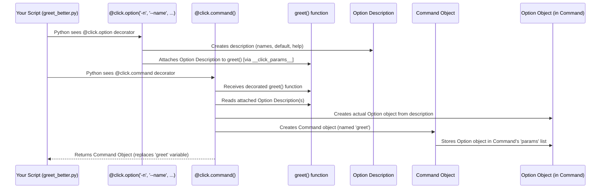

# Chapter 3: Option - Giving Your Commands Settings

In the previous chapter, [Command](02_command.md), we learned how `@click.command()` turns a Python function into a runnable command-line tool. But most tools aren't very useful if you can't tweak their behavior. How do you tell a command to be *more talkative*, or *which file* to process, or *what name* to use?

## The Problem: Static Commands vs. Flexible Tools

Imagine our simple `hello` command from before:

```python
# filename: hello_static.py
import click

@click.command()
def hello():
  """A simple program that says hello."""
  print("Hello World!")

if __name__ == '__main__':
  hello()
```

Running `python hello_static.py` always does the exact same thing: print "Hello World!". What if we want to greet a specific person? Or maybe sometimes we want a more enthusiastic greeting? We need a way to pass "settings" or "switches" to our command when we run it.

On the command line, you've probably seen things like `ls -l` (show long listing format) or `git commit --amend` (amend the previous commit). Those parts starting with `-` or `--` are called **options** or **flags**. They modify how the main command (`ls`, `git commit`) works.

## The Solution: `click.Option` - Your Command's Control Knobs

`click` makes adding these options super easy using the `@click.option()` decorator.

Think of `@click.option()` as adding a control knob, a switch, or a setting dial to your command. It lets the user provide extra information or change how the command behaves *without* changing the command's core purpose.

**Key Ideas about Options:**

1.  **Names:** They usually have a long name (`--verbose`) and often a short, single-letter name (`-v`). Both can be used interchangeably.
2.  **Optional:** As the name suggests, options are typically *optional*. If the user doesn't provide them, the command should still work, perhaps using a default setting.
3.  **Order:** Generally, the order in which you list options on the command line doesn't matter (`command --input file.txt --verbose` is the same as `command --verbose --input file.txt`).
4.  **Values:** Options can act as simple on/off switches (flags) or they can take a value (like a filename or a number).

## Adding Your First Option: A Simple Flag

Let's add a `--verbose` flag to a command. Flags are options that don't take an extra value; their presence alone means "yes" or "true".

```python
# filename: verbose_cli.py
import click

@click.command()
@click.option('--verbose', is_flag=True, help='Show more detailed output.')
def cli(verbose): # The option value is passed as an argument!
  """A simple CLI tool."""
  click.echo("Starting the tool...")
  if verbose:
    click.echo("Verbose mode is ON")
  # ... more actions ...
  click.echo("Finished.")

if __name__ == '__main__':
  cli()
```

**Explanation:**

1.  `@click.option('--verbose', is_flag=True, help='Show more detailed output.')`:
    *   This decorator tells `click` to create an option named `--verbose`.
    *   `is_flag=True`: This is crucial! It tells `click` that this option doesn't expect a value after it. If `--verbose` is present on the command line, the corresponding variable (`verbose` in the function) will be `True`. If it's absent, it will be `False`.
    *   `help='...'`: Provides the description shown in the `--help` message.
2.  `def cli(verbose):`: Notice the function now takes an argument named `verbose`. `click` automatically matches the option name `--verbose` to this argument name. The value (`True` or `False`) will be passed here.
3.  `if verbose:`: Inside the function, we can check the value of `verbose` to change behavior.
4.  `click.echo(...)`: This is `click`'s recommended way to print to the console. It handles some edge cases better than `print()`, especially with different terminal types.

**Try it out!**

```bash
# Run without the flag
$ python verbose_cli.py
Starting the tool...
Finished.

# Run WITH the flag
$ python verbose_cli.py --verbose
Starting the tool...
Verbose mode is ON
Finished.

# Check the help message
$ python verbose_cli.py --help
Usage: verbose_cli.py [OPTIONS]

  A simple CLI tool.

Options:
  --verbose   Show more detailed output.
  --help      Show this message and exit.
```

See how easily we added a setting? The `--verbose` option is now listed in the help message automatically!

## Options That Take Values

Flags are great for on/off switches, but often you need the user to provide specific data, like a name, a number, or a filename.

Let's go back to our greeting example and add an option to specify the name.

```python
# filename: greet_option.py
import click

@click.command()
@click.option('--name', help='The name to greet.')
def greet(name):
  """Greets the person specified by --name."""
  if name:
    click.echo(f"Hello, {name}!")
  else:
    click.echo("Hello there! (Use --name to specify who to greet)")

if __name__ == '__main__':
  greet()
```

**Explanation:**

1.  `@click.option('--name', help='The name to greet.')`:
    *   We define an option `--name`.
    *   We *didn't* use `is_flag=True`. This means `click` expects a value to follow `--name` on the command line.
    *   By default, `click` assumes the value should be text ([STRING](05_paramtype.md)).
2.  `def greet(name):`: Again, the function gets an argument `name`. `click` will pass the value provided after `--name` to this argument.
3.  `if name:`: If the user *doesn't* provide `--name`, the value passed to the function will be `None` by default. We need to check for this.

**Try it out!**

```bash
# Run without the option
$ python greet_option.py
Hello there! (Use --name to specify who to greet)

# Run WITH the option
$ python greet_option.py --name Alice
Hello, Alice!

# Run WITH the option (alternative quoting)
$ python greet_option.py --name "Bob Smith"
Hello, Bob Smith!

# Check the help message
$ python greet_option.py --help
Usage: greet_option.py [OPTIONS]

  Greets the person specified by --name.

Options:
  --name TEXT  The name to greet.
  --help       Show this message and exit.
```

Notice the `TEXT` in the help message? `click` indicates the *type* of value expected after `--name`. We'll learn more about types in [ParamType](05_paramtype.md).

## Default Values and Short Names

Having to check for `None` can be a bit tedious. Often, you want a sensible default value if the user doesn't provide the option. You can also provide a shorter alias for your option.

```python
# filename: greet_better.py
import click

@click.command()
# Add a short name '-n' and a default value
@click.option('-n', '--name', default='World', help='The name to greet.')
def greet(name):
  """Greets NAME. Defaults to 'World' if NAME not provided."""
  click.echo(f"Hello, {name}!")

if __name__ == '__main__':
  greet()
```

**Explanation:**

1.  `@click.option('-n', '--name', ...)`:
    *   We now provide *two* strings before the keyword arguments: `'-n'` and `'--name'`. `click` understands these are the short and long forms of the same option. Users can use either `greet_better.py -n Alice` or `greet_better.py --name Alice`.
    *   `default='World'`: If the user provides neither `-n` nor `--name`, the `name` argument in our function will receive the string `'World'`.
    *   The Python argument name (`name`) is typically derived from the *first long* option name (`--name`). Hyphens are converted to underscores (`--first-name` becomes `first_name`).
2.  `def greet(name):`: Thanks to `default='World'`, we know `name` will always have a string value, simplifying our function logic.

**Try it out!**

```bash
# Run without the option (uses default)
$ python greet_better.py
Hello, World!

# Run with the long option
$ python greet_better.py --name Alice
Hello, Alice!

# Run with the short option
$ python greet_better.py -n Bob
Hello, Bob!

# Check the help message
$ python greet_better.py --help
Usage: greet_better.py [OPTIONS]

  Greets NAME. Defaults to 'World' if NAME not provided.

Options:
  -n, --name TEXT  The name to greet.  [default: World]
  --help           Show this message and exit.
```

The help message now clearly shows both names (`-n, --name`), the expected type (`TEXT`), and the default value!

## How Options Work Under the Hood

How does `@click.option()` connect the command-line flag to your function argument? It's similar to how `@click.command()` works, involving decorators modifying the function.

1.  **Storing Information:** When Python executes the `@click.option(...)` line *above* your function definition, the `option` decorator doesn't immediately create the final `Option` object. Instead, it creates a temporary description of the option (its names like `-n`, `--name`, its `default`, its `help` text, whether it's a `flag`) and attaches this description to the function object itself. `click` often uses a hidden attribute list like `__click_params__` for this.
2.  **Command Creation:** When the `@click.command()` decorator runs (which happens *after* all the `@click.option` decorators for that function), it looks for this attached list of parameter descriptions (`__click_params__`).
3.  **Building Parameters:** For each description found, `@click.command()` creates an actual `click.Option` object (or `click.Argument`, see [Argument](04_argument.md)).
4.  **Attaching to Command:** These created `Option` objects are then stored within the `Command` object that `@click.command()` is building (specifically, in its `params` list).
5.  **Parsing & Calling:** Later, when you run the script and invoke the command, the `Command` object uses its list of `Option` objects to parse the command line (`sys.argv`). It figures out which options were provided and what their values are (or uses defaults). Finally, it calls your original Python function, passing these values as arguments.

**Sequence Diagram:**

Let's visualize the setup phase for `greet_better.py`:



**Code Glimpse (Simplified):**

Looking inside `click/decorators.py`, we see how options are handled:

```python
# Simplified from src/click/decorators.py

# The Option class definition is in core.py
from .core import Option

# Function called internally by @option, @argument etc.
def _param_memo(f, param):
    """Attaches a parameter object to the function temporarily."""
    if isinstance(f, Command):
        # If decorating an existing Command object, add directly
        f.params.append(param)
    else:
        # If decorating a plain function, store in a temporary list
        if not hasattr(f, "__click_params__"):
            f.__click_params__ = []
        f.__click_params__.append(param)

# The @click.option decorator factory
def option(*param_decls, cls=None, **attrs):
    """Attaches an option to the command."""
    if cls is None:
        cls = Option # Default to the Option class

    def decorator(f):
        # Create the Option object (or subclass) with declarations and attributes
        option_obj = cls(param_decls, **attrs)
        # Store this Option object on the function for later processing
        _param_memo(f, option_obj)
        return f
    return decorator

# Simplified view of the @click.command decorator factory
def command(name=None, cls=None, **attrs):
    if cls is None:
        cls = Command

    def decorator(f):
        # ... (other setup) ...

        # *** Collect parameters stored by @option/@argument ***
        params = []
        if hasattr(f, "__click_params__"):
             # Get the stored Option objects
             params.extend(reversed(f.__click_params__))
             del f.__click_params__ # Clean up

        # ... (get help text from docstring etc.) ...

        # Create the Command object, passing the collected params
        cmd = cls(
            name=cmd_name, # Determined command name
            callback=f,    # The original function
            params=params, # *** The list of Option objects ***
            **attrs
        )
        return cmd
    return decorator
```

The key steps are:
1.  `@click.option` creates an `Option` object and uses `_param_memo` to attach it to the function (in `__click_params__`).
2.  `@click.command` later retrieves these `Option` objects from `__click_params__` and passes them to the `Command` constructor via the `params` argument.

## Conclusion

You've now learned how to make your commands much more flexible using **Options**:

*   Options are command-line flags (like `--verbose` or `-n`) that modify a command's behavior.
*   They are defined using the `@click.option()` decorator stacked below `@click.command()`.
*   Options can be simple flags (`is_flag=True`) or take values (like text or numbers).
*   You can specify short and long names (`-n`, `--name`), default values (`default=...`), and help text (`help=...`).
*   `click` automatically parses these options from the command line and passes the values (or defaults) as arguments to your decorated function.

Options are great for optional settings. But what about inputs that are *required* for the command to function, like the source and destination files for a `copy` command? These usually don't have flags like `-f` or `--file`. For these, `click` provides another type of parameter: the **Argument**.

---> Next Chapter: [Argument](04_argument.md)

---

Generated by [AI Codebase Knowledge Builder](https://github.com/The-Pocket/Tutorial-Codebase-Knowledge)