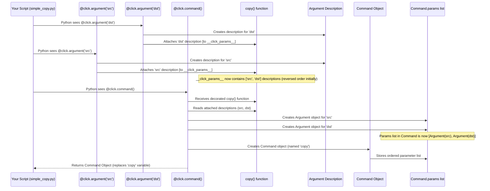

# Chapter 4: Argument - Handling Positional Inputs

In [Chapter 3: Option](03_option.md), we learned how to add optional settings or switches (like `--verbose` or `--name`) to our commands using `@click.option()`. These are great for controlling *how* a command runs. But what about the essential things the command needs to work on?

## The Problem: What Are We Working On?

Think about common command-line tools:
*   `cp source.txt destination.txt`: Copies a file.
*   `mv old_name.txt new_name.txt`: Renames a file.
*   `grep pattern file.txt`: Searches for a pattern in a file.

In these examples, `source.txt`, `destination.txt`, `old_name.txt`, `new_name.txt`, `pattern`, and `file.txt` are the core pieces of information the command needs. They don't have names like `--source source.txt` on the command line. Their meaning is determined by their *position*. The first item after `cp` is the source, the second is the destination. These are called **arguments**.

How do we tell our `click` command to expect these positional values?

## The Solution: `click.Argument` - Defining the "What"

`click` provides the `@click.argument()` decorator to define these positional arguments.

Think back to our tool analogy:
*   Command (`@click.command()`): The tool itself (e.g., a drill).
*   Option (`@click.option()`): Settings on the tool (e.g., speed setting, drill bit type).
*   **Argument (`@click.argument()`)**: The materials the tool works on (e.g., the piece of wood you're drilling into, the wall you're hanging a picture on).

**Key Ideas about Arguments:**

1.  **Positional:** Their meaning comes from their order on the command line, not a name like `--input`.
2.  **Typically Required:** Arguments often represent information that is essential for the command to function. Unlike options, they are usually *not* optional by default.
3.  **No Leading Dashes:** They are just values like `myfile.txt` or `hello`, not `-f` or `--output`.

## Adding Your First Argument

Let's make a command that requires a name to greet. Instead of using an *option* like `--name`, we'll use a positional *argument*.

```python
# filename: greet_arg.py
import click

@click.command()
@click.argument('name') # Define a positional argument named 'name'
def greet(name):        # The argument value is passed here
  """Greets the person specified by the NAME argument."""
  click.echo(f"Hello, {name}!")

if __name__ == '__main__':
  greet()
```

**Explanation:**

1.  `@click.argument('name')`:
    *   This decorator tells `click` to expect one positional argument on the command line.
    *   We give it the internal name `'name'`. This name is used to link the argument to the function parameter. It's also used in the help text (usually uppercased).
    *   By default, arguments are *required*.
2.  `def greet(name):`: The function now takes an argument `name`. `click` automatically takes the value provided on the command line for the `name` argument and passes it here.

**Try it out!**

```bash
# Run WITHOUT the required argument - Click complains!
$ python greet_arg.py
Usage: greet_arg.py [OPTIONS] NAME
Try 'greet_arg.py --help' for help.

Error: Missing argument 'NAME'.

# Run WITH the argument
$ python greet_arg.py Alice
Hello, Alice!

# Run with a different argument
$ python greet_arg.py World
Hello, World!

# Check the help message
$ python greet_arg.py --help
Usage: greet_arg.py [OPTIONS] NAME

  Greets the person specified by the NAME argument.

Arguments:
  NAME  [required]

Options:
  --help  Show this message and exit.
```

See how `click` automatically enforced that the `NAME` argument is required? It also clearly lists the argument (in uppercase) in the help message.

## Multiple Arguments: Order Matters!

Commands often need more than one positional argument, like our `cp source destination` example. Let's build a simplified version.

```python
# filename: simple_copy.py
import click

@click.command()
@click.argument('src')  # First argument: source
@click.argument('dst')  # Second argument: destination
def copy(src, dst):     # Values passed in order
  """Copies the file SRC to DST."""
  click.echo(f"Pretending to copy '{src}' to '{dst}'...")
  # In a real tool, you'd add file copying logic here

if __name__ == '__main__':
  copy()
```

**Explanation:**

1.  `@click.argument('src')`: Defines the *first* expected positional argument.
2.  `@click.argument('dst')`: Defines the *second* expected positional argument.
3.  `def copy(src, dst):`: The function receives the values in the order they were defined. The first value on the command line goes to `src`, the second goes to `dst`.

**Important:** The order of the `@click.argument()` decorators matters! It corresponds directly to the order the user must provide the values on the command line.

**Try it out!**

```bash
# Provide both arguments
$ python simple_copy.py file1.txt backup.txt
Pretending to copy 'file1.txt' to 'backup.txt'...

# Provide arguments in a different order (meaning changes!)
$ python simple_copy.py new_config.cfg old_config.cfg
Pretending to copy 'new_config.cfg' to 'old_config.cfg'...

# Forget an argument
$ python simple_copy.py only_one
Usage: simple_copy.py [OPTIONS] SRC DST
Try 'simple_copy.py --help' for help.

Error: Missing argument 'DST'.

# Check the help message
$ python simple_copy.py --help
Usage: simple_copy.py [OPTIONS] SRC DST

  Copies the file SRC to DST.

Arguments:
  SRC  [required]
  DST  [required]

Options:
  --help  Show this message and exit.
```

The help message now shows both `SRC` and `DST` in the correct order.

## Quick Recap: Argument vs. Option

| Feature         | Argument (`@click.argument`)              | Option (`@click.option`)                     |
| :-------------- | :---------------------------------------- | :------------------------------------------- |
| **Identifier**  | Position on command line                  | Name (e.g., `-f`, `--file`)                  |
| **Required?**   | Usually **Yes** (by default)              | Usually **No** (by default)                  |
| **Order**       | **Matters**                               | Usually **Doesn't Matter**                   |
| **Example**     | `input.txt` in `cmd input.txt output.txt` | `--verbose` in `cmd --verbose input.txt`     |
| **Analogy**     | Materials (the "what")                    | Settings (the "how")                         |

## How Arguments Work Under the Hood

The mechanism for arguments is very similar to how options work, explained in [Chapter 3: Option](03_option.md).

1.  **Storing Information:** When Python sees `@click.argument('name')`, the `argument` decorator creates a description of the argument (its name, that it's required by default, etc.) and attaches this description to the function object (often using a hidden `__click_params__` list).
2.  **Command Creation:** The `@click.command()` decorator runs next. It finds the attached list of parameter descriptions.
3.  **Building Parameters:** For each description from `@click.argument()`, it creates an actual `click.Argument` object.
4.  **Attaching to Command:** These `Argument` objects (along with any `Option` objects) are stored inside the `Command` object created by `@click.command()`, typically in its `params` list. The order they appear in this list is important, especially for arguments.
5.  **Parsing & Calling:** When you run the script, the `Command` object uses its `params` list to parse the command line (`sys.argv`). It matches the positional values provided by the user to the `Argument` objects based on their order. Finally, it calls your original Python function, passing the collected argument values (and option values) as function parameters.

**Sequence Diagram (Setup Phase for `simple_copy.py`):**



**Code Glimpse (Simplified):**

Inside `click/decorators.py`, the `argument` decorator works much like the `option` decorator:

```python
# Simplified from src/click/decorators.py

# The Argument class definition is in core.py
from .core import Argument

# Function called internally by @option, @argument etc.
def _param_memo(f, param):
    """Attaches a parameter object to the function temporarily."""
    # ... (same logic as in Option chapter) ...
    if not hasattr(f, "__click_params__"):
        f.__click_params__ = []
    f.__click_params__.append(param)

# The @click.argument decorator factory
def argument(*param_decls, cls=None, **attrs):
    """Attaches an argument to the command."""
    if cls is None:
        cls = Argument # Default to the Argument class

    def decorator(f):
        # Create the Argument object with declarations and attributes
        # 'param_decls' here is just the name ('src' or 'dst')
        argument_obj = cls(param_decls, **attrs)
        # Store this Argument object on the function for later
        _param_memo(f, argument_obj)
        return f
    return decorator

# Simplified view of the @click.command decorator factory
def command(name=None, cls=None, **attrs):
    # ... (setup) ...
    def decorator(f):
        # ... (other setup) ...

        # *** Collect parameters stored by @option/@argument ***
        params = []
        if hasattr(f, "__click_params__"):
             # Get the stored Argument/Option objects
             # reversed() ensures they are processed in the definition order
             params.extend(reversed(f.__click_params__))
             del f.__click_params__ # Clean up

        # ... (get help text etc.) ...

        # Create the Command object, passing the collected params
        cmd = cls(
            name=cmd_name,
            callback=f,
            params=params, # *** The list of Argument/Option objects ***
                           # Order is preserved here!
            **attrs
        )
        return cmd
    return decorator
```

The crucial part is that `@click.argument` creates an `Argument` object and attaches it (via `_param_memo`). `@click.command` then collects these `Argument` (and `Option`) objects, preserving their order, and stores them in the `Command`'s `params` list. This list is later used, in order, to parse the command-line arguments.

## Conclusion

You've now learned how to define the essential inputs for your commands using **Arguments**:

*   Arguments represent positional values passed to a command (e.g., filenames, patterns).
*   They are defined using the `@click.argument()` decorator, placed below `@click.command()`.
*   Their meaning is determined by their **order** on the command line.
*   They are typically **required** by default.
*   `click` automatically handles parsing these positional values and passing them to your function based on the order you define the arguments.

Arguments, just like options, often need to be specific *types* of data – maybe a number, a filename that must exist, or a choice from a specific list. How do we tell `click` what kind of data to expect for our arguments (and options)? That's the topic of our next chapter!

---> Next Chapter: [ParamType](05_paramtype.md)

---

Generated by [AI Codebase Knowledge Builder](https://github.com/The-Pocket/Tutorial-Codebase-Knowledge)