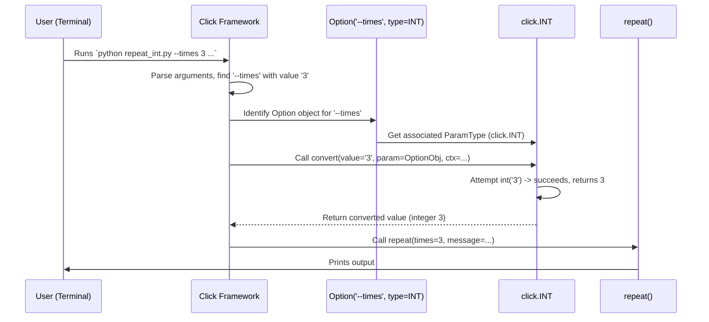
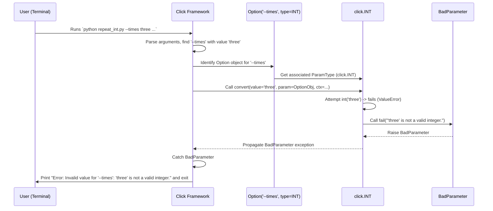

# Chapter 5: ParamType - Checking and Converting Inputs

In the previous chapters, we learned how to define commands using [`@click.command()`](02_command.md), add settings with [`@click.option()`](03_option.md), and specify core inputs with [`@click.argument()`](04_argument.md). These tools let us get information *from* the user via the command line.

But there's a small catch: everything the user types on the command line is initially just **text** (a string).

## The Problem: Text vs. The Right Kind of Data

Imagine you're building a tool that needs a number, maybe the age of a user or the number of times to repeat an action:

```bash
$ repeat-message --times 5 "Hello!"
```

Your Python function expects the `times` value to be an integer so you can use it in calculations or loops. But the value `5` from the command line arrives as the *string* `"5"`. What if the user types something that isn't a number?

```bash
$ repeat-message --times five "Hello!" # "five" is not an integer!
```

Your program would likely crash if it tried to use the string `"five"` as if it were the integer `5`. We need a way to:

1.  **Convert** the input string into the correct Python type (like `int`, `float`, `bool`).
2.  **Validate** that the input is actually valid *before* our main function code runs. If it's not valid (like `"five"` when we need an integer), we should tell the user nicely and stop.

## The Solution: `click.ParamType` - The Input Quality Inspector

`click` solves this problem with **Parameter Types**, often referred to as `ParamType`.

Think of a `ParamType` as a **quality inspector** or a **measurement tool** for your command-line inputs (options and arguments). You attach a specific `ParamType` to each parameter, telling `click`:

*   "Hey, this input *should* be an integer."
*   "This input *needs* to be a valid filename."
*   "This input *must* be one of these specific choices: 'red', 'green', or 'blue'."

When your command runs, `click` uses the assigned `ParamType` to automatically:

1.  **Check** if the raw string input from the user matches the rules of the type.
2.  **Convert** the string into the appropriate Python data type (e.g., `"5"` becomes the integer `5`).
3.  **Report Errors:** If the input is invalid, `click` stops execution and shows a helpful error message to the user *before* your command function is even called.

This saves you from writing lots of repetitive checking and conversion code inside your command functions!

## Using Built-in Parameter Types

`click` comes with several handy built-in `ParamType`s for common needs. You typically use them by passing them to the `type=` argument in `@click.option()` or `@click.argument()`.

Let's look at some examples:

**1. `click.INT` - For Integers**

We want our `repeat-message` command to take an integer number of times.

```python
# filename: repeat_int.py
import click

@click.command()
@click.option('--times', type=click.INT, default=1, help='Number of times to repeat.')
@click.argument('message')
def repeat(times, message):
  """Repeats a MESSAGE the specified number of TIMES."""
  if times < 0:
    click.echo("Error: Times cannot be negative.", err=True)
    return

  for _ in range(times):
    click.echo(message)

if __name__ == '__main__':
  repeat()
```

**Explanation:**

*   `@click.option('--times', type=click.INT, ...)`: We tell the `--times` option that its value must be convertible to an integer using `type=click.INT`.
*   `def repeat(times, message):`: When the function runs, the `times` parameter will already be an actual Python `int`, not a string! `click` handled the conversion.

**Try it out:**

```bash
# Valid input
$ python repeat_int.py --times 3 "Hi"
Hi
Hi
Hi

# Invalid input - click catches it!
$ python repeat_int.py --times three "Hi"
Usage: repeat_int.py [OPTIONS] MESSAGE
Try 'repeat_int.py --help' for help.

Error: Invalid value for '--times': 'three' is not a valid integer.

# Negative input (valid integer, but our function checks it)
$ python repeat_int.py --times -2 "Negative"
Error: Times cannot be negative.

# Default value (also an int)
$ python repeat_int.py "Default"
Default
```

Notice how `click` automatically gave an error for `"three"` because `click.INT` couldn't convert it.

**2. `click.FLOAT` - For Decimal Numbers**

Similar to `INT`, but for floating-point numbers.

```python
# filename: measure.py
import click

@click.command()
@click.argument('value', type=click.FLOAT)
def process_value(value):
  """Processes a floating-point VALUE."""
  click.echo(f"Processing value: {value}")
  click.echo(f"Type in Python: {type(value)}")

if __name__ == '__main__':
  process_value()
```

**Try it out:**

```bash
$ python measure.py 3.14
Processing value: 3.14
Type in Python: <class 'float'>

$ python measure.py -0.5
Processing value: -0.5
Type in Python: <class 'float'>

$ python measure.py abc
Usage: measure.py [OPTIONS] VALUE
Try 'measure.py --help' for help.

Error: Invalid value for 'VALUE': 'abc' is not a valid float.
```

**3. `click.BOOL` - For True/False Values**

Handles converting various strings like "true", "false", "1", "0", "yes", "no" into Python `True` or `False`. Often used implicitly with `is_flag=True` options (where the presence of the flag means `True`), but can be used explicitly too.

```python
# filename: toggle.py
import click

@click.command()
@click.option('--enable/--disable', default=True, help='Enable or disable feature.')
def toggle(enable):
  """Demonstrates boolean options."""
  if enable:
    click.echo("Feature is ENABLED")
  else:
    click.echo("Feature is DISABLED")

if __name__ == '__main__':
  toggle()
```

**Explanation:**

*   `@click.option('--enable/--disable', ...)`: This special format creates two flags. `--enable` sets the value to `True`, and `--disable` sets it to `False`. `click` uses `BOOL` logic internally here.

**Try it out:**

```bash
$ python toggle.py
Feature is ENABLED

$ python toggle.py --enable
Feature is ENABLED

$ python toggle.py --disable
Feature is DISABLED
```

**4. `click.Choice` - Restricting to Specific Values**

What if an input must be one of a few specific strings? `click.Choice` is perfect for this.

```python
# filename: set_color.py
import click

@click.command()
@click.argument('color', type=click.Choice(['red', 'green', 'blue'], case_sensitive=False))
def set_color(color):
  """Sets the color to COLOR (red, green, or blue)."""
  click.echo(f"Color set to: {color}") # color will be lowercase due to case_sensitive=False

if __name__ == '__main__':
  set_color()
```

**Explanation:**

*   `type=click.Choice(['red', 'green', 'blue'], case_sensitive=False)`: This tells `click` the `color` argument *must* be one of the strings in the list. `case_sensitive=False` means "RED" or "Red" will also work and be converted to "red".

**Try it out:**

```bash
$ python set_color.py green
Color set to: green

$ python set_color.py BLUE
Color set to: blue

$ python set_color.py yellow
Usage: set_color.py [OPTIONS] COLOR
Try 'set_color.py --help' for help.

Error: Invalid value for 'COLOR': 'yellow' is not one of 'red', 'green', 'blue'.
```

**5. `click.Path` - For Files and Directories**

Checks if a path exists, is a file or directory, is readable/writable, etc. *without* opening the file. Returns the path string (or `pathlib.Path` object if configured).

```python
# filename: check_file.py
import click

@click.command()
@click.argument('input_file', type=click.Path(exists=True, file_okay=True, dir_okay=False, readable=True))
def check(input_file):
  """Checks if INPUT_FILE exists and is readable."""
  click.echo(f"File '{input_file}' looks good!")

if __name__ == '__main__':
  check()
```

**Explanation:**

*   `type=click.Path(...)`: We configure the `Path` type:
    *   `exists=True`: The path must exist.
    *   `file_okay=True`: It's okay if it's a file.
    *   `dir_okay=False`: It's *not* okay if it's a directory.
    *   `readable=True`: The file must be readable by the current user.

**Try it out (assuming `myfile.txt` exists and is readable, but `mydir` is a directory and `nonexistent.txt` doesn't exist):**

```bash
# Assuming myfile.txt exists and is readable
$ python check_file.py myfile.txt
File 'myfile.txt' looks good!

# Assuming mydir exists but is a directory
$ python check_file.py mydir
Usage: check_file.py [OPTIONS] INPUT_FILE
Try 'check_file.py --help' for help.

Error: Invalid value for 'INPUT_FILE': Path 'mydir' is a directory.

# Assuming nonexistent.txt does not exist
$ python check_file.py nonexistent.txt
Usage: check_file.py [OPTIONS] INPUT_FILE
Try 'check_file.py --help' for help.

Error: Invalid value for 'INPUT_FILE': Path 'nonexistent.txt' does not exist.
```

**6. `click.File` - Opening Files Automatically**

Even more convenient for files you need to read or write. It *opens* the file for you and passes the file object to your function. `click` also automatically closes the file when your command finishes!

```python
# filename: read_file.py
import click

@click.command()
@click.argument('input_file', type=click.File('r')) # 'r' means open for reading text
def read(input_file):
  """Reads and prints the content of INPUT_FILE."""
  content = input_file.read()
  click.echo("--- File Content ---")
  click.echo(content)
  click.echo("--- End of Content ---")
  # File is automatically closed by Click after this function returns

if __name__ == '__main__':
  read()
```

**Explanation:**

*   `type=click.File('r')`: Opens the file specified by the `input_file` argument in read mode (`'r'`).
*   `def read(input_file):`: The `input_file` parameter here is *not* a string filename, but an open file object (like what you get from `open(...)`).

**Try it out (assuming `hello.txt` contains "Hello World"):**

```bash
$ python read_file.py hello.txt
--- File Content ---
Hello World

--- End of Content ---

$ python read_file.py non_existent.txt
Usage: read_file.py [OPTIONS] INPUT_FILE
Try 'read_file.py --help' for help.

Error: Invalid value for 'INPUT_FILE': 'non_existent.txt': No such file or directory
```

Other built-in types include `DateTime`, `UUID`, `IntRange`, and `FloatRange`.

## How `ParamType` Works Under the Hood

It's simpler than you might think!

1.  **Setup:** When you use `@click.option('--age', type=click.INT)` or `@click.argument('filename', type=click.Path(exists=True))`, `click` stores this `type` object (like `click.INT` or an instance of `click.Path`) along with the definition of the option or argument. (Remember how parameters were stored on the function temporarily in the [Option](03_option.md) and [Argument](04_argument.md) chapters? The type goes along for the ride).
2.  **Parsing:** When the user runs your command (`python your_script.py --age 30 data.txt`), `click` parses the command line and gets the raw string values for each parameter (e.g., `"30"` for `--age`, `"data.txt"` for the filename argument).
3.  **Conversion/Validation:** For each parameter, `click` finds the `ParamType` object associated with it. It then calls the type object's `convert()` method, passing the raw string value (e.g., it calls `click.INT.convert("30")`).
4.  **Inside `convert()`:**
    *   The `convert()` method tries to transform the string into the target Python type (e.g., `int("30")` which results in `30`).
    *   It also performs any validation checks (e.g., `click.Path` checks if the file exists).
    *   If everything is okay, `convert()` returns the final Python value (e.g., the integer `30`, or the string `"data.txt"` after checking it exists).
    *   If something goes wrong (e.g., `int("thirty")` raises a `ValueError`, or `click.Path` finds the file doesn't exist), the `convert()` method calls its own `fail()` method.
5.  **Handling Failure:** `fail()` raises a special `click.BadParameter` exception with a helpful message.
6.  **Error Display:** `click` catches this `BadParameter` exception, stops the program gracefully, and prints the error message to the user.
7.  **Success:** If all parameters convert successfully, `click` calls your command function, passing the *converted* Python values as arguments.

**Sequence Diagram (Example: `python repeat_int.py --times 3 ...`)**



**Sequence Diagram (Example: `python repeat_int.py --times three ...`)**



**Code Glimpse (Simplified):**

Let's look inside `src/click/types.py`:

```python
# Simplified from src/click/types.py

class ParamType:
    """Base class for parameter types."""
    name: str # Example: 'integer', 'filename'

    def convert(self, value, param, ctx):
        """Converts the value. This is the core method."""
        # Default implementation does nothing. Subclasses override this.
        return value

    def fail(self, message, param=None, ctx=None):
        """Raises a BadParameter exception."""
        raise BadParameter(message, ctx=ctx, param=param)

class IntParamType(ParamType):
    name = "integer"

    def convert(self, value, param, ctx):
        try:
            # The core conversion logic!
            return int(value)
        except ValueError:
            # If int() fails, call fail() to raise the Click exception
            self.fail(f"'{value}' is not a valid integer.", param, ctx)

# Other types like FloatParamType, Path, File follow similar patterns,
# implementing their specific conversion and validation logic in convert().

# How `type=int` maps to `click.INT`:
def convert_type(ty, default=None):
    # ... (logic to handle different inputs) ...
    if ty is int:
        return INT # INT is an instance of IntParamType()
    if ty is float:
        return FLOAT
    if ty is bool:
        return BOOL
    if ty is str or ty is None:
        return STRING
    # ... etc. ...
    # If 'ty' is already a ParamType instance, return it directly
    if isinstance(ty, ParamType):
         return ty
    # ... (handle other cases like tuples, functions) ...
```

When you write `@click.option('--times', type=int)`, `click` internally calls `convert_type(int)` which returns the pre-made `click.INT` instance. This instance's `convert` method is then used during parsing.

## Custom Parameter Types

While the built-in types cover many cases, you can create your *own* custom `ParamType` by subclassing `click.ParamType` and overriding the `convert` method (and potentially setting the `name` attribute). This is useful for complex validation rules specific to your application (like checking if a string is a valid URL, or parsing a custom date format).

Here's a quick example from the Click documentation (`examples/validation/validation.py`):

```python
# Simplified from examples/validation/validation.py
from urllib import parse as urlparse
import click

class URL(click.ParamType):
    name = "url" # Name shown in help messages

    def convert(self, value, param, ctx):
        # If it's already a parsed URL, accept it
        if not isinstance(value, tuple): # urlparse returns a tuple-like object
            try:
                # Try parsing the string value as a URL
                parsed_url = urlparse.urlparse(value)
                # Perform custom validation: only allow http/https
                if parsed_url.scheme not in ("http", "https"):
                    self.fail(
                        f"invalid URL scheme ({parsed_url.scheme})."
                        " Only HTTP(S) URLs are allowed.",
                        param, ctx,
                    )
                return value # Return the original string if valid
            except Exception: # Broad exception for simplicity here
                self.fail(f"{value!r} is not a valid URL.", param, ctx)
        # If it was already parsed somehow, return it
        return value

@click.command()
@click.option('--website', type=URL(), help='A website URL.')
def cli(website):
    click.echo(f"Website: {website}")

if __name__ == '__main__':
    cli()
```

**Try it:**

```bash
$ python your_script.py --website https://example.com
Website: https://example.com

$ python your_script.py --website ftp://example.com
Usage: your_script.py [OPTIONS]
Try 'your_script.py --help' for help.

Error: Invalid value for '--website': invalid URL scheme (ftp). Only HTTP(S) URLs are allowed.

$ python your_script.py --website not-a-url
Usage: your_script.py [OPTIONS]
Try 'your_script.py --help' for help.

Error: Invalid value for '--website': 'not-a-url' is not a valid URL.
```

## Conclusion

`click.ParamType` is a powerful and essential feature for creating robust command-line interfaces.

*   They ensure that the input provided by the user is of the **correct type** and **format**.
*   They **convert** raw command-line strings into useful Python objects (like `int`, `float`, file objects).
*   They provide automatic **validation** and user-friendly **error messages**.
*   `click` offers many **built-in types** (`INT`, `FLOAT`, `BOOL`, `Choice`, `Path`, `File`, etc.) that cover common use cases.
*   You can create **custom types** for specialized validation needs.

By using parameter types effectively, you make your command functions cleaner (less validation code) and your CLI tools more reliable and easier for users to interact with.

Now that we know how to define individual commands with options and arguments, and how to validate their input, how do we structure an application with *multiple* commands (like `git status`, `git commit`, `git push`)? That's where our next topic comes in!

---> Next Chapter: [Group](06_group.md)

---

Generated by [AI Codebase Knowledge Builder](https://github.com/The-Pocket/Tutorial-Codebase-Knowledge)