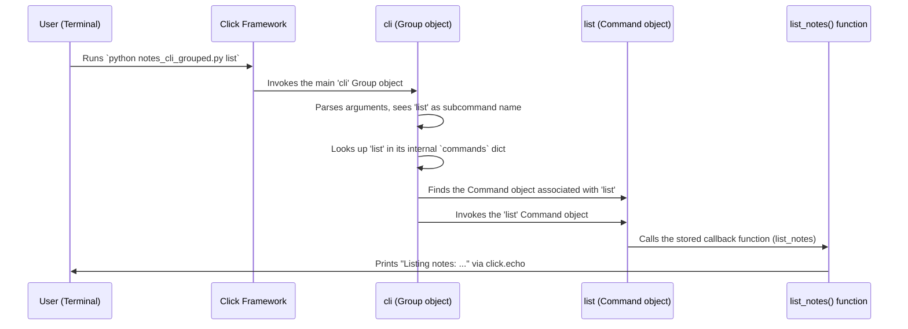

# Chapter 6: Group - Your Command Toolbox

Welcome back! In [Chapter 5: ParamType](05_paramtype.md), we learned how to make sure the inputs to our commands are the right type and format using tools like `click.INT` and `click.Path`. We now know how to build a single, robust command.

But what if your application needs to do *more than one thing*? Think about `git`. You have `git commit`, `git push`, `git pull`, `git status`, and many more. They are all related to `git`, but they are distinct actions. How do you build a tool that bundles multiple commands together like this?

## The Problem: One Tool, Many Actions

Imagine you're building a simple note-taking application for the command line. You might want actions like:

*   `note add "Buy milk"`: Add a new note.
*   `note list`: Show all notes.
*   `note clear`: Delete all notes.

Using only `@click.command()`, you could create three separate scripts: `note_add.py`, `note_list.py`, `note_clear.py`. But that's clumsy! Users want a single tool, `note`, with different subcommands (`add`, `list`, `clear`). How do we create this structure?

## The Solution: `click.Group` - The Toolbox

This is where `click.Group` comes in! A `Group` is a special kind of [Command](02_command.md) that acts as a **container**. It can hold other `Command`s (and even other `Group`s!) inside it.

**Analogy: The Toolbox**

*   If a `click.Command` is like a single tool (a hammer, a screwdriver),
*   Then a `click.Group` is like the **toolbox** itself. It holds multiple tools, keeping them organized under one name.

Groups allow you to build complex, multi-level command-line interfaces. You can have a main entry point (the group) and then various commands attached to it.

## Creating Your First Group

Creating a group is very similar to creating a command, but you use the `@click.group()` decorator instead of `@click.command()`. The function decorated by `@click.group()` serves as the entry point for your entire CLI application.

```python
# filename: notes_cli.py
import click

# 1. Create the main group
@click.group()
def cli():
  """A simple note-taking CLI."""
  # This function runs whenever any command in the group is invoked.
  # Good place for setup common to all commands (more on this later).
  pass

# 2. Define individual commands (we'll add them to the group next)
# @click.command() # We'll replace this soon
def add():
  """Adds a new note (implementation pending)."""
  click.echo("Adding a new note...")

# @click.command() # We'll replace this soon
def list_notes():
  """Lists all notes (implementation pending)."""
  click.echo("Listing all notes...")

if __name__ == '__main__':
  cli() # Run the main group
```

**Explanation:**

1.  `@click.group()`: This decorator turns the `cli` function into a `click.Group` object. This object will be our main "toolbox".
2.  `def cli(): ... pass`: The code inside the group function runs *before* the code of any specific subcommand that gets called. We'll leave it empty for now.
3.  `def add(): ...` and `def list_notes(): ...`: These are regular Python functions that will become our "tools" (commands).
4.  `if __name__ == '__main__': cli()`: We run the `cli` group object when the script is executed.

If you run this now (`python notes_cli.py --help`), you'll see the help for the group, but it won't list any commands yet because we haven't attached `add` or `list_notes` to it.

## Adding Commands to a Group

How do we put our "tools" (`add`, `list_notes`) into the "toolbox" (`cli`)?

The `Group` object created by `@click.group()` (which is now referenced by the variable `cli` in our script) has a special method called `command()`. This method works as a **decorator** that you can apply to your command functions.

```python
# filename: notes_cli_grouped.py
import click

# 1. Create the main group
@click.group()
def cli():
  """A simple note-taking CLI."""
  pass

# 2. Add commands to the group using the group instance as a decorator
@cli.command() # <-- Decorate with the group object!
@click.argument('text')
def add(text):
  """Adds TEXT as a new note."""
  click.echo(f"Adding note: '{text}'")
  # (In a real app, you'd save the note here)

@cli.command("list") # <-- You can explicitly name the command
def list_notes():
  """Lists all saved notes."""
  click.echo("Listing notes:")
  # (In a real app, you'd load and print notes here)
  click.echo("- Buy milk (Example)")
  click.echo("- Call Mom (Example)")

if __name__ == '__main__':
  cli()
```

**Explanation:**

*   `@cli.command()`: Instead of `@click.command()`, we use `@cli.command()` above the `add` function. This tells the `cli` group: "Hey, take this `add` function and register it as a subcommand under your control."
    *   The command name will default to the function name (`add`).
    *   We can still stack other decorators like `@click.argument('text')` below `@cli.command()`.
*   `@cli.command("list")`: Here, we explicitly tell the `cli` group to register the `list_notes` function as a subcommand named `list`.

**Try it out!**

Now, when you run the script, `click` knows about the subcommands attached to `cli`.

```bash
# Ask for help on the main group
$ python notes_cli_grouped.py --help
Usage: notes_cli_grouped.py [OPTIONS] COMMAND [ARGS]...

  A simple note-taking CLI.

Options:
  --help  Show this message and exit.

Commands:
  add   Adds TEXT as a new note. # <-- Command 'add' is listed!
  list  Lists all saved notes.   # <-- Command 'list' is listed!

# Run the 'add' command
$ python notes_cli_grouped.py add "Remember Click Groups"
Adding note: 'Remember Click Groups'

# Run the 'list' command
$ python notes_cli_grouped.py list
Listing notes:
- Buy milk (Example)
- Call Mom (Example)

# Ask for help on a specific command
$ python notes_cli_grouped.py add --help
Usage: notes_cli_grouped.py add [OPTIONS] TEXT

  Adds TEXT as a new note.

Arguments:
  TEXT  [required]

Options:
  --help  Show this message and exit.
```

Success! We now have a single script `notes_cli_grouped.py` that acts as a unified tool with multiple commands (`add`, `list`). The `Group` organized them for us.

## Nested Groups: Toolboxes within Toolboxes

Just like you can have smaller organizers inside a big toolbox, `click` allows `Group`s to contain other `Group`s. This lets you create deeply nested command structures.

Consider `git`:
*   `git` (top-level Group)
    *   `commit` (Command)
    *   `push` (Command)
    *   `remote` (Sub-Group)
        *   `add` (Command)
        *   `remove` (Command)
        *   `show` (Command)

You achieve this by creating another function decorated with `@click.group()` and adding *that* group to the main group using `@cli.group()` (similar to `@cli.command()`).

```python
# filename: nested_cli.py
import click

# Main application group
@click.group()
def cli():
    """Main CLI tool."""
    pass

# --- Simple Command directly under 'cli' ---
@cli.command()
def status():
    """Checks the status."""
    click.echo("Checking status...")

# --- Sub-Group 'remote' ---
@cli.group()
def remote():
    """Manages remote repositories."""
    pass

# --- Command under the 'remote' sub-group ---
@remote.command()
@click.argument('name')
@click.argument('url')
def add(name, url):
    """Adds a new remote."""
    click.echo(f"Adding remote '{name}' with URL '{url}'")

# --- Command under the 'remote' sub-group ---
@remote.command()
@click.argument('name')
def remove(name):
    """Removes a remote."""
    click.echo(f"Removing remote '{name}'")

if __name__ == '__main__':
    cli()
```

**Try it:**

```bash
# Help for the main group
$ python nested_cli.py --help
Usage: nested_cli.py [OPTIONS] COMMAND [ARGS]...

  Main CLI tool.

Options:
  --help  Show this message and exit.

Commands:
  remote  Manages remote repositories. # <-- Sub-group listed
  status  Checks the status.

# Help for the 'remote' sub-group
$ python nested_cli.py remote --help
Usage: nested_cli.py remote [OPTIONS] COMMAND [ARGS]...

  Manages remote repositories.

Options:
  --help  Show this message and exit.

Commands:
  add     Adds a new remote. # <-- Commands within 'remote'
  remove  Removes a remote.

# Run a nested command
$ python nested_cli.py remote add origin https://github.com/example/repo.git
Adding remote 'origin' with URL 'https://github.com/example/repo.git'
```

This nesting capability makes `click.Group` extremely powerful for organizing complex applications.

## How Groups Work Under the Hood

1.  **Group Creation:** `@click.group()` works just like `@click.command()`, but it creates an instance of the `click.Group` class instead of `click.Command`. `Group` is actually a *subclass* of `Command`, so it inherits all the basic command features but adds the ability to hold other commands.
2.  **Command Registration:** When you use `@cli.command()` or `@cli.group()` on a function (`add`, `list_notes`, `remote`), you're essentially calling the `command()` or `group()` *method* of the `cli` (Group) object.
3.  **Storing Commands:** These methods take the decorated function, turn it into a `Command` or `Group` object (just like the top-level decorators do), and then store this new command object in an internal dictionary (often called `commands`) within the parent `Group` object (`cli`). The key in the dictionary is the command's name ("add", "list", "remote").
4.  **Lookup on Execution:** When you run `python notes_cli_grouped.py list`, `click` first invokes the main `cli` group. The `Group` object then parses the command line arguments. It sees "list" and looks up "list" in its internal `commands` dictionary.
5.  **Invoking Subcommand:** If it finds a matching command object (the one created from the `list_notes` function), it invokes *that* command object, passing any remaining arguments to it.

**Sequence Diagram (Running `python notes_cli_grouped.py list`):**



**Code Glimpse (Simplified):**

Inside `click/decorators.py`, the `group` decorator is simple:

```python
# Simplified from src/click/decorators.py
from .core import Group # Import the Group class

# Simplified view of the @click.group decorator factory
def group(name: str | _AnyCallable | None = None, cls: type[GrpType] | None = None, **attrs: t.Any):
    """Creates a new Group with a function as callback."""
    # If no class specified, default to Group
    if cls is None:
        cls = Group # <-- Use Group instead of Command!

    # Use the existing 'command' decorator logic, but pass cls=Group
    if callable(name):
        # Handle case like @click.group def mygroup(): ...
        return command(cls=cls, **attrs)(name)
    # Handle case like @click.group('mygroup') def mygroup_func(): ...
    return command(name, cls, **attrs)
```

It mostly reuses the `@click.command` logic but ensures the created object is a `click.Group`.

Inside `click/core.py`, the `Group` class has methods to add commands:

```python
# Simplified from src/click/core.py

class Group(Command):
    """A Group allows a command to have subcommands."""

    def __init__(self, name: str | None = None, commands: dict[str, Command] | Sequence[Command] | None = None, **attrs: t.Any) -> None:
        super().__init__(name, **attrs)
        # The dictionary to store subcommands
        self.commands: dict[str, Command] = {}
        if commands is not None:
            # Allow passing commands during initialization
            if isinstance(commands, dict):
                self.commands.update(commands)
            else:
                for command in commands:
                    self.add_command(command)

    def add_command(self, cmd: Command, name: str | None = None) -> None:
        """Registers another command with this group."""
        name = name or cmd.name
        if name is None:
            raise TypeError("Command must have a name.")
        # Store the command in the dictionary
        self.commands[name] = cmd

    def command(self, *args: t.Any, **kwargs: t.Any) -> t.Callable[[t.Callable[..., t.Any]], Command]:
        """A decorator that registers a command with this group."""
        # Use the global @click.command decorator to create the Command
        from .decorators import command
        decorator = command(*args, **kwargs)

        def wrapper(f: t.Callable[..., t.Any]) -> Command:
            # Create the command object using the decorator
            cmd = decorator(f)
            # Add the created command to this group's dictionary
            self.add_command(cmd)
            return cmd
        return wrapper

    def group(self, *args: t.Any, **kwargs: t.Any) -> t.Callable[[t.Callable[..., t.Any]], Group]:
        """A decorator that registers a group with this group."""
        # Similar to command(), but uses @click.group
        from .decorators import group
        decorator = group(*args, **kwargs)

        def wrapper(f: t.Callable[..., t.Any]) -> Group:
            grp = decorator(f)
            self.add_command(grp)
            return grp
        return wrapper

    def get_command(self, ctx: Context, cmd_name: str) -> Command | None:
        """Given a context and a command name, find the command object."""
        # Basic lookup in the commands dictionary
        return self.commands.get(cmd_name)

    # ... (Methods for parsing, handling help, invoking subcommands) ...
```

The key methods are `add_command` (which stores a command in the `self.commands` dict) and the `command`/`group` methods (which act as decorators, create the subcommand object, and then call `add_command`).

## Conclusion

You've unlocked a major feature of `click`: **Groups**!

*   `click.Group` acts like a **toolbox**, organizing multiple related `Command`s under a single entry point.
*   You create a group using the `@click.group()` decorator.
*   You add commands or other groups to a parent group by using the parent group instance as a decorator (e.g., `@cli.command()`, `@cli.group()`).
*   This allows you to build structured, multi-level CLI applications like `git` or your own `notes` tool.
*   Under the hood, a `Group` stores its subcommands in a dictionary and looks them up by name when you run the application.

Groups help structure your application, but how do commands within a group share information? What if the main `cli` function needs to set up a configuration object that the `add` and `list` commands need to access? This requires understanding how `click` manages the state during execution, which leads us to our next topic: the **Context**.

---> Next Chapter: [Context](07_context.md)

---

Generated by [AI Codebase Knowledge Builder](https://github.com/The-Pocket/Tutorial-Codebase-Knowledge)