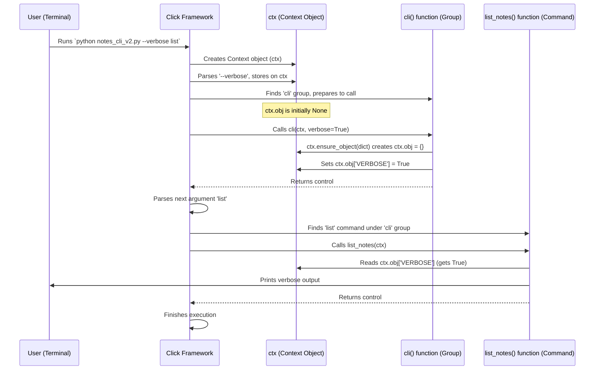

# Chapter 7: Context - The Command's Workspace

Welcome back! In [Chapter 6: Group](06_group.md), we learned how to organize multiple commands together using `@click.group()`, creating powerful tools like `git` or our `notes` example. This structure is great, but it brings up a new question: how can these different commands (like `notes add` and `notes list`) share information or settings?

## The Problem: Sharing Information Between Commands

Imagine you want to add a `--verbose` flag to your main `notes` application. If the user runs `notes --verbose list`, you want the `list` command to print extra details.

```python
# filename: notes_cli_v1.py
import click

# How does the 'list' command know if '--verbose' was passed to 'cli'?
@click.group()
@click.option('--verbose', is_flag=True, help='Enable verbose output.')
def cli(verbose):
  """A simple note-taking CLI."""
  # We have 'verbose' here, but how do we give it to 'add' or 'list'?
  if verbose:
    click.echo("Verbose mode is ON for the main cli group.")

@cli.command("list")
def list_notes():
  """Lists all saved notes."""
  # How can I check the verbose flag here?
  is_verbose = False # Need a way to get the real value!
  click.echo("Listing notes:")
  click.echo("- Buy milk (Example)")
  if is_verbose:
    click.echo("  (Found in notes.db at line 5)")
  click.echo("- Call Mom (Example)")
  if is_verbose:
    click.echo("  (Found in notes.db at line 12)")

# ... (add command, etc) ...

if __name__ == '__main__':
  cli()
```

The `cli` function gets the `verbose` flag, but the `list_notes` function doesn't automatically know about it. They are separate functions called at different times. How can we pass the `verbose` setting (or other shared data, like a database connection) from the parent group (`cli`) down to the child command (`list`)?

## The Solution: `click.Context` - Passing the Backpack

`click` solves this with the **Context** object, usually referred to as `ctx`.

Think of the Context as a **backpack** or a **workspace** that is carried along throughout the execution of your command-line tool.

*   When you run your script, `click` creates a Context object.
*   It fills this context with useful information: parsed parameters (options, arguments), information about the command being run, links to parent commands (if in a group), and more.
*   Crucially, this Context object is passed down from a group to the specific subcommand that gets executed.
*   You can attach your *own* data to this context, allowing you to share information between commands.

**Key Features of the Context (`ctx`):**

1.  **State Holder:** Keeps track of everything happening *during* a specific command invocation.
2.  **Information Source:** Contains parsed parameters, help strings, etc.
3.  **Communication Channel:** Allows passing custom data between parent and child commands.
4.  **Control Object:** Provides methods for controlling the application flow (like exiting or invoking other commands).

## Getting Access to the Context: `@click.pass_context`

How do you get hold of this magical context object in your function? You use the `@click.pass_context` decorator!

This decorator must be placed *first* (innermost, right above the `def`). It tells `click` to pass the current `Context` object as the *first argument* to your function.

Let's modify our `notes` example:

```python
# filename: notes_cli_v2.py
import click

@click.group()
@click.option('--verbose', is_flag=True, help='Enable verbose output.')
@click.pass_context # <-- Ask for the context object
def cli(ctx, verbose): # <-- 'ctx' is now the first argument!
  """A simple note-taking CLI."""
  # We can store our own data on the context!
  # A common practice is to use ctx.obj for custom data.
  # Let's store the verbose flag there.
  ctx.ensure_object(dict) # Ensure ctx.obj exists and is a dict
  ctx.obj['VERBOSE'] = verbose
  if verbose:
    click.echo("Verbose mode is ON (set in cli).")

@cli.command("list")
@click.pass_context # <-- Ask for the context in the subcommand too!
def list_notes(ctx): # <-- 'ctx' is the first argument here too!
  """Lists all saved notes."""
  # Retrieve the verbose flag from the context object!
  is_verbose = ctx.obj['VERBOSE']

  click.echo(f"Listing notes (verbose={is_verbose}):")
  click.echo("- Buy milk (Example)")
  if is_verbose:
    click.echo("  (Details for milk...)")
  click.echo("- Call Mom (Example)")
  if is_verbose:
    click.echo("  (Details for Mom...)")

# ... (add command, etc) ...

if __name__ == '__main__':
  cli()
```

**Explanation:**

1.  `@click.pass_context`: We add this decorator to both `cli` and `list_notes`.
2.  `def cli(ctx, verbose):`: The function signature now includes `ctx` as the first parameter. Other parameters (like `verbose` from `@click.option`) come *after* it.
3.  `ctx.ensure_object(dict)`: This is a handy method. It checks if `ctx.obj` exists. If not, it creates it as an empty dictionary (`dict`). `ctx.obj` is the recommended place to store your custom application state that you want to pass down.
4.  `ctx.obj['VERBOSE'] = verbose`: We store the value of the `verbose` flag inside the `ctx.obj` dictionary with the key `'VERBOSE'`.
5.  `def list_notes(ctx):`: The subcommand also gets the `ctx` object.
6.  `is_verbose = ctx.obj['VERBOSE']`: The `list_notes` function can now access the `ctx.obj` dictionary and retrieve the `'VERBOSE'` value that was set by its parent `cli` group!

**Try it out:**

```bash
# Run normally
$ python notes_cli_v2.py list
Verbose mode is OFF (inferred from lack of output in cli)
Listing notes (verbose=False):
- Buy milk (Example)
- Call Mom (Example)

# Run with verbose flag
$ python notes_cli_v2.py --verbose list
Verbose mode is ON (set in cli).
Listing notes (verbose=True):
- Buy milk (Example)
  (Details for milk...)
- Call Mom (Example)
  (Details for Mom...)
```

It works! The `list` command now knows whether `--verbose` was passed to the main `cli` group because the setting was passed down via the `ctx.obj` attached to the Context.

## Passing Custom Objects with `ctx.obj` and `make_pass_decorator`

Storing simple values like flags in `ctx.obj` as a dictionary is common. But what if you have a more complex object, like a database connection or a configuration object, that you want to pass around?

`ctx.obj` can hold *any* Python object. You can create a custom class to hold your application's state.

```python
# filename: notes_cli_v3.py
import click

# Define a class to hold our shared state
class AppState:
    def __init__(self):
        self.verbose = False
        # You could add other things here, like db_connection = None

# Create a reusable decorator to pass our AppState object
pass_app_state = click.make_pass_decorator(AppState, ensure=True)

@click.group()
@click.option('--verbose', is_flag=True, help='Enable verbose output.')
@pass_app_state # Use our custom decorator
def cli(state, verbose): # <-- Receives AppState object as 'state'
  """A simple note-taking CLI."""
  # Modify the state object directly
  state.verbose = verbose
  if state.verbose:
    click.echo("Verbose mode is ON (set in cli state).")

@cli.command("list")
@pass_app_state # Use our custom decorator here too
def list_notes(state): # <-- Receives the same AppState object
  """Lists all saved notes."""
  # Access the state object directly
  click.echo(f"Listing notes (verbose={state.verbose}):")
  click.echo("- Buy milk (Example)")
  if state.verbose:
    click.echo("  (Details for milk...)")
  click.echo("- Call Mom (Example)")
  if state.verbose:
    click.echo("  (Details for Mom...)")

# ... (add command, etc) ...

if __name__ == '__main__':
  cli()
```

**Explanation:**

1.  `class AppState:`: We define a simple class to hold our shared data (`verbose`).
2.  `pass_app_state = click.make_pass_decorator(AppState, ensure=True)`: This is a powerful helper!
    *   It creates a *new* decorator, similar to `@click.pass_context`.
    *   This new decorator (`@pass_app_state`) finds the nearest `AppState` object stored in `ctx.obj` (or in the `ctx.obj` of any parent contexts).
    *   `ensure=True`: If it can't find an `AppState` object, it creates a new one (`AppState()`) and stores it on the current context's `ctx.obj`. This happens automatically in the `cli` function the first time.
    *   The decorator passes this `AppState` object as the first argument to the decorated function.
3.  `@pass_app_state def cli(state, verbose):`: We use our custom decorator. The first argument is now `state` (an instance of `AppState`), followed by other parameters like `verbose`.
4.  `state.verbose = verbose`: We modify the `verbose` attribute of the shared `state` object.
5.  `@pass_app_state def list_notes(state):`: The subcommand also uses the decorator and receives the *exact same* `AppState` object that `cli` configured.
6.  `click.echo(f"... verbose={state.verbose}")`: The subcommand directly accesses the `verbose` attribute from the shared `state` object.

This approach is cleaner for managing more complex shared state than using a plain dictionary in `ctx.obj`. The `make_pass_decorator` function (and its simpler cousin `@click.pass_obj` which just passes `ctx.obj` directly without type checking or creation) is the standard way to handle shared state in Click applications.

## How the Context Works Under the Hood

1.  **Initialization:** When you run your script (`python notes_cli.py ...`), Click's core machinery starts up. Before anything else, it creates a top-level `Context` object (`ctx`).
2.  **Populating:** Click parses the *initial* command-line arguments (like `--verbose` in our example). It finds the corresponding command or group function (`cli` in our case). Information like the command name, options, and their values are stored on the `ctx`.
3.  **Group Invocation:** If the matched command is a Group (`cli`), Click calls the group's function (our `cli` function), passing the `ctx` object (if requested via `@click.pass_context` or a derivative).
4.  **Modifying Context:** Inside the group function (`cli`), we can modify the `ctx`, often by setting `ctx.obj` (e.g., `ctx.obj['VERBOSE'] = True` or `state.verbose = True`).
5.  **Subcommand Lookup:** After the group function finishes, the `Group` logic uses the `ctx` and the *remaining* command-line arguments ("list") to find the appropriate subcommand.
6.  **Subcommand Invocation:** Click finds the `list` command associated with the `cli` group. It then invokes the `list` command's function (`list_notes`), passing it the *same* `ctx` object (which now contains the modifications we made in step 4).
7.  **Accessing Context:** The subcommand function (`list_notes`) can now access the information stored on `ctx` (e.g., `is_verbose = ctx.obj['VERBOSE']` or `state.verbose`).
8.  **Chaining:** The `ctx` also has a `ctx.parent` attribute, which points to the context of the calling command (if any). This allows commands deep in a nested structure to potentially access information from commands higher up the chain.

**Sequence Diagram (Running `python notes_cli_v2.py --verbose list`):**



**Code Glimpse (Simplified):**

*   **Getting the Context:** Decorators like `@pass_context` are defined in `src/click/decorators.py`. They use `get_current_context` from `src/click/globals.py` which retrieves the context associated with the current thread.

    ```python
    # Simplified from src/click/decorators.py
    from .globals import get_current_context

    def pass_context(f):
        """Marks a callback as wanting to receive the current context
        object as first argument."""
        def new_func(*args, **kwargs):
            # Get the context and pass it as the first argument
            return f(get_current_context(), *args, **kwargs)
        # Make the decorated function look like the original
        return update_wrapper(new_func, f)

    def make_pass_decorator(object_type, ensure=False):
        """Creates a decorator that finds an object of object_type on the context."""
        def decorator(f):
            def new_func(*args, **kwargs):
                ctx = get_current_context()
                obj = None
                if ensure:
                    obj = ctx.ensure_object(object_type) # Get or create the object
                else:
                    obj = ctx.find_object(object_type) # Find object in ctx or parents
                # ... (error handling if obj is None) ...
                # Call the original function with the found/created object
                # ctx.invoke handles parameter injection correctly
                return ctx.invoke(f, obj, *args, **kwargs)
            return update_wrapper(new_func, f)
        return decorator
    ```

*   **Context Class:** The `Context` class itself is defined in `src/click/core.py`. It holds attributes like `parent`, `command`, `params`, and the crucial `obj`.

    ```python
    # Simplified from src/click/core.py
    class Context:
        def __init__(self, command, parent=None, info_name=None, obj=None, ...):
            self.command = command
            self.parent = parent # Link to the parent Context
            self.params = {} # Parsed parameters for this command level
            self.obj = obj # The user object container!
            # ... many other attributes like color settings, help options ...

        def ensure_object(self, object_type):
            """Ensures that ctx.obj exists and is of the correct type."""
            if self.obj is None:
                self.obj = object_type() # Create instance if missing
            # ... (type checking omitted for brevity) ...
            return self.obj

        def find_object(self, object_type):
            """Finds the closest object of a given type in the context chain."""
            node = self
            while node is not None:
                if isinstance(node.obj, object_type):
                    return node.obj
                node = node.parent # Check parent context
            return None

        def invoke(self, callback, *args, **kwargs):
             """Invokes a callback with the given arguments. Makes sure
             that the context is entered and exited properly."""
             # ... (context management code) ...
             return callback(*args, **kwargs)

        # ... many other methods for getting help, exiting, etc. ...
    ```

The `Context` object is central to how Click manages the flow and state of your application during runtime.

## Conclusion

The **Context** (`ctx`) is the invisible thread connecting the different parts of your `click` application during a single run.

*   It acts as a **workspace** holding information about the current command invocation.
*   It's automatically created and passed down from groups to subcommands.
*   You gain access to it using the `@click.pass_context` decorator.
*   The `ctx.obj` attribute is the designated place to store and share your **custom application state** (like configuration, flags, or resources) between commands.
*   `click.make_pass_decorator` provides a convenient way to automatically manage and pass custom state objects stored in `ctx.obj`.

Understanding the context allows you to build more sophisticated applications where different parts need to cooperate and share information.

While the Context helps manage internal state, `click` also provides tools for interacting directly with the user in the terminal – asking questions, showing progress bars, printing colored text, and more. Let's explore these features next!

---> Next Chapter: [Terminal UI (TermUI)](08_terminal_ui__termui_.md)

---

Generated by [AI Codebase Knowledge Builder](https://github.com/The-Pocket/Tutorial-Codebase-Knowledge)