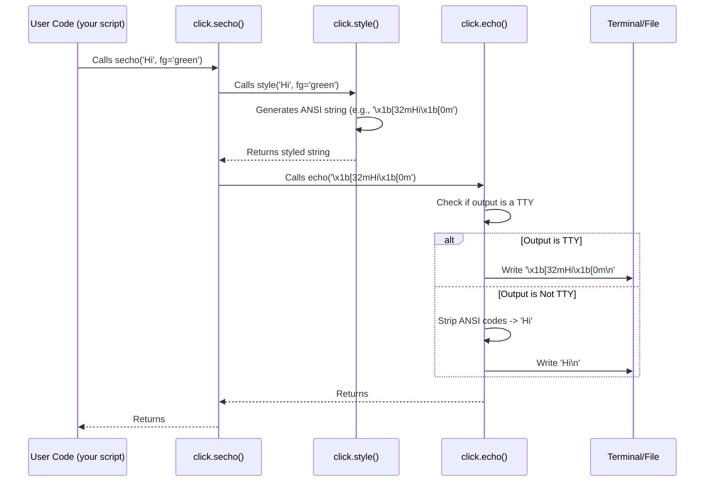

# Chapter 8: Terminal UI (TermUI) - Making Your CLI Talk Back

In the previous chapter, [Context](07_context.md), we saw how `click` manages the state of your application using the `ctx` object, allowing commands to share information. Now, let's focus on how your application *communicates* directly with the user through the terminal.

## The Problem: Beyond Basic Printing

So far, we've mostly used `print()` or `click.echo()` to show output. But modern command-line tools often do much more:
*   Show messages in different colors (like green for success, red for errors).
*   Ask the user questions (like "Are you sure?").
*   Show a progress bar for long-running tasks.
*   Clear the screen or open a file in an editor.

Doing this manually involves handling different terminal types, operating systems, and tricky escape codes. How can we easily add these user-friendly features?

## The Solution: Click's TermUI Helpers - Your CLI's Dashboard

`click` provides a collection of functions specifically designed for terminal interaction, often grouped under the concept of "Terminal UI" or TermUI. These functions are like the dashboard lights, buttons, and display screens for your command-line application.

Think of these helpers as convenient tools in your `click` toolbox for:
*   **Displaying Output:** Printing messages (`echo`, `secho`).
*   **Styling Text:** Adding colors and styles (`style`).
*   **Getting Input:** Asking the user questions (`prompt`, `confirm`).
*   **Showing Progress:** Displaying progress bars (`progressbar`).
*   **Controlling the Terminal:** Clearing the screen (`clear`).
*   **Interacting with the System:** Launching editors or URLs (`edit`, `launch`).

Let's explore some of the most common ones.

## Displaying Output: `echo` and `secho`

We've already seen `click.echo()`. It's generally preferred over Python's built-in `print()` function because:
*   It works more reliably across different Python versions and environments.
*   It handles Unicode better, especially on Windows.
*   It automatically strips out color codes if the output isn't a terminal (e.g., if you pipe the output to a file).

```python
# filename: basic_echo.py
import click

@click.command()
@click.option('--name', default='World', help='Who to greet.')
def greet(name):
    """Greets NAME."""
    click.echo(f"Hello, {name}!") # Use click.echo instead of print

if __name__ == '__main__':
    greet()
```

**Try it:**
```bash
$ python basic_echo.py --name Alice
Hello, Alice!
```

Now, what about adding some color? You *could* manually construct strings with special color codes, but `click` makes it much easier with `click.secho()` (styled echo).

`secho()` works like `echo()` but accepts style keyword arguments like `fg` (foreground color), `bg` (background color), and `bold`.

```python
# filename: styled_echo.py
import click

@click.command()
def notify():
    """Shows different types of messages."""
    click.secho("Operation successful!", fg="green", bold=True)
    click.secho("Warning: Low disk space.", fg="yellow")
    click.secho("Error: File not found.", fg="red", err=True) # err=True prints to stderr

if __name__ == '__main__':
    notify()
```

**Try it:**
(Imagine the following output appears in the specified colors in your terminal)
```bash
$ python styled_echo.py
Operation successful!  # <-- This line is green and bold
Warning: Low disk space. # <-- This line is yellow
Error: File not found.   # <-- This line is red (and went to stderr)
```

## More Control with `style`

`click.secho()` is great for simple styling. If you need to build up more complex styled strings, or style only parts of a string, you can use `click.style()`. It takes text and style arguments, and returns a *new* string with the necessary ANSI color codes embedded. You can then print this string using `click.echo()`.

```python
# filename: complex_style.py
import click

@click.command()
@click.argument('filename')
def process(filename):
    """Processes a file."""
    styled_filename = click.style(filename, fg='cyan', bold=True)
    click.echo(f"Processing file: {styled_filename}")
    # ... processing logic ...
    status = click.style("DONE", fg="green")
    click.echo(f"Status: [{status}]")

if __name__ == '__main__':
    process()
```

**Try it:**
```bash
$ python complex_style.py report.txt
Processing file: report.txt # <-- 'report.txt' is cyan and bold
Status: [DONE]           # <-- 'DONE' is green
```

## Getting User Input: `prompt` and `confirm`

Sometimes your command needs information that wasn't provided via options or arguments. `click.prompt()` is perfect for asking the user for input.

It can also automatically check and convert the input type, just like options and arguments can, using the `type=` parameter (which accepts the same types discussed in [ParamType](05_paramtype.md)). It can also suggest a default value.

```python
# filename: ask_user.py
import click

@click.command()
def setup():
    """Sets up user configuration."""
    username = click.prompt("Enter your username")
    age = click.prompt("Enter your age", type=int) # Use type=int for validation
    destination = click.prompt("Installation directory", default="/usr/local/bin")
    password = click.prompt("Enter password", hide_input=True, confirmation_prompt=True)

    click.echo(f"\nSetup complete for {username} (age {age}).")
    click.echo(f"Will install to: {destination}")
    click.echo(f"Password set: {'*' * len(password)}")

if __name__ == '__main__':
    setup()
```

**Try it:**
```bash
$ python ask_user.py
Enter your username: alice
Enter your age: thirty  # <-- Type 'thirty' here
Error: 'thirty' is not a valid integer.
Enter your age: 30      # <-- Type '30' here
Installation directory [/usr/local/bin]: # <-- Press Enter to accept default
Enter password: <input hidden>
Repeat for confirmation: <input hidden>

Setup complete for alice (age 30).
Will install to: /usr/local/bin
Password set: ********
```

Notice how `prompt` automatically handled the invalid age input and asked again. It also hid the password input.

For simple yes/no questions, `click.confirm()` is even easier. It returns `True` or `False`. You can set `abort=True` to automatically stop the script if the user answers no.

```python
# filename: confirm_action.py
import click

@click.command()
@click.option('--force', is_flag=True, help='Skip confirmation.')
def delete_files(force):
    """Deletes temporary files."""
    if not force:
        # Ask for confirmation, abort if user says no
        click.confirm("Are you sure you want to delete all temp files?", abort=True)

    click.echo("Deleting temporary files...")
    # ... deletion logic ...
    click.secho("Temporary files deleted.", fg="green")

if __name__ == '__main__':
    delete_files()
```

**Try it (answering 'n'):**
```bash
$ python confirm_action.py
Are you sure you want to delete all temp files? [y/N]: n # <-- Type 'n'
Aborted! # <-- Script stops immediately
```

**Try it (answering 'y'):**
```bash
$ python confirm_action.py
Are you sure you want to delete all temp files? [y/N]: y # <-- Type 'y'
Deleting temporary files...
Temporary files deleted. # <-- Script continues
```

**Try it (using `--force`):**
```bash
$ python confirm_action.py --force
Deleting temporary files... # <-- Skips confirmation
Temporary files deleted.
```

## Showing Progress: `progressbar`

For tasks that take a while, it's nice to show the user that something is happening. `click.progressbar()` makes creating terminal progress bars easy. You can use it as a context manager around an iterable, and it will automatically track progress.

```python
# filename: show_progress.py
import click
import time
import random

@click.command()
@click.argument('items', type=int, default=50)
def process_items(items):
    """Processes a number of items with a progress bar."""
    things_to_process = range(items)

    with click.progressbar(things_to_process, label="Processing items") as bar:
        for item in bar:
            # Simulate work
            time.sleep(random.random() * 0.1)

    click.echo("\nFinished processing!")

if __name__ == '__main__':
    process_items()
```

**Try it:**
```bash
$ python show_progress.py
Processing items  [####################################]  100%
Finished processing!
```
(The progress bar will animate in place in your terminal while the script runs.)

You can also use `progressbar` without an iterable if you know the total `length` and manually call the `bar.update(steps)` method.

## Other Helpers

Click includes several other handy functions:
*   `click.clear()`: Clears the terminal screen.
*   `click.launch(url_or_path)`: Opens a URL in the default web browser or a file in its default application.
*   `click.edit(text)`: Opens the user's default text editor with the given text, returning the edited text.

```python
# filename: other_helpers.py
import click

@click.command()
def utils():
    """Demonstrates other UI helpers."""
    if click.confirm("Clear the screen first?"):
        click.clear()

    click.launch("https://click.palletsprojects.com/")
    click.echo("Launched website.")

    note = click.edit("Type your note here.")
    if note:
        click.echo("You wrote:")
        click.echo(note)
    else:
        click.echo("You didn't write anything.")

if __name__ == '__main__':
    utils()
```

## How Does This Work Under the Hood?

These functions hide a lot of complexity related to terminal interactions.

1.  **Styling (`style`, `secho`):**
    *   These functions work by inserting special character sequences called **ANSI escape codes** into the string. For example, `\033[31m` might mean "start red text" and `\033[0m` means "reset all styles".
    *   `click` knows the codes for different colors (like `fg='red'`) and styles (like `bold=True`).
    *   Crucially, `click.echo` and `click.secho` check if the output (`sys.stdout` or `sys.stderr`) is actually an interactive terminal (`isatty()`). If it's not (e.g., output is piped to a file `> output.txt` or another command `| grep ...`), they automatically **strip out** these ANSI codes so you don't get garbage characters in your file or piped output.
    *   On Windows, Click uses the `colorama` library (if installed) to translate ANSI codes into Windows API calls, making colors work on the legacy console.

2.  **Prompting (`prompt`, `confirm`):**
    *   These generally use Python's standard `input()` function for visible prompts.
    *   For hidden input (`hide_input=True`), they use the `getpass.getpass()` function, which attempts to read input without echoing it to the screen.
    *   Type conversion and validation use the same mechanisms as [ParamType](05_paramtype.md).

3.  **Progress Bars (`progressbar`):**
    *   These are quite clever! They work by:
        *   Printing the progress bar line.
        *   Instead of printing a newline character (`\n`) at the end, they print a **carriage return** character (`\r`). The carriage return moves the cursor back to the *beginning* of the current line without moving down.
        *   The *next* time the bar updates, it overwrites the previous bar on the same line.
        *   They often hide the cursor (`\033[?25l`) while the bar is active and show it again (`\033[?25h`) when done.
        *   They calculate the Estimated Time of Arrival (ETA) by keeping track of the time taken for recent steps and extrapolating.
        *   They use terminal width detection (e.g., `shutil.get_terminal_size()`) to try and fit the bar nicely.

4.  **Other Helpers:**
    *   `clear()` sends specific ANSI codes (`\033[2J\033[1;1H`) to clear the screen and move the cursor to the top-left.
    *   `launch()` uses platform-specific commands (`open` on macOS, `start` on Windows, `xdg-open` on Linux) to open files or URLs.
    *   `edit()` finds the default editor (via environment variables like `EDITOR` or platform defaults), creates a temporary file with the text, launches the editor on that file, waits for it to close, reads the file content back, and cleans up.

**Sequence Diagram (Simplified `secho('Hi', fg='green')`)**



**Code Glimpse (Simplified `style` and `echo`)**

Let's peek inside `click/termui.py` and `click/utils.py`:

```python
# Simplified from src/click/termui.py

_ansi_colors = { "green": 32, "red": 31, ... }
_ansi_reset_all = "\033[0m"

def style(text, fg=None, bg=None, bold=None, ..., reset=True):
    bits = []
    if fg:
        bits.append(f"\033[{_ansi_colors[fg]}m")
    if bold:
        bits.append("\033[1m")
    # ... other style codes ...
    bits.append(str(text))
    if reset:
        bits.append(_ansi_reset_all)
    return "".join(bits)

def secho(message=None, ..., **styles):
    if message is not None and not isinstance(message, bytes):
        # Apply styling using the 'style' function
        message = style(message, **styles)
    # Call the regular echo function
    echo(message, ...)

# Simplified from src/click/utils.py
from ._compat import isatty, strip_ansi, WIN, auto_wrap_for_ansi

def echo(message=None, file=None, nl=True, err=False, color=None):
    # ... (determine 'file' based on 'err') ...
    if message is None: message = ""
    if nl: message = str(message) + "\n"

    if not isinstance(message, (bytes, bytearray)):
        # Check if we should strip ANSI codes
        if should_strip_ansi(file, color):
             message = strip_ansi(message)
        # On Windows, wrap the stream for ANSI support if needed
        elif WIN and auto_wrap_for_ansi:
             file = auto_wrap_for_ansi(file, color)

    # Write to the file/stream
    try:
        file.write(message)
        file.flush()
    except BrokenPipeError:
        # Handle case where output pipe is closed
        pass

```

This shows the basic idea: `style` generates strings with codes, `secho` calls `style` then `echo`, and `echo` handles the logic of potentially stripping codes or enabling Windows support before writing to the output stream. The actual implementation handles many more edge cases.

## Conclusion

You've now explored the rich set of **Terminal UI helpers** provided by `click`. These functions allow you to go beyond basic input and output to create more interactive and user-friendly command-line applications.

*   Use `click.echo` for reliable output and `click.secho` or `click.style` for adding **color and styles**.
*   Use `click.prompt` and `click.confirm` to **ask the user questions**.
*   Use `click.progressbar` to show progress during **long operations**.
*   Leverage helpers like `click.clear`, `click.launch`, and `click.edit` for common terminal tasks.
*   `click` handles the underlying complexities of terminal capabilities, ANSI codes, and platform differences for you.

These tools help make your CLIs feel polished and professional. But what happens when things go wrong? How does `click` handle errors, like missing arguments or invalid input? That's our next topic.

---> Next Chapter: [Exceptions](09_exceptions.md)

---

Generated by [AI Codebase Knowledge Builder](https://github.com/The-Pocket/Tutorial-Codebase-Knowledge)