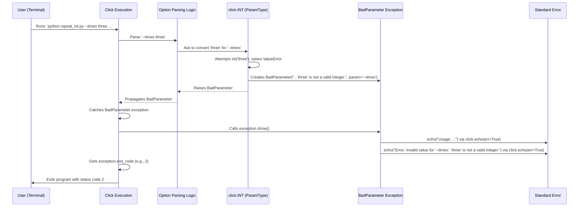

# Chapter 9: Exceptions - Handling Things When They Go Wrong

In the previous chapter, [Terminal UI (TermUI)](08_terminal_ui__termui_.md), we learned how to make our command-line tools interactive and visually appealing using features like colored output, prompts, and progress bars. But what happens when the user makes a mistake? What if they forget a required argument or type an option that doesn't exist?

## The Problem: Confusing Crashes vs. Helpful Errors

Imagine you have a command that needs a number, like `--port 8000`. What if the user types `--port eighty`?

```python
# Potential problem code
import click

@click.command()
@click.option('--port', type=int, required=True)
def run_server(port):
    click.echo(f"Starting server on port {port}...")
    # What happens if port is not an integer?
    # If Click didn't handle it, int(port) might fail later!

if __name__ == '__main__':
    run_server()
```

If `click` didn't have a special way to handle errors, maybe the `type=int` conversion would fail, or maybe the program would crash later with a confusing Python `TypeError` or `ValueError`. The user might just see a long, technical error message (a "stack trace") and have no idea what they did wrong.

Similarly, if an argument is required but missing, just crashing isn't very helpful. We want our tool to politely tell the user, "Hey, you forgot to provide the input filename!" or "Oops, `--port` needs a number, not text."

## The Solution: Click's Specific Error Signals (Exceptions)

`click` handles these situations gracefully using its own set of **custom exception classes**. Exceptions in Python are a way to signal that something unexpected or erroneous has happened. `click` defines specific exceptions for common CLI problems.

**Analogy: Dashboard Warning Lights**

Think of your car's dashboard. It doesn't just have one generic "Problem!" light. It has specific lights:
*   "Low Fuel"
*   "Check Engine"
*   "Oil Pressure Low"
*   "Door Ajar"

Each light tells you *exactly* what kind of problem needs attention. Click's exceptions are like these specific lights. Instead of just crashing (a generic "Problem!"), Click raises different exceptions to signal different issues:

*   `UsageError`: The command was used incorrectly (e.g., missing arguments). Like "Door Ajar" - you used the car wrong.
*   `BadParameter`: A specific option or argument received an invalid value (e.g., text instead of a number). Like "Low Fuel" - one specific input is wrong.
*   `MissingParameter`: A specific type of `BadParameter` when a required input is missing.
*   `NoSuchOption`: The user tried an option that doesn't exist. Like pushing a button that isn't there.
*   `FileError`: Couldn't open a specified file.
*   `Abort`: The user intentionally stopped the operation (e.g., answered 'no' to a confirmation).

By using these specific exceptions, `click` can catch them and display clear, helpful error messages to the user, often including hints on how to fix the problem.

## Seeing Click's Exceptions in Action (Automatic Handling)

The best part is that `click` often raises and handles these exceptions *automatically* for you based on how you define your commands, options, and arguments using decorators and types from previous chapters.

Let's look at examples:

**1. Invalid Value (`BadParameter`)**

Remember our `repeat_int.py` example from [Chapter 5: ParamType](05_paramtype.md)?

```python
# filename: repeat_int.py (from Chapter 5)
import click

@click.command()
@click.option('--times', type=click.INT, default=1, help='Number of times to repeat.')
@click.argument('message')
def repeat(times, message):
  """Repeats a MESSAGE the specified number of TIMES."""
  for _ in range(times):
    click.echo(message)

if __name__ == '__main__':
  repeat()
```

**Try it with invalid input:**

```bash
$ python repeat_int.py --times three "Hi"
Usage: repeat_int.py [OPTIONS] MESSAGE
Try 'repeat_int.py --help' for help.

Error: Invalid value for '--times': 'three' is not a valid integer.
```

What happened here?
*   The user provided `"three"` for `--times`.
*   The `click.INT` type tried to convert `"three"` to an integer.
*   It failed.
*   Instead of crashing, `click.INT` raised a `click.BadParameter` exception internally.
*   `click` caught this exception.
*   It displayed the usage information and the specific error message associated with the exception.
*   The program exited cleanly with an error code (usually 2 for usage errors).

**2. Missing Argument (`MissingParameter`)**

Remember `greet_arg.py` from [Chapter 4: Argument](04_argument.md)?

```python
# filename: greet_arg.py (from Chapter 4)
import click

@click.command()
@click.argument('name') # 'name' is required by default
def greet(name):
  """Greets the person specified by the NAME argument."""
  click.echo(f"Hello, {name}!")

if __name__ == '__main__':
  greet()
```

**Try it without the argument:**

```bash
$ python greet_arg.py
Usage: greet_arg.py [OPTIONS] NAME
Try 'greet_arg.py --help' for help.

Error: Missing argument 'NAME'.
```

Here:
*   `click` parsed the command line and realized the required `name` argument was missing.
*   It raised a `click.MissingParameter` exception (which is a type of `BadParameter`).
*   `click` caught it and showed the specific "Missing argument 'NAME'" error.

**3. Unknown Option (`NoSuchOption`)**

```bash
# Using the same greet_arg.py script
$ python greet_arg.py --nam Alice
Usage: greet_arg.py [OPTIONS] NAME
Try 'greet_arg.py --help' for help.

Error: No such option: --nam. Did you mean --name?
```

Here:
*   `click` encountered `--nam`, which isn't a defined option.
*   It raised a `click.NoSuchOption` exception.
*   `click` caught it and displayed the "No such option" error. It even tries to suggest corrections if the option name is close to a valid one (though we don't have `--name` defined here, if we did, it might suggest it).

## Raising Click Exceptions Manually

While `click` handles many errors automatically, sometimes you need to perform custom validation *inside* your command function or a custom callback/type and signal an error in the standard `click` way. You can do this by raising the appropriate `click` exception yourself.

Let's revisit the validation example from the Click documentation (`examples/validation/validation.py`), slightly simplified:

```python
# filename: custom_validation.py
import click

# A custom validation function for an option
def validate_foo(ctx, param, value):
    if value is not None and value != "wat":
        # Raise BadParameter to signal an invalid value for '--foo'
        raise click.BadParameter(
            'If a value is provided it needs to be the value "wat".',
            param_hint='--foo' # Helps Click format the error nicely
        )
    return value

@click.command()
@click.option('--foo', help='A mysterious parameter.', callback=validate_foo)
def cli(foo):
    """Demonstrates custom validation raising BadParameter."""
    click.echo(f"foo: {foo}")

if __name__ == '__main__':
    cli()
```

**Explanation:**

1.  `validate_foo`: This function is used as a `callback` for the `--foo` option. Callbacks run after the basic type conversion but before the main command function.
2.  `if value is not None and value != "wat":`: We check if the user provided `--foo` and if its value is not exactly "wat".
3.  `raise click.BadParameter(...)`: If the validation fails, we manually raise `BadParameter`. We provide a helpful message and use `param_hint` to tell `click` which parameter caused the issue.
4.  `callback=validate_foo`: We attach our validation function to the option.

**Try it:**

```bash
# Valid usage (not providing --foo)
$ python custom_validation.py
foo: None

# Valid usage (providing --foo wat)
$ python custom_validation.py --foo wat
foo: wat

# Invalid usage
$ python custom_validation.py --foo bar
Usage: custom_validation.py [OPTIONS]
Try 'custom_validation.py --help' for help.

Error: Invalid value for '--foo': If a value is provided it needs to be the value "wat".
```

When we provided `--foo bar`, our `validate_foo` function raised `BadParameter`. Click caught this exception (just like it catches the automatically raised ones) and displayed the error message we provided, correctly attributing it to `--foo`.

You can similarly raise `UsageError` for more general usage problems or `Abort` if you want to stop execution based on some condition (though `click.confirm(..., abort=True)` is often easier for confirmations).

## How Exceptions Work Under the Hood

The process is generally: **Raise -> Catch -> Show -> Exit**.

1.  **Raise:** When an error condition is detected (either automatically by Click's parsing/type conversion or manually by your code), the corresponding `click.ClickException` (or a subclass like `BadParameter`, `UsageError`) is raised.
2.  **Catch:** Click's main execution logic (which wraps the call to your command functions) has a `try...except ClickException` block. It's designed to catch any `ClickException` that bubbles up.
3.  **Show:** When a `ClickException` is caught, the main logic calls the exception object's `show()` method. Each exception type (`UsageError`, `BadParameter`, etc.) has its own `show()` method that knows how to format an appropriate error message.
    *   `UsageError`'s `show()` method usually prints the command usage string first, then the error message.
    *   `BadParameter`'s `show()` method includes the parameter name in the error message.
    *   They all use `click.echo()` to print the message, typically to standard error (`stderr`).
4.  **Exit:** After showing the message, Click exits the application using the `exit_code` defined on the exception class (e.g., `UsageError.exit_code` is 2, `ClickException.exit_code` is 1). This signals to the operating system whether the command succeeded (exit code 0) or failed (non-zero exit code).

**Sequence Diagram (Simplified: Invalid input for `INT` type)**



**Code Glimpse (Simplified):**

Let's look inside `src/click/exceptions.py`:

```python
# Simplified from src/click/exceptions.py

class ClickException(Exception):
    """An exception that Click can handle and show to the user."""
    exit_code = 1

    def __init__(self, message: str) -> None:
        super().__init__(message)
        self.message = message
        # ... store color settings ...

    def format_message(self) -> str:
        # Basic formatting, subclasses can override
        return self.message

    def show(self, file: t.IO[t.Any] | None = None) -> None:
        # Prints the formatted message to stderr by default
        if file is None:
            file = get_text_stderr()
        echo(
            _("Error: {message}").format(message=self.format_message()),
            file=file,
            color=self.show_color,
        )


class UsageError(ClickException):
    """An internal exception that signals a usage error."""
    exit_code = 2

    def __init__(self, message: str, ctx: Context | None = None) -> None:
        super().__init__(message)
        self.ctx = ctx
        # ... store command info ...

    def show(self, file: t.IO[t.Any] | None = None) -> None:
        # Overrides show to potentially print usage first
        if file is None:
            file = get_text_stderr()
        # ... (logic to format hint like 'Try command --help') ...
        if self.ctx is not None:
            echo(f"{self.ctx.get_usage()}\n{hint}", file=file, color=color)
        # Call the basic error printing
        echo(
            _("Error: {message}").format(message=self.format_message()),
            file=file,
            color=color,
        )

class BadParameter(UsageError):
    """An exception for a bad parameter value."""
    def __init__(self, message: str, ..., param: Parameter | None = None, param_hint: str | None = None) -> None:
        super().__init__(message, ctx)
        self.param = param
        self.param_hint = param_hint

    def format_message(self) -> str:
        # Overrides format_message to include the parameter name
        # ... (logic to determine param_hint from self.param or self.param_hint) ...
        if param_hint is None:
            return _("Invalid value: {message}").format(message=self.message)
        return _("Invalid value for {param_hint}: {message}").format(
            param_hint=param_hint_str, message=self.message
        )

class MissingParameter(BadParameter):
   # ... specific formatting for missing parameters ...

class NoSuchOption(UsageError):
   # ... specific formatting for unknown options, potentially with suggestions ...

class Abort(RuntimeError):
    """An internal signalling exception that signals Click to abort."""
    # Note: This is NOT a ClickException subclass, so it's not caught
    # by the default handler unless explicitly caught elsewhere.
    # click.confirm(abort=True) handles this internally.

class Exit(RuntimeError):
    """An exception that indicates the application should exit with some status code."""
    # Also not a ClickException. Used by things like --version.
```

And how a `ParamType` might raise it (from `src/click/types.py`):

```python
# Simplified from src/click/types.py

class ParamType:
    # ... (other methods) ...

    def fail(self, message: str, param: Parameter | None = None, ctx: Context | None = None) -> t.NoReturn:
        """Helper method to fail with an invalid value message."""
        # Raises the standard BadParameter exception!
        raise BadParameter(message, ctx=ctx, param=param)

class IntParamType(ParamType):
    name = "integer"

    def convert(self, value: t.Any, param: Parameter | None, ctx: Context | None) -> t.Any:
        try:
            return int(value)
        except ValueError:
            # If int() fails, call self.fail() to raise BadParameter
            self.fail(f"'{value}' is not a valid integer.", param, ctx)
```

The core idea is that specific error conditions raise specific `ClickException` subclasses, which are then caught and formatted nicely by Click's main execution wrapper.

## Conclusion

You've learned about Click's custom **Exceptions**, which are crucial for robust error handling in command-line interfaces.

*   They act like **specific warning lights**, indicating precisely what went wrong (e.g., `UsageError`, `BadParameter`, `MissingParameter`, `NoSuchOption`).
*   `click` raises these exceptions **automatically** in many common error scenarios (invalid types, missing arguments, unknown options).
*   These exceptions are caught by `click`'s main loop, which displays **user-friendly error messages** and exits gracefully with appropriate status codes.
*   You can **manually raise** `click` exceptions (like `BadParameter`) in your own code for custom validation, ensuring consistent error reporting.

Understanding these exceptions helps you diagnose issues and build CLIs that provide helpful feedback to users when they make mistakes.

So far, we've focused on defining and running commands. But how can we make our CLIs even easier to use by providing automatic command and option completion when the user presses the `Tab` key? Let's explore that next!

---> Next Chapter: [Shell Completion](10_shell_completion.md)

---

Generated by [AI Codebase Knowledge Builder](https://github.com/The-Pocket/Tutorial-Codebase-Knowledge)