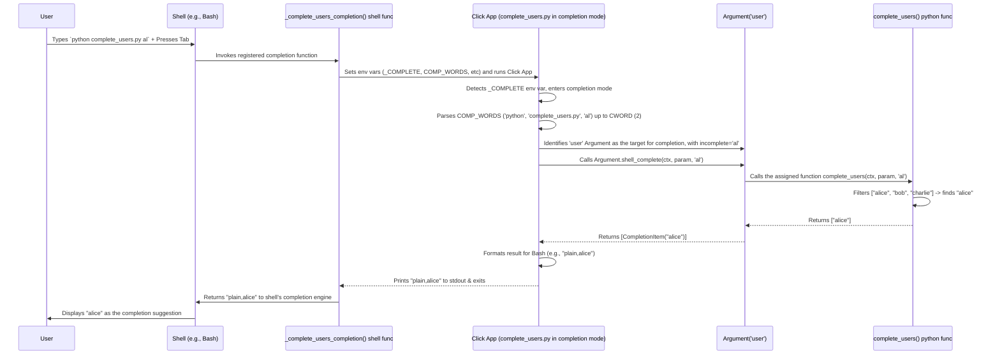

# Chapter 10: Shell Completion - Your CLI's Autopilot

Welcome back! In [Chapter 9: Exceptions](09_exceptions.md), we saw how `click` helps us handle errors gracefully, giving users helpful feedback when things go wrong. Now, let's explore a feature that makes using our CLI tools much faster and less error-prone even *before* an error happens: **Shell Completion**.

## The Problem: Remembering All the Things!

Think about using a tool like `git` or even our `notes` example from [Chapter 6: Group](06_group.md). As tools get more complex, they have:
*   More subcommands (`git commit`, `git push`, `git remote add`, `notes add`, `notes list`).
*   Various options (`--verbose`, `--force`, `--amend`, `--name`).
*   Arguments that might require specific values (like existing filenames, database IDs, or specific keywords).

Typing these out perfectly every time can be slow and error-prone. Did you mean `git checkout` or `git check-out`? Was the option `--user-name` or `--username`? Wouldn't it be nice if the terminal could help you fill in the blanks?

That's exactly what shell completion does! You've probably used it before: you type the first few letters of a command or filename and press the `Tab` key, and the shell magically suggests or completes the rest for you.

## The Solution: Click's Built-in Completion Support

`click` comes with fantastic support for enabling this `Tab` completion for your own CLI applications. It's like giving your CLI an **autopilot** or an **intelligent assistant** that anticipates what you might want to type next.

**How it works:**

1.  **One-Time Setup:** The *user* of your CLI enables completion support for their specific shell (like Bash, Zsh, or Fish). This usually involves adding a line to their shell's configuration file.
2.  **Tab Pressed:** When the user types part of your command and presses `Tab`...
3.  **Magic Happens:** The shell runs a special script (generated by `click`). This script asks your `click` application: "Based on what's typed so far, what could possibly come next?"
4.  **Click Responds:** Your `click` application analyzes the current command line and figures out the valid possibilities (subcommands, option names, or even specific argument values).
5.  **Suggestions Appear:** The script presents these suggestions back to the user in the terminal.

`click` can automatically generate the necessary scripts and provides hooks for you to define custom completions for your arguments.

## Enabling Completion (User Task)

This is the crucial first step, and it's something the *end user* of your CLI tool does **once** for their shell. Your `click` application automatically provides the *mechanism* for this setup.

When you build an application with `click`, it automatically handles special environment variables to support completion. A user can generate the necessary setup script for their shell by running a command like this (replace `your-script-name.py` with your actual script):

*   **Bash:** Add this to `~/.bashrc`:
    ```bash
    eval "$(_YOUR_SCRIPT_NAME_COMPLETE=bash_source your-script-name.py)"
    ```
    *(You need to replace `YOUR_SCRIPT_NAME` with your program's name, usually in uppercase, replacing hyphens with underscores).*

*   **Zsh:** Add this to `~/.zshrc`:
    ```bash
    eval "$(_YOUR_SCRIPT_NAME_COMPLETE=zsh_source your-script-name.py)"
    ```
    *(Same variable naming convention as Bash).*

*   **Fish:** Add this to `~/.config/fish/config.fish`:
    ```fish
    eval (env _YOUR_SCRIPT_NAME_COMPLETE=fish_source your-script-name.py)
    ```
    *(Same variable naming convention as Bash).*

**Example:** If your script is installed as a command named `notes-cli`, the Bash command would likely be `eval "$(_NOTES_CLI_COMPLETE=bash_source notes-cli)"`.

**Key Point:** As the developer, you don't put this `eval` line *in* your Python code. You just build your app with `click`, and `click` automatically responds to the environment variable (`_YOUR_SCRIPT_NAME_COMPLETE`) when the shell tries to get the completion script (`bash_source`, `zsh_source`, etc.) or perform completion (`bash_complete`, etc.).

Once the user has done this setup and restarted their shell, `Tab` completion should start working for your application!

## What Click Completes Automatically

Out of the box, after the user enables completion, `click` will automatically provide completions for:

1.  **Subcommand Names:** If you used `@click.group()` ([Chapter 6: Group](06_group.md)), typing the main command name and pressing `Tab` will suggest the available subcommands.
2.  **Option Names:** Typing `-` or `--` and pressing `Tab` will suggest the available options defined with `@click.option()` ([Chapter 3: Option](03_option.md)).

Let's use our `notes_cli_grouped.py` example from Chapter 6:

```python
# filename: notes_cli_grouped.py (from Chapter 6)
import click

@click.group()
def cli():
  """A simple note-taking CLI."""
  pass

@cli.command()
@click.argument('text')
def add(text):
  """Adds TEXT as a new note."""
  click.echo(f"Adding note: '{text}'")

@cli.command("list")
def list_notes():
  """Lists all saved notes."""
  click.echo("Listing notes:")
  click.echo("- Buy milk (Example)")

if __name__ == '__main__':
  cli()
```

**Try it (after setting up completion for `notes_cli_grouped.py`):**

1.  Type `python notes_cli_grouped.py ` (note the space) and press `Tab`.
    *   The shell should suggest: `add list`
2.  Type `python notes_cli_grouped.py list --` and press `Tab`.
    *   The shell should suggest: `--help` (as it's the only option implicitly added by `click`)
3.  Type `python notes_cli_grouped.py add --` and press `Tab`.
    *   The shell should suggest: `--help`

This basic completion works without any extra code from you!

## Custom Completions for Arguments

Automatic completion is great for commands and options, but what about the *values* for arguments ([Chapter 4: Argument](04_argument.md)) or options?

Imagine you have an argument that should be a username from a predefined list, or maybe a filename from a specific directory. `click` allows you to define *custom completion functions* for this.

You do this using the `shell_complete` parameter in `@click.argument()` or `@click.option()`. This parameter takes a function with a specific signature: `your_function(ctx, param, incomplete)`.

*   `ctx`: The current [Context](07_context.md).
*   `param`: The `Parameter` object (Argument or Option) being completed.
*   `incomplete`: The partial string the user has typed so far for this parameter.

Your function should return a list of possible completion strings that match the `incomplete` prefix.

**Example 1: Completing from a fixed list**

Let's make an argument that must be one of a few specific usernames.

```python
# filename: complete_users.py
import click

# Define our custom completion function
def complete_users(ctx, param, incomplete):
    # A static list of possible users
    all_users = ["alice", "bob", "charlie"]
    # Filter users starting with the 'incomplete' string
    return [user for user in all_users if user.startswith(incomplete)]

@click.command()
@click.argument('user', shell_complete=complete_users) # Use the function
def greet_user(user):
    """Greets a specific user."""
    click.echo(f"Hello, {user}!")

if __name__ == '__main__':
    greet_user()
```

**Explanation:**

1.  `complete_users(ctx, param, incomplete)`: Our function takes the required arguments.
2.  `all_users = [...]`: We define the possible values.
3.  `return [...]`: We return a list containing only the users whose names start with whatever the user has typed (`incomplete`).
4.  `@click.argument('user', shell_complete=complete_users)`: We tell the `user` argument to use our `complete_users` function for `Tab` completion.

**Try it (after setting up completion for `complete_users.py`):**

1.  Type `python complete_users.py ` (note space) and press `Tab`.
    *   The shell suggests: `alice bob charlie`
2.  Type `python complete_users.py b` and press `Tab`.
    *   The shell completes it to: `python complete_users.py bob`
3.  Type `python complete_users.py a` and press `Tab`.
    *   The shell completes it to: `python complete_users.py alice`

**Example 2: Adding Help Text with `CompletionItem`**

Sometimes, just completing the value isn't enough; you might want to show a small description next to each suggestion (if the shell supports it, like Zsh). You can do this by returning a list of `CompletionItem` objects instead of plain strings.

```python
# filename: complete_with_help.py
import click
from click.shell_completion import CompletionItem # Import this!

def complete_projects(ctx, param, incomplete):
    # Simulate projects with descriptions
    projects = {
        "apollo": "Lunar landing mission",
        "gemini": "Earth orbit rendezvous",
        "mercury": "First US human spaceflight"
    }
    results = []
    for name, description in projects.items():
        if name.startswith(incomplete):
            results.append(CompletionItem(name, help=description)) # Add help!
    return results

@click.command()
@click.argument('project', shell_complete=complete_projects)
def select_project(project):
    """Selects a space project."""
    click.echo(f"Selected project: {project}")

if __name__ == '__main__':
    select_project()
```

**Explanation:**

1.  `from click.shell_completion import CompletionItem`: We import the necessary class.
2.  `results.append(CompletionItem(name, help=description))`: Instead of just appending the `name` string, we create a `CompletionItem` containing the name and its associated help text.

**Try it (especially in Zsh):**

1.  Type `python complete_with_help.py ` (note space) and press `Tab`.
    *   Zsh might show something like:
        ```
        apollo   -- Lunar landing mission
        gemini   -- Earth orbit rendezvous
        mercury  -- First US human spaceflight
        ```
    *   Bash might just show: `apollo gemini mercury`

You can write completion functions that do complex things, like listing files in a specific directory, querying a database, or fetching results from an API, to provide dynamic completions.

## How Completion Works Under the Hood

Let's trace the journey when a user presses `Tab`.

1.  **Shell Detects Tab:** The shell (Bash, Zsh, Fish) intercepts the `Tab` key press.
2.  **Shell Invokes Helper:** The shell uses the completion rule registered by the `eval "$(..._source ...)"` command during setup. This rule typically calls a shell function (like `_notes_cli_completion` created by the sourced script).
3.  **Helper Prepares Environment:** The shell function gets the current command line words (`COMP_WORDS`) and the index of the cursor (`COMP_CWORD`). It then sets special environment variables, including `COMP_WORDS`, `COMP_CWORD`, and the crucial `_<PROG_NAME>_COMPLETE` variable set to `{shell}_complete` (e.g., `_NOTES_CLI_COMPLETE=bash_complete`).
4.  **Helper Runs Your App:** The shell function then executes *your actual Click application* (`python notes_cli.py ...`) with these environment variables set.
5.  **Click Enters Completion Mode:** `click`'s entry point detects the `_COMPLETE` environment variable. Instead of running the command normally, it enters a special "completion mode".
6.  **Click Parses Partial Input:** It uses the `COMP_WORDS` and `COMP_CWORD` environment variables to parse the command line *up to the cursor position*. This determines the current `Context` and identifies which command or parameter is being completed (`_resolve_incomplete`).
7.  **Click Calls `shell_complete`:** It finds the appropriate object (Command, Group, Option, or Argument) and calls its `shell_complete` method.
    *   For commands/options, this method generates default completions (subcommand names, option names).
    *   For arguments/options with a custom `shell_complete` function assigned, it calls that specific function, passing `ctx`, `param`, and `incomplete`.
8.  **Suggestions Generated:** The `shell_complete` method (or your custom function) returns a list of `CompletionItem` objects.
9.  **Click Formats Output:** Click takes this list and formats it into a simple text format specific to the requesting shell (e.g., `type,value` for Bash, multi-line for Zsh). It prints this formatted list to standard output.
10. **Helper Reads Output:** The shell function back in Step 3 reads the standard output from your Click application.
11. **Shell Displays Suggestions:** The shell function processes this formatted output and uses the shell's built-in mechanisms to display the suggestions to the user.

**Sequence Diagram (Simplified: `python complete_users.py al<Tab>`)**



**Code Glimpse (Simplified):**

The core logic resides in `click/shell_completion.py`.

```python
# Simplified from click/shell_completion.py

def shell_complete(...) -> int:
    """Main entry point called when _COMPLETE env var is detected."""
    # Determine shell (bash, zsh, fish) from instruction
    shell, _, instruction = instruction.partition("_")
    comp_cls = get_completion_class(shell) # Get BashComplete, ZshComplete etc.
    # ... error handling ...
    comp = comp_cls(cli, ctx_args, prog_name, complete_var)

    # If instruction is 'source', print the setup script
    if instruction == "source":
        echo(comp.source())
        return 0

    # If instruction is 'complete', perform completion
    if instruction == "complete":
        echo(comp.complete()) # <--- Calls the method below
        return 0
    # ...

class ShellComplete: # Base class
    # ... init ...
    def get_completion_args(self) -> tuple[list[str], str]:
        """Uses COMP_WORDS/CWORD env vars to get args & incomplete."""
        raise NotImplementedError # Subclasses implement for each shell

    def get_completions(self, args: list[str], incomplete: str) -> list[CompletionItem]:
        """Finds context and calls the target object's shell_complete."""
        # Figure out the context based on 'args'
        ctx = _resolve_context(self.cli, self.ctx_args, self.prog_name, args)
        # Find which Command/Parameter should handle 'incomplete'
        obj, incomplete = _resolve_incomplete(ctx, args, incomplete)
        # Call the method on the Command or Parameter object!
        return obj.shell_complete(ctx, incomplete)

    def format_completion(self, item: CompletionItem) -> str:
        """Formats a CompletionItem for the specific shell."""
        raise NotImplementedError # Subclasses implement

    def complete(self) -> str:
        """Orchestrates getting args, getting completions, formatting."""
        args, incomplete = self.get_completion_args()
        completions = self.get_completions(args, incomplete)
        out = [self.format_completion(item) for item in completions]
        return "\n".join(out)

# In click/core.py (Parameter classes like Argument/Option)
class Parameter:
    # ...
    def shell_complete(
        self, ctx: Context, incomplete: str
    ) -> list[CompletionItem]:
        """Default completion implementation for parameters.
           Uses the 'type' object's completion or custom function if provided.
        """
        # If a custom function was passed via `shell_complete=` argument:
        if self._custom_shell_complete is not None:
            results = self._custom_shell_complete(ctx, self, incomplete)
            # Ensure result is list of CompletionItems or strings...
            # ... convert strings to CompletionItems ...
            return items
        # Otherwise, delegate to the parameter's type (like Choice, Path)
        return self.type.shell_complete(ctx, self, incomplete)

# In click/types.py
class ParamType:
    # ...
    def shell_complete(...) -> list[CompletionItem]:
        # Most types provide no completions by default
        return []

class Choice(ParamType):
    # ...
    def shell_complete(...) -> list[CompletionItem]:
        # Provides completions based on self.choices matching incomplete
        # ... implementation ...
```

This shows the delegation: the main `shell_complete` function calls the `ShellComplete` subclass instance (`comp`). `comp.complete()` calls `get_completions()`, which finds the right `Parameter` or `Command` object and calls *its* `shell_complete` method. This method then either uses a default (like for option names), delegates to the `ParamType` (like `Choice`), or calls your custom `shell_complete` function if you provided one.

## Conclusion

Shell completion is a powerful usability feature that makes complex CLIs much friendlier.

*   It allows users to discover commands and options easily using the `Tab` key.
*   `click` provides automatic completion for **subcommands** and **option names**.
*   Users need a **one-time setup** in their shell configuration file to enable it.
*   You can implement **custom completions** for arguments or options using the `shell_complete` parameter and providing a function that returns possible values.
*   `click.shell_completion.CompletionItem` allows adding help text to suggestions.
*   Under the hood, it involves the shell calling back into your `click` application in a special mode to request suggestions.

By leveraging shell completion, you significantly improve the user experience of your command-line tools.

Now that we've covered building, running, and enhancing our CLI applications, how do we ensure they work correctly? The next chapter dives into testing your `click` applications.

---> Next Chapter: [CliRunner (Testing)](11_clirunner__testing_.md)

---

Generated by [AI Codebase Knowledge Builder](https://github.com/The-Pocket/Tutorial-Codebase-Knowledge)