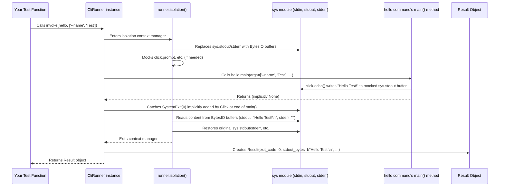

# Chapter 11: CliRunner (Testing) - Making Sure Your CLI Works!

Welcome to the final chapter of our core `click` tutorial! In [Chapter 10: Shell Completion](10_shell_completion.md), we saw how to make our CLI tools easier for users to interact with using `Tab` completion. Now, let's tackle a crucial part of software development: **testing**. How can we be sure that our carefully crafted commands, options, arguments, and logic actually work as expected, now and in the future?

## The Problem: How Do We Know It's Not Broken?

Imagine you've built a small CLI tool, maybe our `notes` application from [Chapter 6: Group](06_group.md). You've added features, fixed bugs, maybe even refactored some code. How do you verify everything still works?

*   You could run it manually: `python notes.py add "Test note"`, `python notes.py list`, `python notes.py --help`... for every possible combination of inputs.
*   This quickly becomes tedious, slow, and easy to forget a specific test case.
*   If you make a change later, you have to repeat all these manual steps. There must be a better way!

We need a way to **automatically** run our CLI commands with predefined inputs and check if they produce the expected output, exit codes, or errors.

## The Solution: `click.testing.CliRunner` - Your CLI's Test Bench

`click` provides a fantastic utility specifically for this purpose: `click.testing.CliRunner`.

Think of `CliRunner` as a **test bench** or a **simulator** for your CLI application. It allows you to:

1.  **Invoke** your commands from within your Python test code (e.g., using a test framework like `pytest` or Python's built-in `unittest`).
2.  **Simulate** command-line arguments and options.
3.  **Capture** everything your command prints to standard output (`stdout`) and standard error (`stderr`).
4.  **Check** the command's exit code (0 usually means success, non-zero means failure).
5.  **Inspect** any exceptions that occurred during the command's execution.
6.  **Provide** simulated user input for prompts.

All of this happens in an isolated environment, without actually running commands in your real shell or affecting your system globally.

## Using `CliRunner.invoke()` - Running Your Command in a Test

The main way you interact with `CliRunner` is through its `invoke()` method. Let's see how it works with a very simple command.

First, our example Click application (`hello_app.py`):

```python
# filename: hello_app.py
import click

@click.command()
@click.option('--name', default='World', help='Who to greet.')
def hello(name):
  """A simple program that greets NAME."""
  click.echo(f"Hello {name}!")

if __name__ == '__main__':
  hello()
```

Now, let's write a test for it using `CliRunner` (e.g., in a file named `test_hello.py`):

```python
# filename: test_hello.py
from click.testing import CliRunner
from hello_app import hello # Import the command function

# 1. Create a CliRunner instance
runner = CliRunner()

# 2. Define a test function
def test_hello_world():
  # 3. Use runner.invoke() to run the command
  result = runner.invoke(hello) # Pass the command object

  # 4. Assert the results
  assert result.exit_code == 0 # Check if the command exited successfully
  assert 'Hello World!' in result.output # Check if the expected output is present

def test_hello_name():
  # Invoke with arguments (like ['--name', 'Alice'] on the command line)
  result = runner.invoke(hello, ['--name', 'Alice'])
  assert result.exit_code == 0
  assert 'Hello Alice!' in result.output

  # You can also pass arguments as a single string
  result_str = runner.invoke(hello, '--name Bob')
  assert result_str.exit_code == 0
  assert 'Hello Bob!' in result_str.output
```

**Explanation:**

1.  `from click.testing import CliRunner`: We import the necessary class.
2.  `from hello_app import hello`: We import the actual `click.Command` object (our decorated `hello` function) from our application file.
3.  `runner = CliRunner()`: We create an instance of the runner. You usually need only one per test module.
4.  `result = runner.invoke(hello, ...)`: This is the core of the test.
    *   The first argument is the `click.Command` object we want to test (`hello`).
    *   Optional subsequent arguments (`['--name', 'Alice']` or `'--name Bob'`) simulate the arguments you would type on the command line after the script name. `CliRunner` automatically splits the string using shell-like rules if you provide a string.
5.  `assert result.exit_code == 0`: `invoke()` returns a `Result` object. We check its `exit_code` attribute. A value of `0` conventionally means the command completed successfully.
6.  `assert 'Expected text' in result.output`: The `Result` object captures the command's output (both stdout and stderr combined) in its `output` attribute (as a string). We check if the expected greeting is present in this captured output.

To run these tests, you would typically use a test runner like `pytest`. Just running `pytest` in your terminal (in the same directory) would discover and execute functions starting with `test_`.

## Examining the `Result` Object

The `Result` object returned by `invoke()` is your window into what happened during the command execution. Its most important attributes are:

*   `result.exit_code` (int): The exit code of the command. `0` usually means success. Non-zero often indicates an error (like those discussed in [Chapter 9: Exceptions](09_exceptions.md)).
*   `result.output` (str): A *mix* of what was printed to standard output and standard error, in the order it was printed, decoded as a string. Useful for checking the overall visible output.
*   `result.stdout` (str): Only what was printed to standard output, decoded as a string.
*   `result.stderr` (str): Only what was printed to standard error, decoded as a string.
*   `result.exception` (Exception | None): If the command crashed with an uncaught exception (and `CliRunner` was configured to catch them), this attribute holds the exception object. Otherwise, it's `None`.
*   `result.exc_info` (tuple | None): A tuple containing `(exception_type, exception_instance, traceback)` if an exception occurred. Useful for more detailed debugging.
*   `result.return_value` (Any): The actual Python value returned by your command function, if any. (Many simple CLI commands don't explicitly return a value, resulting in `None`).

Let's test a command that fails:

```python
# filename: fail_app.py
import click

@click.command()
@click.argument('value', type=int)
def process(value):
  if value < 0:
    click.echo("Error: Value cannot be negative.", err=True) # Print to stderr
    # Simulate failure by exiting with a non-zero code
    # Note: In real code, Click exceptions often handle this automatically
    ctx = click.get_current_context()
    ctx.exit(1)
  click.echo(f"Processing value: {value}")

if __name__ == '__main__':
  process()
```

```python
# filename: test_fail.py
from click.testing import CliRunner
from fail_app import process

runner = CliRunner()

def test_process_success():
  result = runner.invoke(process, ['10'])
  assert result.exit_code == 0
  assert "Processing value: 10" in result.stdout
  assert result.stderr == "" # Nothing printed to stderr

def test_process_negative_value():
  result = runner.invoke(process, ['-5'])
  assert result.exit_code == 1 # Command failed
  assert "Error: Value cannot be negative." in result.stderr # Check stderr
  assert "Processing value" not in result.output # Ensure success message isn't printed

def test_process_invalid_type():
  # Click handles bad types automatically (raises BadParameter)
  result = runner.invoke(process, ['abc'])
  assert result.exit_code != 0 # It failed (usually exit code 2 for UsageError)
  assert isinstance(result.exception, click.BadParameter) # Check the exception type
  assert "Invalid value for 'VALUE'" in result.output # Check error message
```

These examples show how you can use the `Result` object to verify both successful runs and expected failures.

## Simulating User Input (`input=...`)

What about commands that use `click.prompt` or `click.confirm` (from [Chapter 8: Terminal UI (TermUI)](08_terminal_ui__termui_.md))? How do we provide input for those during a test?

The `invoke` method takes an `input` parameter for this. You can pass a string, and `CliRunner` will feed it to the command as if the user typed it.

```python
# filename: prompt_app.py
import click

@click.command()
def configure():
  """Asks for user configuration."""
  username = click.prompt("Enter username")
  password = click.prompt("Enter password", hide_input=True, confirmation_prompt=True)
  click.echo(f"Configured user: {username}")

if __name__ == '__main__':
  configure()
```

```python
# filename: test_prompt.py
from click.testing import CliRunner
from prompt_app import configure

runner = CliRunner()

def test_configure():
  # Simulate typing 'tester', pressing Enter,
  # typing 'password123', Enter,
  # typing 'password123', Enter again.
  user_input = "tester\npassword123\npassword123\n"
  result = runner.invoke(configure, input=user_input)

  assert result.exit_code == 0
  assert "Enter username: tester" in result.output # Check prompt and echoed input
  assert "Enter password:\nRepeat for confirmation:" in result.output
  assert "Configured user: tester" in result.output
```

`CliRunner` cleverly intercepts the calls to `prompt` and feeds them lines from the `input` string.

## Isolating Filesystem Operations (`isolated_filesystem()`)

If your command reads or writes files, running tests repeatedly could cause them to interfere with each other (e.g., one test deletes a file another test needs). `CliRunner` provides a helpful context manager `isolated_filesystem()` to prevent this.

It creates a *new, empty temporary directory* and changes the current working directory to that temporary directory *just for the duration of the `with` block*. When the block finishes, it changes back to the original directory and (usually) cleans up the temporary one.

```python
# filename: file_app.py
import click
import os

@click.command()
@click.argument('filename')
@click.option('--content', default='Default content')
def write_file(filename, content):
  """Writes content to a file."""
  try:
    with open(filename, 'w') as f:
      f.write(content)
    click.echo(f"Successfully wrote to {filename}")
  except Exception as e:
    click.echo(f"Error writing file: {e}", err=True)
    click.get_current_context().exit(1)

if __name__ == '__main__':
  write_file()
```

```python
# filename: test_file.py
import os
from click.testing import CliRunner
from file_app import write_file

runner = CliRunner()

def test_write_file():
  # Use the isolated filesystem
  with runner.isolated_filesystem() as temp_dir:
    # temp_dir contains the path to the temporary directory
    print(f"Running test in temporary directory: {temp_dir}")
    assert os.listdir(temp_dir) == [] # Directory starts empty

    # Run the command INSIDE the 'with' block
    result = runner.invoke(write_file, ['output.txt', '--content', 'Hello Test'])

    assert result.exit_code == 0
    assert "Successfully wrote to output.txt" in result.output

    # Check that the file was actually created inside the temp dir
    assert 'output.txt' in os.listdir(temp_dir)
    with open('output.txt', 'r') as f:
      assert f.read() == 'Hello Test'

  # Outside the 'with' block, we are back in the original directory,
  # and the temporary directory (usually) no longer exists.
  print("Finished test, back in original directory.")
```

Using `isolated_filesystem()` ensures that your file operations happen in a clean, temporary space, making your tests reliable and independent of each other.

## How CliRunner Works Under the Hood

`CliRunner` performs some clever temporary changes to the Python environment during the `invoke` call:

1.  **Isolation:** The `runner.isolation()` context manager (used internally by `invoke` or directly by `isolated_filesystem`) temporarily replaces `sys.stdin`, `sys.stdout`, and `sys.stderr` with in-memory buffers (like `io.BytesIO`). This captures all output.
2.  **Input Simulation:** If `input` is provided, `sys.stdin` is set up to read from that data.
3.  **Environment:** It temporarily modifies `os.environ` if the `env` parameter is used.
4.  **Terminal Mocking:** It replaces (`mocks`) internal Click functions used for terminal interactions like `click.prompt`, `click.confirm`, and `click.getchar`. The mocked versions read from the simulated `sys.stdin` buffer and write prompts to the simulated `sys.stdout` buffer instead of interacting with a real terminal.
5.  **Color/Formatting:** It can control whether Click thinks it's running in a terminal that supports color and sets a fixed terminal width (`FORCE_WIDTH`) so output formatting is consistent during tests.
6.  **Execution:** It calls the target command's `main()` method (which is what `click` normally does when a command runs), passing the simulated arguments.
7.  **Exception Handling:** It wraps the call to `main()` in a `try...except` block.
    *   It catches `SystemExit` exceptions (which Click uses to signal program termination, e.g., via `ctx.exit()`) and records their exit code.
    *   Optionally (`catch_exceptions=True`), it catches other exceptions and stores them in `result.exception`.
8.  **Cleanup:** After the command finishes (or raises an exception), the `isolation` context manager restores the original `sys.stdin`, `sys.stdout`, `sys.stderr`, environment variables, and mocked functions.
9.  **Result Creation:** It reads the captured data from the in-memory buffers (`stdout`, `stderr`, combined `output`), gathers the `exit_code`, `exception`, and `return_value`, and packages them all into the `Result` object that gets returned to your test code.

**Sequence Diagram (Simplified: `runner.invoke(hello, ['--name', 'Test'])`)**



**Code Glimpse (Simplified `invoke`):**

Looking at `src/click/testing.py`:

```python
# Simplified from src/click/testing.py

class CliRunner:
    # ... (init, make_env, isolation) ...

    def invoke(
        self,
        cli: Command,
        args: str | cabc.Sequence[str] | None = None,
        input: str | bytes | t.IO[t.Any] | None = None,
        env: cabc.Mapping[str, str | None] | None = None,
        catch_exceptions: bool | None = None,
        color: bool = False,
        **extra: t.Any,
    ) -> Result:
        exc_info = None
        # Use runner's default if parameter not set
        if catch_exceptions is None:
            catch_exceptions = self.catch_exceptions

        # Use the isolation context manager to redirect IO, mock termui
        with self.isolation(input=input, env=env, color=color) as outstreams:
            return_value = None
            exception: BaseException | None = None
            exit_code = 0

            # Split string args if necessary
            if isinstance(args, str):
                args = shlex.split(args)

            try:
                # Get program name (usually command name or 'root')
                prog_name = extra.pop("prog_name", self.get_default_prog_name(cli))

                # *** The core execution: Call the command's main method ***
                return_value = cli.main(args=args or (), prog_name=prog_name, **extra)

            # Catch SystemExit to get the exit code
            except SystemExit as e:
                exc_info = sys.exc_info()
                e_code = t.cast("int | t.Any | None", e.code)
                if e_code is None: e_code = 0
                if e_code != 0: exception = e # Record if it's an error exit
                if not isinstance(e_code, int): # Handle non-integer exit codes
                    sys.stdout.write(str(e_code)) # Print them as per docs
                    sys.stdout.write("\n")
                    e_code = 1
                exit_code = e_code

            # Optionally catch other exceptions
            except Exception as e:
                if not catch_exceptions: raise # Re-raise if not catching
                exception = e
                exit_code = 1
                exc_info = sys.exc_info()
            finally:
                # Ensure buffers are flushed before reading
                sys.stdout.flush()
                # Read captured output from the isolated streams
                stdout = outstreams[0].getvalue()
                stderr = outstreams[1].getvalue()
                output = outstreams[2].getvalue() # Combined output

        # Package everything into the Result object
        return Result(
            runner=self,
            stdout_bytes=stdout,
            stderr_bytes=stderr,
            output_bytes=output,
            return_value=return_value,
            exit_code=exit_code,
            exception=exception,
            exc_info=exc_info, # type: ignore
        )
```

This shows the `invoke` method orchestrating the `isolation`, running the command's `main` function, handling exceptions, and collecting the results.

## Conclusion

Testing is essential for building reliable command-line tools, and `click.testing.CliRunner` makes it straightforward.

*   It provides a **simulator** (`CliRunner`) to run your commands within tests.
*   The `invoke()` method runs a command with specified arguments and captures the results.
*   The returned `Result` object lets you inspect the **exit code**, **output** (`stdout`, `stderr`), and any **exceptions**.
*   You can simulate user **input** for prompts using the `input` parameter.
*   `isolated_filesystem()` helps test commands that interact with files safely.
*   It works by temporarily redirecting standard streams and mocking terminal functions.

By writing tests using `CliRunner`, you can automate the verification of your CLI's behavior, catch regressions early, and develop with much greater confidence.

This chapter concludes our journey through the core concepts of Click. You've learned how to define commands, options, arguments, groups, handle types, interact with the terminal, manage state, enable shell completion, and test your applications. Congratulations! You now have a solid foundation for building powerful and user-friendly command-line interfaces with Click.

---

Generated by [AI Codebase Knowledge Builder](https://github.com/The-Pocket/Tutorial-Codebase-Knowledge)