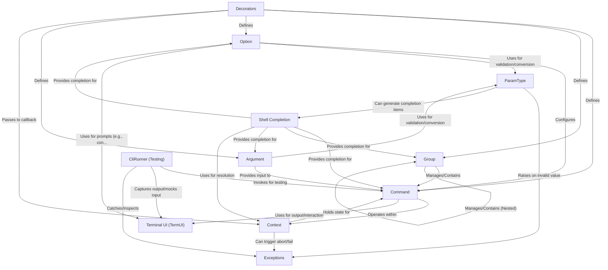

# Tutorial: click

Click is a Python library for creating beautiful and composable **command-line interfaces (CLIs)** in a declarative way.
It uses *decorators* to turn regular Python functions into **Commands** and **Groups**.
You define **Options** (like `--verbose`) and **Arguments** (like `filename`) which are automatically parsed and validated using **ParamTypes**.
Click handles help messages, user interaction through **Terminal UI** functions (like prompts and progress bars), **Exceptions**, and even provides utilities like **CliRunner** for testing your CLI applications and support for **Shell Completion**.

**Source Repository:** [https://github.com/pallets/click.git](https://github.com/pallets/click.git)

## Chapters

1. [Decorators](01_decorators.md)
2. [Command](02_command.md)
3. [Option](03_option.md)
4. [Argument](04_argument.md)
5. [ParamType](05_paramtype.md)
6. [Group](06_group.md)
7. [Context](07_context.md)
8. [Terminal UI (TermUI)](08_terminal_ui__termui_.md)
9. [Exceptions](09_exceptions.md)
10. [Shell Completion](10_shell_completion.md)
11. [CliRunner (Testing)](11_clirunner__testing_.md)

---

Generated by [AI Codebase Knowledge Builder](https://github.com/The-Pocket/Tutorial-Codebase-Knowledge)