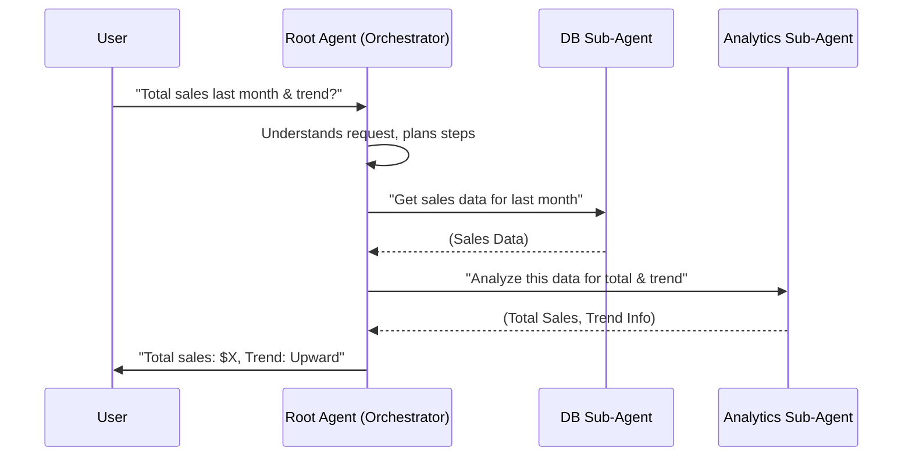

# Chapter 1: Root Agent (Orchestrator) - The Project Manager

Welcome to your first step in understanding our `data-science` project! In this chapter, we'll meet the "brain" of our system: the **Root Agent**, also known as the **Orchestrator**.

Imagine you have a big, important project. You wouldn't try to do everything yourself, right? You'd probably have a project manager. This manager understands the main goal, breaks it down into smaller tasks, and then assigns those tasks to different specialists on a team.

Our Root Agent is exactly like that project manager!

## What's the Big Idea? Meet the Conductor!

Let's say you want to know something about your data, like:

**"What were our total product sales last month, and can you show me if sales are generally going up or down?"**

This isn't just one simple question. It has a few parts:
1.  Finding the sales data for "last month."
2.  Calculating the "total."
3.  Figuring out the "trend" (are sales increasing or decreasing?).

If a computer program tried to do all this in one go, it could get very complicated very quickly. Instead, we use a smarter approach with a "Root Agent."

**The Root Agent is the main conductor of an orchestra.** It doesn't play every instrument, but it knows the whole music piece (your request) and tells each musician (specialized "sub-agents" or "tools") when and what to play.

Its job is to:
1.  **Receive your request** (e.g., "Show me total sales and trends").
2.  **Understand what needs to be done** (e.g., "First, I need to get sales data, then I need to analyze it for trends").
3.  **Delegate tasks** to specialized helpers:
    *   It might ask a "database expert" sub-agent to fetch the sales data.
    *   Then, it might ask a "data analyst" sub-agent to find the trend.
4.  **Combine the results** from the specialists and give you a complete answer.

This way, each part of the job is handled by an expert, and the Root Agent makes sure everything works together smoothly.

## How the Root Agent Handles a Request: A Simple Story

Let's revisit our example: **"What were our total product sales last month, and can you show me if sales are generally going up or down?"**

Here's how our Root Agent might handle this:

1.  **You (the User) ask the Root Agent:** "What were our total product sales last month, and can you show me if sales are generally going up or down?"

2.  **The Root Agent thinks (using its instructions):** "Okay, this user wants two things:
    *   Total sales from last month: This requires fetching data from a database.
    *   A sales trend: This requires some analysis on that data."

3.  **The Root Agent delegates - Part 1 (Getting Data):**
    *   It calls a specialized helper, let's call it the `Database Agent` (which we'll learn more about in [Sub-Agents (Specialists)](02_sub_agents__specialists_.md)).
    *   Root Agent to `Database Agent`: "Please get me all product sales data from last month."
    *   The `Database Agent` goes to the database, fetches the information, and gives it back to the Root Agent.

4.  **The Root Agent delegates - Part 2 (Analyzing Data):**
    *   Now the Root Agent has the raw sales data. It calls another helper, the `Analytics Agent` (also a [Sub-Agents (Specialists)](02_sub_agents__specialists_.md)).
    *   Root Agent to `Analytics Agent`: "Here's the sales data. Can you calculate the total and tell me the sales trend?"
    *   The `Analytics Agent` performs the calculations and analysis and gives the results (total sales and the trend) back to the Root Agent.

5.  **The Root Agent gives you the answer:**
    *   It takes the information from the `Analytics Agent` and presents it to you in a friendly way: "Last month's total product sales were $X. The sales trend is generally upward."

See? The Root Agent didn't fetch the data itself or do the complex math. It understood the request and managed the experts!

## A Peek Under the Hood: How It's Built

In our `data-science` project, the Root Agent is defined using a special `Agent` component. Let's look at a simplified version of how it's set up in our code.

You'll find the main setup in the file `data_science/agent.py`.

```python
# data_science/agent.py (Simplified)

# ... (other imports)
from google.adk.agents import Agent # The main building block for agents
from .prompts import return_instructions_root # Gets the "rules" for our Root Agent
from .sub_agents import bqml_agent # An example specialist agent
from .tools import call_db_agent, call_ds_agent # Example tools

# This function runs before our agent tries to answer a question
def setup_before_agent_call(callback_context):
    # It can prepare things, like getting database details
    # For example, it makes sure the agent knows about the database schema (structure)
    print("Setting things up before the agent acts...")
    # ... (details skipped for simplicity)

# This is where our Root Agent is created!
root_agent = Agent(
    name="db_ds_multiagent", # A friendly name for our Root Agent
    instruction=return_instructions_root(), # The core "rules" or "brain"
    global_instruction="You are a helpful Data Science assistant.", # Overall guidance
    sub_agents=[bqml_agent], # List of specialist sub-agents it knows
    tools=[call_db_agent, call_ds_agent], # List of tools it can use
    before_agent_callback=setup_before_agent_call, # Function to run before acting
    # ... (other configurations)
)
```

Let's break this down:

*   `Agent(...)`: This is like saying, "Let's create a new agent."
*   `name`: Just a name to identify our Root Agent.
*   `instruction`: This is super important! It's a detailed set of instructions or [Agent Prompts (Instructions)](03_agent_prompts__instructions_.md) that tells the Root Agent *how* to think, what workflow to follow, and when to use its specialists or [Tools (Capabilities)](04_tools__capabilities_.md). These instructions come from a function `return_instructions_root()`.
*   `global_instruction`: A general instruction that applies to all interactions with this agent.
*   `sub_agents`: This is a list of other specialized agents (like the `Database Agent` or `Analytics Agent` from our story) that the Root Agent can pass tasks to. We'll explore these in [Sub-Agents (Specialists)](02_sub_agents__specialists_.md).
*   `tools`: These are like special pieces of equipment the Root Agent (or its sub-agents) can use to perform specific actions, like `call_db_agent` (to talk to the database) or `call_ds_agent` (to do data science tasks). We'll cover these in [Tools (Capabilities)](04_tools__capabilities_.md).
*   `before_agent_callback`: This is a function (`setup_before_agent_call`) that runs *before* the agent starts processing your request. It's used to set up necessary information, like loading the database structure so the agent knows what data it can work with.

### The "Rulebook": Agent Instructions

The `instruction` part is the core logic of the Root Agent. It's like its programming or its detailed rulebook. These instructions are defined in another file, `data_science/prompts.py`.

Here's a tiny snippet of what those instructions might look like (the real one is much more detailed!):

```python
# data_science/prompts.py (Highly Simplified Snippet)

def return_instructions_root() -> str:
    instruction_prompt = """
    You are a helpful project manager for data tasks.
    Your goal is to understand the user's request and decide the best way to answer it.

    Workflow:
    1. Understand what the user wants.
    2. If the user asks for data from the database (e.g., "total sales"), use the 'call_db_agent' tool.
    3. If the user asks for analysis (e.g., "sales trend"), and you have data, use the 'call_ds_agent' tool.
    4. If the user asks specifically for BigQuery ML, use the 'bqml_agent'.
    5. Combine the information and give a clear answer.

    IMPORTANT: If the question is simple and you know the answer from the database schema (structure) you have, answer directly!
    """
    return instruction_prompt
```

This `instruction_prompt` guides the Root Agent. It tells it:
*   Its role ("project manager").
*   Its goal ("understand the user's request").
*   A step-by-step workflow.
*   When to use specific tools or sub-agents like `call_db_agent`, `call_ds_agent`, or `bqml_agent`.

The actual instructions are more complex, helping the agent handle many different types of questions, but this gives you the basic idea. We'll dive deeper into these instructions in [Agent Prompts (Instructions)](03_agent_prompts__instructions_.md).

### Visualizing the Flow

Let's visualize that earlier example with a simple diagram. This shows how the different parts talk to each other:



In this diagram:
*   The `User` makes a request.
*   The `Root Agent` receives it, thinks, and then coordinates.
*   It calls the `DB Sub-Agent` to get data.
*   Then, it calls the `Analytics Sub-Agent` to analyze the data.
*   Finally, the `Root Agent` gives the complete answer back to the `User`.

## Why is this Orchestration Useful?

1.  **Modularity:** Each specialist (sub-agent) focuses on what it does best. If we want to improve how we fetch data, we only need to update the `Database Agent`, not the entire system.
2.  **Clarity:** The Root Agent's main job is to understand and delegate. This keeps its own logic simpler.
3.  **Flexibility:** We can easily add new specialists or tools to handle new types of tasks.
4.  **Power:** By combining simple, specialized agents, we can solve complex problems!

## Conclusion

You've now met the Root Agent, the central orchestrator of our `data-science` project! It's like a smart project manager that understands your data-related questions, breaks them down, and delegates the work to a team of specialized helpers. It ensures that the right expert handles the right part of the job, leading to accurate and comprehensive answers.

This concept of a main agent coordinating others is fundamental to how our system works.

In the next chapter, we'll take a closer look at the specialists themselves: [Sub-Agents (Specialists)](02_sub_agents__specialists_.md).

---

Generated by [AI Codebase Knowledge Builder](https://github.com/The-Pocket/Tutorial-Codebase-Knowledge)