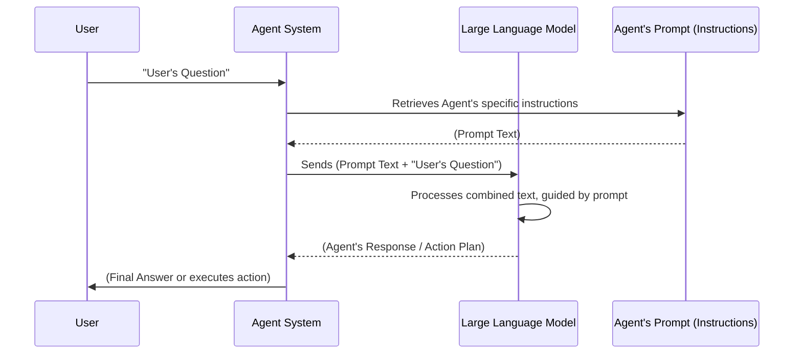

# Chapter 3: Agent Prompts (Instructions) - The Agent's Script

Welcome to Chapter 3! In the previous chapters, we met the [Root Agent (Orchestrator)](01_root_agent__orchestrator_.md), our project manager, and its team of [Sub-Agents (Specialists)](02_sub_agents__specialists_.md). We know the Root Agent delegates tasks and the Sub-Agents perform them. But how does each agent know *exactly* what to do, how to behave, what its goals are, and which tools to use?

That's where **Agent Prompts** (or **Instructions**) come in!

Imagine you're directing a play. You wouldn't just push an actor onto the stage and say "Go!" You'd give them a script, describe their character, explain their motivations, and tell them what actions to perform.

Agent Prompts are precisely that: a detailed script and role description for our LLM-based agents. They are carefully crafted sets of instructions that ensure each agent performs its part correctly and effectively within our `data-science` project.

## What's the Big Idea? Giving Agents Their Roles and Lines

Let's consider our ongoing example:
**"What were our total product sales last month, and can you show me if sales are generally going up or down?"**

When the Root Agent receives this, how does it "decide" to:
1.  Ask the Database Agent for sales data?
2.  Then ask the Analytics Agent for the trend?

And when the Database Agent gets the task "get total sales for last month," how does it know to:
1.  Try to convert this to SQL?
2.  Use a tool to run that SQL against BigQuery?

The answer lies in their **prompts**. Each agent has its own unique prompt, tailored to its specific role and capabilities.

An Agent Prompt is essentially a detailed text given to the Large Language Model (LLM) that powers the agent. This text guides the LLM's thinking process.

## What's Inside an Agent Prompt?

A well-crafted prompt typically includes several key components:

1.  **Persona / Role:** Defines *who* the agent is.
    *   Example for Root Agent: "You are a senior data scientist tasked to accurately classify the user's intent..."
    *   Example for Analytics Agent: "You are an expert Python data analyst..."

2.  **Goal / Objective:** Explains *what* the agent is trying to achieve.
    *   Example for Root Agent: "...formulate specific questions about the database suitable for a SQL database agent (`call_db_agent`) and a Python data science agent (`call_ds_agent`)..."
    *   Example for Database Agent: "...help users generate SQL answers from natural language questions."

3.  **Workflow / Steps:** Provides a step-by-step plan for how to operate.
    *   Example for Root Agent:
        ```
        # **Workflow:**
        # 1. **Understand Intent
        # 2. **Retrieve Data TOOL (`call_db_agent` - if applicable):** ...
        # 3. **Analyze Data TOOL (`call_ds_agent` - if applicable):** ...
        # ...
        ```

4.  **Tool Usage Guidance:** Specifies *when* and *how* to use available [Tools (Capabilities)](04_tools__capabilities_.md) or other sub-agents.
    *   Example: "If the question needs SQL executions, forward it to the database agent (`call_db_agent`)."
    *   Example: "If the user specifically wants to work on BQML, route to the `bqml_agent`."

5.  **Constraints / Important Reminders:** Sets boundaries and highlights critical rules.
    *   Example: "**Never generate SQL code. That is not your task. Use tools instead.**"
    *   Example: "**DO NOT ask the user for project or dataset ID. You have these details in the session context.**"

6.  **Output Format (Optional but common):** Specifies how the agent should structure its response.
    *   Example: "Return `RESULT` AND `EXPLANATION`... Please USE the MARKDOWN format..."

These prompts can be quite detailed, acting as a comprehensive "operating manual" for the agent.

## Example: A Peek at the Root Agent's "Script"

The instructions for our Root Agent are defined in the `data_science/prompts.py` file, within a function called `return_instructions_root()`. Let's look at a *highly simplified* conceptual snippet of what these instructions might contain:

```python
# data_science/prompts.py (Highly Simplified Conceptual Snippet for Root Agent)

def return_instructions_root_simplified() -> str:
    instruction = """
    You are the main Project Manager for data requests.
    Your job is to understand what the user wants and then decide the best way to get the answer.

    Workflow:
    1. Carefully read the user's question.
    2. If the user needs data from the database (like 'total sales', 'customer list'),
       you MUST use the 'call_db_agent' tool. Give it the user's question.
    3. If the user needs analysis on data (like 'sales trend', 'average price'),
       and you have the data (maybe from 'call_db_agent' already),
       you MUST use the 'call_ds_agent' tool. Give it the data and the analysis question.
    4. If the user specifically mentions 'BQML' or 'BigQuery ML',
       you MUST use the 'bqml_agent'.
    5. Combine the results from the tools/agents into a friendly answer for the user.

    Important Rules:
    - Do NOT try to write SQL code yourself.
    - Do NOT try to do Python calculations yourself.
    - Always use the specialized agents for their tasks.
    """
    return instruction
```
This simplified version tells the Root Agent its role ("Project Manager"), its job, a workflow to follow, and crucial rules like "Do NOT try to write SQL code yourself." The actual prompt (`instruction_prompt_root_v2` in `prompts.py`) is much more detailed to handle various scenarios, but this gives you the core idea.

When the user asks, **"What were our total product sales last month, and can you show me if sales are generally going up or down?"**, this prompt guides the Root Agent:
*   It sees "total product sales last month" and knows from rule #2 to use `call_db_agent`.
*   After getting data, it sees "show me if sales are generally going up or down" and knows from rule #3 to use `call_ds_agent`.

## Example: A Sub-Agent's Specialized "Script"

Each sub-agent also gets its own prompt. For example, the Database Agent (our BigQuery specialist) has instructions in `data_science/sub_agents/bigquery/prompts.py` in the `return_instructions_bigquery()` function.

Here's a *highly simplified* conceptual snippet for the Database Agent:

```python
# data_science/sub_agents/bigquery/prompts.py (Highly Simplified Conceptual Snippet)

def return_instructions_database_agent_simplified() -> str:
    instruction = """
    You are a BigQuery SQL Expert. Your job is to take a user's question about data
    and turn it into a perfect BigQuery SQL query.

    Workflow:
    1. Receive the question (e.g., "total sales last month").
    2. Use the 'initial_bq_nl2sql' tool to help you draft an SQL query.
    3. Use the 'run_bigquery_validation' tool to check if your SQL is correct and run it.
    4. If there are errors, fix the SQL and try validating again.
    5. Once successful, return the SQL query and the data result.

    Important Rules:
    - Always use the provided tools to generate and validate SQL.
    - You have access to the database schema. Use it to make sure your SQL is accurate.
    """
    return instruction
```
This prompt tells the Database Agent its role ("BigQuery SQL Expert"), its goal, and the specific tools and steps it must use to convert a natural language question into SQL and get results.

## How Prompts Work: Guiding the LLM

At the heart of each agent (Root or Sub-Agent) is a Large Language Model (LLM). Think of an LLM as a very advanced text-processing engine. It's been trained on vast amounts of text and can understand, generate, and reason about language.

When a user sends a request to an agent:
1.  The agent system takes the user's query (e.g., "Total sales last month?").
2.  It retrieves the agent's specific prompt (like the examples above).
3.  It combines the **prompt** and the **user's query** into a single piece of text.
4.  This combined text is sent to the LLM.

The LLM then processes this combined input. The prompt acts as a powerful context, heavily influencing how the LLM interprets the user's query and what output it generates (which might be a decision to call another tool, a piece of text, or a formatted answer).

Let's visualize this interaction:



The prompt is the "programming" for the LLM within the context of that agent.

## Connecting Prompts to the Agent Code

In our `data-science` project, when we define an agent using the `Agent` class from the `google.adk.agents` library, we pass its instructions to the `instruction` parameter.

Here's how it looked in [Chapter 1](01_root_agent__orchestrator_.md) for the Root Agent:

```python
# data_science/agent.py (Simplified)

from google.adk.agents import Agent
from .prompts import return_instructions_root # This function returns the big string of instructions

root_agent = Agent(
    name="db_ds_multiagent",
    instruction=return_instructions_root(), # <--- The prompt is passed here!
    # ... other parameters like sub_agents, tools
)
```
The `return_instructions_root()` function simply returns the long string containing all the detailed instructions for the Root Agent. The `Agent` class then ensures this instruction string is used by the underlying LLM whenever the `root_agent` is called.

Similarly, for our sub-agents, their specific instruction functions (e.g., `return_instructions_bigquery()` for the Database Agent, `return_instructions_ds()` for the Analytics Agent) are used when defining them:

```python
# data_science/sub_agents/bigquery/agent.py (Simplified)
from google.adk.agents import Agent
from .prompts import return_instructions_bigquery # Instructions for this DB agent

database_agent = Agent(
    name="database_agent",
    instruction=return_instructions_bigquery(), # <--- DB Agent's specific script!
    tools=[...],
    # ... other settings
)
```

## Why Are Well-Crafted Prompts So Important?

The quality of an agent's prompt directly impacts its performance:

*   **Clarity of Behavior:** A clear prompt leads to predictable and understandable agent actions.
*   **Effectiveness:** Detailed workflows and tool usage guidance help the agent achieve its goals efficiently.
*   **Controllability:** Specific constraints and rules prevent the agent from going off-topic or performing undesired actions (like trying to write SQL when it shouldn't).
*   **Accuracy:** Guiding the agent on how to interpret questions and use information (like database schemas) improves the accuracy of its responses.
*   **Reduced Errors:** Telling an agent what *not* to do can be just as important as telling it what to do, helping to avoid common pitfalls.

"Prompt engineering" – the art and science of designing effective prompts – is a crucial skill in building capable LLM-based applications. As you explore the `prompts.py` files in our project, you'll see they are quite elaborate, refined over time to make the agents as smart and reliable as possible.

## Conclusion

Agent Prompts are the "brains" or "scripts" that dictate how each agent in our `data-science` system behaves. They provide the role, goals, workflow, and rules of engagement for the Large Language Models powering our Root Agent and Sub-Agents. By carefully crafting these instructions, we can guide our agents to understand user requests, delegate tasks appropriately, use their tools correctly, and ultimately provide helpful and accurate answers.

These prompts are the invisible hand guiding the agents' intelligence. Without clear instructions, even the most powerful LLM would be like a brilliant actor without a script – full of potential but unsure what to do.

Now that we understand how agents are instructed, what about the specific "tools" they are told to use? In the next chapter, we'll delve into [Tools (Capabilities)](04_tools__capabilities_.md) to see what special abilities our agents have at their disposal.

---

Generated by [AI Codebase Knowledge Builder](https://github.com/The-Pocket/Tutorial-Codebase-Knowledge)